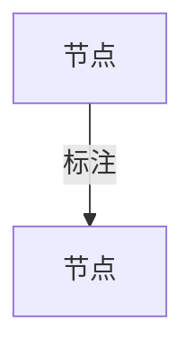

# Example - synthesis:explain-deep

## 什么时候用

当用户不是要改代码，而是说"这个概念/机制我没看懂，你单独解释一下"时使用。

## 本仓库里的真实场景

解释当前工程里为什么同时存在：

- [docs/plan/PLAN.md](../../../../docs/plan/PLAN.md)
- [.claude/state/MANIFEST.yaml](../../state/MANIFEST.yaml)
- [.claude/rules/gate.md](../../../rules/gate.md)

目标：让用户真正理解"总计划 / 会话状态 / 门禁规则"三者的分工，而不是只看见一堆文件名。

## 可直接照抄的用户请求

```text
请用 doc-gen 的 synthesis:explain-deep 模式，详细解释这个项目里 PLAN.md、MANIFEST.yaml、gate.md 三者的关系。

要求：
1. 先用大白话解释它们各自负责什么
2. 再解释数据怎么流转：用户提需求后，谁先更新，谁只是缓存，谁负责卡住执行
3. 给一个具体例子：从"我要新增一个任务"到"开始实施"完整走一遍
4. 输出里至少有 1 张 flowchart 或分层图
5. 补一个"常见误解"小节，说明为什么 MANIFEST 不是全局真相
6. 如果某点文档没写清楚，标注 [未覆盖]
```

## 预期输出骨架

基于两次真实生成（报告 1：PLAN/MANIFEST/Gate 三层关系 140 行；报告 2：双守卫机制 200 行）提炼的骨架：

```markdown
# [主题] 深度解释

> 一句话概括核心职责（≤ 30 字）。[来源:文件名#行号]

## 目录
- [为什么需要它](#为什么需要它)
- [核心概念](#核心概念)
- [工作原理](#工作原理)
- [具体例子：xxx 时会发生什么](#具体例子)
- [常见误解](#常见误解)
- [一句话记忆法](#一句话记忆法)

## 为什么需要它
[解决什么问题，没有它会怎样。2-3 段，每段 ≤5 行]

## 核心概念
| 术语 | 英文 | 一句话解释 |
|------|------|-----------|
| xxx | xxx | ...[来源:file#line] |

## 工作原理
[先大白话版数据流 1 段]



[再技术细节版：判断链 / 调用链 / 状态机，按层级用 ### 拆分]

## 具体例子：xxx 时会发生什么
[2-3 个场景，每个场景给：请求 → 结果 → 结论]

## 常见误解
| 陷阱 | 正确理解 | 来源 |
|------|---------|------|
| "..." | ... | [来源:file#line] |

## 一句话记忆法
- **模块 A**：一句话职责。[来源:file#line]
- **模块 B**：一句话职责。[来源:file#line]

## 未覆盖
- [明确说哪些问题源码没回答，标注 [未覆盖]]
```

## 两次真实生成的经验总结

### 结构验证

| 维度 | 报告 1（三层关系） | 报告 2（双守卫） | 结论 |
|------|-------------------|-----------------|------|
| 行数 | 140 | 200 | 预计 100-250 行 |
| Mermaid 图 | 1 张 flowchart | 2 张 flowchart | 至少 1 张，复杂主题 2+ |
| 核心概念数 | 6 | 11 | 按主题复杂度自然扩展 |
| 具体场景 | 5 步完整流程 | 3 个拦截场景 | 2-5 个场景即可 |
| 误解数 | 4 | 6 | 常见误解是最有价值的章节 |
| 未覆盖 | 2 | 3 | 每份报告都有盲区 |

### 生成的关键技巧

1. **源头追溯 `[来源:file#line]`**：关键结论必须标注来源。技术细节标注具体行号范围，概念级结论标注文件开头即可
2. **先人话再技术**：每节先给直觉版本（1 段话），再给技术版本（判断链/流程图/表格）
3. **误解表是亮点**：读者最常犯的错整理成表格，比正面解释更有用
4. **`[未覆盖]` 别心虚**：两份报告都有 2-3 个未覆盖点，这是正常且有价值的信息
5. **Mermaid 节点用中文标签**：`A["中文标签"]` 格式，节点 ID 只用英文+数字+下划线

### 已知坑

- example 文件的 ```` ``` ```` 嵌套问题：预期输出骨架里包含 Mermaid 代码块，外层要用 4 个反引号包裹
- 主题太宽（如"解释整个项目架构"）会导致概念表膨胀到 20+ 行，应拆分或缩小范围
- 源码超过 500 行时，不可能逐行追溯，按判断链/数据类的粒度标注行号范围即可

## 自检清单

- [ ] 首次出现的术语都解释了（不假设前置知识）
- [ ] 例子足够具体，不是抽象 a/b/c
- [ ] 先讲直觉，再讲技术细节
- [ ] 明确指出文档真相边界和常见误解
- [ ] 关键结论有 `[来源:file#line]` 标注
- [ ] 未覆盖内容标注 `[未覆盖]`，未假装已知
- [ ] Mermaid 节点 ID 不含中文，标签用 `["中文"]`
- [ ] 每段正文 ≤5 行
