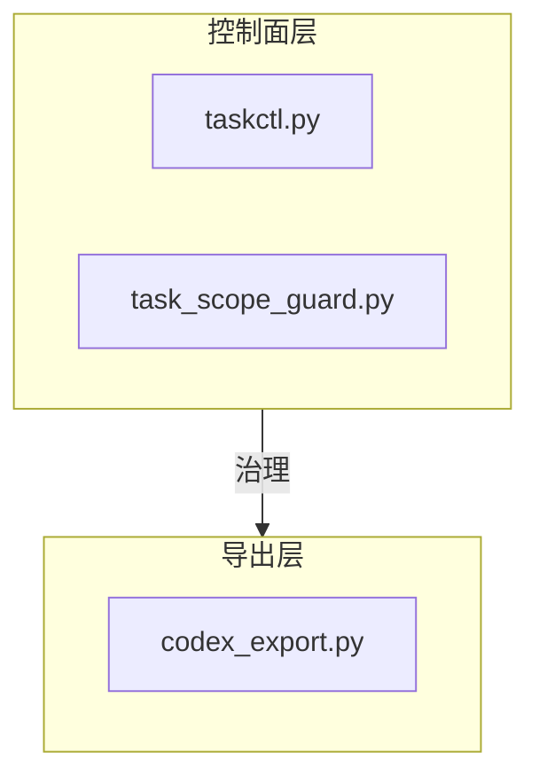
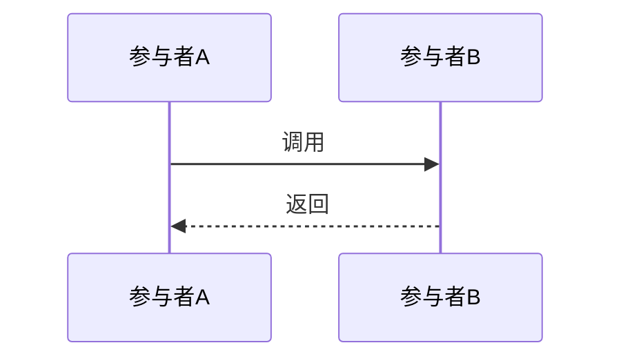

# Example - synthesis:graph-doc

## 什么时候用

当已经有 graph.json、scan-summary 或图谱 HTML，但"还是看不懂"，需要把机器图谱翻译成人能读的文档时使用。

## 本仓库里的真实场景

基于下面这些现成图谱产物，生成一份人类可读的知识图谱解读：

- [docs/代码库-知识图谱/ClaudeCode_Codex_Cowork_Example-LLM图谱/graph.json](../../../../docs/代码库-知识图谱/ClaudeCode_Codex_Cowork_Example-LLM图谱/graph.json)
- [docs/代码库-知识图谱/ClaudeCode_Codex_Cowork_Example-LLM图谱/scan-summary.json](../../../../docs/代码库-知识图谱/ClaudeCode_Codex_Cowork_Example-LLM图谱/scan-summary.json)
- [docs/代码库-知识图谱/ClaudeCode_Codex_Cowork_Example-LLM图谱/GRAPH_REPORT.md](../../../../docs/代码库-知识图谱/ClaudeCode_Codex_Cowork_Example-LLM图谱/GRAPH_REPORT.md)

目标：生成一份给"新人 / 维护者 / 重构者"看的图谱解读文档，而不是再给一份原始统计表。

## 可直接照抄的用户请求

```text
请用 doc-gen 的 synthesis:graph-doc 模式，把下面的图谱结果转成一份人类可读的说明文档：
- docs/代码库-知识图谱/ClaudeCode_Codex_Cowork_Example-LLM图谱/graph.json
- docs/代码库-知识图谱/ClaudeCode_Codex_Cowork_Example-LLM图谱/scan-summary.json
- docs/代码库-知识图谱/ClaudeCode_Codex_Cowork_Example-LLM图谱/GRAPH_REPORT.md

输出到同目录的 GRAPH_README.md。
要求：
1. 先给项目全貌图和 3 句话摘要
2. 列出 Top 10 核心模块，并说人话职责
3. 至少展开 3 条关键调用链或依赖链
4. 解释每个聚簇/社区"它到底在干什么"
5. 指出高风险热点：改哪个模块最容易波及别人
6. 最后给三种阅读路径：新人 / 维护者 / 重构者
7. 所有数据必须来自 graph.json / scan-summary / GRAPH_REPORT，不能脑补
```

## 预期输出骨架

基于一次真实生成（报告：知识图谱解读，241 行）提炼的骨架：

````markdown
# [项目名] 知识图谱解读

> 一句话项目结构（≤ 30 字）。[来源:scan-summary.json#5-10][来源:GRAPH_REPORT.md#1-4]

## 目录

- [速览：项目全貌](#速览项目全貌)
- [核心模块（Top 10）](#核心模块top-10)
- [关键调用链（Top 5）](#关键调用链top-5)
- [社区/聚簇解读](#社区聚簇解读)
- [高风险热点](#高风险热点)
- [快速导航](#快速导航)

## 速览：项目全貌



三句话概括：
1. **项目做什么**：一句话。
2. **核心模块**：一句话。
3. **技术栈**：一句话。

**基础数据**：N 个源文件 · N 个代码节点 · N 条依赖边 · N 个社区。[来源:scan-summary.json#行号]

## 核心模块（Top 10）

| 排名 | 模块 | 职责（一句话） | 依赖数 | 被依赖数 |

**观察**：一句话补充洞察。

## 关键调用链（Top 5）

### 链路 1：标题



数据流：一句话总结。[来源:GRAPH_REPORT.md#行号]

### 链路 2：...

## 社区/聚簇解读

| 社区 | 节点数 | 人话解释 | 核心成员 |

**聚簇质量判断**：
- 内聚度最高的社区特征
- 内聚度较低的大社区拆分建议 [来源:GRAPH_REPORT.md#行号]

## 高风险热点

### 1. 模块名（N 条边）
- **影响范围**：...
- **跨社区连接**：...
- **风险**：...
- **建议**：...

### N. 孤立节点群
- **风险**：...
- **建议**：...

## 快速导航

### 新人
1. 先读...
2. 再看...
3. 最后浏览...

### 维护者
1. 重点看...

### 重构者
1. 从...开始
2. ...

---

*本报告数据来源：graph.json、scan-summary.json、GRAPH_REPORT.md。未从外部引入任何数据。*
````

## 真实生成的经验总结

### 结构验证

| 维度 | 实际报告 | 结论 |
|------|---------|------|
| 行数 | 241 | 预计 150-300 行（中型项目） |
| Mermaid 图 | 1 张 graph TD（全貌）+ 5 张 sequenceDiagram（调用链） | 全貌用 graph TD，调用链用 sequenceDiagram |
| Top 10 模块 | 10 行表格含依赖数/被依赖数 | god nodes（枢纽节点）优先入选 |
| 调用链 | 5 条，每条 10-20 行 | 3-5 条足够，每条配 sequenceDiagram |
| 社区解读 | 8 个大社区（nodes ≥ 10） | 筛选有意义的大社区，不列全部 74 个 |
| 高风险热点 | 5 个含孤立节点群 | god nodes + 孤立节点群是必选项 |
| 阅读路径 | 3 种角色各 2-4 步 | 新人/维护者/重构者三路径 |

### 生成的关键技巧

1. **graph.json 可能读不了**：本例 graph.json 为 1.9MB 超过读取限制。改用 GRAPH_REPORT.md + scan-summary.json 作为数据源，这两个文件包含所有需要的统计数据和社区分析
2. **社区筛选规则**：74 个社区不可能全部解读。按 `nodes ≥ 10` 筛选有意义的大社区，其余一笔带过
3. **sequenceDiagram 优于纯文字**：调用链用 sequenceDiagram 表达，比纯文字描述清晰 10 倍。每条链路只需配一句"数据流"总结
4. **god nodes 识别**：GRAPH_REPORT.md 已列出 god nodes（高连接度节点），直接取 Top 10 作为核心模块，不需要自己从 graph.json 里算
5. **"说人话"是聚簇解读的核心**：每个社区必须有一句"人话解释"（如"任务管理与计划编排"而非"Community 2: modularity=0.04"）
6. **孤立节点群容易被忽视**：174 个孤立节点看起来不重要，但它们可能代表图谱提取遗漏的依赖，值得单独列为一个风险热点

### 已知坑

- graph.json 文件经常超过 Read 工具限制（256KB），必须依赖 GRAPH_REPORT.md 和 scan-summary.json 作为代理数据源
- 社区内聚度数值（如 0.04 vs 0.4）对非专业读者没有意义，需要翻译为"高/低"并配一句解释
- Top 10 模块中测试类占比可能很高（本例 Top 4 中有 3 个测试类），需要在"观察"中说明

## 自检清单

- [ ] 数据从 graph.json / GRAPH_REPORT.md / scan-summary.json 提取，非凭空编造
- [ ] 有项目全貌图（Mermaid graph TD 或 SVG）
- [ ] 有 3 句话摘要（做什么 / 核心模块 / 技术栈）
- [ ] Top 10 模块含依赖数和被依赖数
- [ ] 至少 3 条调用链（sequenceDiagram）
- [ ] 每条调用链有数据流总结和来源标注
- [ ] 社区解读有"人话解释"列
- [ ] 只解读有意义的大社区（nodes ≥ 10），不全列
- [ ] 高风险热点含影响范围和修改建议
- [ ] 孤立节点群作为一个风险热点
- [ ] 有按读者角色的阅读路径（新人/维护者/重构者）
- [ ] 基础数据（文件数/节点数/边数/社区数）与 scan-summary 一致
- [ ] 每段正文 ≤5 行
