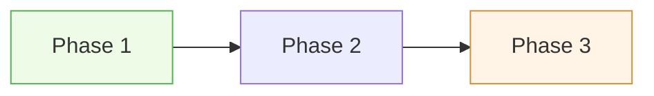

# Example - synthesis:research

## 什么时候用

当你手里已经有多份 Markdown 调研材料，目标不是继续搜索，而是把它们合成一份可决策的结果文档时使用。

## 本仓库里的真实场景

把下面几份关于 Claude/Codex 工作流的文档合成一份结论文档：

- [docs/plans/2026-04-18-main-project-git-change-impact-on-codex-migration.md](../../../../docs/plans/2026-04-18-main-project-git-change-impact-on-codex-migration.md)
- [docs/plans/2026-04-19-codex-enhanced-script-workflows.md](../../../../docs/plans/2026-04-19-codex-enhanced-script-workflows.md)
- [docs/plans/2026-04-21-autoresearch-template-workmode-optimization.md](../../../../docs/plans/2026-04-21-autoresearch-template-workmode-optimization.md)

目标：产出一份"哪些能力应该进主工作流、哪些只适合按需触发"的综合判断。

## 可直接照抄的用户请求

```text
请用 doc-gen 的 synthesis:research 模式，合成下面 3 份文档：
- docs/plans/2026-04-18-main-project-git-change-impact-on-codex-migration.md
- docs/plans/2026-04-19-codex-enhanced-script-workflows.md
- docs/plans/2026-04-21-autoresearch-template-workmode-optimization.md

输出到 docs/research/2026-04-22-workflow-synthesis.md。
要求：
1. 先列来源索引，说明每份文档覆盖什么问题
2. 区分共识、分歧、空白
3. 给出"应该进主线 / 应该保留为按需能力"的推荐
4. 每条关键结论标注 [来源:文件#段落]
5. 如果来源没覆盖，明确写 [未覆盖]
6. 至少放 1 张对比矩阵图或 graph LR 关系图
```

## 预期输出骨架

基于一次真实生成（报告：工作流能力综合调研，109 行）提炼的骨架：

````markdown
# [主题] 综合调研报告

> 一句话核心结论（≤ 30 字）。[来源:文件名#行号]

## 目录

- [执行摘要](#执行摘要)
- [来源索引](#来源索引)
- [共识发现](#共识发现)
- [分歧与对比](#分歧与对比)
- [知识空白](#知识空白)
- [推荐方向](#推荐方向)

## 执行摘要

**共识**：一句话 + 信心等级。[来源:S1#xx]
**分歧**：一句话。[来源:S2#xx]
**空白**：一句话。[未覆盖]
**推荐**：一句话 + 信心等级。

## 来源索引

| # | 文件 | 主题 | 可信度 | 覆盖范围 |
|---|------|------|--------|---------|
| S1 | `path/to/doc1.md` | 主题描述 | 高/中/低 | 覆盖要点列表 |
| S2 | `path/to/doc2.md` | ... | ... | ... |

## 共识发现

### 1. 共识标题

描述 + [来源:S1#行号][来源:S2#行号]

### 2. 共识标题

...

## 分歧与对比

| 分歧点 | S1 视角 | S2 视角 | 评判 |
|--------|---------|---------|------|
| ... | ... | ... | ... |

## 知识空白

- **空白主题**：描述。[未覆盖][来源:S3#行号]

## 推荐方向

| # | 方向 | 信心 | 理由 | 来源 |
|---|------|------|------|------|



## 附录：逐源摘要

### S1：[来源名称]

- 核心结论：...
- 关键数据：...[来源:S1#行号]
````

## 真实生成的经验总结

### 结构验证

| 维度 | 实际报告 | 结论 |
|------|---------|------|
| 行数 | 109 | 预计 80-150 行（3 源） |
| Mermaid 图 | 1 张 graph LR（5 阶段路线图） | 推荐方向用 graph LR 表示阶段依赖 |
| 共识条目 | 4 条 | 按来源数量，一般 3-6 条 |
| 分歧条目 | 4 条（含 1 条矛盾） | 分歧表是读者最有价值的部分 |
| 空白条目 | 5 条 | 每份报告都有 3-5 个空白 |
| 推荐方向 | 5 条 + 阶段图 | 按"信心"排序，高信心先行 |
| 来源索引 | 3 行 | 每源一行，简短但精确 |

### 生成的关键技巧

1. **来源编号简写**：来源索引用 `S1`/`S2`/`S3` 编号，全文引用时写 `[来源:S1#77-81]` 而不是完整文件名，避免行文臃肿
2. **执行摘要是全报告精华**：共识/分歧/空白/推荐各一句，读者只看这段就能拿到 80% 的信息
3. **分歧表比正文更有效**：多源对比用表格，比"来源 A 认为...来源 B 认为..."更清晰
4. **推荐方向要按信心排序**：高信心 → 低信心，并给出理由和来源。阶段间的依赖关系用 Mermaid graph LR 体现
5. **附录逐源摘要有价值**：为想深挖某个来源的读者保留入口，但要精简（每个来源 2-3 行）

### 已知坑

- 来源超过 5 份时分歧表会变得很宽，建议按分歧主题分组而非按来源分列
- 如果某份来源可信度低，在来源索引中标明，但在正文中仍可引用——低可信度不等于无用
- 推荐方向的"信心"列容易变成拍脑袋，必须绑定具体来源行号才能自洽

## 自检清单

- [ ] 来源索引表完整（每源有主题+可信度+覆盖范围）
- [ ] 关键结论有源头标注 `[来源:Sx#行号]`
- [ ] 空白内容标注 `[未覆盖]`，未假装已知
- [ ] 矛盾内容标注 `[矛盾]` 并列出各方观点
- [ ] 关键结论有信心等级（高/中/低）
- [ ] 共识/分歧/空白三维度分析完整
- [ ] 推荐方向有信心等级和来源
- [ ] 至少 1 张 Mermaid 图或 SVG 对比矩阵
- [ ] 附录逐源摘要存在且精简
- [ ] 每段正文 ≤5 行
