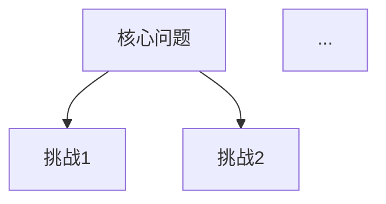
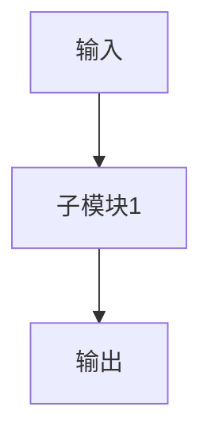
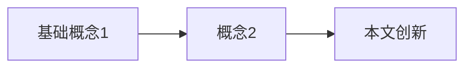

# 学术论文 PDF 处理技能

## 触发场景

- 用户提供 PDF 论文文件，说"翻译"/"解析"/"转 markdown"/"精读"
- 用户说"处理论文"/"论文翻译"/"PDF转MD"/"paper translate"
- 项目 `docs/文献资料/` 或 `Ref/` 目录下有新的 PDF 论文

---

## 完整流程（6 阶段）

```
Phase 1: PDF → Markdown（文本提取）
  ↓
Phase 2: 图片提取 + 页面渲染
  ↓
Phase 3: 中文翻译
  ↓
Phase 4: 公式格式化（$$ 独占一行）
  ↓
Phase 5: 合并输出（翻译版）
  ↓
Phase 6: 生成论文精读文档
```

---

## Phase 1: PDF → Markdown

### 引擎选择

| 引擎 | 命令 | 速度 | 适用场景 |
|------|------|------|---------|
| **pymupdf4llm**（推荐） | `pip install pymupdf4llm` | ~0.1s/页 | 数字原生PDF，日常批处理 |
| marker-pdf | `pip install marker-pdf` | ~1s/页 | 双栏复杂论文，需高质量结构保留 |

### pymupdf4llm 用法

```python
import pymupdf4llm
md_text = pymupdf4llm.to_markdown("论文.pdf")
```

### 多引擎脚本模板

```python
"""PDF → Markdown 转换工具（支持多引擎）"""
import argparse, sys
from pathlib import Path

def convert_pymupdf4llm(pdf_path: str) -> str:
    import pymupdf4llm
    return pymupdf4llm.to_markdown(pdf_path)

def convert_markitdown(pdf_path: str) -> str:
    from markitdown import MarkItDown
    return MarkItDown().convert(pdf_path).text_content

ENGINES = {"pymupdf4llm": convert_pymupdf4llm, "markitdown": convert_markitdown}

def pdf_to_markdown(pdf_path, out_path, engine="pymupdf4llm"):
    md_text = ENGINES[engine](pdf_path)
    Path(out_path).write_text(md_text, encoding="utf-8")
    print(f"Done: {out_path} ({len(md_text)} chars, engine={engine})")
```

### 质量检查

提取后必须检查以下指标，不达标则切换引擎重试：

| 指标 | 合格标准 | 不合格处理 |
|------|---------|-----------|
| 单词粘连 | `grep -c '[a-zA-Z]{30,}'` ≤ 5 | 换 marker-pdf |
| 章节标题 | 有 `##` 结构 | 无则换引擎 |
| 表格可读 | `\|` 分隔符可见 | 手动补表 |

---

## Phase 2: 图片提取 + 页面渲染

### 2.1 提取嵌入图片

```python
import fitz  # pymupdf
import os

def extract_images(pdf_path, out_dir, min_size=50):
    """提取PDF中所有 ≥min_size 的嵌入图片"""
    os.makedirs(out_dir, exist_ok=True)
    doc = fitz.open(pdf_path)
    count = 0
    for page_num in range(len(doc)):
        for img_idx, img in enumerate(doc[page_num].get_images(full=True)):
            xref = img[0]
            base = doc.extract_image(xref)
            if base['width'] < min_size or base['height'] < min_size:
                continue
            count += 1
            ext = base['ext']
            w, h = base['width'], base['height']
            path = os.path.join(out_dir, f'fig_p{page_num+1}_{img_idx+1}_{w}x{h}.{ext}')
            with open(path, 'wb') as f:
                f.write(base['image'])
    return count
```

### 2.2 渲染页面截图（用于公式和图表）

```python
def render_pages(pdf_path, out_dir, zoom=2.0):
    """将每页渲染为高分辨率图片"""
    os.makedirs(out_dir, exist_ok=True)
    doc = fitz.open(pdf_path)
    for page_num in range(len(doc)):
        page = doc[page_num]
        mat = fitz.Matrix(zoom, zoom)
        pix = page.get_pixmap(matrix=mat)
        pix.save(os.path.join(out_dir, f'page_{page_num+1}.png'))
```

### 2.3 图片映射

提取后建立 **图片编号 → 文件名** 映射表，按论文中 Figure 出现顺序匹配：

- `fig_p{页码}_{序号}_{宽}x{高}.{ext}` → 自动对应到翻译文的 ``

---

## Phase 3: 中文翻译

### 翻译规则

1. **全中文翻译**，不保留英文段落
2. **专业术语首次出现附英文对照**，如"改进的余弦相似度（Improved Cosine Similarity Measure, ICSM）"
3. **作者名保留英文**，如"Li等（2022）"
4. **参考文献不翻译**，保持英文原文格式
5. **表格数据不翻译**，仅翻译表头和说明文字
6. **公式编号保留**，如 `(1)`, `(2)` 等

### 翻译结构

```
# 中文标题（英文原标题的准确翻译）

期刊/年份信息
**作者**：中文名/英文名

## 摘要
**关键词**：翻译后的关键词

## 1. 引言
...
## 2. 相关工作
### 2.1 子节
...
## N. 结论
## 参考文献
```

---

## Phase 4: 公式格式化

### 核心规则

| 规则 | 示例 |
|------|------|
| `$$` 独占一行 | `\n$$\n公式\n$$\n` |
| 行内 `$` 改为 `$$` 并换行 | `$x$` → `\n$$\nx\n$$\n` |
| **表格内公式保持原样** | `| $F_1$ |` 不变 |
| 图片 alt 文本内可保留 `$` | `` 不变 |

### 自动转换脚本

```python
import re

def fix_dollar_format(content):
    """将非表格行的 $...$ 转为 $$...$$ 独立行"""
    lines = content.split('\n')
    result = []
    for line in lines:
        stripped = line.strip()
        if stripped.startswith('|') or stripped.startswith('!['):
            result.append(line)
            continue
        # 替换单美元符号
        pattern = re.compile(r'\$(?!\$)(.+?)(?<!\$)\$(?!\$)')
        matches = list(pattern.finditer(line))
        if not matches:
            result.append(line)
            continue
        parts = []
        last = 0
        for m in matches:
            parts.append(line[last:m.start()])
            parts.append('\n\n$$\n' + m.group(1) + '\n$$\n')
            last = m.end()
        parts.append(line[last:])
        result.append(''.join(parts))
    out = '\n'.join(result)
    return re.sub(r'\n{4,}', '\n\n\n', out)
```

---

## Phase 5: 合并输出

### 输出目录结构

```
docs/文献资料/
├── {论文标题翻译}.md          ← 完整翻译版
├── images/                    ← 提取的图片
│   ├── fig_p1_1_238x298.jpeg
│   ├── page_1.png             ← 页面截图
│   └── ...
└── {主题} 论文精读：{简短描述}.md  ← 精读文档
```

---

## Phase 6: 生成论文精读文档

精读文档 ≠ 翻译版。它是一份**教学导向**的深度解析，面向想理解算法原理的读者。

### 精读文档模板

```markdown
# {主题} 论文精读：{简短描述}

> **论文全称**：{英文原标题}
> **发表期刊**：{期刊名}，{年份}，Vol. {卷号}
> **作者**：{第一作者} 等，{机构}

---

## 1. 问题背景

### 1.1 为什么需要这个方法？

{用通俗语言解释问题，配合 mermaid 挑战图}

### 1.2 核心挑战



### 1.3 现有方法的局限

| 方法类型 | 代表方法 | 局限性 |
|----------|----------|--------|
| ... | ... | ... |

---

## 2. 整体框架

{一句话总结核心思路}



---

## 3. 关键算法详解

### 3.1 {算法名}

{通俗解释 + 公式 + SVG/Mermaid 示意图}

$$
{关键公式}
$$

### 3.2 {下一个算法}

...

---

## 5. 核心技术概念索引



---

## 6. 实验结果

| 方法 | 核心指标 | 是否需要GPU | 速度 |
|------|---------|------------|------|
| ... | ... | ... | ... |
| **本文** | **最佳** | ... | ... |

---

## 7. 方法局限性与后续改进方向

{总结局限 + 后续代表工作}

---

## 参考文献

- {完整引用列表}
```

### 精读文档 vs 翻译版的区别

| 维度 | 翻译版 | 精读文档 |
|------|--------|---------|
| 目的 | 忠实翻译原文 | 教学导向，帮助理解 |
| 语言 | 逐段翻译 | 通俗解释 + 类比 |
| 公式 | 保留原文所有公式 | 只保留关键公式，用文字解释 |
| 图表 | 引用原文图片 | 新增 mermaid/SVG 示意图 |
| 结构 | 跟随原文章节 | 重组为"问题→方法→创新→结果" |
| 表格 | 保留原文所有表格 | 精简为对比表 |

---

## 完整调用示例

用户说"翻译这篇论文 Ref/xxx.pdf"时，CC 应执行：

```
1. 确认PDF路径存在
2. 创建输出目录 docs/文献资料/images/
3. pymupdf4llm 提取 Markdown
4. fitz 提取嵌入图片 + 渲染页面截图
5. 分节翻译为中文（可委托子代理并行处理前后半部分）
6. 合并翻译文件
7. 运行 fix_dollar_format() 统一公式格式
8. 生成论文精读文档
9. 清理临时文件
10. 报告输出文件列表
```

### 子代理并行模式

翻译阶段较长时（>100行），可拆分为前后两部分并行翻译：

```
Agent({ description: "翻译论文前半部分(1-N节)", prompt: "...", run_in_background: true })
Agent({ description: "翻译论文后半部分(N+1-结论+参考文献)", prompt: "...", run_in_background: true })
# 等待两个子代理完成后合并
```

---

## 依赖

| 工具 | 安装 | 用途 |
|------|------|------|
| pymupdf4llm | `pip install pymupdf4llm` | PDF→Markdown（主引擎） |
| pymupdf | `pip install pymupdf` | 图片提取、页面渲染 |
| marker-pdf | `pip install marker-pdf`（可选） | 高质量PDF→MD（备选引擎） |
