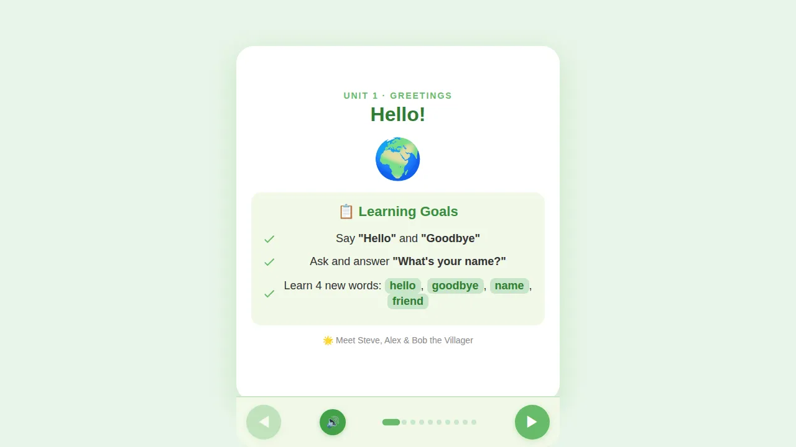
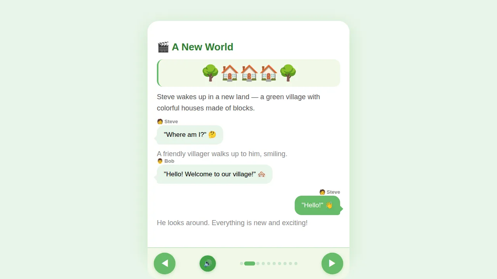
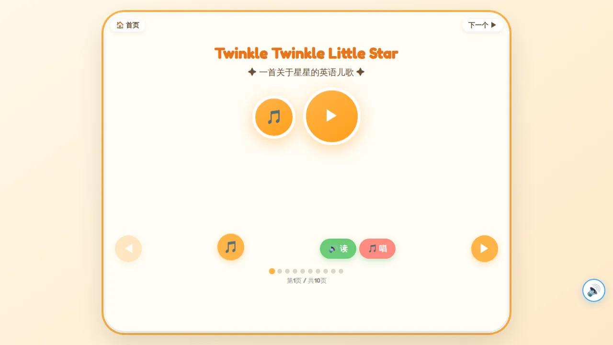

# 🎪 小朋友的互动学习乐园 — Children's Interactive Learning Courseware

> **115+ 交互式 HTML 课件** · 适用于 5-7 岁幼儿 · 触摸屏/键盘双模式 · 零服务器依赖

[](https://github.com/nonomil/childrens-library)
[](courseware/)
[](LICENSE)

---

## 🎯 这是什么？

一个**纯前端的幼儿互动课件库**，所有课程都是独立的 HTML 文件，**打开即用、无需联网、零加载等待**。

<div align="center">
  
  
  
</div>

### ✨ 特点

| | 特点 | 说明 |
|---|---|---|
| 🎯 | **一页一课** | 每个 HTML 就是一节课，直接打开浏览器就能学 |
| 🚀 | **零依赖** | 纯前端，无需服务器，无需安装 |
| 🖱️ | **触摸 + 键鼠** | 专为平板优化，也支持键盘/鼠标 |
| 🎤 | **语音驱动** | 所有文字可点击朗读，不识字也能学 |
| 🧱 | **Minecraft 主题** | Steve & Alex 引导学习，情境式教学 |
| 🎮 | **游戏化** | 配对、闯关、测验、彩纸庆祝 |

---

<div align="center">
  
</div>

---

## 📚 课件分类

### 🔤 英语启蒙（25 课）
| 阶段 | 内容 | 课号 |
|:--|:--|:--:|
| 🟢 入门 | Hello打招呼、ABC字母、颜色、数字 1-5 | 01–05 |
| 🔵 基础 | 家庭、动物、身体、食物、玩具 | 06–10 |
| 🟡 进阶 | 天气、衣服、动作、地点、情绪、时间、交通工具 | 11–17 |
| 🟠 故事 | 综合复习、走失的猫、暴风雨、生日派对、农场、寻宝 | 18–24 |

### 🀄 语文/中文（25 课）
| 阶段 | 内容 | 课号 |
|:--|:--|:--:|
| 🟢 象形识字 | 天地人、大自然、家庭、学校 | 01–06 |
| 🔵 拼音王国 | 拼音入门、声母×3、韵母 | 07–12 |
| 🟡 主题识字 | 身体、颜色、食物、动作、方向、动物 | 13–18 |
| 🟠 进阶阅读 | 复合词、短句、反义词、问答、古诗、大冒险 | 19–24 |

### 🔢 数学启蒙（25 课）
- 数数 1~10 / 数到 20 / 比大小
- 认识加法 / 减法 / 10以内 / 20以内进退位
- 图形 / 测量 / 钱币 / 钟表
- 统计 / 位置 / 乘法启蒙 / 分数
- 应用题挑战 / 数学嘉年华

### 🎵 英语童谣（27 首）
Twinkle Twinkle · Old MacDonald · Wheels on the Bus · Five Little Monkeys · BINGO · ABC Song · Head Shoulders · Humpty Dumpty · If You're Happy · London Bridge · Mary's Little Lamb · Jack and Jill · 以及更多...

### 🌱 科学/绘本（7 课）
- 齿轮传动原理（STEM 互动 SVG）
- 雨林大冒险（点触探索）
- 大自然识字（云雨风雪星花草虫鸟）
- 英文绘本 + 双语对照

---

## 🚀 快速开始

### 在线版（限制较多）
目前托管于 Cloudflare Pages，访问需科学上网环境。

### 本地使用（推荐）

```bash
# 克隆仓库
git clone https://github.com/nonomil/childrens-library.git

# 直接用浏览器打开任意课件
cd childrens-library/courseware
open english-01-hello.html      # macOS
start english-01-hello.html     # Windows
xdg-open english-01-hello.html  # Linux
```

### 本地启动 HTTP 服务

```bash
cd childrens-library/courseware
python3 -m http.server 8080
# 访问 http://localhost:8080/
```

---

## 🛠 技术栈

| 技术 | 用途 |
|:--|:--|
| **HTML/CSS/JS** | 原生三件套，每课一个独立 HTML |
| **GSAP 3.12** | 页面过渡动画、彩纸庆祝效果 |
| **Web Speech API** | 文字朗读 TTS（中文/英文） |
| **MP3 音频** | 优先使用本地音源，TTS 后备降级 |
| **WebP 图片** | 全部图片 WebP 压缩，节省 90%+ 带宽 |
| **Google Fonts** | Nunito（教材）/ Fredoka One（童谣） |

### 🧰 共享工具库

`courseware/shared/courseware.js` 提供可选的公共功能：

| 函数 | 说明 |
|:--|:--|
| `playClick(src, text)` | MP3 播放 → 失败自动降级为 TTS |
| `speakPage()` | 朗读当前页面所有文字 |
| `celebrate()` | 🎊 GSAP 彩纸庆祝动画 |
| `navGoTo/navPrev/navNext` | 翻页导航（可选，兼容则用） |
| `initSwipe()` | 触摸滑动支持（可选） |

---

## 📂 项目结构

```
childrens-library/
├── 📄 README.md                # 项目首页
├── 📁 courseware/              # 🎯 全部课件 HTML（主产品）
│   ├── 📁 shared/              #   共享 JS/CSS 库
│   │   ├── courseware.js       #   playClick / celebrate / navGoTo
│   │   └── courseware.css      #   导航栏 / 彩纸 / 动画样式
│   ├── 📁 images/              #   全部 WebP 图片资源
│   ├── 📁 audio/               #   MP3 音频文件
│   ├── english-01-hello.html
│   ├── twinkle-twinkle.html
│   └── ... (115+ 课件)
├── 📁 docs/                    # MkDocs 文档（绘本清单等）
├── 📁 scripts/                 # 生成/转换脚本
├── 📁 assets/                  # 截图素材
├── ⚙️ mkdocs.yml
└── .gitignore
```

---

## 📊 项目统计

| 指标 | 数值 |
|:--|:--:|
| 课件总数 | 115+ |
| 代码行数 | ~120,000 |
| 图片文件 | 423+（全部 WebP） |
| 共享 JS 库 | 133 行 |
| 覆盖学科 | 英语·中文·数学·童谣·科学·绘本 |

---

## 📜 许可证

本项目为个人学习项目，课件内容仅供教育参考使用。

---

*用 ❤️ 发电 · 为小朋友做的互动学习乐园* 🎪
