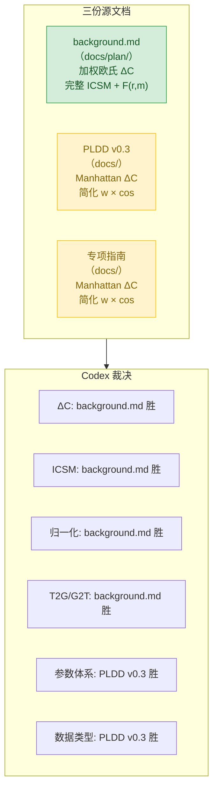
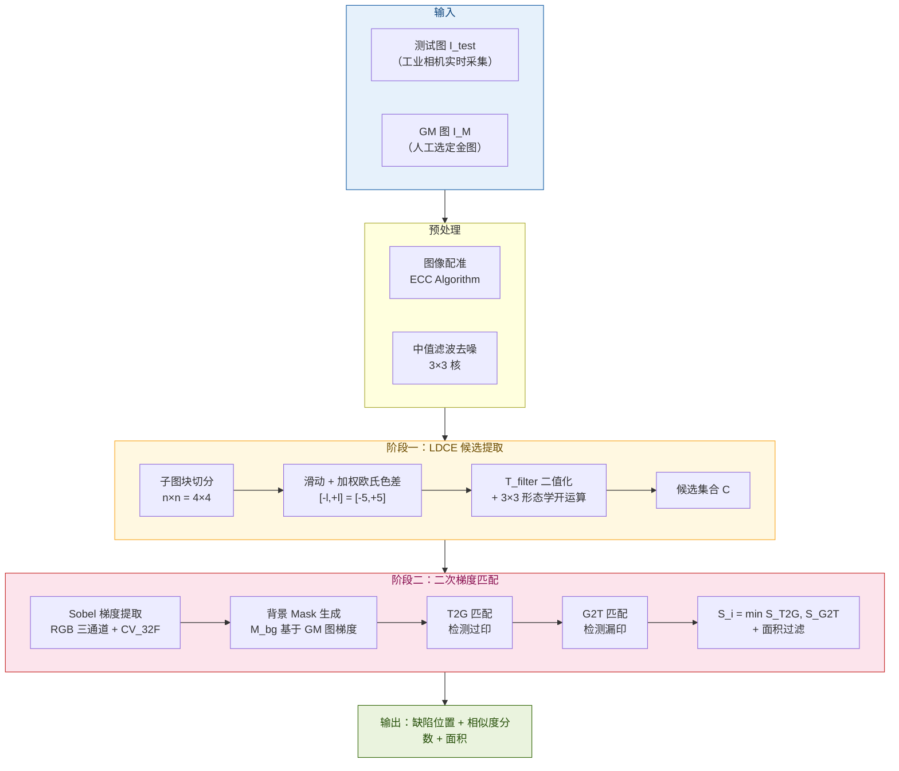
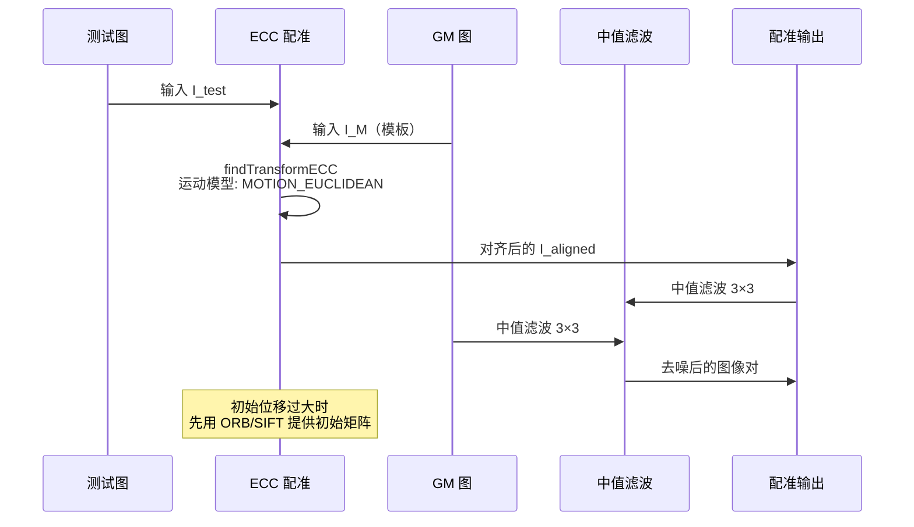
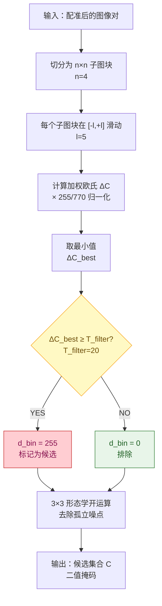
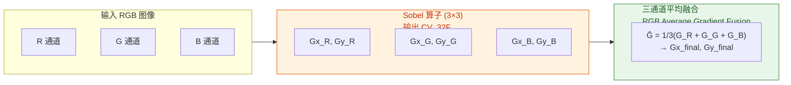
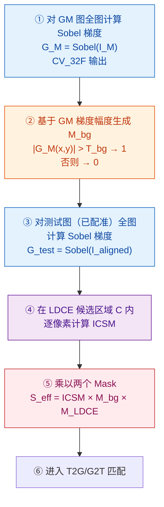
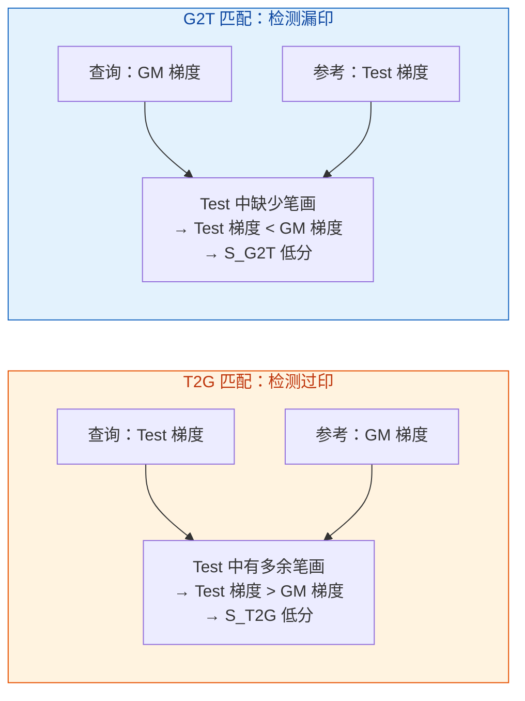
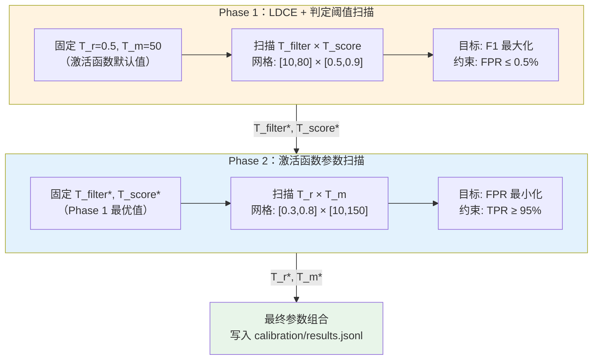
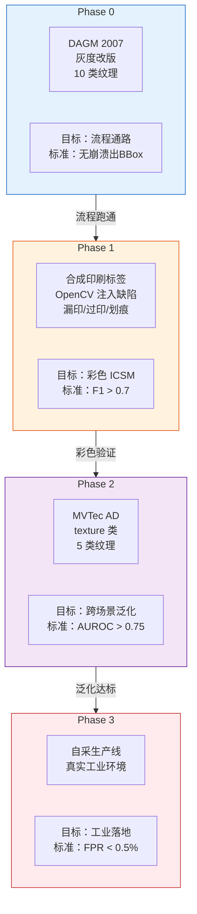

# PLDD 统一算法规格文档

> 基于三文档交叉审核 + 论文原文（中文全译）校准的论文忠实复现规格。v1.1 修正三项公式错误。

## 目录

1. [文档来源与统一决策](#1-文档来源与统一决策)
2. [整体算法框架](#2-整体算法框架)
3. [图像配准](#3-图像配准)
4. [阶段一：LDCE 候选提取](#4-阶段一ldce-候选提取)
5. [RGB 三通道梯度提取](#5-rgb-三通道梯度提取)
6. [背景掩码与 Mask 机制](#6-背景掩码与-mask-机制)
7. [改进余弦相似度 ICSM](#7-改进余弦相似度-icsm)
8. [T2G 与 G2T 双向匹配](#8-t2g-与-g2t-双向匹配)
9. [核心参数完整定义](#9-核心参数完整定义)
10. [数据类型安全规范](#10-数据类型安全规范)
11. [参数标定实验设计](#11-参数标定实验设计)
12. [数据集选型与验证路径](#12-数据集选型与验证路径)
13. [性能指标与论文结果](#13-性能指标与论文结果)

---

## 1. 文档来源与统一决策

本规格基于四份文档交叉审核后统一，Codex 逐项判定各公式的论文原貌归属。

### 三文档公式冲突与裁决

| 模块 | 采用版本 | 来源 | 弃用原因 |
|---|---|---|---|
| ΔC 色差 | 加权欧氏 + ×255/770 | background.md（论文 Eq.1-6） | PLDD v0.3 的 Manhattan 是简化改写，丢失动态权重 |
| ICSM | 完整 cos × F(r,m) | background.md（论文 Eq.10+17-19） | 专项指南的 w × cos 缺少激活函数，漏检率高 |
| 归一化系数 | ×255/770 | background.md（论文 Eq.6） | 1/(3×255) 等价意图但不等同，映射范围不同 |
| T2G/G2T 语义 | 过印/漏印双方向 + min 融合 | background.md（论文 §3.4） | PLDD v0.3 的"粗筛/精定位"混淆了物理意义 |
| 参数体系 | 完整参数表含单位和标定方法 | PLDD v0.3（§7） | background.md 参数定义不完整 |
| Mask 处理顺序 | 梯度 → Mask → ICSM → 乘积 | PLDD v0.3（§6） | background.md 顺序不明确 |
| 数据类型规范 | float32 全程，CV_32F 强制 | PLDD v0.3（§9） | background.md 未涉及溢出风险 |

---

## 2. 整体算法框架

PLDD（Printed Label Defect Detection）分两个主要阶段，前置图像配准。核心思想：先粗筛候选区域（LDCE），再通过梯度方向匹配精确定位缺陷（二次梯度匹配）。

**数据流转总览**：测试图和 GM 图经配准去噪后，LDCE 阶段输出候选区域集合 C（二值掩码），C 内的像素进入二次梯度匹配，通过 ICSM 计算相似度后输出最终缺陷判定。

---

## 3. 图像配准

配准将测试图精确对齐到 GM 图，消除传送带引起的全局位移和旋转。论文采用基于形状的模板匹配，工程实现落地为 ECC（Enhanced Correlation Coefficient）算法。

**配准失败原因与对策**：图像对比度不足时 ECC 无法收敛；初始位移超出收敛盆地时同样失败。工程上先用 ORB 或 SIFT 特征点匹配给出初始变换矩阵，再交给 ECC 精化。运动模型默认使用 `MOTION_EUCLIDEAN`（平移+旋转），若标签有透视变形则升级为 `MOTION_HOMOGRAPHY`。

---

## 4. 阶段一：LDCE 候选提取

LDCE（Latent Defect Candidates Extraction）在全图中快速标出"值得进一步检查"的候选区域，排除非刚性形变产生的伪影。

### 4.1 ΔC 加权欧氏色差（Eq.1–6）

论文不使用简单 Manhattan 距离，而采用**加权欧氏色差**。权重系数根据红色通道均值动态调整，模拟人眼对不同颜色区间的感知差异。

红色通道均值：

$$
r = \frac{C_{1,R} + C_{2,R}}{2}
$$

加权欧氏色差：

$$
\Delta C = \sqrt{\left(2 + \frac{r}{256}\right)\Delta R^2 + 4\,\Delta G^2 + \left(2 + \frac{255 - r}{256}\right)\Delta B^2}
$$

归一化到 [0, 255]：

$$
\Delta C_{\text{revised}} = \Delta C \times \frac{255}{770}
$$

其中 770 是三通道加权欧氏距离的工程近似上界。

**为什么不用 Manhattan**：Manhattan 距离对所有通道赋予相同权重。加权欧氏通过 r 均值动态调整红蓝权重——在浅色背景的浅色字区域（低对比度缺陷），Manhattan 产生的色差值接近背景噪声，而加权欧氏因权重自适应而具有更高的缺陷灵敏度。

### 4.2 LDCE 子图块滑动机制

将图像切分为 n×n 个子图块（论文最优值 n=4），每个子图块在 [-l, +l]（论文 l=5）范围内滑动，取最小差异作为最优对齐残差。

<svg viewBox="0 0 620 340" xmlns="http://www.w3.org/2000/svg">
<defs>
<marker id="arrow" markerWidth="8" markerHeight="8" refX="6" refY="3" orient="auto">
<path d="M0,0 L0,6 L8,3 z" fill="#555"/>
</marker>
</defs>
<g id="background">
<rect x="20" y="20" width="260" height="260" rx="4" fill="#FAFAFA" stroke="#CCC" stroke-width="1"/>
<rect x="30" y="30" width="115" height="115" rx="2" fill="#E3F2FD" stroke="#1976D2" stroke-width="1.2"/>
<rect x="30" y="155" width="115" height="115" rx="2" fill="#FFF3E0" stroke="#E65100" stroke-width="1.2"/>
<rect x="155" y="30" width="115" height="115" rx="2" fill="#FFF3E0" stroke="#E65100" stroke-width="1.2"/>
<rect x="155" y="155" width="115" height="115" rx="2" fill="#FFF3E0" stroke="#E65100" stroke-width="1.2"/>
<rect x="340" y="30" width="60" height="60" rx="3" fill="#E3F2FD" stroke="#1976D2" stroke-width="1.5"/>
<rect x="335" y="25" width="70" height="70" rx="3" fill="none" stroke="#C62828" stroke-width="1" stroke-dasharray="4,3"/>
<rect x="320" y="110" width="100" height="30" rx="3" fill="#F5F5F5" stroke="#999" stroke-width="1"/>
<rect x="340" y="160" width="250" height="110" rx="6" fill="#F9FBE7" stroke="#9E9D24" stroke-width="1.2"/>
</g>
<g id="edges">
<line x1="260" y1="150" x2="330" y2="60" stroke="#555" stroke-width="1" marker-end="url(#arrow)"/>
<line x1="400" y1="60" x2="410" y2="108" stroke="#555" stroke-width="1" marker-end="url(#arrow)"/>
</g>
<g id="nodes">
<circle cx="350" cy="120" r="4" fill="#C62828"/>
<circle cx="360" cy="118" r="4" fill="#C62828" opacity="0.5"/>
<circle cx="340" cy="125" r="4" fill="#C62828" opacity="0.5"/>
</g>
<g id="labels">
<text x="87" y="95" text-anchor="middle" font-size="11" font-weight="bold" fill="#1565C0">Block(0,0)</text>
<text x="87" y="220" text-anchor="middle" font-size="11" fill="#BF360C">Block(1,0)</text>
<text x="212" y="95" text-anchor="middle" font-size="11" fill="#BF360C">Block(0,1)</text>
<text x="212" y="220" text-anchor="middle" font-size="11" fill="#BF360C">Block(1,1)</text>
<text x="25" y="14" font-size="10" fill="#666">4×4 切分示意（n=4）</text>
<text x="370" y="20" text-anchor="middle" font-size="10" fill="#666">单块滑动</text>
<text x="370" y="65" text-anchor="middle" font-size="10" fill="#1565C0">当前块</text>
<text x="370" y="15" text-anchor="middle" font-size="9" fill="#C62828">[-l,+l] 搜索范围</text>
<text x="370" y="130" text-anchor="middle" font-size="9" fill="#C62828">各偏移位置</text>
<text x="350" y="155" text-anchor="middle" font-size="9" fill="#666">↓ 取 min</text>
<text x="465" y="185" text-anchor="middle" font-size="10" font-weight="bold" fill="#558B2F">ΔC_best = min ΔC_revised</text>
<text x="465" y="210" text-anchor="middle" font-size="9" fill="#666">最佳对齐差异</text>
<text x="465" y="235" text-anchor="middle" font-size="9" fill="#666">若 ΔC_best ≥ T_filter</text>
<text x="465" y="255" text-anchor="middle" font-size="9" font-weight="bold" fill="#C62828">→ 标记为候选</text>
</g>
</svg>

最优对齐差异的数学表达：

$$
\Delta C_{\text{best}}(x,y) = \min_{(di, dj) \in [-l,+l]^2} \Delta C_{\text{revised}}\bigl(\text{shift}(I_{\text{test}}, di, dj),\; I_M\bigr)
$$

物理含义：在小范围内允许局部平移补偿形变，用最佳对齐后的残差作为真实差异。这确保了只有"即使在小范围内也找不到好匹配"的区域才被标记为候选。

### 4.3 LDCE 完整流程

---

## 5. RGB 三通道梯度提取

论文不将彩色图像转成灰度再提取梯度，而是对 R/G/B 三个通道**分别**运行 Sobel 算子，保留各通道的纹理信息。这是 ICSM 在低对比度缺陷上漏检率低于灰度方案的关键。

梯度幅值计算：

$$
\|G(x,y)\| = \sqrt{G_x^2(x,y) + G_y^2(x,y)}
$$

**Sobel X 方向核**（k=3）：

| -1 | 0 | +1 |
|---|---|---|
| -2 | 0 | +2 |
| -1 | 0 | +1 |

**Sobel Y 方向核**（k=3）：

| -1 | -2 | -1 |
|---|---|---|
| 0 | 0 | 0 |
| +1 | +2 | +1 |

三通道梯度融合策略（论文原文"RGB 平均梯度融合"）：对每个像素位置，将 R/G/B 三通道的梯度向量取算术平均。公式为：

$$
\bar{G} = \frac{1}{3}(G_R + G_G + G_B)
$$

即 Gx_final = (Gx_R + Gx_G + Gx_B) / 3，Gy_final = (Gy_R + Gy_G + Gy_B) / 3。**论文贡献声明明确写"RGB平均梯度融合"（RGB Average Gradient Fusion），不是取最大通道**。平均融合保留了所有通道的纹理信息，避免单一通道丢失低对比度缺陷。

---

## 6. 背景掩码与 Mask 机制

Mask 机制是 PLDD 区别于简单梯度匹配的核心——它消除低纹理背景区域的梯度干扰，确保 ICSM 只在有意义的印刷纹理区域计算。

### 6.1 正确的处理顺序

**梯度计算在 Mask 之前，对全图执行，不受候选区域限制。** 若先 Mask 再求梯度，会在掩码边界产生人工边缘。

**为什么 M_bg 基于 GM 图而非测试图**：GM 图代表"正常印刷"的期望纹理分布。以 GM 图定义哪些区域应有梯度、哪些是真实背景，可避免测试图中因缺陷导致的梯度异常被误认为背景。

### 6.2 Mask 叠加效果

<svg viewBox="0 0 620 200" xmlns="http://www.w3.org/2000/svg">
<defs>
<marker id="arrow2" markerWidth="8" markerHeight="8" refX="6" refY="3" orient="auto">
<path d="M0,0 L0,6 L8,3 z" fill="#555"/>
</marker>
</defs>
<g id="background">
<rect x="20" y="50" width="120" height="80" rx="4" fill="#E3F2FD" stroke="#1565C0" stroke-width="1.2"/>
<rect x="190" y="50" width="120" height="80" rx="4" fill="#FFF3E0" stroke="#E65100" stroke-width="1.2"/>
<rect x="360" y="50" width="120" height="80" rx="4" fill="#FFEBEE" stroke="#C62828" stroke-width="1.2"/>
<rect x="530" y="40" width="80" height="100" rx="4" fill="#E8F5E9" stroke="#2E7D32" stroke-width="1.2"/>
</g>
<g id="edges">
<line x1="140" y1="90" x2="188" y2="90" stroke="#555" stroke-width="1.2" marker-end="url(#arrow2)"/>
<line x1="310" y1="90" x2="358" y2="90" stroke="#555" stroke-width="1.2" marker-end="url(#arrow2)"/>
<line x1="480" y1="90" x2="528" y2="90" stroke="#555" stroke-width="1.2" marker-end="url(#arrow2)"/>
</g>
<g id="labels">
<text x="80" y="30" text-anchor="middle" font-size="11" font-weight="bold" fill="#1565C0">ICSM 相似度图</text>
<text x="80" y="75" text-anchor="middle" font-size="9" fill="#666">缺陷区域低分</text>
<text x="80" y="90" text-anchor="middle" font-size="9" fill="#666">背景区域高分</text>
<text x="80" y="110" text-anchor="middle" font-size="9" fill="#999">S(x,y) ∈ [0,1]</text>
<text x="250" y="30" text-anchor="middle" font-size="11" font-weight="bold" fill="#E65100">M_bg 背景掩码</text>
<text x="250" y="75" text-anchor="middle" font-size="9" fill="#666">有纹理=1</text>
<text x="250" y="90" text-anchor="middle" font-size="9" fill="#666">无纹理=0</text>
<text x="250" y="110" text-anchor="middle" font-size="9" fill="#999">基于 GM 梯度</text>
<text x="420" y="30" text-anchor="middle" font-size="11" font-weight="bold" fill="#C62828">M_LDCE 候选掩码</text>
<text x="420" y="75" text-anchor="middle" font-size="9" fill="#666">候选区域=1</text>
<text x="420" y="90" text-anchor="middle" font-size="9" fill="#666">非候选=0</text>
<text x="420" y="110" text-anchor="middle" font-size="9" fill="#999">来自 LDCE 阶段</text>
<text x="570" y="30" text-anchor="middle" font-size="11" font-weight="bold" fill="#2E7D32">S_eff</text>
<text x="570" y="60" text-anchor="middle" font-size="9" fill="#2E7D32">有效相似度</text>
<text x="570" y="80" text-anchor="middle" font-size="9" fill="#666">只在候选区域</text>
<text x="570" y="95" text-anchor="middle" font-size="9" fill="#666">且有纹理处</text>
<text x="570" y="110" text-anchor="middle" font-size="9" fill="#666">保留分数</text>
<text x="420" y="165" text-anchor="middle" font-size="9" fill="#999">S_eff = S × M_bg × M_LDCE</text>
</g>
</svg>

背景掩码定义：

$$
M_{\text{bg}}(x,y) = \begin{cases} 1 & \text{if } \|G_M(x,y)\| > T_{\text{bg}} \\ 0 & \text{otherwise} \end{cases}
$$

有效相似度（叠加两个掩码）：

$$
S_{\text{eff}}(x,y) = S(x,y) \cdot M_{\text{bg}}(x,y) \cdot M_{\text{LDCE}}(x,y)
$$

---

## 7. 改进余弦相似度 ICSM

ICSM（Improved Cosine Similarity Measure）是 PLDD 的核心创新，在标准余弦相似度基础上引入非线性激活函数，同时考虑梯度方向和幅值差异。

### 7.1 标准余弦 → 改进版的动机

标准余弦相似度只衡量梯度方向一致性，忽略幅值差异：

$$
\cos(\mathbf{G}_{\text{test}}, \mathbf{G}_M) = \frac{G_{x,t} \cdot G_{x,m} + G_{y,t} \cdot G_{y,m}}{\|\mathbf{G}_{\text{test}}\| \cdot \|\mathbf{G}_M\|}
$$

**问题**：当测试图存在漏印时，该区域梯度幅值趋近于零，但由于噪声，方向仍可能"凑巧"与 GM 图相似，余弦值偏高 → **漏检**。ICSM 通过非线性激活函数 F(r, m) 解决此问题。

### 7.2 ICSM 完整公式（Eq.10）

$$
\text{Sim}\left(T_i, G_i^{(u,v)}\right) = \frac{1}{N} \sum_{j=1}^{N} F(r_j, m_j) \cdot \frac{G_{j,x}^T \cdot G_{j,x}^G + G_{j,y}^T \cdot G_{j,y}^G}{\sqrt{(G_{j,x}^T)^2 + (G_{j,y}^T)^2} \cdot \sqrt{(G_{j,x}^G)^2 + (G_{j,y}^G)^2}} \cdot M_i
$$

**关键要素**：

- **1/N 平均**：仅在 N 个 Canny 特征点上求和后取平均，不是逐像素计算
- N = 子图像 T_i 经 Canny 边缘检测后的特征点数量
- 分子：第 j 个特征点处的梯度内积，衡量方向一致性
- 分母：梯度幅值乘积，归一化因子
- F(r, m)：非线性激活函数，连续调节得分
- M_i：第 i 个候选的掩码（由图5流程生成）

**为什么只在 Canny 特征点上计算**：Canny 提取的是边缘/纹理关键点，在这些点上梯度方向信息最具判别力。全像素计算会引入大量低梯度噪声点，稀释有效信号。1/N 归一化确保不同大小的候选区域具有可比的相似度得分。

### 7.3 非线性激活函数 F(r, m)（Eq.15–19）

定义两个判定指标——幅值比 r 和幅值差 m：

$$
r_j = \frac{\min(\|G_{\text{test}}\|, \|G_M\|)}{\max(\|G_{\text{test}}\|, \|G_M\|)}
$$

$$
m_j = \left|\|G_{\text{test}}\| - \|G_M\|\right|
$$

激活函数（**连续返回值，不是二值门控**）：

$$
F(r_j, m_j) = \begin{cases} r_j, & \text{if } r_j < T_r \\ m_j, & \text{if } m_j > T_m \\ 0, & \text{otherwise} \end{cases}
$$

**物理含义**：F(r,m) 不是简单的 0/1 硬门控，而是根据幅值比或幅值差返回连续值。当幅值比偏低（r_j < T_r）时，返回 r_j 本身作为惩罚系数——r_j 越小惩罚越重；当幅值差偏大（m_j > T_m）时，返回 m_j 作为惩罚——m_j 越大惩罚越重。当两个指标都处于正常范围时，返回 0，将该特征点对 ICSM 的贡献置零（即"确认有缺陷"）。

### 7.4 F(r, m) 三种场景的物理直觉

<svg viewBox="0 0 620 220" xmlns="http://www.w3.org/2000/svg">
<defs>
<marker id="arrow3" markerWidth="8" markerHeight="8" refX="6" refY="3" orient="auto">
<path d="M0,0 L0,6 L8,3 z" fill="#555"/>
</marker>
</defs>
<g id="background">
<rect x="15" y="15" width="185" height="190" rx="8" fill="#E8F5E9" stroke="#2E7D32" stroke-width="1.5"/>
<rect x="215" y="15" width="185" height="190" rx="8" fill="#FFF8E1" stroke="#F9A825" stroke-width="1.5"/>
<rect x="415" y="15" width="185" height="190" rx="8" fill="#FFEBEE" stroke="#C62828" stroke-width="1.5"/>
</g>
<g id="nodes">
<circle cx="107" cy="90" r="35" fill="#A5D6A7" stroke="#2E7D32" stroke-width="2" opacity="0.7"/>
<circle cx="307" cy="90" r="35" fill="#FFE082" stroke="#F9A825" stroke-width="2" opacity="0.7"/>
<circle cx="507" cy="90" r="12" fill="#EF9A9A" stroke="#C62828" stroke-width="2" opacity="0.9"/>
<circle cx="507" cy="90" r="45" fill="none" stroke="#C62828" stroke-width="2" stroke-dasharray="5,3"/>
</g>
<g id="labels">
<text x="107" y="35" text-anchor="middle" font-size="12" font-weight="bold" fill="#1B5E20">正常区域</text>
<text x="107" y="60" text-anchor="middle" font-size="10" fill="#2E7D32">梯度幅值相近</text>
<text x="107" y="80" text-anchor="middle" font-size="10" fill="#2E7D32">方向相同</text>
<text x="107" y="135" text-anchor="middle" font-size="10" fill="#555">r → 1, m → 0</text>
<text x="107" y="155" text-anchor="middle" font-size="10" fill="#555">F = 0（正常）</text>
<text x="107" y="178" text-anchor="middle" font-size="11" font-weight="bold" fill="#2E7D32">ICSM ≈ cos → 高分</text>
<text x="307" y="35" text-anchor="middle" font-size="12" font-weight="bold" fill="#6D4C00">疑似缺陷</text>
<text x="307" y="60" text-anchor="middle" font-size="10" fill="#E65100">幅值比偏低</text>
<text x="307" y="80" text-anchor="middle" font-size="10" fill="#E65100">r_j &lt; T_r</text>
<text x="307" y="135" text-anchor="middle" font-size="10" fill="#555">F = r_j（连续惩罚）</text>
<text x="307" y="155" text-anchor="middle" font-size="10" fill="#555">r_j 越小 → 惩罚越重</text>
<text x="307" y="178" text-anchor="middle" font-size="11" font-weight="bold" fill="#E65100">ICSM → 低分</text>
<text x="507" y="35" text-anchor="middle" font-size="12" font-weight="bold" fill="#880E4F">确定漏印</text>
<text x="507" y="60" text-anchor="middle" font-size="10" fill="#C62828">幅值差极大</text>
<text x="507" y="80" text-anchor="middle" font-size="10" fill="#C62828">m_j > T_m</text>
<text x="507" y="135" text-anchor="middle" font-size="10" fill="#555">r 偏低, m 极大</text>
<text x="507" y="155" text-anchor="middle" font-size="10" fill="#555">F = m_j（大幅惩罚）</text>
<text x="507" y="178" text-anchor="middle" font-size="11" font-weight="bold" fill="#C62828">ICSM ≈ 0</text>
</g>
</svg>

**关键设计**：F(r, m) 是一个**连续惩罚函数**，不是二值门控。当幅值比偏低（r_j < T_r）时，返回 r_j 本身（值域 [0, T_r)）作为惩罚系数；当幅值差偏大（m_j > T_m）时，返回 m_j 本身作为惩罚。只有当两个指标都处于正常范围时才返回 0，将该点贡献置零。这种连续机制比硬门控更平滑——靠近阈值的可疑点获得轻微惩罚，远离阈值的明确缺陷获得重度惩罚。

### 7.5 ICSM 映射与最终得分

ICSM 原始范围 [-1, 1]，映射到 [0, 1]：

$$
S(x,y) = \frac{\text{ICSM}(x,y) + 1}{2}
$$

缺陷得分（越高越可能是缺陷）：

$$
D(x,y) = 1 - S(x,y)
$$

---

## 8. T2G 与 G2T 双向匹配

"二次"梯度匹配的含义是从两个方向各做一次 ICSM 计算，分别针对不同缺陷类型。这不是"粗筛+精定位"，而是**两个互补方向的独立验证**。

### 8.1 双向匹配原理

| 匹配方向 | 查询图 | 参考图 | 检测目标 | 物理解释 |
|---|---|---|---|---|
| T2G（Test to GM） | 测试图梯度 | GM 图梯度 | 过印（多余笔画） | Test 有 GM 没有的纹理 → 幅值比 r 低 |
| G2T（GM to Test） | GM 图梯度 | 测试图梯度 | 漏印（缺失笔画） | GM 有 Test 没有的纹理 → 幅值比 r 低 |

### 8.2 最终得分融合

取两次匹配的最小值（最严格判断）：

$$
S_i = \min(S_{\text{T2G}},\; S_{\text{G2T}})
$$

最终缺陷判定：

$$
\text{Defect}(x,y) = \begin{cases} 1 & \text{if } S_i < T_{\text{score}} \text{ AND area} > T_{\text{area}} \\ 0 & \text{otherwise} \end{cases}
$$

**为什么取 min 而非平均**：只有两个方向都确认"正常"时才判定为正常。任一方向发现异常即标记为缺陷，确保过印和漏印均不漏检。

---

## 9. 核心参数完整定义

论文给出了部分参数的具体值。T_r 和 T_m（激活函数内部参数）未给出，必须通过标定实验确定。

### 9.1 参数总表

| 参数 | 符号 | 论文值 | 建议范围 | 单位 | 确定方式 |
|---|---|---|---|---|---|
| LDCE 色差阈值 | $T_{\text{filter}}$ | 20 | 10–80 | ΔC_revised 值 | 标定实验 |
| 子图分割数 | $n$ | 4 | 2–8 | — | 论文最优值 |
| LDCE 滑动范围 | $l$ | 5 | 2–10 | 像素 | 论文值 |
| 形态学核 | — | 3 | 3–7 | 像素 | 论文值 |
| 中值滤波核 | — | 3 | 3 | 像素 | 论文值 |
| Canny 低/高阈值 | — | 60/130 | — | — | 论文值 |
| Mask 膨胀核 | — | 5 | 3–7 | 像素 | 论文值 |
| Sobel 核大小 | $k$ | 3 | 3 或 5 | 像素 | 论文默认 |
| 背景梯度阈值 | $T_{\text{bg}}$ | 未给出 | 5–25 | 梯度幅值 | 参考 GM 图梯度分布 |
| 激活函数幅值比阈值 | $T_r$ | 未给出 | 0.3–0.8 | 归一化比值 | **必须标定**（r_j < T_r 时 F 返回 r_j） |
| 激活函数幅值差阈值 | $T_m$ | 未给出 | 10–150 | 梯度幅值差 | **必须标定**（m_j > T_m 时 F 返回 m_j） |
| 相似度判定阈值 | $T_{\text{score}}$ | 0.75 | 0.5–0.9 | 归一化相似度 | 论文值，可微调 |
| 最小缺陷面积 | $T_{\text{area}}$ | 5 | 5–500 | 像素² | 由相机分辨率决定 |
| OpenMP 线程数 | — | 12 | 4–16 | — | 按 CPU 核心数 |

### 9.2 参数依赖关系

<svg viewBox="0 0 620 300" xmlns="http://www.w3.org/2000/svg">
<defs>
<marker id="arrow4" markerWidth="8" markerHeight="8" refX="6" refY="3" orient="auto">
<path d="M0,0 L0,6 L8,3 z" fill="#555"/>
</marker>
</defs>
<g id="background">
<rect x="20" y="20" width="170" height="50" rx="6" fill="#E3F2FD" stroke="#1565C0" stroke-width="1.2"/>
<rect x="220" y="20" width="170" height="50" rx="6" fill="#FFF3E0" stroke="#E65100" stroke-width="1.2"/>
<rect x="420" y="20" width="170" height="50" rx="6" fill="#F3E5F5" stroke="#6A1B9A" stroke-width="1.2"/>
<rect x="20" y="120" width="170" height="50" rx="6" fill="#FFEBEE" stroke="#C62828" stroke-width="1.2"/>
<rect x="220" y="120" width="170" height="50" rx="6" fill="#FFEBEE" stroke="#C62828" stroke-width="1.2"/>
<rect x="420" y="120" width="170" height="50" rx="6" fill="#FFEBEE" stroke="#C62828" stroke-width="1.2"/>
<rect x="170" y="220" width="270" height="50" rx="6" fill="#E8F5E9" stroke="#2E7D32" stroke-width="1.5"/>
</g>
<g id="edges">
<line x1="105" y1="70" x2="105" y2="118" stroke="#555" stroke-width="1.2" marker-end="url(#arrow4)"/>
<line x1="305" y1="70" x2="305" y2="118" stroke="#555" stroke-width="1.2" marker-end="url(#arrow4)"/>
<line x1="505" y1="70" x2="505" y2="118" stroke="#555" stroke-width="1.2" marker-end="url(#arrow4)"/>
<line x1="105" y1="170" x2="220" y2="218" stroke="#555" stroke-width="1" marker-end="url(#arrow4)"/>
<line x1="305" y1="170" x2="305" y2="218" stroke="#555" stroke-width="1" marker-end="url(#arrow4)"/>
<line x1="505" y1="170" x2="390" y2="218" stroke="#555" stroke-width="1" marker-end="url(#arrow4)"/>
</g>
<g id="labels">
<text x="105" y="42" text-anchor="middle" font-size="10" font-weight="bold" fill="#1565C0">配准参数</text>
<text x="105" y="58" text-anchor="middle" font-size="9" fill="#666">ECC 迭代/精度</text>
<text x="305" y="42" text-anchor="middle" font-size="10" font-weight="bold" fill="#E65100">LDCE 参数</text>
<text x="305" y="58" text-anchor="middle" font-size="9" fill="#666">T_filter, n, l</text>
<text x="505" y="42" text-anchor="middle" font-size="10" font-weight="bold" fill="#6A1B9A">梯度参数</text>
<text x="505" y="58" text-anchor="middle" font-size="9" fill="#666">Sobel k, T_bg</text>
<text x="105" y="142" text-anchor="middle" font-size="10" font-weight="bold" fill="#C62828">T_r（幅值比）</text>
<text x="105" y="158" text-anchor="middle" font-size="9" fill="#999">必须标定</text>
<text x="305" y="142" text-anchor="middle" font-size="10" font-weight="bold" fill="#C62828">T_m（幅值差）</text>
<text x="305" y="158" text-anchor="middle" font-size="9" fill="#999">必须标定</text>
<text x="505" y="142" text-anchor="middle" font-size="10" font-weight="bold" fill="#C62828">T_score, T_area</text>
<text x="505" y="158" text-anchor="middle" font-size="9" fill="#999">论文给出可微调</text>
<text x="305" y="242" text-anchor="middle" font-size="11" font-weight="bold" fill="#2E7D32">最终缺陷判定</text>
<text x="305" y="258" text-anchor="middle" font-size="9" fill="#666">S_i &lt; T_score AND area &gt; T_area</text>
</g>
</svg>

### 9.3 T_area 单位换算

$$
T_{\text{area}} = \left(\frac{d_{\min}[\text{mm}]}{r[\text{mm/px}]}\right)^2
$$

论文设备：4088×3072 相机，空间分辨率 $r \approx 0.015$ mm/px，最小缺陷直径 $d_{\min} = 0.1$ mm → $T_{\text{area}} \approx 44$ px²。论文取 5 为最保守下限。

---

## 10. 数据类型安全规范

OpenCV 中不当的数据类型选择会导致梯度方向丢失、整数溢出等隐蔽 bug。以下规范必须在实现中严格遵守。

### 10.1 类型溢出风险表

| 操作 | 正确类型 | 错误类型 | 失败后果 |
|---|---|---|---|
| Sobel 输出 | CV_32F (float32) | CV_8U (uint8) | 负梯度截断为 0，方向丢失 |
| 梯度幅值 G² + G² | float32 | int16 | 255² = 65025 > 32767，溢出 |
| ΔC 三通道求和 | int32 / float32 | uint8 | 最大 765 > 255，溢出 |
| ICSM 计算全程 | float32 | float16 | ε = 1e-8 被舍入 |
| 候选 Mask | uint8 {0, 255} | bool | OpenCV 形态学操作不支持 bool |

### 10.2 安全计算管线

<svg viewBox="0 0 620 320" xmlns="http://www.w3.org/2000/svg">
<defs>
<linearGradient id="safeGrad" x1="0%" y1="0%" x2="0%" y2="100%">
<stop offset="0%" stop-color="#E8F5E9"/>
<stop offset="100%" stop-color="#C8E6C9"/>
</linearGradient>
<marker id="arrow5" markerWidth="8" markerHeight="8" refX="6" refY="3" orient="auto">
<path d="M0,0 L0,6 L8,3 z" fill="#555"/>
</marker>
</defs>
<g id="background">
<rect x="30" y="15" width="560" height="45" rx="6" fill="#FAFAFA" stroke="#999" stroke-width="1"/>
<rect x="30" y="75" width="560" height="45" rx="6" fill="url(#safeGrad)" stroke="#2E7D32" stroke-width="1"/>
<rect x="30" y="135" width="560" height="45" rx="6" fill="url(#safeGrad)" stroke="#2E7D32" stroke-width="1"/>
<rect x="30" y="195" width="560" height="45" rx="6" fill="url(#safeGrad)" stroke="#2E7D32" stroke-width="1"/>
<rect x="30" y="255" width="560" height="45" rx="6" fill="#E3F2FD" stroke="#1565C0" stroke-width="1"/>
</g>
<g id="edges">
<line x1="310" y1="60" x2="310" y2="73" stroke="#555" stroke-width="1.2" marker-end="url(#arrow5)"/>
<line x1="310" y1="120" x2="310" y2="133" stroke="#555" stroke-width="1.2" marker-end="url(#arrow5)"/>
<line x1="310" y1="180" x2="310" y2="193" stroke="#555" stroke-width="1.2" marker-end="url(#arrow5)"/>
<line x1="310" y1="240" x2="310" y2="253" stroke="#555" stroke-width="1.2" marker-end="url(#arrow5)"/>
</g>
<g id="labels">
<text x="50" y="35" font-size="10" fill="#555">读取图像</text>
<text x="50" y="50" font-size="10" font-weight="bold" fill="#333">uint8 BGR [0,255]</text>
<text x="50" y="95" font-size="10" fill="#2E7D32">Sobel(cv2.CV_32F)</text>
<text x="50" y="110" font-size="10" font-weight="bold" fill="#1B5E20">float32 梯度 [-1000,+1000]</text>
<text x="50" y="155" font-size="10" fill="#2E7D32">Gx²+Gy² → sqrt</text>
<text x="50" y="170" font-size="10" font-weight="bold" fill="#1B5E20">float32 幅值 ≥ 0</text>
<text x="50" y="215" font-size="10" fill="#2E7D32">F(r,m) × cos × M_i</text>
<text x="50" y="230" font-size="10" font-weight="bold" fill="#1B5E20">ICSM float32 [-1,+1]</text>
<text x="50" y="275" font-size="10" fill="#1565C0">S = (ICSM+1)/2 × M_bg × M_LDCE</text>
<text x="50" y="290" font-size="10" font-weight="bold" fill="#0D47A1">S_eff float32 [0,1]</text>
</g>
</svg>
**BGR vs RGB 约定**：OpenCV 默认读取为 BGR 顺序。ΔC 加权欧氏公式中的 R/B 权重由红色通道均值 r 决定，因此必须正确索引通道。全程使用 OpenCV 原生 BGR，Sobel 前用 `cv2.COLOR_BGR2GRAY` 转灰度。

---

## 11. 参数标定实验设计

T_r 和 T_m 是 ICSM 激活函数的核心参数，论文未给出具体值。必须通过两阶段网格扫描在标定数据集上确定。

### 11.1 标定集构建

从 DAGM 或合成数据中取 20 张正常图像对 + 20 张缺陷图像对（含像素级 Ground Truth 掩码）。

### 11.2 两阶段扫描策略

Phase 1 目标函数：

$$
T_{\text{filter}}^* = \arg\max_{T_f,\, T_s} F_1(T_f, T_s) \quad \text{s.t.} \quad \text{FPR}(T_f, T_s) \leq 0.005
$$

Phase 2 目标函数：

$$
(T_r^*, T_m^*) = \arg\min_{T_r,\, T_m} \text{FPR}(T_r, T_m) \quad \text{s.t.} \quad \text{TPR}(T_r, T_m) \geq 0.95
$$

### 11.3 结果记录

每次实验写入 `calibration/results.jsonl`，字段：`phase`、`T_filter`、`T_score`、`T_r`、`T_m`、`precision`、`recall`、`f1`、`fpr`、`tp`、`fp`、`fn`、`tn`、`time_sec`。可据此绘制 F1 热力图选取最优超参组合。

---

## 12. 数据集选型与验证路径

论文原始数据集为工厂私有（19 类印刷标签，未公开），工程验证需按阶段使用替代数据集。

### 12.1 四阶段验证路径

| 阶段 | 数据集 | 目标 | 通过标准 |
|---|---|---|---|
| Phase 0 | DAGM 2007（灰度改版） | 确认流水线通路 | 能运行完整流程并输出 BBox |
| Phase 1 | 合成印刷标签数据 | 验证彩色 ΔC 和 ICSM | F1 > 0.7 |
| Phase 2 | MVTec AD（texture 类） | 量化 AUROC，与基线对比 | AUROC > 0.75 |
| Phase 3 | 自采生产线数据 | 满足产线 FPR 要求 | FPR ≤ 0.005 |

### 12.2 合成标签数据集构建

选取公开印刷品扫描图作为 GM 图，通过 OpenCV 注入三类人工缺陷：

| 缺陷类型 | 注入方法 | 模拟目标 |
|---|---|---|
| 漏印 | 降低区域色值或局部遮挡 | 缺少笔画 |
| 过印 | 区域颜色增强或扩展 | 多余笔画 |
| 划痕 | 细线叠加 | 物理损伤 |

同时保存像素级 Ground Truth 掩码，用于 F1/Precision/Recall 计算。

### 12.3 DAGM 2007 下载

| 来源 | 链接 |
|---|---|
| Kaggle | https://www.kaggle.com/datasets/bassam165/dagm-2007-industrial-defect-detection-dataset |
| GitHub 索引 | https://github.com/Charmve/Surface-Defect-Detection |

DAGM 数据结构：10 类纹理，每类 575 张训练图 + 575 张测试图，512×512 灰度 PNG，含椭圆形缺陷标注。

---

## 13. 性能指标与论文结果

| 指标 | 论文报告值 |
|---|---|
| Mean F1 | 0.9702 |
| 总误报数（FP） | 103 / 44,628 GT 缺陷 |
| 平均 FP | 34.33 / 标签类别 |
| 平均检测时间 | 263.62 ms |
| GPU 需求 | 无（纯 CPU） |
| 并行线程 | 12（OpenMP） |

测试集：4,429 张图像，44,628 个标注缺陷（含真实缺陷 285 + 2 + 51 张，其余人工模拟）。评估方式：目标级 IoU > 0.001 记为 TP。

---

## 附录：术语表

| 术语 | 全称 | 含义 |
|---|---|---|
| PLDD | Printed Label Defect Detection | 印刷标签缺陷检测 |
| LDCE | Latent Defect Candidates Extraction | 潜在缺陷候选提取 |
| ICSM | Improved Cosine Similarity Measure | 改进余弦相似度 |
| GM 图 | Golden Master | 人工选定的标准模板图像 |
| T2G | Test-to-GM gradient matching | 测试图→GM 图梯度匹配（检测过印） |
| G2T | GM-to-Test gradient matching | GM 图→测试图梯度匹配（检测漏印） |
| ECC | Enhanced Correlation Coefficient | 增强相关系数（图像配准算法） |
| F(r,m) | Nonlinear activation function | 非线性激活函数，连续调节 ICSM 得分（返回 r_j 或 m_j，非二值门控） |
