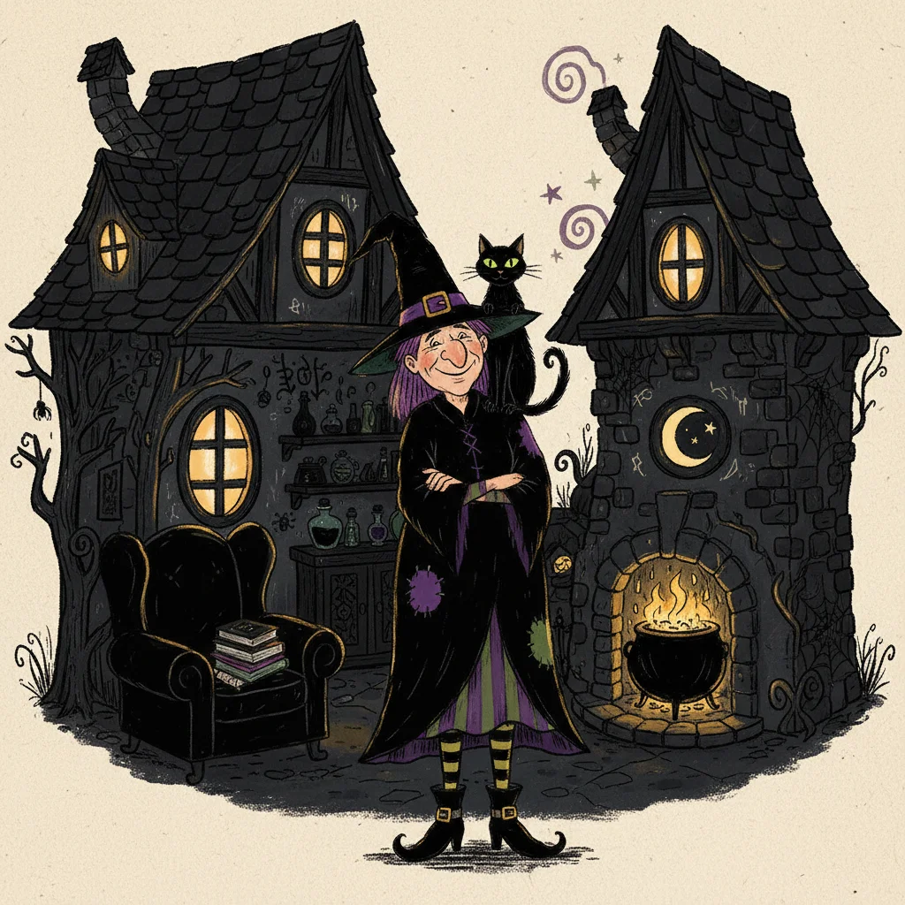

# Winnie the Witch — 逐页阅读

> **作者**：Valerie Thomas · 插画：Korky Paul · **适合年龄**：3-7岁
> **4 张配图** · AI 生成插画

---

  

    
    

      1 / 4
    

  

  

    <button onclick="firstPage()" style="padding: 10px 18px; border: 2px solid #009688; border-radius: 30px; background: white; color: #009688; font-size: 16px; cursor: pointer; font-weight: bold;">⏮ 首页</button>
    <button onclick="prevPage()" style="padding: 10px 24px; border: 2px solid #009688; border-radius: 30px; background: #009688; color: white; font-size: 16px; cursor: pointer; font-weight: bold;">◀ 上一页</button>
    
      第 <input id="page-input" type="number" min="1" max="4" value="1"
                 style="width: 50px; text-align: center; font-size: 16px; padding: 6px; border: 2px solid #ddd; border-radius: 8px;"
                 onkeydown="if(event.key==='Enter')goToPage()"> 页
      <button onclick="goToPage()" style="padding: 6px 14px; border: none; border-radius: 8px; background: #009688; color: white; cursor: pointer;">跳转</button>
    
    <button onclick="nextPage()" style="padding: 10px 24px; border: 2px solid #009688; border-radius: 30px; background: #009688; color: white; font-size: 16px; cursor: pointer; font-weight: bold;">下一页 ▶</button>
    <button onclick="lastPage()" style="padding: 10px 18px; border: 2px solid #009688; border-radius: 30px; background: white; color: #009688; font-size: 16px; cursor: pointer; font-weight: bold;">末页 ⏭</button>
  

  

    

  

  

    💡 键盘：← 上一页 · → 下一页 · 点击图片翻页
  

  

    <a href="../pdfs/winnie_witch.pdf" target="_blank" style="display: inline-block; padding: 12px 28px; background: #ff6f00; color: white; border-radius: 30px; text-decoration: none; font-size: 18px; font-weight: bold;">📥 下载完整PDF</a>
  

---

## 📚 亲子阅读小贴士

| 阶段 | 怎么读 |
|------|--------|
| **第1遍** | 先让孩子看黑色房子里的黑色猫——"你能找到 Wilbur 吗？" |
| **第2遍** | 到 Winnie 绊倒那页时夸张地演出来，孩子会大笑 |
| **第3遍** | 讨论颜色的作用——为什么 Wilbur 最后又变成黑色了？ |

!!! tip "Korky Paul的秘诀"
    每页都有大量隐藏细节。让孩子当"侦探"，找一找背景里有什么好玩的东西。

---

[← 返回书目](./winnie_witch.md)
