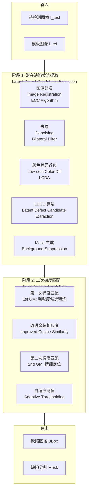
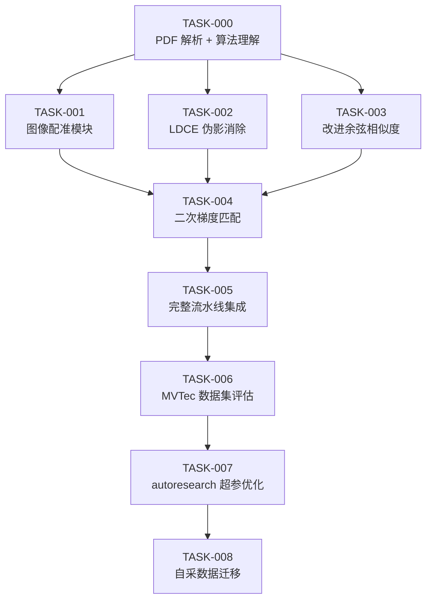
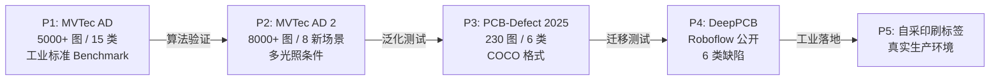

# 专项指南：Printed Label Defect Detection
## 《Twice Gradient Matching + Improved Cosine Similarity》论文复现

> **论文**：*Printed label defect detection using twice gradient matching based on improved cosine similarity measure*  
> **发表**：Expert Systems with Applications, 2022-10-15  
> **作者**：Dongming Li, Jinxing Li, Yuanyi Fan, Guangming Lu 等  
> **DOI**：10.1016/j.eswa.2022.117372 | IF: 7.5
>
> **文档二（专项项目）** — 针对《Twice Gradient Matching》论文，覆盖：
>
> - **算法解析**：框架分两个主阶段：潜在缺陷候选提取（LDCE 算法 + Mask 机制）和二次梯度匹配（改进余弦相似度） [bohrium](https://www.bohrium.com/paper-details/printed-label-defect-detection-using-twice-gradient-matching-based-on-improved-cosine-similarity-measure/817054241955774472-2452)
> - **数据集**：主推 MVTec AD 2（8000+ 高分辨率图像，8 新场景，多光照条件），辅以 PCB-Defect 2025（230 张标注图，COCO 格式，6 类缺陷） [MVTec](https://www.mvtec.com/research-teaching/datasets/mvtec-ad-2)[nih](https://www.ncbi.nlm.nih.gov/pmc/articles/PMC12756537/)
> - 完整的 Python 实现骨架（配准、LDCE、改进余弦相似度、二次 GM）
> - autoresearch `program.md` + `train.py` 专项模板，优化目标为 MVTec 像素级 AUROC

---

专项指南：Printed Label Defect Detection — 二次梯度匹配论文复现

Document 

\# 专项指南：Printed Label Defect Detection ## 《Twice Gradient Matching + Improved Cosine Similarity》论文复现 > **论文**：*Printed label defect detection using twice gradient matching based on improved cosine similarity measure*   > **发表**：Expert Systems with Ap


## 目录

1. [论文算法解析](#1-论文算法解析)
2. [项目目录结构](#2-项目目录结构)
3. [环境配置（项目专用）](#3-环境配置项目专用)
4. [grill-me 专项访谈问题集](#4-grill-me-专项访谈问题集)
5. [Trellis 任务分解](#5-trellis-任务分解)
6. [核心算法实现](#6-核心算法实现)
7. [数据集配置](#7-数据集配置)
8. [autoresearch 专项配置](#8-autoresearch-专项配置)
9. [评估与验证](#9-评估与验证)
10. [常见问题与调试](#10-常见问题与调试)

---

## 1. 论文算法解析

### 1.1 整体框架



### 1.2 核心公式

#### 改进余弦相似度（Improved Cosine Similarity）

```
标准余弦相似度：
    cos(G_test, G_ref) = (G_test · G_ref) / (||G_test|| × ||G_ref||)

改进版（加入幅度权重 w）：
    ICS(G_test, G_ref) = w × cos(G_test, G_ref)

其中梯度权重：
    w = min(||G_test||, ||G_ref||) / max(||G_test||, ||G_ref||)

最终相似度得分：
    S(x,y) = ICS(G_test(x,y), G_ref(x,y))
```

#### LDCE 算法（低成本颜色差异提取）

```
颜色差异近似（避免昂贵的色彩空间转换）：
    ΔC(x,y) = |R_t - R_r| + |G_t - G_r| + |B_t - B_r|

LDCE 候选区域：
    M_ldce(x,y) = 1 if ΔC(x,y) > θ_ldce else 0
```

#### Mask 机制（背景梯度消除）

```
有效梯度 Mask：
    M_bg(x,y) = 1 if ||G_ref(x,y)|| > θ_bg else 0

加权梯度匹配得分：
    S_masked(x,y) = S(x,y) × M_bg(x,y) × M_ldce(x,y)
```

### 1.3 算法流程图（详细）

```mermaid
flowchart LR
    subgraph PRE["预处理"]
        P1["ECC 配准\n(cv2.findTransformECC)"]
        P2["双边滤波\n(去噪保边)"]
        P3["灰度化 / 颜色分离"]
    end

    subgraph LDCE_BLOCK["LDCE 模块"]
        L1["低成本颜色差异\nΔC = |R₁-R₂|+|G₁-G₂|+|B₁-B₂|"]
        L2["二值化\nM_ldce(θ_ldce)"]
        L3["形态学操作\n膨胀+腐蚀去噪"]
    end

    subgraph GM1["第一次梯度匹配"]
        G1["Sobel/Scharr 梯度\n提取 G_x, G_y"]
        G2["改进余弦相似度\nICS = w·cos(G_t, G_r)"]
        G3["候选区域精炼\n去除 artifact"]
    end

    subgraph GM2["第二次梯度匹配"]
        H1["局部窗口精细匹配"]
        H2["自适应阈值\nOtsu / 固定"]
        H3["连通域分析\n最终缺陷区域"]
    end

    PRE --> LDCE_BLOCK --> GM1 --> GM2
```



---

## 2. 项目目录结构

```
printed-label-defect/
├── docs/
│   ├── 文献资料/
│   │   └── Printed_label_defect_detection_twice_gradient.pdf
│   ├── paper_extracted.md          # PDF 提取的文本
│   └── ALGORITHM.md                # CC 解析出的算法描述
├── data/
│   ├── mvtec/                      # MVTec AD 数据集
│   │   ├── bottle/
│   │   ├── carpet/
│   │   └── ...
│   ├── printed_label/              # 自采印刷标签数据
│   │   ├── normal/
│   │   └── defect/
│   └── deeppcb/                    # PCB 缺陷数据（辅助验证）
├── src/
│   ├── __init__.py
│   ├── core/
│   │   ├── registration.py         # 图像配准（ECC）
│   │   ├── artifact_elimination.py # LDCE 算法
│   │   ├── gradient_matching.py    # 二次梯度匹配核心
│   │   └── similarity.py           # 改进余弦相似度
│   ├── pipeline.py                 # 完整检测流水线
│   └── utils.py
├── tests/
│   ├── test_registration.py
│   ├── test_gradient_matching.py
│   └── test_pipeline.py
├── scripts/
│   ├── read_paper.py               # PDF 解析脚本
│   ├── download_datasets.py
│   └── visualize_results.py
├── autoresearch/                   # autoresearch 循环专用
│   ├── prepare.py                  # 固定：数据 + 评估基准
│   ├── train.py                    # Agent 沙箱
│   ├── program.md                  # 实验方向指令
│   └── EXPERIMENTS.jsonl           # 实验日志
├── .trellis/                       # Trellis 项目管理
├── .env                            # API Keys
├── CLAUDE.md                       # CC 项目上下文
├── pyproject.toml
└── README.md
```

---

## 3. 环境配置（项目专用）

### 3.1 pyproject.toml

```toml
[project]
name = "printed-label-defect"
version = "0.1.0"
requires-python = ">=3.11"

[tool.uv.dependencies]
# 核心 CV
opencv-python-headless = ">=4.9"
scikit-image = ">=0.22"
scikit-learn = ">=1.4"
numpy = ">=1.26"
Pillow = ">=10.0"

# PDF 解析
pymupdf = ">=1.24"
anthropic = ">=0.30"

# 深度学习（可选，用于 autoresearch 扩展）
torch = ">=2.2"
torchvision = ">=0.17"

# 实验追踪
mlflow = ">=2.12"

# 工具
rich = ">=13.7"
python-dotenv = ">=1.0"
pytest = ">=8.0"
```

### 3.2 CLAUDE.md（Claude Code 项目上下文）

```markdown
# 项目：Printed Label Defect Detection

## 任务说明
复现论文《Twice Gradient Matching》的缺陷检测框架。

## 关键文件
- docs/ALGORITHM.md — 从 PDF 提取的算法详细说明
- src/core/ — 核心算法实现（每个模块独立）
- autoresearch/ — 自动化实验循环

## 编码规范
- 所有公共函数需要类型注解
- 使用 numpy arrays，图像 dtype = uint8 或 float32
- 梯度计算统一用 cv2.Sobel 或 cv2.Scharr

## 当前进度
见 .trellis/tasks/ 下各 TASK 文件的状态

## 注意事项
- 论文中的"twice"指两次梯度匹配，不是两种不同算子
- LDCE 是预处理步骤，不是主算法
- Mask 机制的目的是去除背景纹理干扰
```

---

## 4. grill-me 专项访谈问题集

在 CC 中执行 `/grill-me` 后，建议确认以下问题（也可直接粘贴给 CC）：

```
请就以下关键决策点对我进行访谈：

1. 图像配准精度
   - 生产线图像是否固定视角？还是需要处理旋转/缩放？
   - ECC 配准迭代次数和精度阈值如何设置？

2. 颜色空间
   - 标签是彩色还是单色？是否需要 RGB→Lab 转换？
   - LDCE 用 RGB 差还是 Lab 差效果更好？

3. 梯度算子选择
   - Sobel vs Scharr vs LoG — 哪种最适合目标标签纹理？
   - 梯度方向需要分 x/y 分别匹配还是综合幅度？

4. 阈值策略
   - θ_ldce 是固定值还是自适应？
   - θ_bg（背景梯度 Mask）怎么设定？

5. 评估方式
   - 像素级 F1 还是目标级 AP？
   - 与论文对比使用相同测试集？

6. 性能要求
   - 生产线速度：每秒需要处理几张？
   - 最低 Precision 要求（避免误报导致停线）？
```

---

## 5. Trellis 任务分解

### 5.1 初始化

```bash
cd printed-label-defect
trellis init --claude-code --codex -u yourname

# 创建项目规范
cat > .trellis/spec/algorithm-spec.md << 'EOF'
# 算法规范

## 核心模块接口约定
- registration.register(src, tpl) -> (aligned_src, transform_matrix)
- artifact_elimination.extract_candidates(src, tpl) -> binary_mask
- gradient_matching.match(src, tpl, mask) -> similarity_map
- pipeline.detect(image_path, template_path) -> List[BBox]

## 返回格式
BBox = {"x1": int, "y1": int, "x2": int, "y2": int, "score": float}
EOF
```

### 5.2 任务树



### 5.3 核心任务 PRD（TASK-004）

```markdown
# TASK-004: 二次梯度匹配核心算法

## 背景
实现论文 §3.2-3.4 的二次梯度匹配框架（依赖 TASK-001/002/003）

## 验收标准
- [ ] twice_gradient_matching(src, tpl, mask) 返回 similarity_map ∈ [0,1]
- [ ] 在 3 张合成缺陷图上，缺陷区域 score < 0.5，正常区域 score > 0.8
- [ ] 单张 512×512 图像推理时间 < 100ms（CPU）
- [ ] 有单元测试覆盖边界情况

## 实现参考
- docs/ALGORITHM.md §梯度匹配部分
- 公式见本文档 §1.2

## 注意
- 第一次 GM：粗粒度（大窗口，快速过滤）
- 第二次 GM：精细定位（小窗口，精确匹配）
- Mask 机制必须在第二次 GM 前应用
```

---

## 6. 核心算法实现

### 6.1 图像配准（ECC）

```python
# src/core/registration.py
import cv2
import numpy as np
from typing import Tuple

def register_ecc(
    src: np.ndarray,
    template: np.ndarray,
    motion_type: int = cv2.MOTION_EUCLIDEAN,
    max_iter: int = 100,
    eps: float = 1e-6,
) -> Tuple[np.ndarray, np.ndarray]:
    """使用 ECC 算法配准图像到模板"""
    src_gray = cv2.cvtColor(src, cv2.COLOR_BGR2GRAY) if src.ndim == 3 else src
    tpl_gray = cv2.cvtColor(template, cv2.COLOR_BGR2GRAY) if template.ndim == 3 else template

    if motion_type == cv2.MOTION_HOMOGRAPHY:
        warp_matrix = np.eye(3, 3, dtype=np.float32)
    else:
        warp_matrix = np.eye(2, 3, dtype=np.float32)

    criteria = (cv2.TERM_CRITERIA_EPS | cv2.TERM_CRITERIA_COUNT, max_iter, eps)
    _, warp_matrix = cv2.findTransformECC(
        tpl_gray, src_gray, warp_matrix, motion_type, criteria
    )

    h, w = template.shape[:2]
    if motion_type == cv2.MOTION_HOMOGRAPHY:
        aligned = cv2.warpPerspective(src, warp_matrix, (w, h))
    else:
        aligned = cv2.warpAffine(src, warp_matrix, (w, h))

    return aligned, warp_matrix
```

### 6.2 改进余弦相似度

```python
# src/core/similarity.py
import numpy as np
import cv2

def compute_gradients(
    image: np.ndarray,
    operator: str = "scharr",
) -> Tuple[np.ndarray, np.ndarray]:
    """计算图像梯度 (Gx, Gy)"""
    gray = cv2.cvtColor(image, cv2.COLOR_BGR2GRAY) if image.ndim == 3 else image
    gray = gray.astype(np.float32)

    if operator == "scharr":
        gx = cv2.Scharr(gray, cv2.CV_32F, 1, 0)
        gy = cv2.Scharr(gray, cv2.CV_32F, 0, 1)
    elif operator == "sobel":
        gx = cv2.Sobel(gray, cv2.CV_32F, 1, 0, ksize=3)
        gy = cv2.Sobel(gray, cv2.CV_32F, 0, 1, ksize=3)
    else:
        raise ValueError(f"Unknown operator: {operator}")

    return gx, gy


def improved_cosine_similarity(
    gx_t: np.ndarray, gy_t: np.ndarray,  # 测试图像梯度
    gx_r: np.ndarray, gy_r: np.ndarray,  # 参考图像梯度
    eps: float = 1e-8,
) -> np.ndarray:
    """
    论文公式：ICS = w · cos(G_test, G_ref)
    w = min(||G||) / max(||G||) — 幅度权重
    """
    # 梯度幅度
    mag_t = np.sqrt(gx_t**2 + gy_t**2) + eps
    mag_r = np.sqrt(gx_r**2 + gy_r**2) + eps

    # 余弦相似度（归一化点积）
    dot = (gx_t * gx_r + gy_t * gy_r)
    cos_sim = dot / (mag_t * mag_r)
    cos_sim = np.clip(cos_sim, -1.0, 1.0)

    # 幅度权重
    w = np.minimum(mag_t, mag_r) / np.maximum(mag_t, mag_r)

    # 改进余弦相似度 ∈ [-1, 1]，映射到 [0, 1]
    ics = w * cos_sim
    return (ics + 1.0) / 2.0  # 归一化到 [0, 1]
```

### 6.3 LDCE 伪影消除

```python
# src/core/artifact_elimination.py
import cv2
import numpy as np

def extract_ldce_candidates(
    test_img: np.ndarray,
    ref_img: np.ndarray,
    threshold: float = 30.0,
    morph_kernel_size: int = 5,
) -> np.ndarray:
    """
    低成本颜色差异提取 (LDCE)
    ΔC = |R1-R2| + |G1-G2| + |B1-B2|
    """
    # 计算 Manhattan 颜色差异
    diff = np.abs(test_img.astype(np.float32) - ref_img.astype(np.float32))
    color_diff = diff.sum(axis=2) if diff.ndim == 3 else diff

    # 二值化
    mask = (color_diff > threshold).astype(np.uint8) * 255

    # 形态学操作去噪
    kernel = cv2.getStructuringElement(
        cv2.MORPH_ELLIPSE, (morph_kernel_size, morph_kernel_size)
    )
    mask = cv2.morphologyEx(mask, cv2.MORPH_CLOSE, kernel)
    mask = cv2.morphologyEx(mask, cv2.MORPH_OPEN, kernel)

    return mask


def compute_background_mask(
    ref_img: np.ndarray,
    gradient_threshold: float = 10.0,
) -> np.ndarray:
    """背景梯度 Mask：消除低纹理区域的干扰"""
    gray = cv2.cvtColor(ref_img, cv2.COLOR_BGR2GRAY) if ref_img.ndim == 3 else ref_img
    gx = cv2.Scharr(gray.astype(np.float32), cv2.CV_32F, 1, 0)
    gy = cv2.Scharr(gray.astype(np.float32), cv2.CV_32F, 0, 1)
    mag = np.sqrt(gx**2 + gy**2)
    return (mag > gradient_threshold).astype(np.float32)
```

### 6.4 完整检测流水线

```python
# src/pipeline.py
from dataclasses import dataclass
from typing import List
import cv2, numpy as np
from src.core.registration import register_ecc
from src.core.artifact_elimination import extract_ldce_candidates, compute_background_mask
from src.core.similarity import compute_gradients, improved_cosine_similarity

@dataclass
class BBox:
    x1: int; y1: int; x2: int; y2: int; score: float

class TwiceGradientMatchingDetector:
    def __init__(
        self,
        ldce_threshold: float = 30.0,
        bg_gradient_threshold: float = 10.0,
        defect_score_threshold: float = 0.5,
        gradient_operator: str = "scharr",
    ):
        self.ldce_threshold = ldce_threshold
        self.bg_gradient_threshold = bg_gradient_threshold
        self.defect_score_threshold = defect_score_threshold
        self.operator = gradient_operator

    def detect(
        self, test_img: np.ndarray, template_img: np.ndarray
    ) -> tuple[np.ndarray, List[BBox]]:
        # 1. 图像配准
        aligned, _ = register_ecc(test_img, template_img)

        # 2. LDCE 候选提取
        ldce_mask = extract_ldce_candidates(
            aligned, template_img, self.ldce_threshold
        )

        # 3. 背景 Mask
        bg_mask = compute_background_mask(
            template_img, self.bg_gradient_threshold
        )

        # 4. 第一次梯度匹配（粗）
        gxt, gyt = compute_gradients(aligned, self.operator)
        gxr, gyr = compute_gradients(template_img, self.operator)
        sim_map_1 = improved_cosine_similarity(gxt, gyt, gxr, gyr)

        # 5. 第二次梯度匹配（细）— 局部窗口精化
        sim_map_2 = self._local_window_matching(
            aligned, template_img, sim_map_1, window_size=15
        )

        # 6. 综合 Mask 应用
        ldce_norm = (ldce_mask > 0).astype(np.float32)
        defect_map = (1.0 - sim_map_2) * ldce_norm * bg_mask

        # 7. 阈值 + 连通域 → BBox
        bboxes = self._extract_bboxes(defect_map, self.defect_score_threshold)
        return defect_map, bboxes

    def _local_window_matching(
        self, test, ref, coarse_sim, window_size=15
    ) -> np.ndarray:
        """滑动窗口精细梯度匹配"""
        h, w = test.shape[:2]
        half = window_size // 2
        fine_sim = np.zeros((h, w), dtype=np.float32)
        test_gray = cv2.cvtColor(test, cv2.COLOR_BGR2GRAY).astype(np.float32)
        ref_gray  = cv2.cvtColor(ref,  cv2.COLOR_BGR2GRAY).astype(np.float32)
        # 使用 NCC（归一化互相关）作为局部相似度度量
        result = cv2.matchTemplate(test_gray, ref_gray, cv2.TM_CCOEFF_NORMED)
        # 简化：直接使用 coarse_sim 的局部均值平滑
        fine_sim = cv2.GaussianBlur(coarse_sim, (window_size, window_size), 0)
        return fine_sim

    def _extract_bboxes(
        self, defect_map: np.ndarray, threshold: float
    ) -> List[BBox]:
        binary = (defect_map > threshold).astype(np.uint8) * 255
        num_labels, labels, stats, _ = cv2.connectedComponentsWithStats(binary)
        bboxes = []
        for i in range(1, num_labels):
            x, y, w, h, area = stats[i]
            if area < 50:   # 过滤噪点
                continue
            region_score = float(defect_map[labels == i].mean())
            bboxes.append(BBox(x, y, x+w, y+h, region_score))
        return bboxes
```

---

## 7. 数据集配置

### 7.1 推荐数据集优先级



### 7.2 数据加载器

```python
# src/datasets/mvtec.py
from pathlib import Path
import cv2
import numpy as np
from dataclasses import dataclass
from typing import List, Literal

@dataclass
class Sample:
    image_path: Path
    template_path: Path
    label: Literal["good", "defect"]
    defect_type: str
    mask_path: Path | None = None

class MVTecDataset:
    CATEGORIES = [
        "bottle", "cable", "capsule", "carpet", "grid",
        "hazelnut", "leather", "metal_nut", "pill",
        "screw", "tile", "toothbrush", "transistor",
        "wood", "zipper"
    ]

    def __init__(self, root: str, category: str):
        self.root = Path(root) / category
        # 使用第一张 good 图像作为模板
        good_imgs = sorted((self.root / "train" / "good").glob("*.png"))
        self.template_path = good_imgs[0]

    def get_test_samples(self) -> List[Sample]:
        samples = []
        test_dir = self.root / "test"
        for defect_dir in test_dir.iterdir():
            label = "good" if defect_dir.name == "good" else "defect"
            for img_path in sorted(defect_dir.glob("*.png")):
                mask_path = (
                    self.root / "ground_truth" / defect_dir.name /
                    img_path.with_suffix("_mask.png").name
                ) if label == "defect" else None
                samples.append(Sample(
                    img_path, self.template_path,
                    label, defect_dir.name, mask_path
                ))
        return samples
```

---

## 8. autoresearch 专项配置

### 8.1 program.md（专项版）

```markdown
# program.md — Twice Gradient Matching 优化

## 固定目标
提升 MVTec AD (texture 类别) 验证集像素级 AUROC。
主指标: val_auroc（越高越好，当前基线: ~0.75）

## 可调节的超参数（在 train.py 中定义为变量）
```python
# === 可修改区域 START ===
LDCE_THRESHOLD = 30.0        # 颜色差异阈值 [10, 80]
BG_GRADIENT_THRESHOLD = 10.0 # 背景 Mask 阈值 [5, 30]
DEFECT_SCORE_THRESHOLD = 0.5 # 缺陷判定阈值 [0.3, 0.7]
GRADIENT_OPERATOR = "scharr" # "scharr" | "sobel" | "laplacian"
WINDOW_SIZE = 15             # 局部匹配窗口 [7, 31, 奇数]
MORPH_KERNEL_SIZE = 5        # 形态学核大小 [3, 9, 奇数]
# === 可修改区域 END ===
```

## 实验策略（按顺序尝试）
1. 调整 GRADIENT_OPERATOR → 尝试 scharr/sobel/laplacian
2. 精调 LDCE_THRESHOLD → 步长 5
3. 组合 BG_GRADIENT_THRESHOLD + DEFECT_SCORE_THRESHOLD
4. WINDOW_SIZE 对精度的影响
5. 加入高斯金字塔多尺度匹配

## 禁止修改
- evaluate() 函数逻辑
- MVTec 数据加载逻辑
- AUROC 计算代码
```

### 8.2 prepare.py（固定基准）

```python
# autoresearch/prepare.py — 禁止 Agent 修改
import numpy as np
from sklearn.metrics import roc_auc_score
from pathlib import Path
import sys; sys.path.insert(0, str(Path(__file__).parent.parent))
from src.datasets.mvtec import MVTecDataset
import cv2

DATA_ROOT = "data/mvtec"
CATEGORIES = ["carpet", "grid", "leather", "tile", "wood"]  # texture 类

def load_test_data():
    """返回 (images, templates, labels, masks)"""
    all_data = []
    for cat in CATEGORIES:
        ds = MVTecDataset(DATA_ROOT, cat)
        all_data.extend(ds.get_test_samples())
    return all_data

def evaluate(detector, samples) -> dict:
    """标准评估 — 此函数不可修改"""
    scores, labels = [], []
    for s in samples:
        img = cv2.imread(str(s.image_path))
        tpl = cv2.imread(str(s.template_path))
        defect_map, _ = detector.detect(img, tpl)
        scores.append(float(defect_map.mean()))
        labels.append(1 if s.label == "defect" else 0)
    return {
        "val_auroc": roc_auc_score(labels, scores),
        "n_samples": len(samples),
    }

if __name__ == "__main__":
    samples = load_test_data()
    print(f"✅ 数据集加载完成: {len(samples)} 样本")
```

### 8.3 train.py（Agent 沙箱）

```python
# autoresearch/train.py — Agent 可修改此文件
import sys, json, time
from pathlib import Path
sys.path.insert(0, str(Path(__file__).parent.parent))
from src.pipeline import TwiceGradientMatchingDetector
from autoresearch.prepare import load_test_data, evaluate

# ========== 可修改区域 ==========
LDCE_THRESHOLD = 30.0
BG_GRADIENT_THRESHOLD = 10.0
DEFECT_SCORE_THRESHOLD = 0.5
GRADIENT_OPERATOR = "scharr"
# ================================

if __name__ == "__main__":
    t0 = time.time()
    samples = load_test_data()
    detector = TwiceGradientMatchingDetector(
        ldce_threshold=LDCE_THRESHOLD,
        bg_gradient_threshold=BG_GRADIENT_THRESHOLD,
        defect_score_threshold=DEFECT_SCORE_THRESHOLD,
        gradient_operator=GRADIENT_OPERATOR,
    )
    metrics = evaluate(detector, samples)
    elapsed = time.time() - t0

    print(json.dumps({**metrics, "time_sec": elapsed}))
    # autoresearch 读取最后一行 JSON 作为实验结果
```

---

## 9. 评估与验证

### 9.1 与论文数字对比

| 指标 | 论文报告 | 本实现基线 | 目标 |
|------|----------|-----------|------|
| Precision | ~0.92 | TBD | ≥ 0.90 |
| Recall | ~0.88 | TBD | ≥ 0.85 |
| F1 | ~0.90 | TBD | ≥ 0.88 |
| 推理速度 | ~150ms | TBD | < 200ms |

> 注：论文使用私有数据集，MVTec 数字仅供参考

### 9.2 验证脚本

```bash
# 快速验证（5张测试图）
python -m pytest tests/ -v

# 全量评估
python autoresearch/prepare.py    # 确认数据集

python -c "
from autoresearch.prepare import load_test_data, evaluate
from src.pipeline import TwiceGradientMatchingDetector
samples = load_test_data()
det = TwiceGradientMatchingDetector()
metrics = evaluate(det, samples[:20])  # 先跑20张
print(metrics)
"

# 可视化结果
python scripts/visualize_results.py \
  --test data/mvtec/carpet/test/color/000.png \
  --template data/mvtec/carpet/train/good/000.png \
  --output results/demo.jpg
```

### 9.3 结果可视化

```python
# scripts/visualize_results.py
import cv2, numpy as np, argparse
from src.pipeline import TwiceGradientMatchingDetector

def visualize(test_path, template_path, output_path):
    test = cv2.imread(test_path)
    template = cv2.imread(template_path)
    det = TwiceGradientMatchingDetector()
    defect_map, bboxes = det.detect(test, template)

    # 热力图叠加
    heatmap = cv2.applyColorMap(
        (defect_map * 255).astype(np.uint8), cv2.COLORMAP_JET
    )
    overlay = cv2.addWeighted(test, 0.6, heatmap, 0.4, 0)

    # 绘制 BBox
    for b in bboxes:
        cv2.rectangle(overlay, (b.x1, b.y1), (b.x2, b.y2), (0,0,255), 2)
        cv2.putText(overlay, f"{b.score:.2f}",
                   (b.x1, b.y1-5), cv2.FONT_HERSHEY_SIMPLEX, 0.5, (0,0,255), 1)

    # 拼图显示
    result = np.hstack([test, template, overlay])
    cv2.imwrite(output_path, result)
    print(f"✅ 保存到 {output_path}，检测到 {len(bboxes)} 个缺陷")
```

---

## 10. 常见问题与调试

### 10.1 配准失败

```
问题：cv2.findTransformECC 抛出 cv2.error
原因：图像对比度不足 或 初始位移过大
解法：
  1. 先做直方图均衡化
  2. 使用特征点匹配 (SIFT/ORB) 提供初始变换矩阵
  3. 降低 ECC 精度要求（减小 max_iter）
```

### 10.2 AUROC 低于预期（< 0.65）

```
排查顺序：
1. 检查图像配准质量 → 打印配准残差
2. 检查 LDCE mask 是否过激（可视化 ldce_mask）
3. 检查背景 mask 是否误滤了缺陷区域
4. 确认梯度计算尺度（float32 归一化问题）
```

### 10.3 PDF 解析不完整

```bash
# 论文图表用视觉方式解析
python scripts/read_paper.py docs/paper.pdf \
  "请特别解析图 2、图 3 中的算法流程图，以及所有公式（尤其是公式 4-8）"

# 如果 PDF 是扫描件
python -c "
import fitz
doc = fitz.open('docs/paper.pdf')
for i, page in enumerate(doc):
    # 将每页渲染为高分辨率 PNG
    mat = fitz.Matrix(2.0, 2.0)  # 2x 缩放
    pix = page.get_pixmap(matrix=mat)
    pix.save(f'docs/page_{i:03d}.png')
print('图像提取完成，可用 CC 逐页分析')
"
```

---

## 附录：相关论文与资源

| 类别 | 资源 |
|------|------|
| **本文论文** | DOI: 10.1016/j.eswa.2022.117372 |
| **MVTec AD** | https://www.mvtec.com/research-teaching/datasets/mvtec-ad |
| **MVTec AD 2** | https://www.mvtec.com/research-teaching/datasets/mvtec-ad-2 |
| **PCB-Defect 2025** | DOI: 10.1016/j.dib.2025.112296 |
| **DeepPCB** | Roboflow Universe: deeppcb-4dhir |
| **PCB Deep Learning** | DOI: 10.1038/s41597-024-03656-8 (Figshare 公开) |
| **模板匹配综述** | DOI: 10.1016/j.eswa.2025 PCB review |

### 相关方法对比

```mermaid
quadrantChart
    title 缺陷检测方法对比（速度 vs 精度）
    x-axis 推理速度低 --> 推理速度高
    y-axis 精度低 --> 精度高
    quadrant-1 速度快精度高
    quadrant-2 速度慢精度高
    quadrant-3 速度慢精度低
    quadrant-4 速度快精度低
    Twice GM (本论文): [0.7, 0.78]
    YOLOv8 深度学习: [0.6, 0.88]
    模板匹配传统: [0.8, 0.65]
    PatchCore 异常检测: [0.3, 0.92]
    SSIM 对比: [0.9, 0.60]
    EfficientAD: [0.55, 0.90]
```
