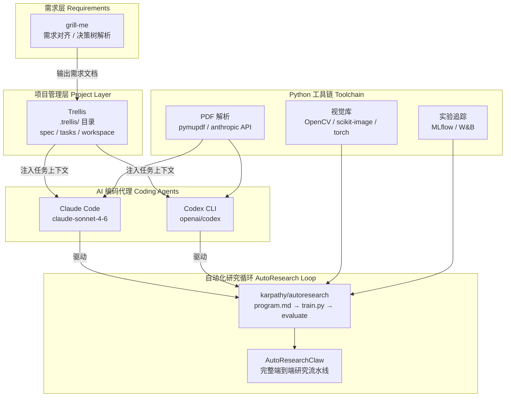
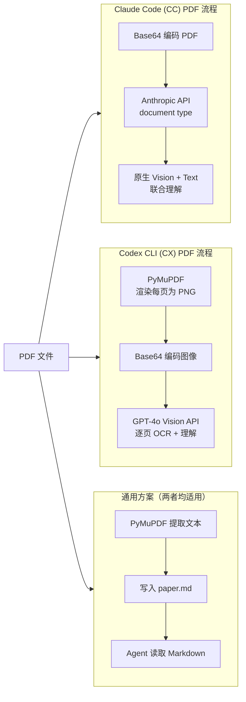
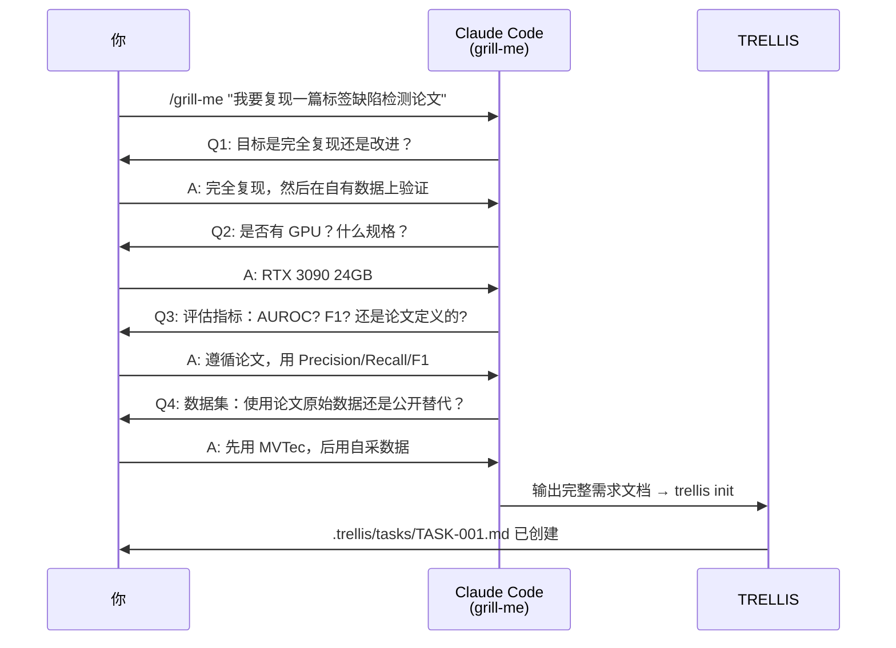
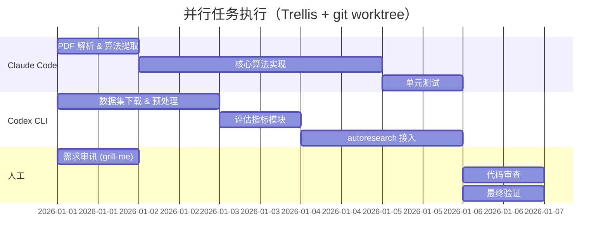
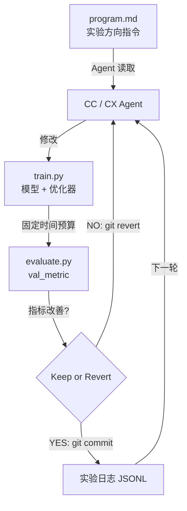
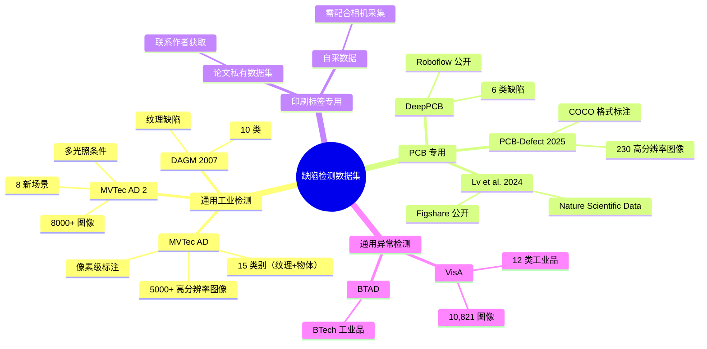
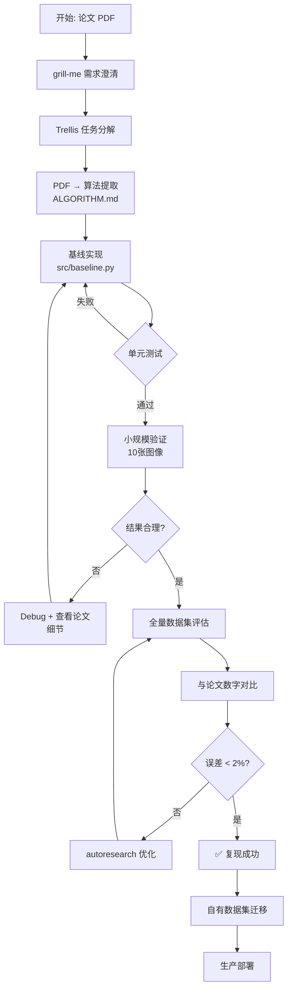
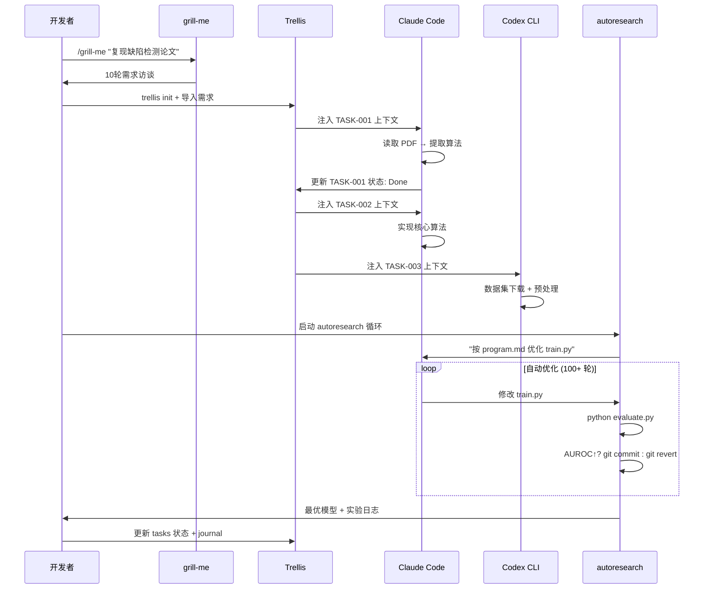

# 通用指南：使用 CC + CX + autoresearch + grill-me + Trellis 复现机器视觉论文

> **适用范围**：所有使用 Claude Code (CC) 和 OpenAI Codex CLI (CX) 复现 CV/机器视觉论文的项目  
> **最后更新**：2026-05
>
> ### 文档概览
>
> **文档一（通用方法）** — 适用于所有机器视觉论文复现项目，覆盖：
>
> - **工具安装链路**：uv → CC (`npm i -g @anthropic-ai/claude-code`) → CX (`npm i -g @openai/codex`) → grill-me (skills) → Trellis (`npm i -g @mindfoldhq/trellis`) → autoresearch
> - **PDF 解析方案**：CC 用 Anthropic 原生 `document` API（32MB 限制），CX 用 PDF skill（渲染成 PNG 送 Vision），通用方案用 PyMuPDF 提取 Markdown
> - **grill-me**：让 agent 像资深工程师一样对你进行审讯，直到所有决策树分支都被解决，解决开发方向模糊的问题 [GitHub](https://github.com/TimothyVang/Grill-me)
> - **Trellis**：将 CLAUDE.md / AGENTS.md 中的巨型 prompt 变成分层 wiki（specs、tasks、journals），agent 按需加载，同时支持 CC 和 CX [GitHub](https://github.com/mindfold-ai/trellis)
> - **autoresearch**：在 program.md 中描述实验方向，agent 自动循环 propose-train-evaluate，只保留改进 val_metric 的变更 [DataCamp](https://www.datacamp.com/tutorial/guide-to-autoresearch)

---

## 目录

1. [工具生态全景图](#1-工具生态全景图)
2. [环境安装](#2-环境安装)
3. [让 CC 和 CX 读取 PDF 论文](#3-让-cc-和-cx-读取-pdf-论文)
4. [grill-me：需求对齐与设计冻结](#4-grill-me需求对齐与设计冻结)
5. [Trellis：管理整个开发流程](#5-trellis管理整个开发流程)
6. [autoresearch：自动化实验验证循环](#6-autoresearch自动化实验验证循环)
7. [文献调研与相关数据集搜索](#7-文献调研与相关数据集搜索)
8. [标准实验验证流程](#8-标准实验验证流程)
9. [完整工作流串联](#9-完整工作流串联)

---

## 1. 工具生态全景图



---

## 2. 环境安装

### 2.1 基础依赖（Python 环境）

```bash
# 推荐使用 uv 管理环境（比 pip 快 10-100x）
curl -LsSf https://astral.sh/uv/install.sh | sh

# 创建虚拟环境
uv venv .venv --python 3.11
source .venv/bin/activate   # Linux/macOS
# .venv\Scripts\activate    # Windows

# 安装核心 CV 工具链
uv pip install \
  pymupdf \           # PDF → 图像渲染（无系统依赖）
  anthropic \         # Anthropic API（Claude PDF 原生支持）
  openai \            # OpenAI API
  opencv-python-headless \
  scikit-image \
  scikit-learn \
  torch torchvision \
  matplotlib \
  numpy \
  mlflow \
  rich \
  python-dotenv
```

### 2.2 安装 Claude Code (CC)

```bash
# macOS / Linux
npm install -g @anthropic-ai/claude-code
# 或者
brew install claude-code   # macOS Homebrew

# 验证
claude --version

# 登录
claude auth login
```

### 2.3 安装 Codex CLI (CX)

```bash
# npm 安装
npm install -g @openai/codex
# 或 Homebrew
brew install --cask codex

# 登录（ChatGPT 账号 或 API Key）
codex login

# 启用 PDF Skills（Codex 会自动加载 ~/.codex/skills/ 下的技能）
# Codex 的 PDF 技能：将 PDF 每页渲染为 PNG → 通过 Vision 模型解析
```

### 2.4 安装 grill-me

```bash
# 方式1：克隆到 Claude Code skills 目录
git clone https://github.com/mattpocock/skills.git /tmp/skills
cp -r /tmp/skills/grill-me ~/.claude/skills/grill-me

# 方式2：Codex skills 目录
cp -r /tmp/skills/grill-me ~/.codex/skills/grill-me

# 使用（在 CC 中）
# /grill-me  → 开始需求访谈
```

### 2.5 安装 Trellis

```bash
# 全局安装
npm install -g @mindfoldhq/trellis@latest

# 在项目根目录初始化（同时支持 CC 和 CX）
trellis init --claude-code --codex -u your-name

# 查看生成的目录结构
tree .trellis/
# .trellis/
# ├── spec/          # 项目规范（编码规范、架构决策）
# ├── tasks/         # 任务 PRD + 验收标准
# ├── workspace/     # 个人 Journal + 会话记忆
# └── workflow.md    # 共享工作流规则
```

### 2.6 安装 autoresearch

```bash
# karpathy/autoresearch（基础 ML 优化循环）
git clone https://github.com/karpathy/autoresearch.git
cd autoresearch
uv sync
uv run prepare.py     # 一次性数据准备

# AutoResearchClaw（端到端研究流水线，支持 CC + CX）
git clone https://github.com/aiming-lab/AutoResearchClaw.git
cd AutoResearchClaw
uv sync
```

---

## 3. 让 CC 和 CX 读取 PDF 论文

### 3.1 工作原理对比



### 3.2 CC 读取 PDF（Anthropic 原生方式）

创建 `scripts/read_paper.py`：

```python
import anthropic, base64, sys
from pathlib import Path

def analyze_paper(pdf_path: str, query: str) -> str:
    pdf_data = base64.standard_b64encode(
        Path(pdf_path).read_bytes()
    ).decode("utf-8")

    client = anthropic.Anthropic()
    message = client.beta.messages.create(
        model="claude-sonnet-4-6",
        betas=["pdfs-2024-09-25"],
        max_tokens=4096,
        messages=[{
            "role": "user",
            "content": [
                {
                    "type": "document",
                    "source": {
                        "type": "base64",
                        "media_type": "application/pdf",
                        "data": pdf_data,
                    },
                },
                {"type": "text", "text": query},
            ],
        }],
    )
    return message.content[0].text

if __name__ == "__main__":
    pdf_path = sys.argv[1]
    query = sys.argv[2] if len(sys.argv) > 2 else \
        "请提取：1)核心算法流程 2)关键公式 3)实验设置 4)评估指标 5)数据集"
    print(analyze_paper(pdf_path, query))
```

**在 Claude Code 中直接使用**：

```bash
# 方式1：命令行传入 PDF
claude "请读取 docs/paper.pdf 并提取算法核心步骤，输出为 ALGORITHM.md"

# 方式2：通过脚本
python scripts/read_paper.py "docs/文献资料/paper.pdf" \
  "提取算法流程、核心公式、数据集信息"
```

### 3.3 CX 读取 PDF（Skills 方式）

```bash
# Codex 使用 PDF skill（自动渲染为 PNG 传给 Vision）
codex "使用 PDF skill 读取 docs/paper.pdf，
       提取：算法框架、损失函数、实验配置，写入 PAPER_NOTES.md"

# 或使用 --image 直接传图
codex --image docs/paper_fig1.png \
  "解释这张图中的算法架构，特别是梯度匹配的两个阶段"
```

### 3.4 通用 Markdown 转换方案

```python
# scripts/pdf_to_md.py — 两种 agent 均可使用
import fitz  # PyMuPDF

def pdf_to_markdown(pdf_path: str, out_path: str):
    doc = fitz.open(pdf_path)
    pages = []
    for i, page in enumerate(doc):
        text = page.get_text("text")
        pages.append(f"## Page {i+1}\n\n{text}\n")
    Path(out_path).write_text("\n---\n".join(pages))
    print(f"✅ 转换完成: {out_path}")

pdf_to_markdown("docs/paper.pdf", "docs/paper_extracted.md")
```

---

## 4. grill-me：需求对齐与设计冻结

### 4.1 什么是 grill-me

grill-me 是一个 Claude/Codex Skills，让 AI 像一个资深工程师一样对你进行"审讯"，直到所有决策树分支都被解决，避免开发过程中的误解。

### 4.2 使用流程



### 4.3 典型 grill-me 对话提示词

```
/grill-me

我需要复现论文《Printed label defect detection using twice gradient 
matching based on improved cosine similarity measure》，
并在 MVTec 数据集上验证，然后接入我们的生产线相机。

请对我进行完整的需求审讯。
```

grill-me 会追问的典型维度：

- 精度 vs 速度 trade-off（生产线实时性要求？）
- 缺陷类型覆盖范围
- 是否需要无监督/少样本
- 现有代码基础（从零 or 基于某框架）
- 验证标准（论文数字 or 业务 KPI）

---

## 5. Trellis：管理整个开发流程

### 5.1 目录结构

```
.trellis/
├── spec/
│   ├── architecture.md      # 模块架构规范
│   ├── coding-standards.md  # 代码风格（类型注解、docstring）
│   └── ml-conventions.md    # 实验管理规范（seed、logging）
├── tasks/
│   ├── TASK-001-pdf-parse.md
│   ├── TASK-002-preprocessing.md
│   ├── TASK-003-algorithm-impl.md
│   ├── TASK-004-evaluation.md
│   └── TASK-005-autoresearch.md
├── workspace/
│   └── your-name/
│       ├── journal.md       # 每日进展
│       └── decisions.md     # ADR（架构决策记录）
└── workflow.md
```

### 5.2 任务 PRD 示例（TASK-003）

```markdown
# TASK-003: 实现 Twice Gradient Matching 核心算法

## 目标
实现论文 §3.2 描述的二次梯度匹配框架

## 验收标准
- [ ] artifact_elimination() 函数通过单元测试（LDCE 算法）
- [ ] twice_gradient_matching() 在测试图像上 F1 ≥ 0.85
- [ ] 推理速度 < 200ms/张（CPU）
- [ ] 所有公共函数有类型注解和 docstring

## 实现上下文
- 参考文件: docs/paper_extracted.md §3.2
- 依赖: TASK-002（图像预处理完成）
- 输出文件: src/core/gradient_matching.py

## 注意事项
- 余弦相似度改进版：使用 improved_cosine_similarity()
- mask 机制消除背景梯度影响
```

### 5.3 Trellis + CC + CX 并行执行



---

## 6. autoresearch：自动化实验验证循环

### 6.1 核心原理



### 6.2 三文件架构

| 文件 | 角色 | 可修改？ |
|------|------|---------|
| `prepare.py` | 数据加载 + 评估指标定义（不变基准） | ❌ 禁止修改 |
| `train.py` | 模型、优化器、训练循环（Agent 沙箱） | ✅ Agent 唯一可改文件 |
| `program.md` | 实验方向 + 规则（人类控制） | ✅ 人工调整 |

### 6.3 为 CV 论文复现定制 program.md

```markdown
# program.md — 缺陷检测 autoresearch 指令

## 目标
优化 `train.py` 中的缺陷检测模型，提升 MVTec 验证集 AUROC。
评估指标: val_auroc（越高越好）

## 实验方向（优先级从高到低）
1. 梯度特征提取：尝试 Sobel/Scharr/LoG 不同算子
2. 余弦相似度计算：改进归一化方式
3. 阈值策略：自适应 vs 固定阈值
4. 图像配准：ECC 精度 vs 速度 trade-off
5. 数据增强：旋转、模糊、噪声注入

## 规则
- 每次实验仅修改 1-2 处变化（便于归因）
- 不改变评估逻辑（preserve evaluate() 函数签名）
- 如果 AUROC 不提升则立刻 git revert
- 每轮记录修改原因到 EXPERIMENTS.jsonl

## 已知有效的方向
- Scharr 算子比 Sobel 在细纹理上表现更好
- 双边滤波预处理可减少噪声对梯度的影响
```

### 6.4 启动 autoresearch 循环

```bash
# 在 Claude Code 中启动（推荐）
cd your-project
claude --dangerously-skip-permissions \
  "按照 program.md 的指令运行 autoresearch 循环，
   每轮修改 train.py，运行 python evaluate.py，
   如果 val_auroc 提升则 git commit，否则 git revert，
   持续运行直到我叫停"

# 在 Codex CLI 中启动
codex "Read program.md and run the autoresearch loop:
      edit train.py → python evaluate.py → 
      keep if val_auroc improves else revert → repeat"
```

---

## 7. 文献调研与相关数据集搜索

### 7.1 使用 CC/CX 进行文献搜索

```bash
# CC 内置 web_search 能力
claude "搜索 2022-2025 年关于 printed label defect detection 的论文，
        重点关注 gradient matching 和 template matching 方法，
        整理到 docs/related_works.md，格式：标题/年份/方法/数据集/AUROC"

# CX 开启实时搜索
codex --search "find recent papers on industrial defect detection 
                using gradient-based methods, list datasets used"
```

### 7.2 关键数据集汇总



### 7.3 数据集下载脚本

```bash
# MVTec AD（最常用的 benchmark）
wget https://www.mvtec.com/fileadmin/Redaktion/mvtec.com/company/research/datasets/mvtec_anomaly_detection.tar.xz
tar -xf mvtec_anomaly_detection.tar.xz -C data/mvtec/

# DeepPCB（Roboflow）
# 需要 Roboflow 账号，通过 API 下载
pip install roboflow
python -c "
from roboflow import Roboflow
rf = Roboflow(api_key='YOUR_KEY')
proj = rf.workspace('tack-hwa-wong-zak5u').project('deeppcb-4dhir')
proj.version(5).download('yolov8')
"
```

---

## 8. 标准实验验证流程

### 8.1 验证流程图



### 8.2 评估指标标准模板

```python
# src/evaluate.py — autoresearch 基准（禁止修改）
from sklearn.metrics import (
    roc_auc_score, f1_score, 
    precision_score, recall_score,
    average_precision_score
)
import numpy as np

def evaluate(y_true: np.ndarray, y_score: np.ndarray) -> dict:
    """标准缺陷检测评估指标"""
    y_pred = (y_score > 0.5).astype(int)
    return {
        "val_auroc": roc_auc_score(y_true, y_score),
        "val_f1":    f1_score(y_true, y_pred),
        "val_ap":    average_precision_score(y_true, y_score),
        "val_prec":  precision_score(y_true, y_pred),
        "val_rec":   recall_score(y_true, y_pred),
    }

# 主指标（autoresearch keep/revert 依据）
VAL_METRIC = "val_auroc"  # 越高越好
```

---

## 9. 完整工作流串联

### 9.1 端到端序列图



### 9.2 关键命令速查

```bash
# 1. 初始化项目
mkdir my-defect-project && cd my-defect-project
git init
trellis init --claude-code --codex -u yourname

# 2. 需求对齐
claude    # 进入 CC 交互
# > /grill-me 我要复现...

# 3. PDF 解析
claude "读取 docs/paper.pdf，提取算法流程写入 ALGORITHM.md"

# 4. 任务驱动开发（CC）
claude "查看 .trellis/tasks/TASK-002.md 并实现"

# 5. 并行任务（CX）
codex "查看 .trellis/tasks/TASK-003.md 并完成数据集预处理"

# 6. 启动 autoresearch
claude --dangerously-skip-permissions \
  "Run autoresearch loop per program.md, 
   optimize for val_auroc, run 50 experiments"

# 7. 查看实验结果
python -c "
import json, pathlib
logs = [json.loads(l) for l in open('EXPERIMENTS.jsonl')]
best = max(logs, key=lambda x: x.get('val_auroc', 0))
print(f'Best: AUROC={best[\"val_auroc\"]:.4f} @ {best[\"commit\"]}')
"
```

---

## 附录：推荐阅读

| 资源 | 链接 |
|------|------|
| Claude Code 文档 | https://docs.claude.com |
| Codex CLI 文档 | https://developers.openai.com/codex/cli |
| Trellis | https://github.com/mindfold-ai/trellis |
| grill-me skills | https://github.com/mattpocock/skills |
| karpathy/autoresearch | https://github.com/karpathy/autoresearch |
| AutoResearchClaw | https://github.com/aiming-lab/AutoResearchClaw |
| MVTec AD 数据集 | https://www.mvtec.com/research-teaching/datasets |
| Prompt Engineering 指南 | https://docs.claude.com/en/docs/build-with-claude/prompt-engineering/overview |
