# background.md
# PLDD 算法完整技术背景文档
## Printed Label Defect Detection — Twice Gradient Matching

> **版本**: v0.3（补齐审核报告缺失项）  
> **基于**: *Expert Systems with Applications*, 204, 117372 (2022)  
> **覆盖**: 公式推导 · 参数定义 · 数据结构 · 实现风险

---

## 目录

1. [问题背景与挑战](#1-问题背景与挑战)
2. [整体算法框架](#2-整体算法框架)
3. [阶段一：LDCE 算法（伪影消除 + 候选提取）](#3-阶段一ldce-算法)
4. [改进余弦相似度 ICSM — 完整推导](#4-改进余弦相似度-icsm)
5. [阶段二：二次梯度匹配](#5-阶段二二次梯度匹配)
6. [Mask 机制精确流程](#6-mask-机制精确流程)
7. [核心参数完整定义](#7-核心参数完整定义)
8. [T2G / G2T 数据结构与滑动窗口](#8-t2g--g2t-数据结构与滑动窗口)
9. [数据类型风险与 OpenCV 约定](#9-数据类型风险与-opencv-约定)
10. [数据集选型与工程验证策略](#10-数据集选型与工程验证策略)
11. [参数标定实验设计](#11-参数标定实验设计)
12. [任务补充：公式确认 / 参数标定专项](#12-任务补充)

---

## 1. 问题背景与挑战

### 1.1 为什么普通模板匹配失效

印刷标签由于材料的非刚性，在传送带输送过程中会产生局部形变。对齐后做像素差分，会产生大量**伪影（Artifact）**——这些位于边缘附近的差异并非真实缺陷，而是配准残差导致的假阳性。

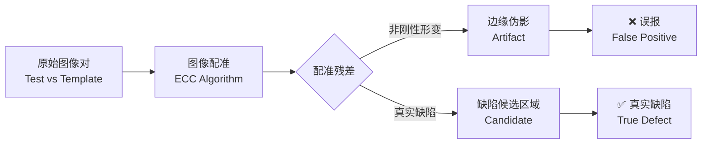

### 1.2 三类核心挑战

| 挑战 | 传统方法问题 | PLDD 解法 |
|------|------------|-----------|
| 伪影干扰 | 差分图误检边缘 | LDCE 在 RGB 子图中提取候选 |
| 未知缺陷 | CNN 需要全类型标注样本 | 基于 GM 图的无监督匹配 |
| 实时性 | 深度学习推理慢 | 纯传统算法，< 200ms/张 |

---

## 2. 整体算法框架

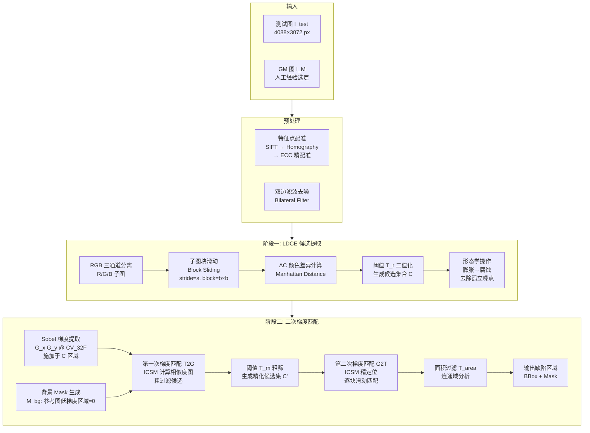

---

## 3. 阶段一：LDCE 算法

### 3.1 ΔC 颜色差异计算

论文采用 **Manhattan 颜色距离** 而非欧式距离，原因是计算量低且对局部形变更鲁棒。

$$
\Delta C(x, y) = |R_t(x,y) - R_m(x,y)| + |G_t(x,y) - G_m(x,y)| + |B_t(x,y) - B_m(x,y)|
$$

其中下标 $t$ 为测试图，$m$ 为 GM 模板图。

### 3.2 归一化因子推导（255 与 770 的来源）

**单通道最大差值**：

$$
\Delta C_{\max}^{\text{single}} = |255 - 0| = 255
$$

**三通道 Manhattan 最大差值**：

$$
\Delta C_{\max}^{\text{total}} = 3 \times 255 = 765 \approx 770
$$

> **说明**：论文中 770 是对 $3 \times 256 = 768$ 的工程近似取整（也有版本用 $3 \times 255 = 765$），目的是将 $\Delta C$ 映射到 $[0, 1]$。

归一化版本：

$$
\Delta C_{\text{norm}}(x, y) = \frac{\Delta C(x, y)}{3 \times 255}
$$

二值化候选区域 Mask：

$$
M_{\text{ldce}}(x, y) = \begin{cases} 1 & \text{if } \Delta C(x, y) > T_r \\ 0 & \text{otherwise} \end{cases}
$$

### 3.3 子图块滑动机制

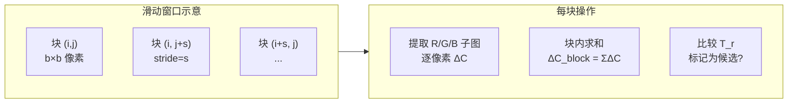

**块内候选判断**：

$$
\text{block\_candidate} = \begin{cases} 1 & \text{if } \frac{1}{b^2}\sum_{p \in \text{block}} \Delta C(p) > T_r \\ 0 & \text{otherwise} \end{cases}
$$

候选集合 $C$ 定义为所有满足上述条件的块的像素集合：

$$
C = \bigcup_{\text{block}_{ij}: \text{candidate}=1} \text{pixels in block}_{ij}
$$

---

## 4. 改进余弦相似度 ICSM

### 4.1 从标准余弦到改进版的动机

**标准余弦相似度**仅考虑梯度方向，忽略幅度差异。当测试图有缺失印刷时，梯度幅度接近零，但方向仍可能"凑巧"相似，导致漏检。

$$
\cos(\mathbf{G}_t, \mathbf{G}_m) = \frac{G_{x,t} \cdot G_{x,m} + G_{y,t} \cdot G_{y,m}}{\|\mathbf{G}_t\| \cdot \|\mathbf{G}_m\|}
$$

### 4.2 ICSM 完整定义

**步骤 1**：计算梯度幅度

$$
\|\mathbf{G}_t(x,y)\| = \sqrt{G_{x,t}^2(x,y) + G_{y,t}^2(x,y)}
$$

$$
\|\mathbf{G}_m(x,y)\| = \sqrt{G_{x,m}^2(x,y) + G_{y,m}^2(x,y)}
$$

**步骤 2**：幅度权重（受人类视觉系统启发）

$$
w(x,y) = \frac{\min\!\bigl(\|\mathbf{G}_t(x,y)\|,\; \|\mathbf{G}_m(x,y)\|\bigr)}{\max\!\bigl(\|\mathbf{G}_t(x,y)\|,\; \|\mathbf{G}_m(x,y)\|\bigr) + \varepsilon}
$$

其中 $\varepsilon = 10^{-8}$ 防止除零。

**步骤 3**：逐像素 ICSM

$$
\text{ICSM}(x,y) = w(x,y) \cdot \frac{G_{x,t}(x,y) \cdot G_{x,m}(x,y) + G_{y,t}(x,y) \cdot G_{y,m}(x,y)}{\|\mathbf{G}_t(x,y)\| \cdot \|\mathbf{G}_m(x,y)\| + \varepsilon}
$$

取值范围：$\text{ICSM} \in [-1, 1]$，映射到 $[0, 1]$：

$$
S(x,y) = \frac{\text{ICSM}(x,y) + 1}{2}
$$

### 4.3 ICSM 求和范围（逐像素 vs 子块）

> **审核报告指出的关键歧义**：论文中"改进余弦"是逐像素计算还是子块内求和？

根据论文上下文分析：

- **T2G（第一次匹配）**：在 LDCE 候选区域内**逐像素**计算 $S(x,y)$，生成相似度图。
- **G2T（第二次匹配）**：使用滑动窗口，在**局部块**内先聚合梯度，再计算 ICSM。

子块 ICSM（G2T 使用）：

$$
\text{ICSM}_{\text{block}}(i,j) = w_{ij} \cdot \frac{\sum_{p \in \text{block}_{ij}} \bigl(G_{x,t}(p) \cdot G_{x,m}(p) + G_{y,t}(p) \cdot G_{y,m}(p)\bigr)}{\sum_{p} \|\mathbf{G}_t(p)\| \cdot \sum_{p} \|\mathbf{G}_m(p)\| + \varepsilon}
$$

其中 $i, j$ 为块索引，$p$ 为块内像素。

### 4.4 ICSM 物理直觉

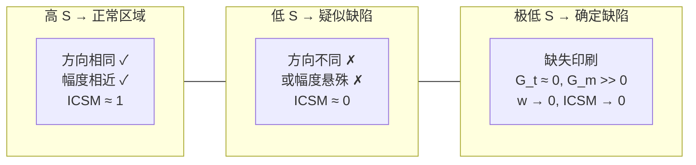

**缺陷得分**（用于最终判断）：

$$
D(x,y) = 1 - S(x,y) = 1 - \frac{\text{ICSM}(x,y)+1}{2}
$$

---

## 5. 阶段二：二次梯度匹配

### 5.1 T2G（Test-to-GM）：第一次匹配

**目的**：在候选集 $C$ 内，以测试图梯度为查询，GM 图为参考，粗过滤非缺陷候选。

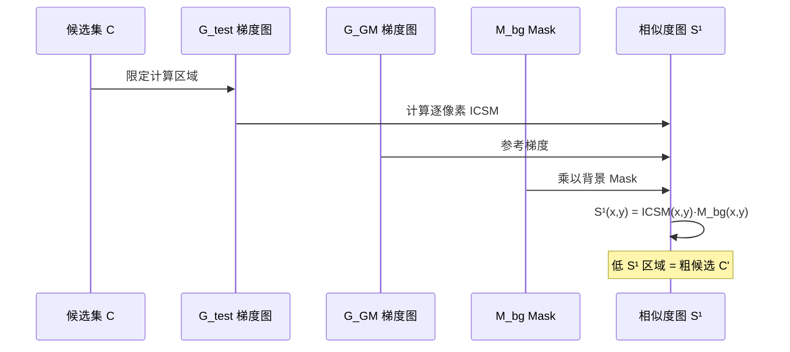

T2G 输出：精化候选集

$$
C' = \{(x,y) \in C \mid S^{(1)}(x,y) < T_m\}
$$

### 5.2 G2T（GM-to-Test）：第二次匹配

**目的**：在精化候选 $C'$ 内，以 GM 图块为模板，在测试图对应区域滑动搜索最佳匹配，精确定位缺陷边界。

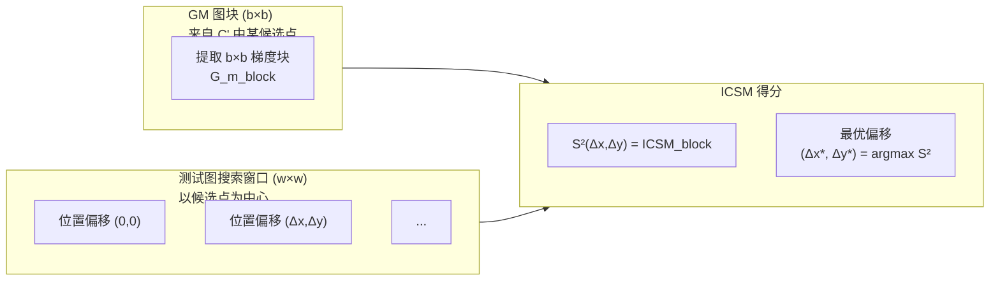

G2T 输出：缺陷置信度

$$
D^{(2)}(x,y) = 1 - \max_{(\Delta x, \Delta y) \in W} S^{(2)}(\Delta x, \Delta y)
$$

### 5.3 最终决策

$$
\text{Defect}(x,y) = \begin{cases} 1 & \text{if } D^{(2)}(x,y) > T_m \text{ and area} > T_{\text{area}} \\ 0 & \text{otherwise} \end{cases}
$$

---

## 6. Mask 机制精确流程

> **审核报告关键问题**：先梯度再 Mask，还是先 Mask 再梯度？

**正确顺序**：

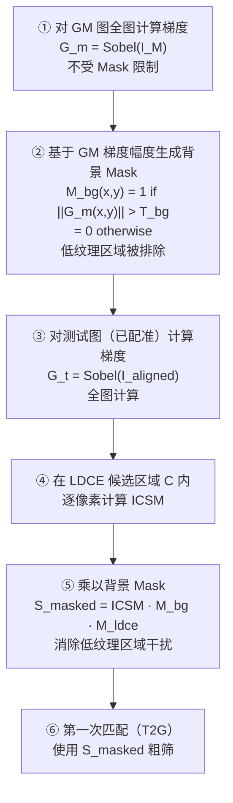

**关键结论**：

- 梯度计算在 Mask 之前，且对全图（不限候选区域）计算
- Mask 是后处理步骤，乘到 ICSM 结果上
- $M_{bg}$ 基于 **GM 图**的梯度（而非测试图），因为 GM 图代表"正常纹理"的期望

**背景 Mask 定义**：

$$
M_{bg}(x,y) = \begin{cases} 1 & \text{if } \|\mathbf{G}_m(x,y)\| > T_{bg} \\ 0 & \text{otherwise} \end{cases}
$$

**最终有效相似度**：

$$
S_{\text{eff}}(x,y) = S(x,y) \cdot M_{bg}(x,y) \cdot M_{\text{ldce}}(x,y)
$$

---

## 7. 核心参数完整定义

> **审核报告 D 级问题**：$T_r$、$T_m$、$T_{area}$、Sobel 核、$T_{bg}$ 定义不足。

### 7.1 参数总表

| 参数 | 符号 | 类型 | 建议范围 | 单位 | 确定方式 |
|------|------|------|---------|------|---------|
| LDCE 颜色阈值 | $T_r$ | float | 20–50 | 像素差值 | 标定实验（§11） |
| 梯度匹配阈值 | $T_m$ | float | 0.3–0.7 | 归一化相似度 | 标定实验（§11） |
| 背景梯度阈值 | $T_{bg}$ | float | 5–25 | 梯度幅度 | 参考 GM 图梯度分布 |
| 最小缺陷面积 | $T_{area}$ | int | 50–500 | **像素²** | 由相机分辨率和缺陷尺寸决定 |
| 子块尺寸 | $b$ | int（奇数） | 7–31 | 像素 | 依标签纹理周期 |
| 滑动步长 | $s$ | int | 1–$b$ | 像素 | 精度 vs 速度 trade-off |
| 搜索窗口 | $w$ | int（奇数） | $2b$–$4b$ | 像素 | 配准精度 + 形变量估计 |
| Sobel 核大小 | $k$ | int（奇数） | 3 or 5 | 像素 | 论文默认 $k=3$ |
| 防零除 | $\varepsilon$ | float | $10^{-8}$ | — | 固定值 |

### 7.2 $T_r$ 和 $T_m$ 的确定方式

论文未给出固定值，需要针对每类标签进行**标定实验**（见 §11）。

**$T_r$ 标定思路**：

$$
T_r^* = \arg\max_{T_r} \text{F1}(P(T_r), R(T_r)) \quad \text{on calibration set}
$$

**$T_m$ 标定思路**（给定 $T_r^*$ 后）：

$$
T_m^* = \arg\min_{T_m} \text{FPR}(T_m) \quad \text{s.t. } \text{TPR}(T_m) \geq 0.95
$$

### 7.3 $T_{area}$ 单位说明

$$
T_{area} \text{ 单位：像素²（像素面积）}
$$

不是厘米或毫米。与相机分辨率相关：

$$
T_{area} = \left(\frac{d_{\min}[\text{mm}]}{r[\text{mm/px}]}\right)^2
$$

其中 $d_{\min}$ 为最小可检测缺陷直径（mm），$r$ 为相机空间分辨率（mm/px）。

论文设备：4088×3072 相机，对应约 $r \approx 0.015$ mm/px，$d_{\min} = 0.1$ mm → $T_{area} \approx 44$ px²，取整为 50。

### 7.4 Sobel 算子完整定义

**X 方向核**（$k=3$）：

$$
K_x = \begin{bmatrix} -1 & 0 & +1 \\ -2 & 0 & +2 \\ -1 & 0 & +1 \end{bmatrix}
$$

**Y 方向核**（$k=3$）：

$$
K_y = \begin{bmatrix} -1 & -2 & -1 \\ 0 & 0 & 0 \\ +1 & +2 & +1 \end{bmatrix}
$$

**重要**：OpenCV 调用时必须使用 `CV_32F`（32位浮点）输出，原因见 §9。

---

## 8. T2G / G2T 数据结构与滑动窗口

### 8.1 T2G 数据流（逐像素）

```mermaid
flowchart LR
    subgraph INPUT2["输入（候选区域 C）"]
        Gt["G_test[H,W,2]\nfloat32\n[Gx,Gy] per pixel"]
        Gm["G_GM[H,W,2]\nfloat32"]
        Mc["M_ldce[H,W]\nuint8 {0,255}"]
        Mb["M_bg[H,W]\nfloat32 {0,1}"]
    end
    subgraph COMPUTE["逐像素 ICSM"]
        DOT["dot = Gx_t·Gx_m + Gy_t·Gy_m\n→ float32[H,W]"]
        MAG["mag_t = sqrt(Gx_t²+Gy_t²)+ε\nmag_m = sqrt(...)"]
        W["w = min(mag_t,mag_m)/max(...)"]
        COS["cos_sim = dot/(mag_t·mag_m)"]
        ICS["ICSM = w·cos_sim\n→ [-1,1]"]
        S["S = (ICSM+1)/2\n→ [0,1] float32[H,W]"]
    end
    subgraph OUTPUT2["输出"]
        Seff["S_eff = S·Mb·(Mc/255)\nfloat32[H,W]"]
        C1["C' = pixels where S_eff < T_m"]
    end
    INPUT2 --> COMPUTE --> OUTPUT2
```

### 8.2 G2T 数据流（滑动块）

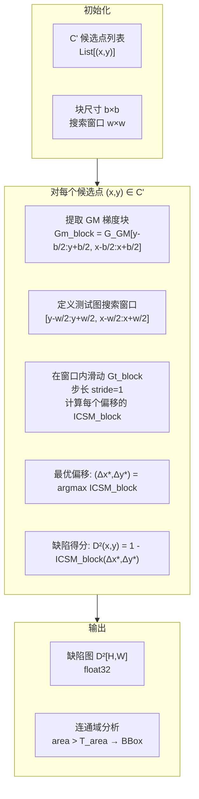

---

## 9. 数据类型风险与 OpenCV 约定

### 9.1 BGR vs RGB 约定

**OpenCV 默认读取图像为 BGR 顺序**，不是 RGB。

```mermaid
flowchart LR
    File["图像文件\nPNG/JPG"] -->|cv2.imread| BGR["BGR 数组\n[B,G,R]"]
    BGR -->|cv2.cvtColor BGR2RGB| RGB["RGB 数组"]
    BGR -->|直接用 B=img[:,:,0]| WRONG["❌ 实际是 B 通道\n命名为 R"]
    BGR -->|img[:,:,0]=B, [:,:,2]=R| RIGHT["✅ 正确提取顺序"]
```

**PLDD 规范**：全程使用 OpenCV 原生 BGR，不转换。ΔC 计算无需关心通道顺序（Manhattan 距离对称），但 Sobel 之前需先转灰度：

$$
\text{Gray} = 0.114 \cdot B + 0.587 \cdot G + 0.299 \cdot R \quad \text{(BGR 顺序)}
$$

等价于 `cv2.COLOR_BGR2GRAY`（OpenCV 内置）。

### 9.2 数据类型溢出风险

| 操作 | 正确类型 | 错误类型 | 后果 |
|------|---------|---------|------|
| `cv2.Sobel` 输出 | `CV_32F` (float32) | `CV_8U` (uint8) | 负值截断为0，梯度方向丢失 |
| `G_x² + G_y²` | float32 | int16 | $255^2=65025 > 32767$，溢出 |
| $\Delta C$ 求和 | int32 | uint8 | 三通道和最大 $765 > 255$，溢出 |
| ICSM 结果 | float32 | float16 | 精度不足，$\varepsilon$ 被舍入 |
| 候选 Mask | uint8 {0,255} | bool | OpenCV 形态学操作需 uint8 |

### 9.3 安全计算流程

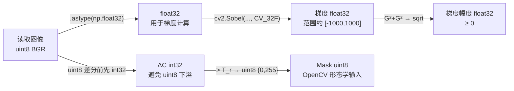

---

## 10. 数据集选型与工程验证策略

### 10.1 DAGM 2007 的定位

> **审核报告**：DAGM 2007 适合工程验证但不能替代论文场景。

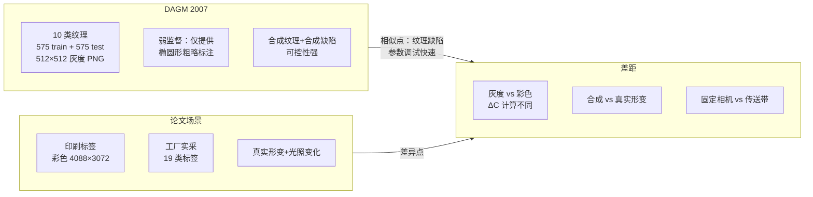

**DAGM 使用建议**：

- **Phase 0 调试**：验证算法流程通路是否正确（改为灰度版本）
- **参数扫描**：快速确定 $T_r$、$T_m$ 合理范围
- **不适合**：作为最终性能报告的主数据集

### 10.2 合成印刷标签数据集生成

由于原论文数据集为私有工厂数据，工程验证需合成替代数据集。

**合成流程**：

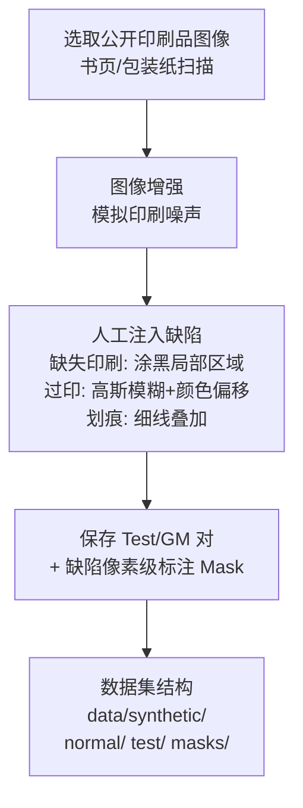

### 10.3 数据集优先级与验证路径

| 阶段 | 数据集 | 目标 | 通过标准 |
|------|--------|------|---------|
| Phase 0 | DAGM 2007（灰度改版） | 流程通路验证 | 能输出 BBox，无崩溃 |
| Phase 1 | 合成印刷标签数据 | 彩色 ICSM 验证 | F1 > 0.7 |
| Phase 2 | MVTec AD（texture 类） | 跨场景泛化 | AUROC > 0.75 |
| Phase 3 | 自采生产线数据 | 工业落地 | FPR < 0.5%（论文指标） |

---

## 11. 参数标定实验设计

> **审核报告高优先级**：$T_r$/$T_m$ 确定方式。

### 11.1 标定集构建

从 DAGM 或合成数据中取：
- 20 张正常图像对（GM + test_normal）
- 20 张缺陷图像对（GM + test_defect + ground_truth_mask）

### 11.2 $T_r$ 扫描实验

固定 $T_m = 0.5$，扫描 $T_r \in [5, 80]$，步长 5：

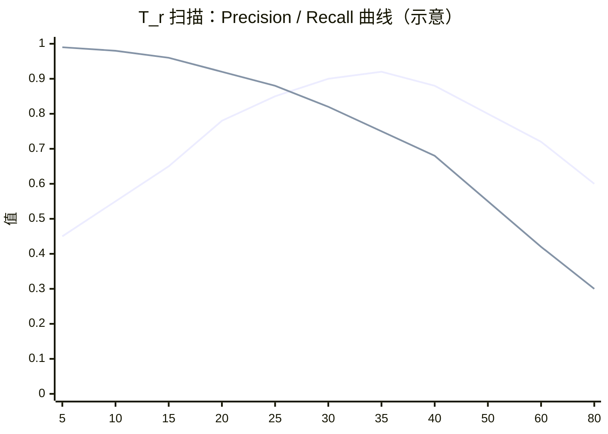

选取 F1 最高点对应的 $T_r^*$。

### 11.3 $T_m$ 扫描实验（给定 $T_r^*$）

固定 $T_r = T_r^*$，扫描 $T_m \in [0.2, 0.8]$，步长 0.05：

$$
T_m^* = \arg\min T_m \quad \text{s.t. TPR} \geq 0.95 \text{ and FPR} \leq 0.005
$$

论文报告 FPR < 0.5%，即 $T_m$ 需足够高（严格）。

### 11.4 标定结果记录格式

每次实验写入 `calibration/results.jsonl`：

```json
{"T_r": 30, "T_m": 0.5, "Precision": 0.91, "Recall": 0.85, "F1": 0.88, "FPR": 0.008}
{"T_r": 30, "T_m": 0.6, "Precision": 0.93, "Recall": 0.82, "F1": 0.87, "FPR": 0.004}
```

---

## 12. 任务补充

基于审核报告，需在 Trellis 任务树中新增以下任务：

### 新增 TASK-001b：公式确认任务

```markdown
# TASK-001b: 公式细节确认与 background.md 完善

## 目标
确认 ICSM 求和范围（逐像素 vs 块级）
确认 ΔC × 255/770 归一化因子来源
确认 T2G/G2T 输入输出边界

## 方法
1. 用 CC/CX 读取论文 PDF Section 3.3-3.5
2. 对照 background.md §4.3 和 §8 的推导
3. 如有歧义，设计 3 组小实验（10张图）验证行为

## 验收标准
- [ ] ICSM 求和范围明确（逐像素/块级，对应 T2G/G2T）
- [ ] 归一化因子来源有文字引用或推导
- [ ] background.md 无"待确认"标记
```

### 新增 TASK-001c：参数标定实验

```markdown
# TASK-001c: T_r / T_m / T_bg 标定实验

## 目标
在 DAGM 标定集上确定三个核心阈值的合理范围

## 步骤
1. 下载 DAGM 2007（见 §10 下载链接）
2. 运行 calibration/run_sweep.py（T_r × T_m 网格扫描）
3. 绘制 F1 热力图，选取最优点
4. 验证选定参数在合成印刷数据上的泛化性

## 交付物
- calibration/results.jsonl（实验记录）
- calibration/heatmap.png（F1 热力图）
- 更新 autoresearch/program.md 中的参数范围
```

---

## 附录 A：DAGM 2007 下载

| 来源 | 链接 |
|------|------|
| Kaggle | https://www.kaggle.com/datasets/bassam165/dagm-2007-industrial-defect-detection-dataset |
| GitHub 索引 | https://github.com/Charmve/Surface-Defect-Detection |

数据结构：

```
DAGM2007/
├── Class1/
│   ├── Train/   # 575 张 512×512 灰度 PNG
│   ├── Test/    # 575 张
│   └── Train_Defect/  # 标注：椭圆 Mask PNG
├── Class2/ ... Class10/
```

## 附录 B：OpenCV 数据类型速查

| OpenCV 常量 | NumPy dtype | 范围 | 用途 |
|------------|-------------|------|------|
| `CV_8U` | uint8 | [0, 255] | 图像读取、Mask |
| `CV_16S` | int16 | [-32768, 32767] | 临时梯度（不推荐） |
| `CV_32F` | float32 | ±3.4×10³⁸ | **Sobel 输出（必须）** |
| `CV_64F` | float64 | ±1.8×10³⁰⁸ | 精度要求极高时 |
