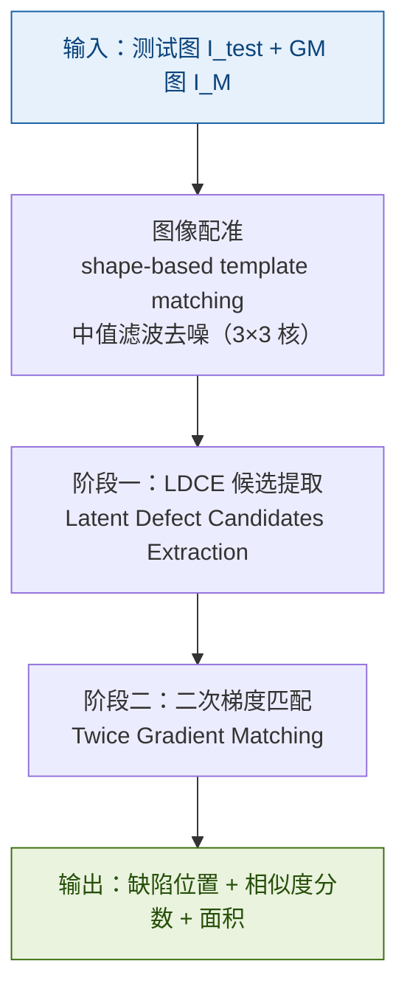

# PLDD 算法技术文档 - 印刷标签缺陷检测：二次梯度匹配与改进余弦相似度

## 

> **论文**：*Printed label defect detection using twice gradient matching based on improved cosine similarity measure*
> **期刊**：Expert Systems with Applications, Vol 204, 2022
> **DOI**：10.1016/j.eswa.2022.117372

---

## 1. 问题背景与核心挑战

### 1.1 为什么普通模板匹配失效

印刷标签的基材是非刚性薄膜，在传送带高速输送过程中会产生随机局部形变。将测试图像与模板图像（GM 图）对齐后直接做像素差分，形变区域的边缘会产生大量**伪影（Artifact）**，这些假阳性信号与真实缺陷在差分图上难以区分。

PLDD 算法通过三层机制解决这一问题：LDCE 候选提取过滤掉无关区域，改进余弦相似度测量梯度方向而非像素值，二次匹配从两个方向同时验证缺陷存在性。

### 1.2 三类核心挑战对照表

| 挑战 | 传统方法的问题 | PLDD 的解法 |
|---|---|---|
| 伪影干扰 | 像素差分无法区分形变与缺陷 | LDCE 在子图块滑动中提取最小差异候选 |
| 未知缺陷泛化 | CNN 需要覆盖所有缺陷类型的标注样本 | 基于 GM 图的无监督梯度匹配，无需缺陷样本 |
| 实时性要求 | 深度学习 GPU 推理难以满足 CPU 级产线速度 | 纯传统 CV，OpenMP 多线程，平均 263ms/张 |

---

## 2. 整体算法框架

PLDD 算法分为两个主要阶段，前置图像配准步骤。下图展示了从输入图像对到缺陷输出的完整流程。

---

## 3. 图像配准

在进行任何差异计算之前，必须将测试图精确对齐到 GM 图。论文采用基于形状的模板匹配（shape-based template matching），工程实现落地为 ECC（Enhanced Correlation Coefficient）算法。

配准后对两张图像各自施加 **3×3 中值滤波**，去除传感器噪声，避免后续梯度计算中引入椒盐噪声干扰。

**ECC 配准失败的常见原因**：图像对比度不足（LDCE 差值趋近于零）或初始位移过大（超出 ECC 收敛盆地）。工程上可先用 ORB/SIFT 特征点匹配给出初始变换矩阵，再交给 ECC 精化。

---

## 4. 阶段一：LDCE 候选提取

LDCE（Latent Defect Candidates Extraction）的目标是在全图中快速标出"值得进一步检查"的候选区域，同时排除由非刚性形变产生的伪影。

### 4.1 ΔC 色差计算（Eq.1–6）

论文没有使用简单的 Manhattan 距离，而是采用**加权欧氏色差**，权重系数根据红色通道的均值动态调整，模拟人眼对不同颜色区间的感知差异。

设测试图像素与 GM 图像素的 R/G/B 通道差值分别为 $\Delta R$、$\Delta G$、$\Delta B$，红色通道均值为：

$$
r = \frac{C_{1,R} + C_{2,R}}{2}
$$

加权欧氏色差为：

$$
\Delta C = \sqrt{\left(2 + \frac{r}{256}\right)\Delta R^2 + 4\,\Delta G^2 + \left(2 + \frac{255 - r}{256}\right)\Delta B^2}
$$

归一化到 $[0, 255]$（Eq.6）：

$$
\Delta C_{\text{revised}} = \Delta C \times \frac{255}{770}
$$

其中 770 是三通道加权欧氏距离的工程近似上界（$3 \times 255 = 765 \approx 770$）。

> **为什么不用 Manhattan？** PLDD v0.3 简化版采用 $|\Delta R| + |\Delta G| + |\Delta B|$，但论文原始公式通过 $r$ 均值动态调整红绿蓝权重，在低对比度印刷区域（如浅色背景上的浅色字）对色差更敏感。

### 4.2 LDCE 滑动机制

将图像切分为 $n \times n$（论文最优值 $n = 4$）个子图块，每个子图块在 $[-l, +l]$（论文 $l = 5$）像素范围内滑动，计算不同偏移量下的 $\sum \Delta C_{\text{revised}}$，取最小值作为该位置的"最优对齐差异"。

$$
\Delta C_{\text{best}}(x,y) = \min_{(di, dj) \in [-l,+l]^2} \Delta C_{\text{revised}}\bigl(\text{shift}(I_{\text{test}}, di, dj),\; I_M\bigr)
$$

这一步的物理含义是：在小范围内允许局部平移补偿形变，用最佳对齐后的残差作为真实差异。

二值化生成候选掩码（Eq.7）：

$$
d_{\text{bin}}(x,y) = \begin{cases} 255 & \text{if } \Delta C_{\text{best}}(x,y) \geq T_{\text{filter}} \\ 0 & \text{otherwise} \end{cases}
$$

论文参数 $T_{\text{filter}} = 20$。随后施加 **3×3 形态学开运算**去除孤立噪点，输出候选集合 $C$。

---

## 5. 阶段二：二次梯度匹配

候选集 $C$ 已过滤掉大部分背景区域，但仍包含配准残差引起的伪影。第二阶段通过梯度方向匹配进一步精化，是 PLDD 的核心创新。

### 5.1 RGB 三通道梯度提取

论文不将彩色图像转成灰度再提取梯度，而是对 R/G/B 三个通道分别运行 **Sobel 算子**（$3 \times 3$ 核，必须输出 float32 以避免负值截断）：

$$
G_x = K_x * I, \quad G_y = K_y * I
$$

$$
\|G(x,y)\| = \sqrt{G_x^2(x,y) + G_y^2(x,y)}
$$

三通道梯度融合取逐像素幅值最大的通道，保留最强纹理信息。这是 ICSM 相比灰度梯度方案在低对比度缺陷上漏检率更低的关键原因。

> **数据类型安全**：Sobel 输出必须使用 `CV_32F`（float32）。若使用 `CV_8U`，负方向的梯度会被截断为 0，导致梯度方向完全丢失。梯度幅值平方运算前亦需确保为 float32，否则 $255^2 = 65025$ 超出 int16 范围导致溢出。

### 5.2 背景掩码生成（M_bg）

背景掩码基于 **GM 图**（而非测试图）的梯度幅值生成：

$$
M_{\text{bg}}(x,y) = \begin{cases} 1 & \text{if } \|G_M(x,y)\| > T_{\text{bg}} \\ 0 & \text{otherwise} \end{cases}
$$

低于阈值 $T_{\text{bg}}$（建议范围 5–25）的区域视为无纹理背景，在后续 ICSM 计算中贡献置零。使用 GM 图而非测试图的原因是：GM 图代表"正常印刷"的期望纹理分布，以此定义哪些区域应有梯度、哪些是真实背景。

**正确的处理顺序**（PLDD v0.3 §6）为：

$$
\text{全图梯度提取} \rightarrow \text{生成 } M_{\text{bg}} \rightarrow \text{计算 ICSM} \rightarrow \text{乘以 } M_{\text{bg}} \text{ 和 } M_{\text{LDCE}}
$$

若先 Mask 再求梯度，会在掩码边界产生人工边缘，干扰梯度计算。

### 5.3 改进余弦相似度 ICSM（Eq.10）

标准余弦相似度只关心梯度方向，忽略幅值差异。当测试图存在漏印时，梯度幅值趋近于零，但方向可能凑巧相似，导致漏检。ICSM 通过非线性激活函数 $F(r_j, m_j)$ 同时考虑方向和幅值：

$$
\text{Sim}(T_i, G_i^{(u,v)}) = \frac{\sum \left[G_x \cdot G'_x + G_y \cdot G'_y\right]}{\sum \left[\sqrt{G_x^2 + G_y^2} \cdot \sqrt{G'^2_x + G'^2_y}\right]} \times F(r_j, m_j)
$$

其中分子为梯度内积（衡量方向一致性），分母为梯度幅值乘积（归一化因子）。

#### 非线性激活函数 F(r, m)（Eq.15–19）

定义梯度幅值比和幅值差：

$$
r_j = \frac{\min(\|G_{\text{test}}\|, \|G_M\|)}{\max(\|G_{\text{test}}\|, \|G_M\|)}
$$

$$
m_j = \left|\|G_{\text{test}}\| - \|G_M\|\right|
$$

激活函数：

$$
F(r_j, m_j) = \begin{cases} 0 & \text{if } r_j < T_r \text{ OR } m_j > T_m \\ 1 & \text{otherwise} \end{cases}
$$

**物理直觉**：

- 正常区域：两图梯度幅值相近，$r_j \to 1$，$m_j \to 0$，$F = 1$，ICSM 保留余弦值
- 漏印区域：测试图梯度幅值接近零，$r_j \to 0$，$F = 0$，ICSM 被强制置零
- 过印区域：测试图梯度幅值远大于 GM，$m_j$ 大，$F = 0$，ICSM 同样置零

> **$T_r$ 和 $T_m$ 的取值**：论文未给出具体数值，必须通过标定实验（§7）在特定数据集上网格搜索确定。

最终 ICSM 映射到 $[0, 1]$：

$$
S(x,y) = \frac{\text{ICSM}(x,y) + 1}{2}
$$

有效相似度（叠加两个掩码）：

$$
S_{\text{eff}}(x,y) = S(x,y) \cdot M_{\text{bg}}(x,y) \cdot M_{\text{LDCE}}(x,y)
$$

### 5.4 T2G 与 G2T 双向匹配（Eq.20）

"二次"的含义是从两个方向各做一次梯度匹配，分别针对不同缺陷类型：

| 匹配方向 | 查询图 | 参考图 | 检测目标 |
|---|---|---|---|
| T2G（Test to GM） | 测试图梯度 | GM 图梯度 | 过印（测试图有多余笔画） |
| G2T（GM to Test） | GM 图梯度 | 测试图梯度 | 漏印（测试图缺少笔画） |

两次匹配得分取最小值（最严格的判断）：

$$
S_i = \min(S_{\text{T2G}},\; S_{\text{G2T}})
$$

最终缺陷判定：

$$
\text{Defect}(x,y) = \begin{cases} 1 & \text{if } S_i < T_{\text{score}} \text{ AND area} > T_{\text{area}} \\ 0 & \text{otherwise} \end{cases}
$$

论文参数：$T_{\text{score}} = 0.75$，$T_{\text{area}} = 5$（像素²）。

---

## 6. 核心参数完整定义

论文给出了部分参数的具体值，$T_r$ 和 $T_m$（激活函数内部参数）未给出，需标定。

| 参数 | 符号 | 论文值 | 建议范围 | 单位 | 确定方式 |
|---|---|---|---|---|---|
| LDCE 色差阈值 | $T_{\text{filter}}$ | 20 | 10–80 | 像素差值（$\Delta C_{\text{revised}}$） | 标定实验 |
| 子图分割数 | $n$ | 4 | 2–8 | — | 论文最优值 |
| LDCE 滑动范围 | $l$ | 5 | 2–10 | 像素 | 论文值 |
| 形态学核 | — | 3 | 3–7 | 像素 | 论文值 |
| 背景梯度阈值 | $T_{\text{bg}}$ | 未给出 | 5–25 | 梯度幅值 | 参考 GM 图分布 |
| Sobel 核大小 | $k$ | 3 | 3 或 5 | 像素 | 论文默认 |
| 激活函数幅值比阈值 | $T_r$ | 未给出 | 0.3–0.8 | 归一化比值 | **必须标定** |
| 激活函数幅值差阈值 | $T_m$ | 未给出 | 10–150 | 梯度幅值差 | **必须标定** |
| 相似度判定阈值 | $T_{\text{score}}$ | 0.75 | 0.5–0.9 | 归一化相似度 | 论文值，可微调 |
| 最小缺陷面积 | $T_{\text{area}}$ | 5 | 5–500 | **像素²** | 由相机分辨率决定 |
| OpenMP 线程数 | — | 12 | 4–16 | — | 按 CPU 核心数 |

**$T_{\text{area}}$ 单位说明**：单位是像素²（像素面积），不是毫米。换算公式为：

$$
T_{\text{area}} = \left(\frac{d_{\min}[\text{mm}]}{r[\text{mm/px}]}\right)^2
$$

论文设备为 4088×3072 相机，空间分辨率约 $r \approx 0.015$ mm/px，最小可检测缺陷直径 $d_{\min} = 0.1$ mm，故 $T_{\text{area}} \approx 44$ px²，取 5 为最保守下限。

---

## 7. 参数标定实验设计（PLDD v0.3 §11）

### 7.1 两阶段网格扫描策略

**Phase 1**：固定激活函数参数，扫描 $T_{\text{filter}} \times T_{\text{score}}$

目标：在约束 $\text{FPR} \leq 0.5\%$（论文指标）下最大化 F1：

$$
T_{\text{filter}}^* = \arg\max_{T_f,\, T_s} F_1(T_f, T_s) \quad \text{s.t.} \quad \text{FPR}(T_f, T_s) \leq 0.005
$$

**Phase 2**：固定 Phase 1 最优值，扫描 $T_r \times T_m$

目标：在保持 TPR ≥ 0.95 的前提下最小化 FPR：

$$
(T_r^*, T_m^*) = \arg\min_{T_r,\, T_m} \text{FPR}(T_r, T_m) \quad \text{s.t.} \quad \text{TPR}(T_r, T_m) \geq 0.95
$$

### 7.2 结果记录格式

每次实验以 JSON Lines 格式写入 `calibration/results.jsonl`，字段包括：`phase`、`T_filter`、`T_score`、`T_r`（Phase 2 专用）、`T_m`（Phase 2 专用）、`precision`、`recall`、`f1`、`fpr`、`tp`、`fp`、`fn`、`tn`、`time_sec`。可据此绘制 F1 热力图，直观选取最优超参组合。

---

## 8. 数据集选型与验证路径

由于论文原始数据集为工厂私有数据（19 类印刷标签，未公开），工程验证需按阶段使用替代数据集。

| 阶段 | 数据集 | 目标 | 通过标准 |
|---|---|---|---|
| Phase 0（流程调试） | DAGM 2007（灰度改版） | 确认流水线无崩溃、BBox 可输出 | 能运行完整流程 |
| Phase 1（彩色验证） | 合成印刷标签数据 | 验证彩色 ICSM 和 $\Delta C$ 计算 | F1 > 0.7 |
| Phase 2（跨场景泛化） | MVTec AD（texture 类） | 量化 AUROC，与基线方法对比 | AUROC > 0.75 |
| Phase 3（工业落地） | 自采生产线数据 | 满足产线 FPR < 0.5% 要求 | FPR ≤ 0.005 |

**合成标签数据集构建思路**：选取公开印刷品扫描图作为 GM 图，通过 OpenCV 注入三类人工缺陷：漏印（降低区域色值或局部遮挡）、过印（区域颜色增强或扩展）、划痕（细线叠加），同时保存像素级 Ground Truth 掩码。

---

## 9. 三文档公式差异与统一决策

最终采用的公式版本及决策依据：

| 模块 | 采用版本 | 来源 | 弃用原因 |
|---|---|---|---|
| $\Delta C$ 色差 | 加权欧氏 + $\times 255/770$ | background.md（论文 Eq.1-6） | PLDD v0.3 的 Manhattan 是简化改写，丢失动态权重 |
| ICSM | 完整 $\cos \times F(r,m)$ | background.md（论文 Eq.10+17-19） | 专项指南的 $w \times \cos$ 缺少激活函数，漏印检测能力弱 |
| 归一化系数 | $\times 255/770$ | background.md（论文 Eq.6） | $1/(3 \times 255)$ 等价但不等同，映射范围不同 |
| T2G/G2T 语义 | 过印/漏印双方向 + min 融合 | background.md（论文 §3.4） | PLDD v0.3 的"粗筛/精定位"解释混淆了两次匹配的物理意义 |
| 参数体系 | 完整参数表含单位和标定方法 | PLDD v0.3（§7） | background.md 参数定义不完整（D 级评分项） |
| Mask 处理顺序 | 梯度 → Mask → ICSM → 乘积 | PLDD v0.3（§6） | background.md 仅说"Canny AND 差值"，顺序不明确 |
| 数据类型规范 | float32 全程，CV_32F 强制 | PLDD v0.3（§9） | background.md 未涉及溢出风险 |

---

## 10. 性能指标与论文结果

| 指标 | 论文报告值 |
|---|---|
| Mean F1 | 0.9702 |
| 总误报数（FP） | 103 / 44,628 GT 缺陷 |
| 平均 FP | 34.33 / 标签类别 |
| 平均检测时间 | 263.62 ms |
| GPU 需求 | 无（纯 CPU） |
| 并行线程 | 12（OpenMP） |

测试集共 4,429 张图像，44,628 个标注缺陷（其中真实采集缺陷 285 + 2 + 51 张，其余为人工模拟），评估采用目标级 IoU，阈值 IoU > 0.001 记为 TP。
