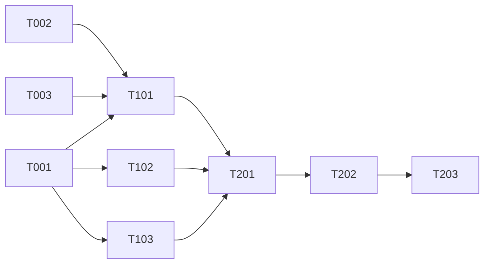

# PLAN.md — Label_Defect（印刷标签缺陷检测）

> 规则：每个 agent 只更新自己负责的行，不碰其他 agent 的行
> 本文件仅含任务索引。背景、实验详报等大块内容拆分到独立文件，按需加载。

---

## 项目目标

复现论文 "Printed label defect detection using twice gradient matching based on improved cosine similarity measure" (ESWA 2022)，实现 PLDD 框架并在印刷标签数据集上验证。

## 详细文档索引

| 文档 | 内容 | 何时加载 |
|------|------|---------|
| [background.md](background.md) | 论文摘要、算法原理、技术架构 | 需要理解算法背景时 |

---

## 任务总表

### Phase 0：算法理解与数据准备（Week 1-2）

| ID | 任务名 | 状态 | 优先级 | 负责人 | 创建日期 | 完成日期 | 备注 |
|----|--------|------|--------|--------|----------|----------|------|
| T001 | 论文精读与算法流程梳理 | pending | P0 | — | 2026-05-09 | | 输出：算法流程图 + 关键公式 |
| T002 | 数据集准备与目录规范 | pending | P0 | — | 2026-05-09 | | GM 图 + 测试图 |
| T003 | 图像配准模块实现 | pending | P1 | — | 2026-05-09 | | shape-based template matching |

### Phase 1：核心模块实现（Week 2-4）

| ID | 任务名 | 状态 | 优先级 | 负责人 | 创建日期 | 完成日期 | 备注 |
|----|--------|------|--------|--------|----------|----------|------|
| T101 | LDCE 算法实现（潜在缺陷候选提取） | pending | P0 | — | | | RGB 子图滑动 + 色差近似 |
| T102 | 改进余弦相似度实现 | pending | P0 | — | | | 梯度融合 + 非线性激活 |
| T103 | 二次梯度匹配实现 | pending | P0 | — | | | 含 Mask 机制 |

### Phase 2：集成验证与对比实验（Week 4-6）

| ID | 任务名 | 状态 | 优先级 | 负责人 | 创建日期 | 完成日期 | 备注 |
|----|--------|------|--------|--------|----------|----------|------|
| T201 | PLDD 框架集成 | pending | P0 | — | | | 全流程跑通 |
| T202 | 对比实验（SSIM/DSIM/FCN/DeepLabV3+） | pending | P1 | — | | | 复现论文 Table 结果 |
| T203 | 性能基准测试 | pending | P1 | — | | | F1/FP/速度 |

<!-- 状态：pending / doing / in_review / done / blocked / cancelled -->

---

## 决策日志

| 日期 | 决策 | 理由 |
|------|------|------|
| 2026-05-09 | 初始化项目，从 SPC_Floor + AutoResearch_Template 迁移模板 | 复用已验证的工程基础设施 |
| 2026-05-09 | 项目路径：E:/Project_LM/Label_Defect/ | 与 SPC_Floor 同级，独立仓库 |

## 依赖关系

## 验收标准（Phase 级）

| Phase | 验收条件 |
|-------|---------|
| Phase 0 | 论文算法流程图完成 + 数据集可读取 + 配准模块可用 |
| Phase 1 | LDCE + 余弦相似度 + 二次匹配 三个模块各自通过单元测试 |
| Phase 2 | 全流程跑通 + F1 ≥ 0.90 + 对比实验完成 |

---

## 归档

已完成的任务归档到 `docs/archive/`
