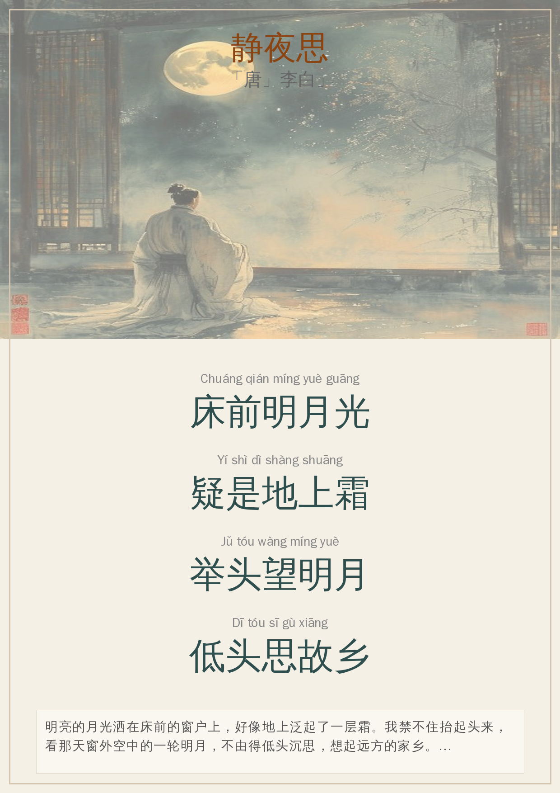

# 静夜思

  <h1>静夜思</h1>
  
「唐」李白

  
#月亮 #思乡 #李白 #秋天 #夜晚

---

## 📜 原诗朗诵

床前明月光Chuáng qián míng yuè guāng

疑是地上霜Yí shì dì shàng shuāng

举头望明月Jǔ tóu wàng míng yuè

低头思故乡Dī tóu sī gù xiāng

<button class="tts-button" onclick="speakPoem()">🔊 朗读</button>

---

## 📝 现代译文

明亮的月光洒在床前的窗户上，好像地上泛起了一层霜。我禁不住抬起头来，看那天窗外空中的一轮明月，不由得低头沉思，想起远方的家乡。

---

## 🏞️ 场景故事

🏞️ **场景描写**：

这是一个深秋的夜晚，诗人独自住在扬州的一家旅舍中。

推开窗户，一轮皎洁的明月高悬夜空，月光如流水般倾泻而下，
洒在床前的地面上。秋夜的凉意让月光看起来如同地上的白霜。

诗人从睡梦中醒来，被这清冷的月光所吸引。他抬头望向明月，
那轮圆月仿佛就是家乡的天空。低头时，思乡之情涌上心头。

🌙 **意象元素**：
- 明月：象征团圆、思念
- 霜：秋夜的清寒、时光的流逝
- 床/井栏：孤独、漂泊
- 故乡：温暖、归属感

---

## 📖 诗人介绍

李白（701年－762年），字太白，号青莲居士，又号「谪仙人」，唐代伟大的浪漫主义诗人，被后人誉为「诗仙」。

这首《静夜思》是李白最脍炙人口的诗作之一，约作于唐玄宗开元十四年（726年）。当时李白26岁，离开家乡四川，
在扬州旅舍写下此诗。诗人在异乡客居，秋夜难眠，望着天上的明月，思念起远方的故乡和亲人。

诗中的「床」并非现代意义上的床，有学者认为是「井栏」或「坐具」之意。但无论如何理解，都不影响这首诗
表达的那份 universal 的思乡之情。

---

## 📝 学习要点

📝 **学习要点**：

1. **朗读技巧**
   - 「明月光」读得轻柔、缓慢
   - 「地上霜」带一点惊讶的语气
   - 「望明月」抬头仰望的感觉
   - 「思故乡」声音渐低，表达思念

2. **生字学习**
   - 床：古代指坐具，今天指睡觉的家具
   - 疑：怀疑、以为
   - 举：抬起
   - 故乡：家乡

3. **文化知识**
   - 中秋节赏月的传统
   - 「月是故乡明」的文化内涵
   - 唐诗的格律（五言绝句）

4. **延伸活动**
   - 画一幅「静夜思」的画
   - 观察月亮，说说月亮像什么
   - 学习「月」字的演变
   - 唱《静夜思》儿歌

---

## 🎨 配图卡片

  
  
💡 右键保存图片，可打印成A6卡片

---

