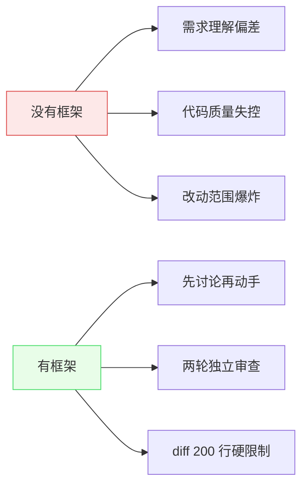

# Claude Code + Codex 多 Agent 协作框架 — 项目综述

> 让两个 AI 一个出主意一个写代码，配合门禁和审查，安全高效地完成开发任务。

## 目录

- [这是什么？](#这是什么)
- [为什么需要它？](#为什么需要它)
- [它怎么工作？（30 秒版）](#它怎么工作30-秒版)
- [快速上手](#快速上手)
- [核心概念（深入版）](#核心概念深入版)
- [关键设计决策](#关键设计决策)
- [常见场景指南](#常见场景指南)
- [术语表](#术语表)

---

## 这是什么？

想象一家餐厅：**主厨**尝味道、定菜单、检查出品质量，但不下厨；**副厨**按食谱炒菜，手脚快、出品稳定。这个项目就是让两个 AI 扮演这两个角色：

- **Claude Code（主厨）**：理解需求、制定计划、搜索资料、审查代码质量
- **Codex / GPT-5.4（副厨）**：根据指令写代码、做重构、修 bug

两者通过一套**协作规范**配合工作——Claude Code 决定做什么、怎么做，Codex 负责实际写代码。整个过程中，**门禁系统**确保不跳步，**审查机制**确保不出错。

简单说：这是一个**多 AI 协作开发框架模板**，你把它复制到自己的项目里，Claude Code 和 Codex 就会按照既定规则协同工作，而不是各干各的。

---

## 为什么需要它？

直接让 AI 写代码，常见这些坑：

| 痛点 | 具体表现 |
|------|---------|
| **理解偏差** | 你说"优化性能"，AI 把所有函数重写了一遍，但其实只需要改一个索引 |
| **没有安全网** | AI 一把梭改了 20 个文件，git diff 500 行，你不知道它改了什么 |
| **跳过讨论** | 你刚说完需求，AI 已经开始写代码了，方向对不对不知道 |
| **质量失控** | AI 写的代码能跑，但没有测试、没有类型标注、不符合项目风格 |
| **不可复现** | 上次 AI 帮你修了一个 bug，但没记录原因，下次遇到类似问题又从头来 |

这个框架用**流程约束**解决这些问题——不是限制 AI 的能力，而是确保它走在正确的路上。



---

## 它怎么工作？（30 秒版）

用户提交任务后，经历五个阶段：


1. **门禁检查**：Claude Code 先复述你的需求，列出歧义点，**等你确认后才动手**
2. **场景路由**：根据任务类型（debug/调研/大重构/简单改动），自动匹配对应工作流
3. **规划拆分**：复杂任务拆成小步骤，每步标注谁来做（CC 还是 Codex）
4. **Codex 执行**：Codex 按计划写代码，每次改动不超过 200 行
5. **两轮审查**：Claude Code 先自查，Codex 再深度审查，通过后才提交

以下 SVG 展示四层架构和核心组件：

<svg viewBox="0 0 700 320" xmlns="http://www.w3.org/2000/svg">
<defs>
<marker id="ar" markerWidth="8" markerHeight="8" refX="6" refY="3" orient="auto">
<path d="M0,0 L0,6 L8,3 z" fill="#667"/>
</marker>
<linearGradient id="g1" x1="0" y1="0" x2="0" y2="1">
<stop offset="0%" stop-color="#e8f4fd"/>
<stop offset="100%" stop-color="#d0e8f8"/>
</linearGradient>
<linearGradient id="g2" x1="0" y1="0" x2="0" y2="1">
<stop offset="0%" stop-color="#e8fde8"/>
<stop offset="100%" stop-color="#d0f0d0"/>
</linearGradient>
<linearGradient id="g3" x1="0" y1="0" x2="0" y2="1">
<stop offset="0%" stop-color="#fdf5e8"/>
<stop offset="100%" stop-color="#f0e0c0"/>
</linearGradient>
<linearGradient id="g4" x1="0" y1="0" x2="0" y2="1">
<stop offset="0%" stop-color="#fde8e8"/>
<stop offset="100%" stop-color="#f0d0d0"/>
</linearGradient>
</defs>
<g id="background">
<rect x="20" y="15" width="660" height="60" rx="8" fill="url(#g1)" stroke="#4a9edd" stroke-width="1.5"/>
<rect x="20" y="95" width="660" height="60" rx="8" fill="url(#g2)" stroke="#4add6a" stroke-width="1.5"/>
<rect x="20" y="175" width="660" height="60" rx="8" fill="url(#g3)" stroke="#ddaa4a" stroke-width="1.5"/>
<rect x="20" y="255" width="660" height="60" rx="8" fill="url(#g4)" stroke="#dd4a4a" stroke-width="1.5"/>
</g>
<g id="edges">
<line x1="350" y1="75" x2="350" y2="93" stroke="#667" stroke-width="1.5" marker-end="url(#ar)"/>
<line x1="350" y1="155" x2="350" y2="173" stroke="#667" stroke-width="1.5" marker-end="url(#ar)"/>
<line x1="350" y1="235" x2="350" y2="253" stroke="#667" stroke-width="1.5" marker-end="url(#ar)"/>
</g>
<g id="nodes"/>
<g id="labels">
<text x="350" y="38" text-anchor="middle" font-size="14" font-weight="bold" fill="#1a5f8a">入口路由层</text>
<text x="350" y="60" text-anchor="middle" font-size="11" fill="#3a7faa">CLAUDE.md 门禁检查 + 按任务类型分发到对应工作流</text>
<text x="350" y="118" text-anchor="middle" font-size="14" font-weight="bold" fill="#1a7a2a">工作流调度层</text>
<text x="350" y="140" text-anchor="middle" font-size="11" fill="#3a9a3a">8 种场景工作流（debug/research/complex/parallel 等）</text>
<text x="350" y="198" text-anchor="middle" font-size="14" font-weight="bold" fill="#7a4a1a">执行支撑层</text>
<text x="350" y="220" text-anchor="middle" font-size="11" fill="#9a6a2a">27 个 Skills + 8 个 Rules + 10 个 Hook 脚本</text>
<text x="350" y="278" text-anchor="middle" font-size="14" font-weight="bold" fill="#7a1a1a">代码产出层</text>
<text x="350" y="300" text-anchor="middle" font-size="11" fill="#9a3a3a">Codex 生成代码 → 两轮审查 → Git 提交</text>
</g>
</svg>

---

## 快速上手

### 前置条件

| 条件 | 说明 |
|------|------|
| Claude Code | Anthropic 的 CLI 工具，已安装并可用 |
| Codex | OpenAI Codex CLI 或 MCP 插件（二选一） |
| Git | 项目必须是一个 Git 仓库 |
| Python 3.10+ | Hook 脚本和扫描工具的运行环境 |

### 5 分钟体验

```bash
# 1. 克隆模板
git clone <repo-url> my-project && cd my-project

# 2. 删除演示应用（可选，保留作为参考也行）
rm -rf image-merger/

# 3. 开始对话 — Claude Code 会自动读取 CLAUDE.md 并启动门禁流程
claude
# 你说："帮我给项目加一个用户登录功能"
# Claude Code 会：复述需求 → 列出歧义 → 等你确认 → 制定计划 → 调 Codex 写代码

# 4. 审查提交 — 代码写完后自动进入两轮审查
# 审查通过 → 自动提交（Hook 脚本做安全检查）
# 审查未通过 → 返回修改（最多 3 轮）
```

### 项目结构速览

```
项目根目录/
├── CLAUDE.md              # 🚪 入口：门禁规则 + 场景路由表（CC 读取）
├── AGENTS.md              # 🤖 Codex 侧约束（Codex 读取）
├── .claude/
│   ├── workflows/         # 📋 核心：8 种场景工作流（按需加载）
│   │   ├── claude-workflow-complex.md     # 复杂开发（6 Phase）
│   │   ├── claude-workflow-parallel.md    # 并行开发（多 Worktree）
│   │   ├── claude-workflow-debug.md       # 调试流程
│   │   ├── claude-workflow-research.md    # 调研流程
│   │   └── claude-workflow-constants.md   # 所有常量定义（单一真相源）
│   ├── rules/             # 📏 按需加载的编码规范
│   │   ├── code-style.md / code-style-cpp.md  # 代码风格
│   │   ├── security.md / security-cpp.md       # 安全规范
│   │   └── testing.md / testing-cpp.md         # 测试规范
│   ├── skills/            # 🔧 27 个可复用 AI 技能
│   │   ├── largebase-structured-scan/     # 大型代码库结构化扫描
│   │   ├── doc-gen/                       # 结构化文档生成
│   │   ├── plan / review / commit         # 计划/审查/提交
│   │   └── ...                            # 其他领域技能
│   ├── scripts/           # 🛡️ Hook 脚本（自动触发）
│   │   ├── git_safety_check.py            # 拦截危险 Git 操作
│   │   ├── auto_checkpoint_commit.py      # 会话结束自动提交
│   │   └── pre_merge_scope_guard.py       # 合并前范围检查
│   └── memory/            # 🧠 跨会话记忆
├── image-merger/          # 📦 演示应用（Python 图片合并，可替换为你自己的项目）
├── docs/
│   ├── plan/              # 📝 任务计划文档
│   ├── scan/              # 🔍 代码库扫描报告
│   └── CODEBASE_MAP.md    # 🗺️ 项目结构导航图
└── tasks/
    └── lessons.md         # 📖 历史教训（AI 每次启动自动读取）
```

---

## 核心概念（深入版）

### 门禁系统

**直觉理解**：就像手术室的消毒流程——进手术室前必须洗手、穿无菌服，不是限制你，是保护病人。

**技术细节**：每次收到新任务，Claude Code 强制执行一套检查序列——复述需求、列出歧义、判断复杂度、搜索历史记忆。**用户说"确认"之前，不允许写任何代码。**

**具体体现**：`CLAUDE.md` 开头的"⛔ 强制门禁"节，违反门禁的 AI 行为会被强制重启。

### 场景路由

**直觉理解**：像医院分诊台——不是所有病人都走同一个科室，先判断你是感冒还是骨折，再送去对应科室。

**技术细节**：8 种场景按优先级从高到低匹配：Debug > Code Review > C++ 编译 > C++ 测试 > 研究调研 > 大型代码库 > 并行开发 > 复杂开发 > 简单开发。**匹配即停止**，不走多余的流程。

**具体体现**：`CLAUDE.md` 的场景路由表，每种场景对应 `.claude/workflows/` 下的一个工作流文件。

### 双路径调用

**直觉理解**：给副厨下指令有两种方式——当面说（快，但在同一个厨房）或者打电话（慢一点，但副厨可以在别的地方）。

**技术细节**：Codex 有两种调用方式——CLI 插件（路径 A，推荐，低延迟）或 MCP 协议（路径 B，通用，需要网络）。框架自动检测可用方式。

**具体体现**：`claude-workflow-constants.md` 的"Codex 调用规范（双路径）"节。

### Context 按需加载

**直觉理解**：像自助餐——不是把所有菜都端上桌，而是你点什么上什么。桌子就那么大（Context 窗口有限），全端上来反而吃不下。

**技术细节**：`.claude/rules/` 下的每个规则文件有 `paths` frontmatter，声明它适用于哪些文件类型。Claude Code 根据当前操作的文件类型，只加载匹配的规则。

**具体体现**：`security.md` 的 frontmatter 写 `paths: ["**/*.py"]`，只有编辑 Python 文件时才加载安全规范。

### 两轮独立审查

**直觉理解**：作文交上去，语文老师先看一遍（看逻辑通不通），然后数学老师再看一遍（看数据对不对）。两个老师独立打分，不是一个老师看两遍。

**技术细节**：diff > 100 行或涉及核心逻辑时，必须执行两轮审查。第一轮 Claude Code 检查逻辑正确性、安全性；第二轮 Codex 检查边界条件、兼容性。有分歧就修复后重来。

**具体体现**：`claude-workflow-complex.md` Phase 5 的审查流程。

---

## 关键设计决策

| 决策 | 选择了什么 | 为什么这样选 | 放弃了什么 |
|------|-----------|-------------|-----------|
| AI 角色分工 | CC 规划 + Codex 写代码 | CC 搜索和规划能力强，Codex 代码生成稳定 | 让 CC 写代码（质量不如 Codex）或让 Codex 规划（搜索能力弱） |
| 门禁强制执行 | CLAUDE.md 硬约束，违反重启 | AI 容易"兴奋"直接写代码，没有门禁就失去控制 | 柔性提醒（AI 会忽略） |
| diff ≤ 200 行 | 单次提交硬限制 | 大 diff 无法有效审查，风险指数级上升 | 允许大 diff（审查流于形式） |
| 规则按需加载 | paths frontmatter 过滤 | 全量注入占满 Context 窗口，挤占有效信息 | 全量注入（简单但浪费） |
| Hook 脚本拦截 | PreToolUse 钩子 | 最后一道防线，防止 AI 执行危险操作 | 纯靠 Prompt 约束（AI 可能忽略） |
| 演示应用分离 | image-merger 独立目录 | 模板和业务代码隔离，方便替换为你自己的项目 | 演示代码混在框架里（难剥离） |

---

## 常见场景指南

### "我想修改一个已有的 Python 函数"

1. Claude Code 读取 `CLAUDE.md` → 触发门禁 → 复述需求
2. 你确认后 → 判断复杂度 → 匹配工作流
3. 改动 < 20 行 → CC 直接做；改动 ≥ 20 行 → 调 Codex
4. 审查通过 → Git 提交

**相关文件**：`claude-workflow-constants.md`（Codex 调用）、`.claude/rules/code-style.py`（Python 风格）

### "我要重构一个大模块，涉及 10+ 个文件"

1. 触发"大型代码库"路由 → 加载 `claude-workflow-largebase.md`
2. 先运行 `largebase-structured-scan` skill 扫描代码库
3. 基于扫描结果制定重构计划
4. 拆分为多个独立任务，每个 ≤ 200 行
5. 可并行的任务用 `parallel.md` 工作流同时执行

**相关文件**：`.claude/skills/largebase-structured-scan/SKILL.md`、`claude-workflow-parallel.md`

### "我要调试一个 bug"

1. 触发"Debug"路由（最高优先级）→ 加载 `claude-workflow-debug.md`
2. Claude Code 帮你最小化复现、定位根因
3. 先写回归测试，再修复
4. 确认测试通过后提交

**相关文件**：`claude-workflow-debug.md`、`.claude/rules/workflows.md` 的 Debug 节

### "我想了解项目里有什么"

1. 查看 `docs/CODEBASE_MAP.md`（项目结构导航图）
2. 运行 `largebase-structured-scan` skill 生成完整扫描报告
3. 查看 `docs/project-overview.md`（就是本文档）

**相关文件**：`docs/CODEBASE_MAP.md`、`docs/scan/` 目录

### "我想把这个框架用在自己的项目上"

1. 克隆本仓库
2. 删除 `image-merger/`（演示应用，你不需要）
3. 把你自己的代码放进来
4. 修改 `.claude/rules/project.md`（更新模块描述、入口点、技术栈）
5. 修改 `CLAUDE.md` 底部的项目特定信息
6. 运行 Cartographer 生成你项目的 `CODEBASE_MAP.md`

**相关文件**：`CLAUDE.md`、`.claude/rules/project.md`

---

## 术语表

| 术语 | 日常解释 | 技术定义 |
|------|---------|---------|
| CC (Claude Code) | 主厨，负责规划和审查 | Anthropic 的 AI CLI 工具，框架中担任"大脑"角色 |
| Codex | 副厨，负责写代码 | OpenAI 的代码生成模型（GPT-5.4），框架中担任"双手"角色 |
| 门禁 | 进手术室前的消毒流程 | 任务执行前的强制检查序列（需求讨论 + 复杂度判断） |
| 路由 | 医院分诊台 | 根据任务特征匹配对应工作流的过程 |
| 工作流 | 科室的诊疗流程 | 预定义的任务执行步骤模板（8 种场景） |
| Hook | 自动报警器 | 在特定操作前自动执行的拦截脚本（如防止 `rm -rf`） |
| Skill | 技能包 | 可复用的 AI 能力定义（如代码扫描、文档生成） |
| Rule | 行为规范 | 按需加载的编码/安全/测试规范 |
| diff | 改动量 | Git 中一次提交的代码变更行数 |
| Worktree | 平行时空 | Git 的多目录工作区，允许同时在不同分支上工作 |
| Context 窗口 | AI 的"工作台"大小 | AI 一次能处理的最大文本量，全量加载会浪费空间 |
| frontmatter | 文件头标签 | Markdown 文件顶部的 YAML 元数据，声明文件属性 |
