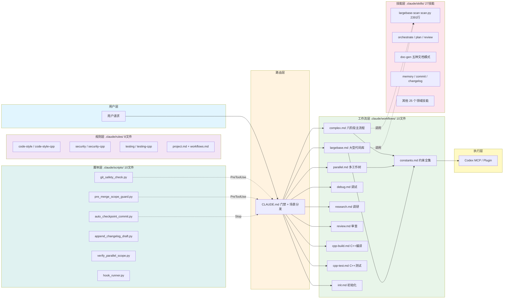

# 01 架构文档

> CC+Codex 协作框架六大模块分层架构与依赖关系

## 目录

- [概览图](#概览图)
- [模块依赖关系](#模块依赖关系)
- [目录结构](#目录结构)
- [入口点](#入口点)
- [架构约束](#架构约束)

---

## 概览图

项目采用**分层路由架构**：用户请求经门禁检查后，由 `CLAUDE.md` 路由到对应工作流，工作流调用 Codex 或 CC 执行，Hook 脚本提供安全守卫。

---

## 模块依赖关系

六大模块按**自上而下**方向依赖：路由层驱动工作流层，工作流层调用技能层和执行层，脚本层横向守卫所有操作。

<svg viewBox="0 0 800 400" xmlns="http://www.w3.org/2000/svg">
<defs>
<marker id="arr" markerWidth="8" markerHeight="8" refX="6" refY="3" orient="auto">
<path d="M0,0 L0,6 L8,3 z" fill="#555"/>
</marker>
</defs>
<g id="background">
<rect x="40" y="20" width="720" height="55" rx="8" fill="#e1f5fe" stroke="#4a9edd" stroke-width="1.5"/>
<rect x="40" y="95" width="720" height="55" rx="8" fill="#fff3e0" stroke="#ddaa4a" stroke-width="1.5"/>
<rect x="40" y="170" width="340" height="55" rx="8" fill="#e8f5e9" stroke="#4add6a" stroke-width="1.5"/>
<rect x="420" y="170" width="340" height="55" rx="8" fill="#f3e5f5" stroke="#aa4add" stroke-width="1.5"/>
<rect x="40" y="245" width="340" height="55" rx="8" fill="#fce4ec" stroke="#dd4a6a" stroke-width="1.5"/>
<rect x="420" y="245" width="340" height="55" rx="8" fill="#e0f2f1" stroke="#4addaa" stroke-width="1.5"/>
<rect x="40" y="320" width="720" height="55" rx="8" fill="#fff9c4" stroke="#dddd4a" stroke-width="1.5"/>
</g>
<g id="edges">
<line x1="400" y1="75" x2="400" y2="93" stroke="#555" stroke-width="1.5" marker-end="url(#arr)"/>
<line x1="250" y1="150" x2="250" y2="168" stroke="#555" stroke-width="1.5" marker-end="url(#arr)"/>
<line x1="550" y1="150" x2="550" y2="168" stroke="#555" stroke-width="1.5" marker-end="url(#arr)"/>
<line x1="250" y1="225" x2="250" y2="243" stroke="#555" stroke-width="1.5" marker-end="url(#arr)"/>
<line x1="550" y1="225" x2="550" y2="243" stroke="#555" stroke-width="1.5" marker-end="url(#arr)"/>
<line x1="250" y1="300" x2="250" y2="318" stroke="#555" stroke-width="1.5" marker-end="url(#arr)"/>
<line x1="550" y1="300" x2="550" y2="318" stroke="#555" stroke-width="1.5" marker-end="url(#arr)"/>
<line x1="600" y1="200" x2="470" y2="200" stroke="#999" stroke-width="1" stroke-dasharray="4,3"/>
<line x1="600" y1="275" x2="470" y2="275" stroke="#999" stroke-width="1" stroke-dasharray="4,3"/>
</g>
<g id="nodes"/>
<g id="labels">
<text x="400" y="52" text-anchor="middle" font-size="13" font-weight="bold" fill="#1a5f8a">CLAUDE.md / AGENTS.md — 路由入口</text>
<text x="400" y="127" text-anchor="middle" font-size="13" font-weight="bold" fill="#7a5a1a">工作流层 — 场景分发与流程控制</text>
<text x="210" y="202" text-anchor="middle" font-size="12" font-weight="bold" fill="#1a7a2a">.claude/workflows/ 10文件</text>
<text x="590" y="202" text-anchor="middle" font-size="12" font-weight="bold" fill="#6a1a7a">.claude/rules/ 8文件</text>
<text x="210" y="277" text-anchor="middle" font-size="12" font-weight="bold" fill="#7a1a3a">.claude/skills/ 27技能</text>
<text x="590" y="277" text-anchor="middle" font-size="12" font-weight="bold" fill="#1a6a5a">.claude/scripts/ 10文件</text>
<text x="400" y="352" text-anchor="middle" font-size="13" font-weight="bold" fill="#5a5a1a">Codex MCP / Plugin — 代码执行</text>
</g>
</svg>

**核心依赖链**：

| 上游模块 | 下游模块 | 依赖方式 |
|----------|---------|---------|
| `CLAUDE.md` | `.claude/workflows/` | 门禁检查 → 场景路由 |
| `constants.md` | 所有工作流 | 单一约束源，引用不复制 |
| `.claude/rules/` | CC 会话 | `paths` frontmatter 自动加载 |
| `.claude/scripts/` | Hook 事件 | `hook_runner.py` 统一分发 |
| `.claude/skills/` | CC Skill 工具 | 按需调用，无状态 |
| 工作流层 | Codex | 结构化 Prompt + 四必填参数 |

---

## 目录结构

项目根目录包含两个独立子系统：`.claude/` 是协作框架主体，`image-merger/` 是演示应用。

<svg viewBox="0 0 700 420" xmlns="http://www.w3.org/2000/svg">
<defs>
<marker id="tree" markerWidth="6" markerHeight="6" refX="3" refY="3" orient="auto">
<line x1="0" y1="3" x2="6" y2="3" stroke="#888" stroke-width="1.5"/>
</marker>
</defs>
<g id="background">
<rect x="10" y="10" width="680" height="400" rx="8" fill="#fafafa" stroke="#ddd" stroke-width="1"/>
</g>
<g id="edges">
<line x1="60" y1="50" x2="60" y2="390" stroke="#ccc" stroke-width="1"/>
<line x1="60" y1="80" x2="150" y2="80" stroke="#888" stroke-width="1.2"/>
<line x1="150" y1="80" x2="150" y2="210" stroke="#888" stroke-width="1.2"/>
<line x1="150" y1="100" x2="250" y2="100" stroke="#888" stroke-width="1.2"/>
<line x1="150" y1="125" x2="250" y2="125" stroke="#888" stroke-width="1.2"/>
<line x1="150" y1="150" x2="250" y2="150" stroke="#888" stroke-width="1.2"/>
<line x1="150" y1="175" x2="250" y2="175" stroke="#888" stroke-width="1.2"/>
<line x1="150" y1="200" x2="250" y2="200" stroke="#888" stroke-width="1.2"/>
<line x1="60" y1="240" x2="150" y2="240" stroke="#888" stroke-width="1.2"/>
<line x1="150" y1="240" x2="150" y2="290" stroke="#888" stroke-width="1.2"/>
<line x1="150" y1="260" x2="250" y2="260" stroke="#888" stroke-width="1.2"/>
<line x1="150" y1="285" x2="250" y2="285" stroke="#888" stroke-width="1.2"/>
<line x1="60" y1="320" x2="150" y2="320" stroke="#888" stroke-width="1.2"/>
<line x1="60" y1="350" x2="150" y2="350" stroke="#888" stroke-width="1.2"/>
<line x1="60" y1="380" x2="150" y2="380" stroke="#888" stroke-width="1.2"/>
</g>
<g id="nodes">
<circle cx="60" cy="50" r="5" fill="#4a9edd"/>
<circle cx="150" cy="80" r="4" fill="#666"/>
<circle cx="150" cy="240" r="4" fill="#666"/>
</g>
<g id="labels">
<text x="70" y="54" font-size="13" font-weight="bold" fill="#333">项目根目录</text>
<text x="160" y="84" font-size="12" fill="#333" font-weight="bold">.claude/</text>
<text x="260" y="84" font-size="10" fill="#888">协作框架主体</text>
<text x="260" y="104" font-size="11" fill="#555">workflows/ (10文件)</text>
<text x="260" y="129" font-size="11" fill="#555">rules/ (8文件)</text>
<text x="260" y="154" font-size="11" fill="#555">scripts/ (10文件, 60函数)</text>
<text x="260" y="179" font-size="11" fill="#555">skills/ (27技能)</text>
<text x="260" y="204" font-size="11" fill="#555">fbm/ (记忆服务器)</text>
<text x="160" y="244" font-size="12" fill="#333" font-weight="bold">docs/</text>
<text x="260" y="244" font-size="10" fill="#888">文档与扫描产物</text>
<text x="260" y="264" font-size="11" fill="#555">plan/ (11计划文件)</text>
<text x="260" y="289" font-size="11" fill="#555">scan/ (20+扫描会话)</text>
<text x="160" y="324" font-size="12" fill="#333" font-weight="bold">CLAUDE.md</text>
<text x="160" y="354" font-size="12" fill="#333" font-weight="bold">AGENTS.md</text>
<text x="160" y="384" font-size="12" fill="#333" font-weight="bold">image-merger/</text>
<rect x="460" y="85" width="210" height="24" rx="4" fill="#e8f5e9" stroke="#4add6a" stroke-width="1"/>
<text x="470" y="101" font-size="10" fill="#1a5a2a">10个工作流定义 + 约束常量</text>
<rect x="460" y="115" width="210" height="24" rx="4" fill="#f3e5f5" stroke="#aa4add" stroke-width="1"/>
<text x="470" y="131" font-size="10" fill="#5a1a6a">paths自动加载编码/安全规则</text>
<rect x="460" y="145" width="210" height="24" rx="4" fill="#e0f2f1" stroke="#4addaa" stroke-width="1"/>
<text x="470" y="161" font-size="10" fill="#1a5a4a">Hook守卫 git安全/范围检查</text>
<rect x="460" y="175" width="210" height="24" rx="4" fill="#fce4ec" stroke="#dd4a6a" stroke-width="1"/>
<text x="470" y="191" font-size="10" fill="#6a1a2a">scan.py 2391行 8子命令</text>
<rect x="460" y="205" width="210" height="24" rx="4" fill="#fff3e0" stroke="#ddaa4a" stroke-width="1"/>
<text x="470" y="221" font-size="10" fill="#5a3a1a">fbm-mcp.js 跨会话记忆</text>
<rect x="460" y="340" width="210" height="24" rx="4" fill="#f5f5f5" stroke="#bbb" stroke-width="1"/>
<text x="470" y="356" font-size="10" fill="#555">Python演示 非框架焦点</text>
</g>
</svg>

---

## 入口点

| 入口 | 类型 | 触发条件 | 调用链前3步 |
|------|------|---------|------------|
| `CLAUDE.md` | 路由 | CC 会话启动或新请求 | 门禁检查 → 场景分发 → 工作流执行 |
| `AGENTS.md` | 约束 | Codex 直接对话 | 文件操作限制 → 复杂度判断 → 等待确认 |
| `scan.py` | CLI/Skill | `scan --mode M1-M4` | 初始化目录 → 提取代码 → 生成 JSON |
| `fbm-mcp.js` | MCP 服务器 | CC 记忆读写请求 | 接收请求 → 搜索 Markdown → 返回结果 |
| `hook_runner.py` | Hook | 任意 Hook 事件 | 解析事件 → 路由脚本 → 返回退出码 |
| `git_safety_check.py` | Hook | PreToolUse(commit/push) | 解析命令 → 风险评分 → 放行或阻止 |
| `main.py` | CLI | `python main.py` | argparse → `merge_images()` → 保存输出 |

**调用优先级**：`CLAUDE.md` 门禁 > Hook 守卫 > 工作流 > 技能 > Codex 执行。任何一层都可阻止请求继续向下传递。

---

## 架构约束

### 硬约束（来自 `constants.md`）

| 编号 | 约束 | 影响 |
|------|------|------|
| C1 | 单次 diff 不超过 200 行 | 强制任务拆分，禁止巨型提交 |
| C2 | Codex 四必填参数 | 每次 MCP 调用必须带全参数 |
| C3 | 禁止无确认删除文件 | `rm -rf`、`git clean -f` 被拦截 |
| C4 | commit/push 前安全检查 | 风险评分阻止危险操作 |
| C5 | diff > 100 行需两轮 Review | 轮次1 CC 逻辑+安全，轮次2 Codex 边界条件 |

### 设计约束

| 编号 | 约束 | 理由 |
|------|------|------|
| D1 | CC = 大脑，Codex = 双手 | 关注点分离 |
| D2 | `constants.md` 为单一约束源 | 所有工作流引用，不复制规则 |
| D3 | 规则按 `paths` 自动加载 | `.py` 文件自动获得 Python 规则 |
| D4 | Hook 链同步阻塞 | PreToolUse 可阻止工具执行 |
| D5 | 扫描提取阶段零 AI | `scan.py` 仅用 AST/正则 |
| D6 | 技能无状态 | 每次调用独立，状态持久化到文件 |
