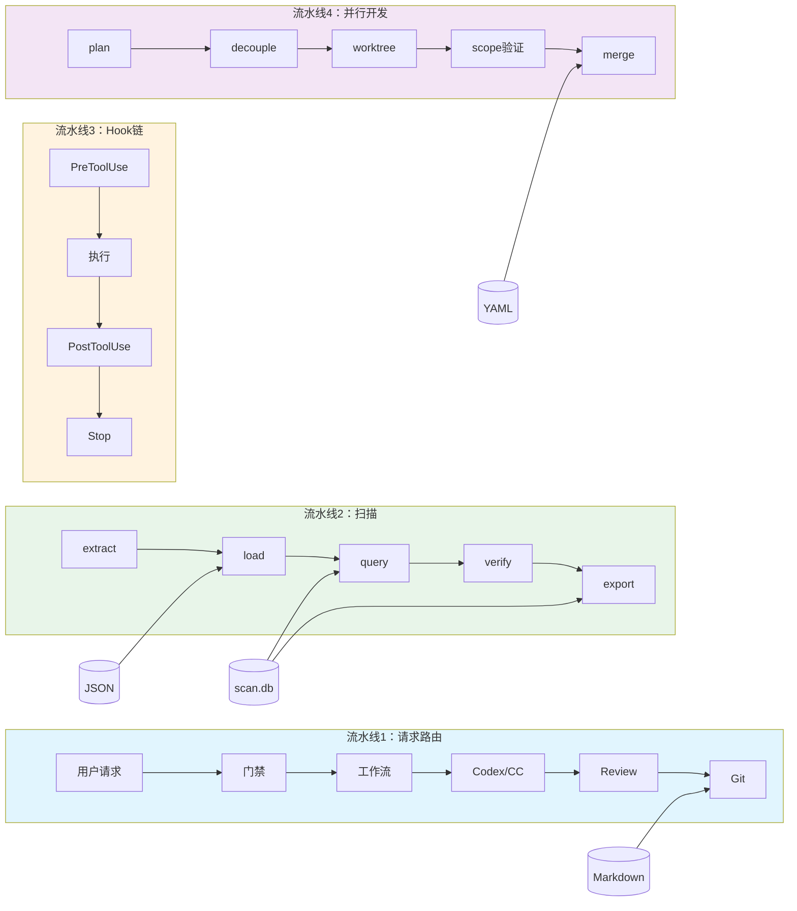
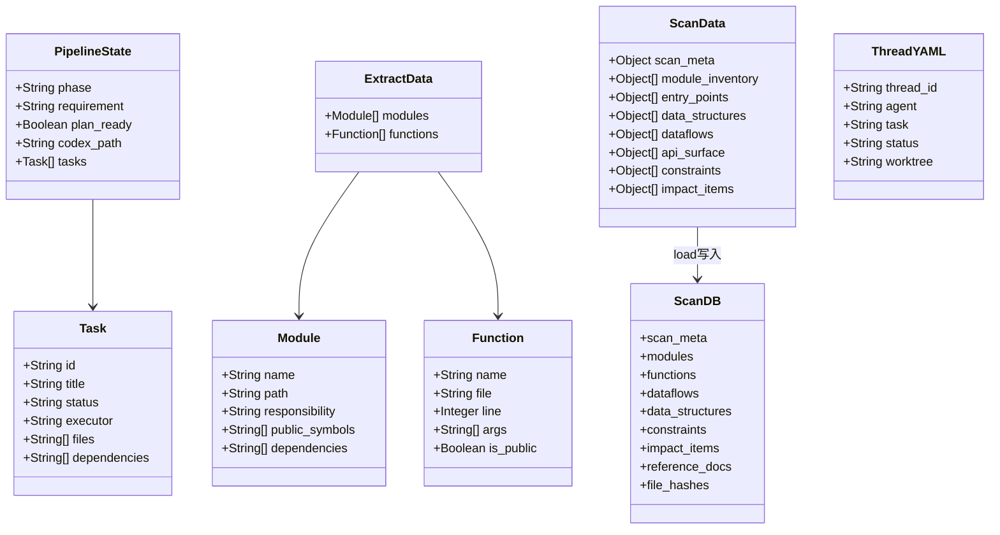
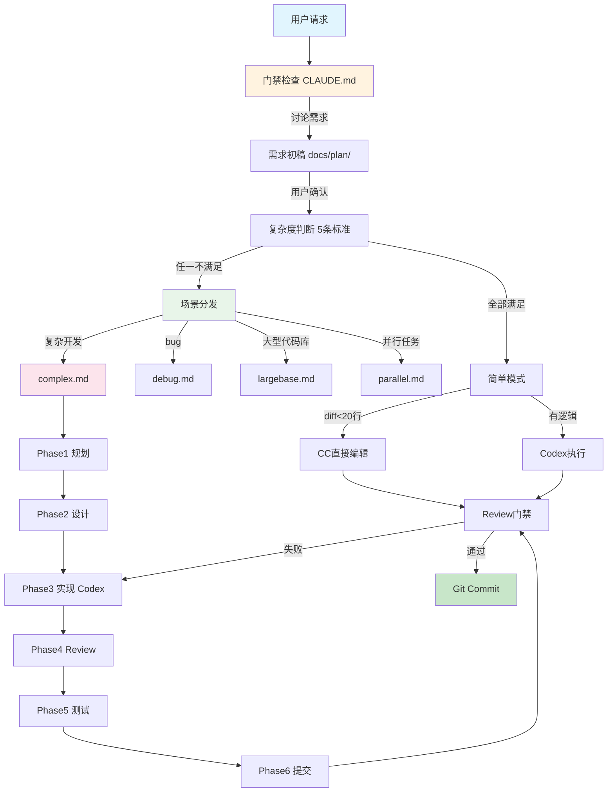
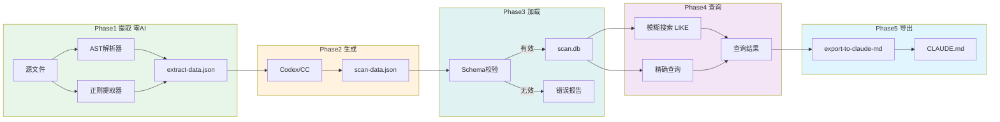
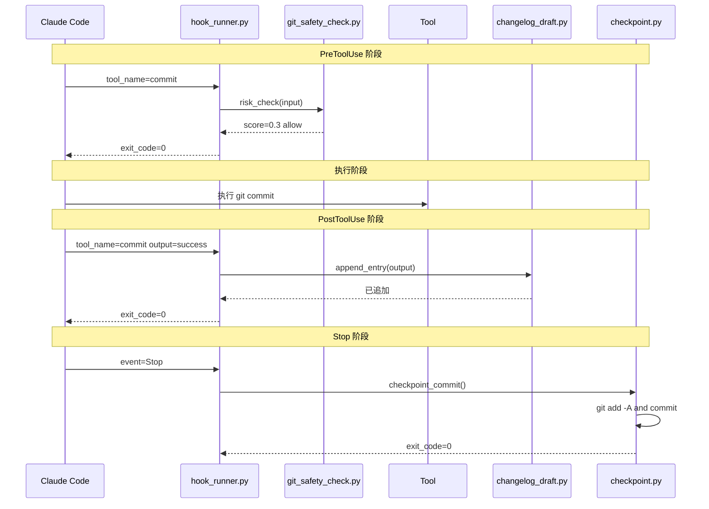
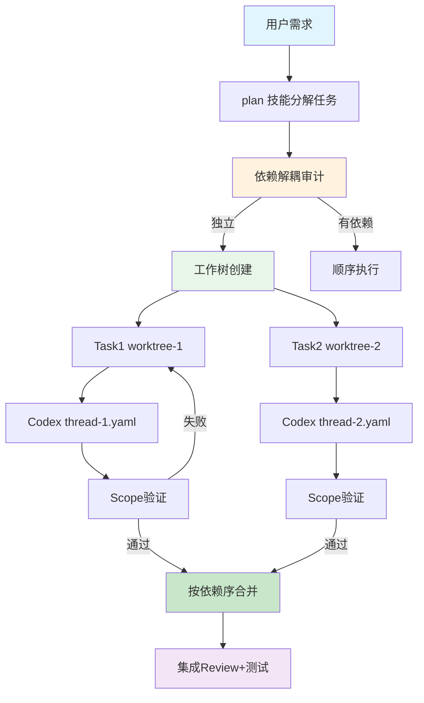

# 02 数据流文档

> 六种核心数据结构与四条端到端数据流水线

## 目录

- [概览图](#概览图)
- [核心数据结构](#核心数据结构)
- [数据流：请求路由](#数据流请求路由)
- [数据流：扫描流水线](#数据流扫描流水线)
- [数据流：Hook 链](#数据流hook-链)
- [数据流：并行开发](#数据流并行开发)
- [存储层](#存储层)
- [关键约束](#关键约束)

---

## 概览图

项目存在四条核心数据流水线，共享 SQLite、JSON、Markdown 三种存储介质。

---

## 核心数据结构

### 数据结构总览

### `pipeline/state.json` — 状态机

phase 字段定义了八个状态，单向流转不允许回退：

| 状态 | 含义 | 可转入 |
|------|------|--------|
| `idle` | 空闲，等待请求 | `planning` |
| `planning` | 制定计划 | `reviewing_plan` |
| `reviewing_plan` | 审查计划 | `executing` |
| `executing` | Codex 执行 | `reviewing_code` |
| `reviewing_code` | 代码审查 | `testing` |
| `testing` | 运行测试 | `reporting` |
| `reporting` | 生成报告 | `done` |
| `done` | 任务完成 | `idle` |

**写入方**：`orchestrate` 技能。**读取方**：`plan` / `execute` / `review` / `report` 技能。

### `extract-data.json` — AST/正则输出

由 `scan.py extract` 子命令生成，Python 用 `ast` 模块，其他语言用正则。零 AI 参与。

关键字段：`modules`（模块名/路径/职责/导出符号/依赖）和 `functions`（函数名/文件/行号/参数/可见性）。

### `scan-data.json` — M4 扫描产物

8 个顶层键与 `scan.db` 的 9 张表一一对应。由 `scan.py scan` 生成，由 `scan.py load` 写入 SQLite。

### `scan.db` — SQLite 9 张表

| 表名 | 核心列 | 用途 |
|------|--------|------|
| `scan_meta` | `key TEXT PK`, `value TEXT` | 扫描元数据 |
| `modules` | `id`, `path`, `name`, `loc INT` | 模块清单 |
| `functions` | `id`, `module_id FK`, `name`, `line_number INT` | 函数索引+调用图 |
| `dataflows` | `id`, `name`, `steps`, `input_format` | 数据流记录 |
| `data_structures` | `id`, `name`, `fields`, `storage_layer` | 数据结构目录 |
| `constraints` | `id`, `source_doc`, `content`, `priority` | 约束注册 |
| `impact_items` | `id`, `change_point`, `risk_level` | 影响分析 |
| `reference_docs` | `id`, `path`, `conflicts_with` | 参考文档索引 |
| `file_hashes` | `path TEXT PK`, `sha256` | 增量扫描支持 |

### `.coordination/threads/*.yaml` — 线程注册表

| 字段 | 类型 | 用途 |
|------|------|------|
| `thread_id` | string | 唯一线程标识 |
| `agent` | string | 代理名称（codex-1, cc） |
| `task` | string | 分配的任务 ID |
| `status` | string | `active` / `waiting` / `completed` |
| `worktree` | string | 工作树路径 |

### `*-steps.md` — 任务开发计划

YAML frontmatter 中的 `paths` 字段触发 `.claude/rules/` 自动加载。Markdown 正文包含结构化实现步骤。

---

## 数据流：请求路由

从用户请求到代码提交的端到端流程。

**各阶段数据转换**：

| 阶段 | 输入 | 输出 | 格式 |
|------|------|------|------|
| 门禁 | 用户消息 | 需求初稿 | Markdown |
| 复杂度判断 | 初稿 + 文件列表 | 模式决策 | 内部状态 |
| Codex 执行 | 结构化 Prompt | 代码变更 | 源文件 |
| Review | Diff 输出 | 通过/失败 | 终端输出 |
| 提交 | 暂存文件 | Commit hash | Git 对象 |

---

## 数据流：扫描流水线

从源码提取到 `CLAUDE.md` 注入的五阶段流水线。

**关键转换函数**：

- `scan.py extract` → `extract-data.json`：AST + 正则，零 LLM 调用
- `validate_scan_data()` → 校验 8 个顶层键和必填字段
- `cmd_load()` → JSON 键映射到 SQLite 表
- `cmd_query()` → 支持 `hybrid_search` / `impact` / `callers` / `risks` 五种查询模式
- `cmd_verify()` → 检查所有表是否有数据，报告缺失
- `cmd_export_to_claude_md()` → 替换 `CLAUDE.md` 中的扫描摘要段落

---

## 数据流：Hook 链

同步阻塞的 Hook 链包裹每次工具执行。

| 事件 | 脚本 | 阻塞 |
|------|------|------|
| PreToolUse(commit/push) | `git_safety_check.py` | 是，可阻止 |
| PreToolUse(merge) | `pre_merge_scope_guard.py` | 是，阻止跨工作树合并 |
| PostToolUse(commit) | `append_changelog_draft.py` | 否，仅记录 |
| Stop(会话结束) | `auto_checkpoint_commit.py` | 否，自动保存 |

---

## 数据流：并行开发

多代理并行开发，工作树隔离，按依赖序合并。

**协调数据位置**：

| 数据 | 位置 | 写入方 | 读取方 |
|------|------|--------|--------|
| 线程注册 | `.coordination/threads/*.yaml` | `parallel.md` | 范围验证 |
| 工作树状态 | `.claude/worktrees/*/` | 工作树创建 | 范围验证 |
| 依赖图 | Task `dependencies` 字段 | `plan` 技能 | 合并协调器 |
| 范围快照 | Git status 输出 | `verify_parallel_scope.py` | 合并门禁 |

---

## 存储层

项目使用三种存储介质，各有不同的读写模式和生命周期。

<svg viewBox="0 0 750 340" xmlns="http://www.w3.org/2000/svg">
<defs>
<marker id="arr2" markerWidth="8" markerHeight="8" refX="6" refY="3" orient="auto">
<path d="M0,0 L0,6 L8,3 z" fill="#555"/>
</marker>
</defs>
<g id="background">
<rect x="30" y="20" width="200" height="300" rx="8" fill="#e8f5e9" stroke="#4add6a" stroke-width="1.5"/>
<rect x="270" y="20" width="200" height="300" rx="8" fill="#e1f5fe" stroke="#4a9edd" stroke-width="1.5"/>
<rect x="510" y="20" width="200" height="300" rx="8" fill="#fff3e0" stroke="#ddaa4a" stroke-width="1.5"/>
</g>
<g id="edges">
<line x1="230" y1="170" x2="268" y2="170" stroke="#555" stroke-width="1.5" marker-end="url(#arr2)"/>
<line x1="470" y1="170" x2="508" y2="170" stroke="#555" stroke-width="1.5" marker-end="url(#arr2)"/>
</g>
<g id="nodes">
<rect x="55" y="50" width="150" height="28" rx="4" fill="#c8e6c9" stroke="#388e3c" stroke-width="1"/>
<rect x="55" y="90" width="150" height="28" rx="4" fill="#c8e6c9" stroke="#388e3c" stroke-width="1"/>
<rect x="55" y="130" width="150" height="28" rx="4" fill="#c8e6c9" stroke="#388e3c" stroke-width="1"/>
<rect x="55" y="170" width="150" height="28" rx="4" fill="#c8e6c9" stroke="#388e3c" stroke-width="1"/>
<rect x="55" y="210" width="150" height="28" rx="4" fill="#c8e6c9" stroke="#388e3c" stroke-width="1"/>
<rect x="55" y="250" width="150" height="28" rx="4" fill="#c8e6c9" stroke="#388e3c" stroke-width="1"/>
<rect x="295" y="50" width="150" height="28" rx="4" fill="#bbdefb" stroke="#1565c0" stroke-width="1"/>
<rect x="295" y="90" width="150" height="28" rx="4" fill="#bbdefb" stroke="#1565c0" stroke-width="1"/>
<rect x="295" y="130" width="150" height="28" rx="4" fill="#bbdefb" stroke="#1565c0" stroke-width="1"/>
<rect x="295" y="170" width="150" height="28" rx="4" fill="#bbdefb" stroke="#1565c0" stroke-width="1"/>
<rect x="295" y="210" width="150" height="28" rx="4" fill="#bbdefb" stroke="#1565c0" stroke-width="1"/>
<rect x="535" y="50" width="150" height="28" rx="4" fill="#ffe0b2" stroke="#e65100" stroke-width="1"/>
<rect x="535" y="90" width="150" height="28" rx="4" fill="#ffe0b2" stroke="#e65100" stroke-width="1"/>
<rect x="535" y="130" width="150" height="28" rx="4" fill="#ffe0b2" stroke="#e65100" stroke-width="1"/>
<rect x="535" y="170" width="150" height="28" rx="4" fill="#ffe0b2" stroke="#e65100" stroke-width="1"/>
<rect x="535" y="210" width="150" height="28" rx="4" fill="#ffe0b2" stroke="#e65100" stroke-width="1"/>
</g>
<g id="labels">
<text x="130" y="38" text-anchor="middle" font-size="13" font-weight="bold" fill="#1a5a2a">SQLite scan.db</text>
<text x="130" y="68" text-anchor="middle" font-size="10" fill="#333">scan_meta</text>
<text x="130" y="108" text-anchor="middle" font-size="10" fill="#333">modules</text>
<text x="130" y="148" text-anchor="middle" font-size="10" fill="#333">functions</text>
<text x="130" y="188" text-anchor="middle" font-size="10" fill="#333">dataflows</text>
<text x="130" y="228" text-anchor="middle" font-size="10" fill="#333">constraints</text>
<text x="130" y="268" text-anchor="middle" font-size="10" fill="#333">file_hashes</text>
<text x="370" y="38" text-anchor="middle" font-size="13" font-weight="bold" fill="#1a3a6a">JSON 文件</text>
<text x="370" y="68" text-anchor="middle" font-size="10" fill="#333">scan-data.json</text>
<text x="370" y="108" text-anchor="middle" font-size="10" fill="#333">extract-data.json</text>
<text x="370" y="148" text-anchor="middle" font-size="10" fill="#333">00-scan-meta.json</text>
<text x="370" y="188" text-anchor="middle" font-size="10" fill="#333">pipeline/state.json</text>
<text x="370" y="228" text-anchor="middle" font-size="10" fill="#333">settings.local.json</text>
<text x="610" y="38" text-anchor="middle" font-size="13" font-weight="bold" fill="#6a3a1a">Markdown / YAML</text>
<text x="610" y="68" text-anchor="middle" font-size="10" fill="#333">CLAUDE.md</text>
<text x="610" y="108" text-anchor="middle" font-size="10" fill="#333">01-06 扫描报告</text>
<text x="610" y="148" text-anchor="middle" font-size="10" fill="#333">*-steps.md 任务计划</text>
<text x="610" y="188" text-anchor="middle" font-size="10" fill="#333">threads/*.yaml</text>
<text x="610" y="228" text-anchor="middle" font-size="10" fill="#333">changelog-draft.md</text>
<text x="130" y="300" text-anchor="middle" font-size="9" fill="#666">WAL模式 批量写入 只读查询</text>
<text x="370" y="300" text-anchor="middle" font-size="9" fill="#666">写一次/追加/覆写</text>
<text x="610" y="300" text-anchor="middle" font-size="9" fill="#666">写一次/追加/段落替换</text>
</g>
</svg>

### 存储模式对比

| 介质 | 文件数 | 写模式 | 生命周期 |
|------|--------|--------|---------|
| SQLite | 1 个 DB / 次扫描 | `load` 批量写入，其余只读 | 跟随扫描会话 |
| JSON | 5+ | 写一次或覆写 | 跟随任务或扫描 |
| YAML | 动态 | 创建 + 状态更新 | 跟随并行任务 |
| Markdown | 10+ | 写一次或追加 | 持久保留 |

---

## 关键约束

### 数据完整性

| 约束 | 来源 | 机制 |
|------|------|------|
| `scan-data.json` 加载前必须通过校验 | `scan.py:validate_scan_data()` | 检查顶层键和必填字段 |
| `file_hashes` 防止过期数据 | `scan.py:is_file_changed()` | SHA-256 对比 |
| 管线状态单向流转 | `orchestrate` 技能 | 不支持回退到早期阶段 |

### 安全

| 约束 | 来源 | 机制 |
|------|------|------|
| 提取阶段零 AI 参与 | 设计决策 | `scan.py extract` 仅用 AST + 正则 |
| Hook 同步阻塞 | CC 架构 | PreToolUse 非零退出码阻止工具调用 |
| Codex 产出必须 Review | Review 门禁 | diff > 100 行需两轮审查 |

### 性能

| 约束 | 来源 | 机制 |
|------|------|------|
| SQLite WAL 模式 | `scan.py:init_db()` | `PRAGMA journal_mode=WAL` 支持并发读 |
| 增量扫描 | `file_hashes` 表 | SHA-256 变更检测避免全量重扫 |
| 模糊搜索 | `cmd_query()` | LIKE + 关键词匹配，无外部引擎 |
