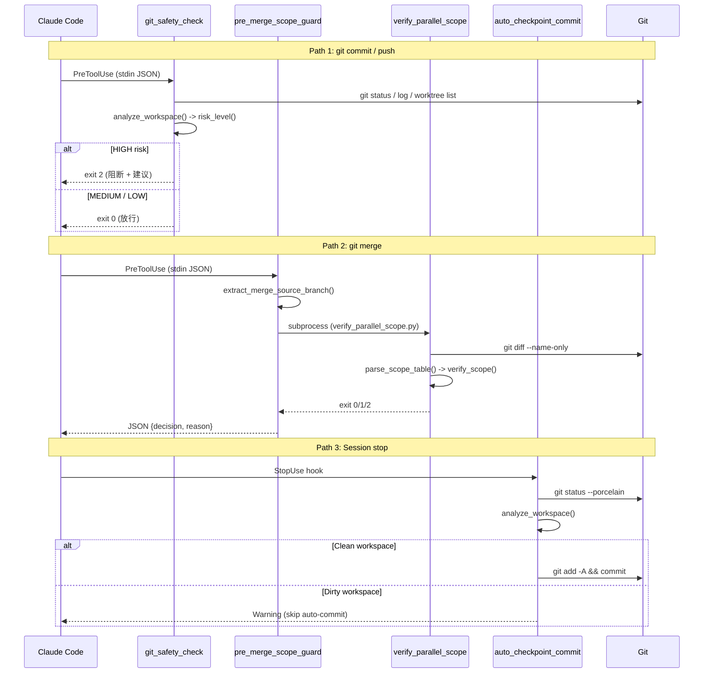
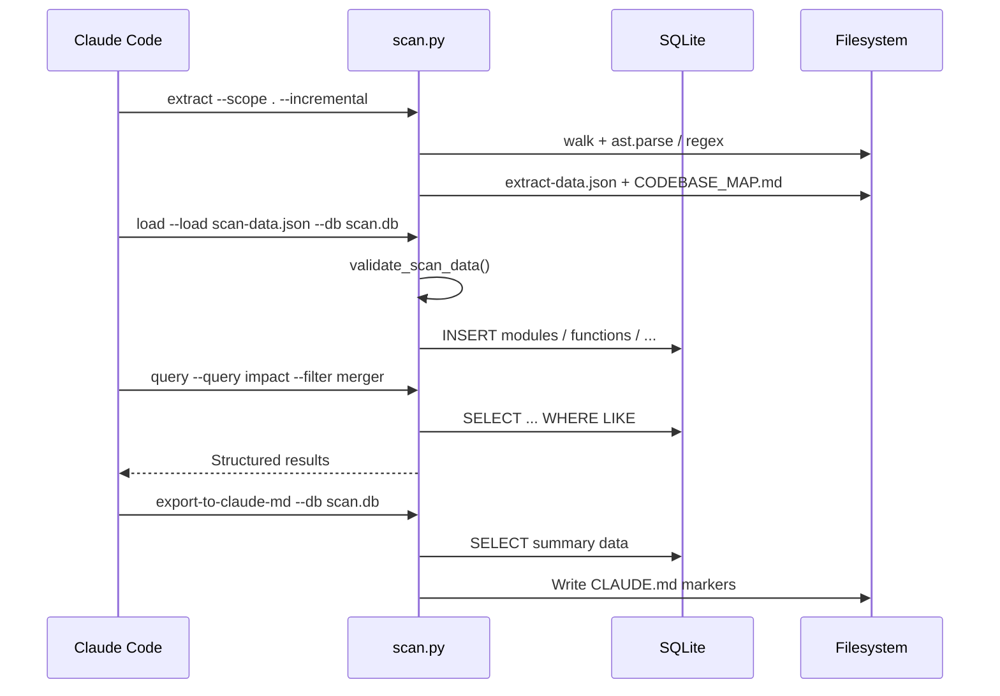

# 03 API 表面文档

> Hook 脚本 + scan.py 共 8 子命令、~60 个公开函数

## 目录

- [1 概览图](#1-概览图)
- [2 Hook 脚本 API](#2-hook-脚本-api)
  - [2.1 git_safety_check.py](#21-git_safety_checkpy)
  - [2.2 pre_merge_scope_guard.py](#22-pre_merge_scope_guardpy)
  - [2.3 auto_checkpoint_commit.py](#23-auto_checkpoint_commitpy)
  - [2.4 verify_parallel_scope.py](#24-verify_parallel_scopepy)
- [3 scan.py 子命令 API](#3-scanpy-子命令-api)
- [4 关键调用链](#4-关键调用链)
- [5 兼容性策略](#5-兼容性策略)

## 1 概览图

项目公开 API 分两大类：**Hook 脚本**（Claude Code 触发）和 **scan.py 子命令**（CLI/Codex 调度），共约 60 个公开函数。

<svg viewBox="0 0 800 320" xmlns="http://www.w3.org/2000/svg">
<defs>
<marker id="arw" markerWidth="8" markerHeight="8" refX="6" refY="3" orient="auto">
<path d="M0,0 L0,6 L8,3 z" fill="#555"/>
</marker>
</defs>
<g id="background">
<rect x="10" y="10" width="230" height="300" rx="8" fill="#e8f4fd" stroke="#4a9edd" stroke-width="1.5"/>
<text x="125" y="35" text-anchor="middle" font-size="13" font-weight="bold" fill="#1a5f8a">Hook 脚本 API</text>
<rect x="20" y="50" width="210" height="55" rx="6" fill="#ffffff" stroke="#4a9edd" stroke-width="1"/>
<text x="125" y="70" text-anchor="middle" font-size="11" font-weight="bold" fill="#333">git_safety_check.py</text>
<text x="125" y="86" text-anchor="middle" font-size="9" fill="#666">analyze_workspace / risk_level / build_message</text>
<text x="125" y="98" text-anchor="middle" font-size="8" fill="#4a9edd">PreToolUse | git commit/push</text>
<rect x="20" y="115" width="210" height="55" rx="6" fill="#ffffff" stroke="#4a9edd" stroke-width="1"/>
<text x="125" y="135" text-anchor="middle" font-size="11" font-weight="bold" fill="#333">pre_merge_scope_guard.py</text>
<text x="125" y="151" text-anchor="middle" font-size="9" fill="#666">read_input_payload / run_scope_verify</text>
<text x="125" y="163" text-anchor="middle" font-size="8" fill="#4a9edd">PreToolUse | git merge</text>
<rect x="20" y="180" width="210" height="55" rx="6" fill="#ffffff" stroke="#4a9edd" stroke-width="1"/>
<text x="125" y="200" text-anchor="middle" font-size="11" font-weight="bold" fill="#333">auto_checkpoint_commit.py</text>
<text x="125" y="216" text-anchor="middle" font-size="9" fill="#666">analyze_workspace / create_zip_backup / do_commit</text>
<text x="125" y="228" text-anchor="middle" font-size="8" fill="#4a9edd">Stop | 会话结束</text>
<rect x="20" y="245" width="210" height="55" rx="6" fill="#ffffff" stroke="#4a9edd" stroke-width="1"/>
<text x="125" y="265" text-anchor="middle" font-size="11" font-weight="bold" fill="#333">verify_parallel_scope.py</text>
<text x="125" y="281" text-anchor="middle" font-size="9" fill="#666">parse_scope_table / build_scope_policy / verify_scope</text>
<text x="125" y="293" text-anchor="middle" font-size="8" fill="#4a9edd">委托调用 | exit 0/1/2</text>
<rect x="260" y="10" width="530" height="300" rx="8" fill="#e8fde8" stroke="#4add6a" stroke-width="1.5"/>
<text x="525" y="35" text-anchor="middle" font-size="13" font-weight="bold" fill="#1a7a2a">scan.py 子命令（8 个）</text>
<rect x="270" y="50" width="245" height="40" rx="6" fill="#ffffff" stroke="#4add6a" stroke-width="1"/>
<text x="392" y="67" text-anchor="middle" font-size="11" font-weight="bold" fill="#333">scan</text>
<text x="392" y="82" text-anchor="middle" font-size="9" fill="#666">初始化目录 + scan.db</text>
<rect x="525" y="50" width="250" height="40" rx="6" fill="#ffffff" stroke="#4add6a" stroke-width="1"/>
<text x="650" y="67" text-anchor="middle" font-size="11" font-weight="bold" fill="#333">extract (--incremental)</text>
<text x="650" y="82" text-anchor="middle" font-size="9" fill="#666">AST/regex 提取，零 AI token</text>
<rect x="270" y="100" width="245" height="40" rx="6" fill="#ffffff" stroke="#4add6a" stroke-width="1"/>
<text x="392" y="117" text-anchor="middle" font-size="11" font-weight="bold" fill="#333">load</text>
<text x="392" y="132" text-anchor="middle" font-size="9" fill="#666">JSON → SQLite + schema 校验</text>
<rect x="525" y="100" width="250" height="40" rx="6" fill="#ffffff" stroke="#4add6a" stroke-width="1"/>
<text x="650" y="117" text-anchor="middle" font-size="11" font-weight="bold" fill="#333">query (fuzzy + 特殊模式)</text>
<text x="650" y="132" text-anchor="middle" font-size="9" fill="#666">impact / callers / risks / module-deps</text>
<rect x="270" y="150" width="245" height="40" rx="6" fill="#ffffff" stroke="#4add6a" stroke-width="1"/>
<text x="392" y="167" text-anchor="middle" font-size="11" font-weight="bold" fill="#333">verify (--dir --mode)</text>
<text x="392" y="182" text-anchor="middle" font-size="9" fill="#666">产物完整性校验</text>
<rect x="525" y="150" width="250" height="40" rx="6" fill="#ffffff" stroke="#4add6a" stroke-width="1"/>
<text x="650" y="167" text-anchor="middle" font-size="11" font-weight="bold" fill="#333">measure</text>
<text x="650" y="182" text-anchor="middle" font-size="9" fill="#666">代码库规模统计 JSON</text>
<rect x="270" y="200" width="245" height="40" rx="6" fill="#ffffff" stroke="#4add6a" stroke-width="1"/>
<text x="392" y="217" text-anchor="middle" font-size="11" font-weight="bold" fill="#333">merge</text>
<text x="392" y="232" text-anchor="middle" font-size="9" fill="#666">并行 Codex 结果汇总</text>
<rect x="525" y="200" width="250" height="40" rx="6" fill="#ffffff" stroke="#4add6a" stroke-width="1"/>
<text x="650" y="217" text-anchor="middle" font-size="11" font-weight="bold" fill="#333">export-to-claude-md</text>
<text x="650" y="232" text-anchor="middle" font-size="9" fill="#666">scan.db 摘要 → CLAUDE.md</text>
<rect x="270" y="255" width="505" height="40" rx="6" fill="#fdf5e8" stroke="#ddaa4a" stroke-width="1"/>
<text x="522" y="272" text-anchor="middle" font-size="11" font-weight="bold" fill="#333">输出产物</text>
<text x="522" y="287" text-anchor="middle" font-size="9" fill="#666">scan.db (SQLite) | scan-data.json | CODEBASE_MAP.md | docs-index.md | CLAUDE.md</text>
</g>
<g id="edges">
<line x1="230" y1="270" x2="260" y2="270" stroke="#555" stroke-width="1.5" marker-end="url(#arw)"/>
<line x1="392" y1="90" x2="392" y2="98" stroke="#aaa" stroke-width="1" stroke-dasharray="4"/>
<line x1="650" y1="90" x2="650" y2="98" stroke="#aaa" stroke-width="1" stroke-dasharray="4"/>
</g>
<g id="nodes"/>
<g id="labels"/>
</svg>

## 2 Hook 脚本 API

### 2.1 git_safety_check.py

**触发时机**: PreToolUse，匹配 `Bash(git commit*)` / `Bash(git push*)`

| 函数 | 签名 | 返回值 | 说明 |
|------|------|--------|------|
| `analyze_workspace` | `(cwd: str\|None) -> dict` | 工作区状态字典 | 含冲突、stash、worktree、mtime 跨度分析 |
| `risk_level` | `(ws: dict) -> tuple[str, list[dict]]` | `(level, issues)` | HIGH/MEDIUM/LOW 风险等级 + 问题列表 |
| `build_message` | `(ws, level, issues, cmd) -> str` | 格式化建议文本 | 场景化处理方案（worktree 感知） |
| `is_git_write_op` | `(tool_input: dict) -> tuple[bool, str]` | `(is_dangerous, cmd)` | 正则匹配 git 写操作 |
| `run_git` | `(*args: str, cwd) -> tuple[str, int]` | `(stdout, returncode)` | 底层 git 命令执行 |

**风险评分规则**（分数越高越危险）：

| 加分项 | 分值 | 含义 |
|--------|------|------|
| `conflict_files` | +100 | 冲突标记未解决 |
| `behind_remote` | +40 | 本地落后远端 |
| `partial_stage` | +35 | 暂存不完整 |
| `multi_tool_edit` | +25 | 多工具交替修改（mtime 跨度 >3min） |
| `stash_shared_wt` | +15 | stash 跨 worktree 共享 |
| `stash_backlog` | +10 | 积压 >=2 个 stash |
| `untracked_many` | +8 | 未跟踪文件 >5 |

**退出码**: score >= 60 → HIGH (exit 2 阻断); >= 25 → MEDIUM (exit 0 警告); < 25 → LOW (exit 0 静默)

### 2.2 pre_merge_scope_guard.py

**触发时机**: PreToolUse，匹配 `Bash(git merge*)`

| 函数 | 签名 | 返回值 | 说明 |
|------|------|--------|------|
| `read_input_payload` | `() -> dict` | Hook 输入字典 | 优先 stdin，回退 `CLAUDE_TOOL_INPUT` 环境变量 |
| `run_scope_verify` | `(project_dir, table_path, task_name, base_ref, target_ref) -> tuple[int, str]` | `(exit_code, output)` | 委托 `verify_parallel_scope.py` 执行校验 |
| `output_decision` | `(decision: str, reason: str) -> int` | 0 | 输出 JSON 决策 |
| `resolve_table_path` | `(project_dir, source_branch, explicit_table) -> Path` | 表路径 | 逐级推断：显式指定 → PARALLEL_SCOPE_TABLE → 分支推断 |
| `resolve_task_name` | `(table_path, source_branch, explicit_task) -> str` | 任务名 | 分支名解析 → 环境变量 → 表内唯一任务 |
| `extract_merge_source_branch` | `(command_text: str) -> str` | 分支名 | shlex 分词后提取 merge 目标 |

**决策输出格式**:

```json
{"decision": "approve|block", "reason": "原因说明"}
```

### 2.3 auto_checkpoint_commit.py

**触发时机**: Stop hook（会话结束时）

| 函数 | 签名 | 返回值 | 说明 |
|------|------|--------|------|
| `analyze_workspace` | `(d: Path, wt_info: dict\|None) -> dict` | 状态字典 | 含多作者检测、陈旧变更、冲突标记检测 |
| `create_zip_backup` | `(d: Path, changed_files: list[str]) -> str\|None` | zip 路径 | 打包变更文件 + manifest 到 `.claude/backups/` |
| `do_commit` | `(d: Path, message: str) -> bool` | 是否成功 | `git add -A` + `git commit` |
| `detect_worktree` | `(d: Path) -> dict` | worktree 状态 | 返回 `in_worktree` / `worktree_count` / `is_bare_project` |

**安全阈值**:

```python
MAX_CHANGED_FILES_AUTO = 10   # 非 worktree 最大文件数
MAX_STREAK_AGE_MINUTES = 120  # 陈旧变更阈值（分钟）
# worktree 内放宽为 20（隔离环境风险更低）
```

### 2.4 verify_parallel_scope.py

**触发时机**: 被 `pre_merge_scope_guard.py` 通过 `subprocess.run()` 调用

| 函数 | 签名 | 返回值 | 说明 |
|------|------|--------|------|
| `parse_scope_table` | `(table_path: Path) -> list[dict]` | 任务行列表 | 解析 Markdown 表格（任务/允许路径/共享文件/owner） |
| `build_scope_policy` | `(rows, task_name) -> tuple[list, set, set]` | `(patterns, exact, forbidden)` | glob 模式 + 精确匹配 + 禁止集 |
| `verify_scope` | `(changed_files, patterns, exact, forbidden) -> tuple[list, list]` | `(forbidden_hits, out_of_scope)` | 范围违规检测 |
| `run_git_diff` | `(base_ref, target_ref) -> list[str]` | 文件路径列表 | `git diff --name-only base...target` |

**退出码**: 0 = 通过, 1 = 范围违规, 2 = 错误（表不存在/ref 无效）

## 3 scan.py 子命令 API

共 8 个子命令，全部支持 `--help` 查看参数。

| 子命令 | 必填参数 | 核心行为 | 输出 |
|--------|---------|---------|------|
| `scan` | `--mode` `--scope` `--topic` | 初始化目录 + scan.db | `docs/scan/YYYY-MM-DD-topic/` |
| `extract` | `--scope` `--topic` | AST/regex 结构提取，可选 `--incremental` | `extract-data.json` + `CODEBASE_MAP.md` |
| `load` | `--load` `--db` | JSON → SQLite，含 schema 校验 | scan.db |
| `query` | `--query` `--db` | 模糊搜索 + 4 种特殊模式 | 终端输出 |
| `verify` | `--dir` `--mode`(可选) | 产物完整性校验 | exit 0/1/2 |
| `measure` | `--scope` | 文件数/LOC/字节数统计 | JSON (stdout 或文件) |
| `merge` | `--inputs` `--output` | 并行 Codex scan-data 合并 | 合并后 JSON |
| `export-to-claude-md` | `--db` | scan.db 摘要写入 CLAUDE.md | CLAUDE.md |

**query 特殊模式**:

| 模式 | 需 `--filter` | 查询内容 |
|------|--------------|---------|
| `impact` | 是 | 函数 + 影响矩阵 |
| `callers` | 是 | 调用链（正向+反向） |
| `risks` | 否 | 高风险变更点 (high/critical) |
| `module-deps` | 是 | 模块依赖关系 |

## 4 关键调用链

以下 sequenceDiagram 展示三条核心 Hook 触发路径。



**scan pipeline 调用链**（Codex 调度场景）:



## 5 兼容性策略

所有 scan.py 子命令保持**向后兼容**的 CLI 参数：

1. 新增参数均为可选，带合理默认值
2. 已有参数不更名、不删减
3. JSON 输出新增字段追加到末尾，不改变已有字段语义
4. SQLite schema 仅新增表/列，不修改已有列类型
5. exit code 语义不变，新增错误类型使用未占用的码值

**已知兼容处理**:

| 场景 | 处理方式 |
|------|---------|
| `scan-data.json` 旧字段名 | `get_module_rows()` / `get_function_rows()` 兼容新旧字段名 |
| tree-sitter 不可用 | `_extract_js_ts()` 自动降级为增强正则 |
| stdin 输入缺失 | `read_input_payload()` 回退到 `CLAUDE_TOOL_INPUT` 环境变量 |
| worktree 内操作 | 阈值自动放宽（文件数 x2），建议 patch 代替 stash |
