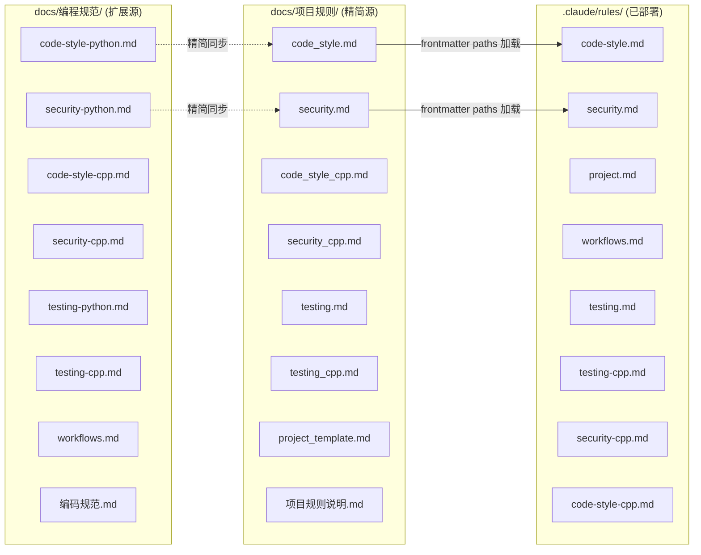
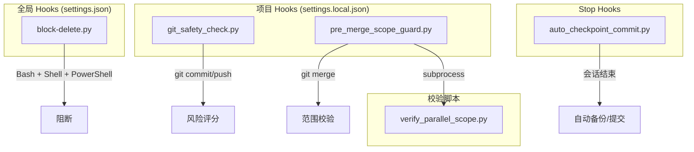

# 04 参考文档约束

> 三层规则体系 + Hook 安全链 + 5 处已知文档冲突

## 目录

- [1 约束分类总览](#1-约束分类总览)
- [2 规则三源体系](#2-规则三源体系)
- [3 工作流路由约束](#3-工作流路由约束)
- [4 硬性限制清单](#4-硬性限制清单)
- [5 Hook 链约束](#5-hook-链约束)
- [6 lessons.md 迁移状态](#6-lessonsmd-迁移状态)
- [7 FBM 双系统约束](#7-fbm-双系统约束)
- [8 文档冲突关系](#8-文档冲突关系)

## 1 约束分类总览

本项目存在多层嵌套的规则体系，改动任何约束文件都需考虑跨层影响。下图为约束类型与受影响模块的矩阵。

<svg viewBox="0 0 780 340" xmlns="http://www.w3.org/2000/svg">
<defs>
<marker id="arw2" markerWidth="8" markerHeight="8" refX="6" refY="3" orient="auto">
<path d="M0,0 L0,6 L8,3 z" fill="#555"/>
</marker>
</defs>
<g id="background">
<rect x="0" y="0" width="780" height="340" rx="8" fill="#f8f9fa"/>
<text x="390" y="25" text-anchor="middle" font-size="14" font-weight="bold" fill="#333">约束类型 × 受影响模块 矩阵</text>
<text x="50" y="55" text-anchor="middle" font-size="10" font-weight="bold" fill="#555">约束类型</text>
<text x="280" y="55" text-anchor="middle" font-size="10" font-weight="bold" fill="#555">Claude Code</text>
<text x="400" y="55" text-anchor="middle" font-size="10" font-weight="bold" fill="#555">Codex MCP</text>
<text x="520" y="55" text-anchor="middle" font-size="10" font-weight="bold" fill="#555">Git 操作</text>
<text x="640" y="55" text-anchor="middle" font-size="10" font-weight="bold" fill="#555">scan.py</text>
<text x="750" y="55" text-anchor="middle" font-size="10" font-weight="bold" fill="#555">代码生成</text>
<rect x="10" y="65" width="180" height="35" rx="4" fill="#e8f4fd" stroke="#4a9edd" stroke-width="1"/>
<text x="100" y="87" text-anchor="middle" font-size="10" fill="#333">规则三源体系</text>
<rect x="200" y="65" width="100" height="35" rx="4" fill="#4a9edd" stroke="#4a9edd" stroke-width="1"/>
<text x="250" y="87" text-anchor="middle" font-size="10" fill="#fff">frontmatter</text>
<rect x="310" y="65" width="100" height="35" rx="4" fill="#4a9edd" stroke="#4a9edd" stroke-width="1"/>
<text x="360" y="87" text-anchor="middle" font-size="10" fill="#fff">Prompt 注入</text>
<rect x="420" y="65" width="100" height="35" rx="4" fill="#e0e0e0" stroke="#ccc" stroke-width="1"/>
<rect x="530" y="65" width="100" height="35" rx="4" fill="#e0e0e0" stroke="#ccc" stroke-width="1"/>
<rect x="640" y="65" width="100" height="35" rx="4" fill="#4a9edd" stroke="#4a9edd" stroke-width="1"/>
<text x="690" y="87" text-anchor="middle" font-size="10" fill="#fff">style/lint</text>
<rect x="10" y="110" width="180" height="35" rx="4" fill="#e8fde8" stroke="#4add6a" stroke-width="1"/>
<text x="100" y="132" text-anchor="middle" font-size="10" fill="#333">工作流路由</text>
<rect x="200" y="110" width="100" height="35" rx="4" fill="#4add6a" stroke="#4add6a" stroke-width="1"/>
<text x="250" y="132" text-anchor="middle" font-size="10" fill="#fff">场景分发</text>
<rect x="310" y="110" width="100" height="35" rx="4" fill="#4add6a" stroke="#4add6a" stroke-width="1"/>
<text x="360" y="132" text-anchor="middle" font-size="10" fill="#fff">模式选择</text>
<rect x="420" y="110" width="100" height="35" rx="4" fill="#e0e0e0" stroke="#ccc" stroke-width="1"/>
<rect x="530" y="110" width="100" height="35" rx="4" fill="#e0e0e0" stroke="#ccc" stroke-width="1"/>
<rect x="640" y="110" width="100" height="35" rx="4" fill="#e0e0e0" stroke="#ccc" stroke-width="1"/>
<rect x="10" y="155" width="180" height="35" rx="4" fill="#fdf5e8" stroke="#ddaa4a" stroke-width="1"/>
<text x="100" y="177" text-anchor="middle" font-size="10" fill="#333">硬性限制 (diff/params)</text>
<rect x="200" y="155" width="100" height="35" rx="4" fill="#ddaa4a" stroke="#ddaa4a" stroke-width="1"/>
<text x="250" y="177" text-anchor="middle" font-size="10" fill="#fff">Phase 门禁</text>
<rect x="310" y="155" width="100" height="35" rx="4" fill="#ddaa4a" stroke="#ddaa4a" stroke-width="1"/>
<text x="360" y="177" text-anchor="middle" font-size="10" fill="#fff">4 必填参数</text>
<rect x="420" y="155" width="100" height="35" rx="4" fill="#ddaa4a" stroke="#ddaa4a" stroke-width="1"/>
<text x="470" y="177" text-anchor="middle" font-size="10" fill="#fff">scope 排除</text>
<rect x="530" y="155" width="100" height="35" rx="4" fill="#e0e0e0" stroke="#ccc" stroke-width="1"/>
<rect x="640" y="155" width="100" height="35" rx="4" fill="#e0e0e0" stroke="#ccc" stroke-width="1"/>
<rect x="10" y="200" width="180" height="35" rx="4" fill="#fde8e8" stroke="#dd4a4a" stroke-width="1"/>
<text x="100" y="222" text-anchor="middle" font-size="10" fill="#333">Hook 安全链</text>
<rect x="200" y="200" width="100" height="35" rx="4" fill="#e0e0e0" stroke="#ccc" stroke-width="1"/>
<rect x="310" y="200" width="100" height="35" rx="4" fill="#e0e0e0" stroke="#ccc" stroke-width="1"/>
<rect x="420" y="200" width="100" height="35" rx="4" fill="#dd4a4a" stroke="#dd4a4a" stroke-width="1"/>
<text x="470" y="222" text-anchor="middle" font-size="10" fill="#fff">强制拦截</text>
<rect x="530" y="200" width="100" height="35" rx="4" fill="#e0e0e0" stroke="#ccc" stroke-width="1"/>
<rect x="640" y="200" width="100" height="35" rx="4" fill="#e0e0e0" stroke="#ccc" stroke-width="1"/>
<rect x="10" y="245" width="180" height="35" rx="4" fill="#f0e8fd" stroke="#9a4add" stroke-width="1"/>
<text x="100" y="267" text-anchor="middle" font-size="10" fill="#333">FBM 双系统</text>
<rect x="200" y="245" width="100" height="35" rx="4" fill="#9a4add" stroke="#9a4add" stroke-width="1"/>
<text x="250" y="267" text-anchor="middle" font-size="10" fill="#fff">Grep 搜索</text>
<rect x="310" y="245" width="100" height="35" rx="4" fill="#e0e0e0" stroke="#ccc" stroke-width="1"/>
<rect x="420" y="245" width="100" height="35" rx="4" fill="#e0e0e0" stroke="#ccc" stroke-width="1"/>
<rect x="530" y="245" width="100" height="35" rx="4" fill="#e0e0e0" stroke="#ccc" stroke-width="1"/>
<rect x="640" y="245" width="100" height="35" rx="4" fill="#e0e0e0" stroke="#ccc" stroke-width="1"/>
<rect x="10" y="290" width="180" height="35" rx="4" fill="#e8f4fd" stroke="#4a9edd" stroke-width="1"/>
<text x="100" y="312" text-anchor="middle" font-size="10" fill="#333">lessons 迁移</text>
<rect x="200" y="290" width="100" height="35" rx="4" fill="#4a9edd" stroke="#4a9edd" stroke-width="1"/>
<text x="250" y="312" text-anchor="middle" font-size="10" fill="#fff">路径重定向</text>
<rect x="310" y="290" width="100" height="35" rx="4" fill="#e0e0e0" stroke="#ccc" stroke-width="1"/>
<rect x="420" y="290" width="100" height="35" rx="4" fill="#e0e0e0" stroke="#ccc" stroke-width="1"/>
<rect x="530" y="290" width="100" height="35" rx="4" fill="#e0e0e0" stroke="#ccc" stroke-width="1"/>
<rect x="640" y="290" width="100" height="35" rx="4" fill="#e0e0e0" stroke="#ccc" stroke-width="1"/>
<rect x="760" y="65" width="15" height="260" rx="4" fill="#e0e0e0"/>
<text x="760" y="200" text-anchor="middle" font-size="8" fill="#999" transform="rotate(-90,760,200)">低影响</text>
<rect x="760" y="65" width="15" height="120" rx="4" fill="#4a9edd" opacity="0.3"/>
<rect x="760" y="65" width="15" height="60" rx="4" fill="#dd4a4a" opacity="0.3"/>
</g>
<g id="edges"/>
<g id="nodes"/>
<g id="labels">
<rect x="690" y="300" width="12" height="12" rx="2" fill="#dd4a4a"/>
<text x="708" y="310" font-size="9" fill="#555">高影响</text>
<rect x="760" y="300" width="12" height="12" rx="2" fill="#e0e0e0"/>
<text x="778" y="310" font-size="9" fill="#555">低影响</text>
</g>
</svg>

## 2 规则三源体系

项目规则分布在三个目录层级，形成**精简→部署→扩展**的递进关系。

**三源关系公式**：

`docs/项目规则/` (精简) ≈ `.claude/rules/` (已部署) ⊂ `docs/编程规范/` (扩展)

- `docs/项目规则/` 与 `.claude/rules/` 内容应对等，但**不保证实时同步**
- `docs/编程规范/` 包含代码示例和行业标准，是完整参考源
- **风险点**: `.claude/rules/` 可能滞后于 `docs/编程规范/` 中的最新规则
- Claude Code 通过 `.claude/rules/` 下的 `paths` frontmatter 字段控制适用范围

## 3 工作流路由约束

`CLAUDE.md` 定义了 8 种场景路由，按优先级从高到低匹配：

| 优先级 | 场景 | 触发关键词 | 工作流文档 |
|--------|------|-----------|-----------|
| 1 | Debug | bug / 错误 / 测试失败 | `claude-workflow-debug.md` |
| 2 | Code Review | review / 审查 / 代码质量 | `claude-workflow-review.md` |
| 3 | C++ 编译 | build / CMake + C++ | `claude-workflow-cpp-build.md` |
| 4 | C++ 测试 | gtest + C++ | `claude-workflow-cpp-test.md` |
| 5 | 研究调研 | 调研 / 对比 / 选型 / 搜索 | `claude-workflow-research.md` |
| 6 | 大型代码库 | >20 文件 / 3+ 模块 / 重构迁移 | `claude-workflow-largebase.md` |
| 7 | 并行开发 | >=2 可解耦任务 | `claude-workflow-parallel.md` |
| 8 | 复杂开发 | 不满足简单标准且未命中上述 | `claude-workflow-complex.md` |
| 9 | 简单开发 | 满足全部 5 条简单标准 | 无需读文档 |

**路由规则**: 优先级高的先匹配，命中后不再检查低优先级路由。Debug > Research > Largebase > Complex > Simple。

## 4 硬性限制清单

| 约束 | 值 | 来源 | 违反后果 |
|------|-----|------|---------|
| 单次 diff | <= 200 行 | `claude-workflow-constants.md` | 必须拆分任务 |
| Codex 必填参数 | model + sandbox + approval-policy + reasoning | `claude-workflow-constants.md` | 调用失败 |
| scope 排除目录 | `.git/` `node_modules/` `.venv/` `__pycache__/` | `scan.py` `EXTRACT_SKIP_DIRS` | 自动跳过 |
| 函数行数上限 | Python <= 50 行, C++ <= 80 行 | `.claude/rules/code-style.md` | Review 不通过 |
| Git 禁止操作 | `stash` `reset --hard` `push --force` `checkout .` `clean -f` | `claude-workflow-constants.md` | Hook 阻断 |
| 文件删除禁令 | `rm -rf` / `del` / `rd /s` / `Remove-Item -Recurse` | `claude-workflow-constants.md` | Hook 阻断 |
| Hook 阻断 exit code | 2 | `git_safety_check.py` | Claude Code 重新规划 |

## 5 Hook 链约束

Hook 脚本形成**不可绕过的安全链**，三层独立注册、互不依赖。

**不可绕过原因**:

- `block-delete.py` 注册在全局 PreToolUse，匹配所有 shell 类型
- `git_safety_check.py` 匹配 `Bash(git commit*)` / `Bash(git push*)`
- `pre_merge_scope_guard.py` 匹配 `Bash(git merge*)`，内部委托 `verify_parallel_scope.py`
- 三个 hook 独立注册，绕过一个不影响其余

## 6 lessons.md 迁移状态

| 状态 | 路径 | 说明 |
|------|------|------|
| 已废弃（保留重定向） | `tasks/lessons.md` | 内容已迁移，文件含重定向通知 |
| 新位置 | `.claude/memory/lessons/` | FBM 记忆系统管理 |

**风险**: `claude-workflow-constants.md` 仍引用 `tasks/lessons.md` 作为固定路径，与新位置不一致。新会话若读到旧引用，可能写入错误位置。

## 7 FBM 双系统约束

项目中存在两套独立的记忆系统，各自运行，不互相干扰：

| 系统 | 技术 | 存储位置 | 搜索方式 | 适用场景 |
|------|------|---------|---------|---------|
| `.claude/fbm/` | TypeScript + 向量数据库 | `.claude/fbm/` | 语义搜索 | 大规模经验检索 |
| `.claude/skills/memory/` | CC 原生工具 (Read/Write/Grep) | `.claude/memory/` | Grep 搜索 | 轻量级跨会话记忆 |

**约束规则**:
- 两套系统独立运行，不要求互相同步
- `.claude/skills/memory/` 是主系统（CC 原生，零外部依赖）
- `.claude/fbm/` 是增强系统（需要 TypeScript 运行时）
- 写入记忆时选择任一系统即可

## 8 文档冲突关系

以下 SVG 展示 5 处已知文档冲突及其影响路径。

<svg viewBox="0 0 720 280" xmlns="http://www.w3.org/2000/svg">
<defs>
<marker id="arw3" markerWidth="8" markerHeight="8" refX="6" refY="3" orient="auto">
<path d="M0,0 L0,6 L8,3 z" fill="#dd4a4a"/>
</marker>
<marker id="arw3g" markerWidth="8" markerHeight="8" refX="6" refY="3" orient="auto">
<path d="M0,0 L0,6 L8,3 z" fill="#ddaa4a"/>
</marker>
</defs>
<g id="background">
<rect x="10" y="10" width="700" height="260" rx="8" fill="#fff5f5" stroke="#dd4a4a" stroke-width="1" opacity="0.3"/>
<text x="360" y="30" text-anchor="middle" font-size="13" font-weight="bold" fill="#dd4a4a">文档冲突关系图</text>
<rect x="20" y="45" width="180" height="35" rx="6" fill="#ffffff" stroke="#4a9edd" stroke-width="1.5"/>
<text x="110" y="67" text-anchor="middle" font-size="10" font-weight="bold" fill="#333">docs/编程规范/</text>
<rect x="20" y="95" width="180" height="35" rx="6" fill="#ffffff" stroke="#4add6a" stroke-width="1.5"/>
<text x="110" y="117" text-anchor="middle" font-size="10" font-weight="bold" fill="#333">.claude/rules/</text>
<rect x="250" y="45" width="220" height="35" rx="6" fill="#ffffff" stroke="#dd4a4a" stroke-width="1.5"/>
<text x="360" y="67" text-anchor="middle" font-size="10" font-weight="bold" fill="#333">冲突1: 扩展规则未同步</text>
<text x="360" y="67" text-anchor="middle" font-size="10" font-weight="bold" fill="#333"></text>
<rect x="490" y="45" width="210" height="35" rx="6" fill="#fff3cd" stroke="#ddaa4a" stroke-width="1"/>
<text x="595" y="61" text-anchor="middle" font-size="9" fill="#666">编程规范有代码示例和</text>
<text x="595" y="74" text-anchor="middle" font-size="9" fill="#666">行业标准未部署到 rules/</text>
<rect x="250" y="95" width="220" height="35" rx="6" fill="#ffffff" stroke="#dd4a4a" stroke-width="1.5"/>
<text x="360" y="117" text-anchor="middle" font-size="10" font-weight="bold" fill="#333">冲突2: 旧路径引用</text>
<rect x="490" y="95" width="210" height="35" rx="6" fill="#fff3cd" stroke="#ddaa4a" stroke-width="1"/>
<text x="595" y="111" text-anchor="middle" font-size="9" fill="#666">CLAUDE.md 引用</text>
<text x="595" y="124" text-anchor="middle" font-size="9" fill="#666">.claude/instructions/ (已迁移)</text>
<rect x="20" y="150" width="180" height="35" rx="6" fill="#ffffff" stroke="#9a4add" stroke-width="1.5"/>
<text x="110" y="172" text-anchor="middle" font-size="10" font-weight="bold" fill="#333">tasks/lessons.md</text>
<rect x="20" y="200" width="180" height="35" rx="6" fill="#ffffff" stroke="#4add6a" stroke-width="1.5"/>
<text x="110" y="222" text-anchor="middle" font-size="10" font-weight="bold" fill="#333">.claude/memory/lessons/</text>
<rect x="250" y="150" width="220" height="35" rx="6" fill="#ffffff" stroke="#dd4a4a" stroke-width="1.5"/>
<text x="360" y="172" text-anchor="middle" font-size="10" font-weight="bold" fill="#333">冲突3: lessons 双引用</text>
<rect x="490" y="150" width="210" height="35" rx="6" fill="#fff3cd" stroke="#ddaa4a" stroke-width="1"/>
<text x="595" y="166" text-anchor="middle" font-size="9" fill="#666">constants.md 同时引用</text>
<text x="595" y="179" text-anchor="middle" font-size="9" fill="#666">旧路径和新路径</text>
<rect x="250" y="200" width="220" height="35" rx="6" fill="#ffffff" stroke="#ddaa4a" stroke-width="1.5"/>
<text x="360" y="222" text-anchor="middle" font-size="10" font-weight="bold" fill="#333">冲突4: 子文档索引路径</text>
<rect x="490" y="200" width="210" height="35" rx="6" fill="#fff3cd" stroke="#ddaa4a" stroke-width="1"/>
<text x="595" y="216" text-anchor="middle" font-size="9" fill="#666">CLAUDE.md 子文档索引</text>
<text x="595" y="229" text-anchor="middle" font-size="9" fill="#666">部分路径仍指向旧位置</text>
<rect x="250" y="243" width="220" height="35" rx="6" fill="#e0e0e0" stroke="#ccc" stroke-width="1"/>
<text x="360" y="265" text-anchor="middle" font-size="10" font-weight="bold" fill="#333">冲突5: 章节名引用</text>
</g>
<g id="edges">
<line x1="200" y1="62" x2="248" y2="62" stroke="#dd4a4a" stroke-width="1.5" marker-end="url(#arw3)"/>
<line x1="470" y1="62" x2="488" y2="62" stroke="#dd4a4a" stroke-width="1.5" marker-end="url(#arw3)"/>
<line x1="200" y1="112" x2="248" y2="112" stroke="#dd4a4a" stroke-width="1.5" marker-end="url(#arw3)"/>
<line x1="470" y1="112" x2="488" y2="112" stroke="#dd4a4a" stroke-width="1.5" marker-end="url(#arw3)"/>
<line x1="200" y1="167" x2="248" y2="167" stroke="#dd4a4a" stroke-width="1.5" marker-end="url(#arw3)"/>
<line x1="470" y1="167" x2="488" y2="167" stroke="#dd4a4a" stroke-width="1.5" marker-end="url(#arw3)"/>
<line x1="110" y1="185" x2="110" y2="198" stroke="#9a4add" stroke-width="1.5" stroke-dasharray="4"/>
<line x1="470" y1="217" x2="488" y2="217" stroke="#ddaa4a" stroke-width="1" marker-end="url(#arw3g)"/>
</g>
<g id="nodes"/>
<g id="labels">
<rect x="20" y="248" width="80" height="20" rx="3" fill="#fff3cd" stroke="#ddaa4a" stroke-width="1"/>
<text x="60" y="262" text-anchor="middle" font-size="9" fill="#ddaa4a">MEDIUM</text>
<rect x="110" y="248" width="60" height="20" rx="3" fill="#d4edda" stroke="#28a745" stroke-width="1"/>
<text x="140" y="262" text-anchor="middle" font-size="9" fill="#28a745">LOW</text>
<text x="200" y="262" font-size="9" fill="#999">风险等级</text>
</g>
</svg>

**冲突汇总表**:

| # | 冲突 | 位置 | 风险 | 建议处理 |
|---|------|------|------|---------|
| 1 | 扩展规则未同步 | `docs/编程规范/` vs `.claude/rules/` | MEDIUM | 定期同步，或自动化 diff 检查 |
| 2 | 旧路径引用 | `CLAUDE.md` 扫描摘要 | LOW | `.claude/instructions/` → `.claude/rules/` |
| 3 | lessons 双引用 | `claude-workflow-constants.md` | MEDIUM | 统一到 `.claude/memory/lessons/` |
| 4 | 子文档索引路径 | `CLAUDE.md` 子文档索引 | LOW | 批量替换旧路径 |
| 5 | 章节名引用 | 多个工作流文件 | LOW | 保持章节名稳定，避免重命名 |
