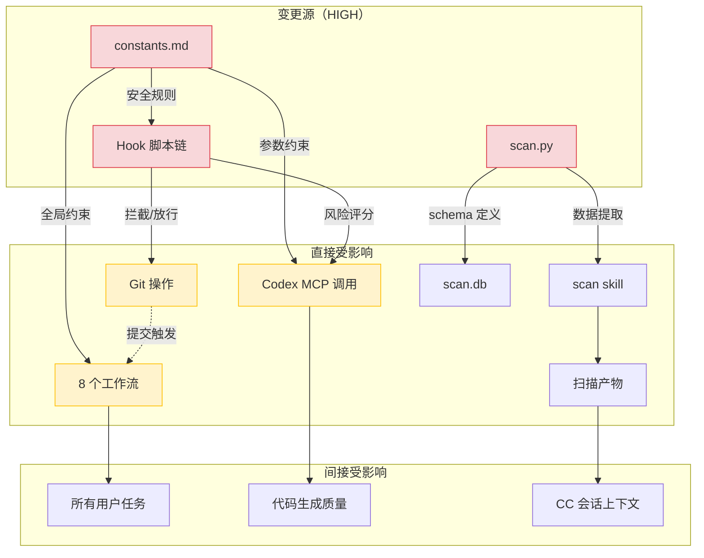

# 05-impact-matrix.md -- 影响矩阵

> 七大变更点的模块级风险评估与验证策略

## 目录

- [1. 概览：影响范围热力图](#1-概览影响范围热力图)
- [2. HIGH 风险变更点](#2-high-风险变更点)
- [3. MEDIUM 风险变更点](#3-medium-风险变更点)
- [4. 变更影响传播图](#4-变更影响传播图)
- [5. 验证策略矩阵](#5-验证策略矩阵)
- [6. 验证清单图](#6-验证清单图)

---

## 1. 概览：影响范围热力图

以下 SVG 矩阵展示 7 个变更点在 5 个风险维度上的评分。颜色越深表示风险越高。

<svg viewBox="0 0 720 340" xmlns="http://www.w3.org/2000/svg">
<defs>
<linearGradient id="riskGrad" x1="0%" y1="0%" x2="100%" y2="0%">
<stop offset="0%" stop-color="#4caf50"/>
<stop offset="50%" stop-color="#ff9800"/>
<stop offset="100%" stop-color="#f44336"/>
</linearGradient>
</defs>
<g id="background">
<rect x="0" y="0" width="720" height="340" fill="#fafafa"/>
<rect x="160" y="40" width="540" height="36" fill="#37474f"/>
<rect x="0" y="40" width="160" height="36" fill="#37474f"/>
<rect x="0" y="76" width="160" height="36" fill="#eceff1"/>
<rect x="0" y="112" width="160" height="36" fill="#eceff1"/>
<rect x="0" y="148" width="160" height="36" fill="#eceff1"/>
<rect x="0" y="184" width="160" height="36" fill="#eceff1"/>
<rect x="0" y="220" width="160" height="36" fill="#eceff1"/>
<rect x="0" y="256" width="160" height="36" fill="#eceff1"/>
<rect x="0" y="292" width="160" height="36" fill="#eceff1"/>
</g>
<g id="edges"/>
<g id="nodes">
<rect x="160" y="76" width="108" height="36" fill="#f44336"/>
<rect x="268" y="76" width="108" height="36" fill="#f44336"/>
<rect x="376" y="76" width="108" height="36" fill="#f44336"/>
<rect x="484" y="76" width="108" height="36" fill="#ff9800"/>
<rect x="592" y="76" width="108" height="36" fill="#f44336"/>
<rect x="160" y="112" width="108" height="36" fill="#f44336"/>
<rect x="268" y="112" width="108" height="36" fill="#4caf50"/>
<rect x="376" y="112" width="108" height="36" fill="#f44336"/>
<rect x="484" y="112" width="108" height="36" fill="#ff9800"/>
<rect x="592" y="112" width="108" height="36" fill="#f44336"/>
<rect x="160" y="148" width="108" height="36" fill="#f44336"/>
<rect x="268" y="148" width="108" height="36" fill="#f44336"/>
<rect x="376" y="148" width="108" height="36" fill="#4caf50"/>
<rect x="484" y="148" width="108" height="36" fill="#4caf50"/>
<rect x="592" y="148" width="108" height="36" fill="#f44336"/>
<rect x="160" y="184" width="108" height="36" fill="#f44336"/>
<rect x="268" y="184" width="108" height="36" fill="#f44336"/>
<rect x="376" y="184" width="108" height="36" fill="#4caf50"/>
<rect x="484" y="184" width="108" height="36" fill="#ff9800"/>
<rect x="592" y="184" width="108" height="36" fill="#f44336"/>
<rect x="160" y="220" width="108" height="36" fill="#ff9800"/>
<rect x="268" y="220" width="108" height="36" fill="#ff9800"/>
<rect x="376" y="220" width="108" height="36" fill="#ff9800"/>
<rect x="484" y="220" width="108" height="36" fill="#ff9800"/>
<rect x="592" y="220" width="108" height="36" fill="#ff9800"/>
<rect x="160" y="256" width="108" height="36" fill="#ff9800"/>
<rect x="268" y="256" width="108" height="36" fill="#4caf50"/>
<rect x="376" y="256" width="108" height="36" fill="#ff9800"/>
<rect x="484" y="256" width="108" height="36" fill="#ff9800"/>
<rect x="592" y="256" width="108" height="36" fill="#4caf50"/>
<rect x="160" y="292" width="108" height="36" fill="#4caf50"/>
<rect x="268" y="292" width="108" height="36" fill="#ff9800"/>
<rect x="376" y="292" width="108" height="36" fill="#ff9800"/>
<rect x="484" y="292" width="108" height="36" fill="#4caf50"/>
<rect x="592" y="292" width="108" height="36" fill="#ff9800"/>
</g>
<g id="labels">
<text x="80" y="24" text-anchor="middle" font-size="14" font-weight="bold" fill="#212121">影响矩阵热力图</text>
<text x="214" y="63" text-anchor="middle" font-size="11" font-weight="bold" fill="#ffffff">功能性</text>
<text x="322" y="63" text-anchor="middle" font-size="11" font-weight="bold" fill="#ffffff">安全性</text>
<text x="430" y="63" text-anchor="middle" font-size="11" font-weight="bold" fill="#ffffff">兼容性</text>
<text x="538" y="63" text-anchor="middle" font-size="11" font-weight="bold" fill="#ffffff">可维护性</text>
<text x="646" y="63" text-anchor="middle" font-size="11" font-weight="bold" fill="#ffffff">综合</text>
<text x="80" y="99" text-anchor="middle" font-size="10" fill="#212121">constants.md</text>
<text x="80" y="135" text-anchor="middle" font-size="10" fill="#212121">scan.py</text>
<text x="80" y="171" text-anchor="middle" font-size="10" fill="#212121">git_safety</text>
<text x="80" y="207" text-anchor="middle" font-size="10" fill="#212121">scope_guard</text>
<text x="80" y="243" text-anchor="middle" font-size="10" fill="#212121">.claude/rules/</text>
<text x="80" y="279" text-anchor="middle" font-size="10" fill="#212121">SKILL.md</text>
<text x="80" y="315" text-anchor="middle" font-size="10" fill="#212121">CLAUDE.md</text>
<text x="214" y="99" text-anchor="middle" font-size="10" font-weight="bold" fill="#ffffff">HIGH</text>
<text x="322" y="99" text-anchor="middle" font-size="10" font-weight="bold" fill="#ffffff">HIGH</text>
<text x="430" y="99" text-anchor="middle" font-size="10" font-weight="bold" fill="#ffffff">HIGH</text>
<text x="538" y="99" text-anchor="middle" font-size="10" font-weight="bold" fill="#212121">MED</text>
<text x="646" y="99" text-anchor="middle" font-size="10" font-weight="bold" fill="#ffffff">HIGH</text>
<text x="214" y="135" text-anchor="middle" font-size="10" font-weight="bold" fill="#ffffff">HIGH</text>
<text x="322" y="135" text-anchor="middle" font-size="10" font-weight="bold" fill="#ffffff">LOW</text>
<text x="430" y="135" text-anchor="middle" font-size="10" font-weight="bold" fill="#ffffff">HIGH</text>
<text x="538" y="135" text-anchor="middle" font-size="10" font-weight="bold" fill="#212121">MED</text>
<text x="646" y="135" text-anchor="middle" font-size="10" font-weight="bold" fill="#ffffff">HIGH</text>
<text x="214" y="171" text-anchor="middle" font-size="10" font-weight="bold" fill="#ffffff">HIGH</text>
<text x="322" y="171" text-anchor="middle" font-size="10" font-weight="bold" fill="#ffffff">HIGH</text>
<text x="430" y="171" text-anchor="middle" font-size="10" font-weight="bold" fill="#ffffff">LOW</text>
<text x="538" y="171" text-anchor="middle" font-size="10" font-weight="bold" fill="#ffffff">LOW</text>
<text x="646" y="171" text-anchor="middle" font-size="10" font-weight="bold" fill="#ffffff">HIGH</text>
<text x="214" y="207" text-anchor="middle" font-size="10" font-weight="bold" fill="#ffffff">HIGH</text>
<text x="322" y="207" text-anchor="middle" font-size="10" font-weight="bold" fill="#ffffff">HIGH</text>
<text x="430" y="207" text-anchor="middle" font-size="10" font-weight="bold" fill="#ffffff">LOW</text>
<text x="538" y="207" text-anchor="middle" font-size="10" font-weight="bold" fill="#212121">MED</text>
<text x="646" y="207" text-anchor="middle" font-size="10" font-weight="bold" fill="#ffffff">HIGH</text>
<text x="214" y="243" text-anchor="middle" font-size="10" font-weight="bold" fill="#212121">MED</text>
<text x="322" y="243" text-anchor="middle" font-size="10" font-weight="bold" fill="#212121">MED</text>
<text x="430" y="243" text-anchor="middle" font-size="10" font-weight="bold" fill="#212121">MED</text>
<text x="538" y="243" text-anchor="middle" font-size="10" font-weight="bold" fill="#212121">MED</text>
<text x="646" y="243" text-anchor="middle" font-size="10" font-weight="bold" fill="#212121">MED</text>
<text x="214" y="279" text-anchor="middle" font-size="10" font-weight="bold" fill="#212121">MED</text>
<text x="322" y="279" text-anchor="middle" font-size="10" font-weight="bold" fill="#ffffff">LOW</text>
<text x="430" y="279" text-anchor="middle" font-size="10" font-weight="bold" fill="#212121">MED</text>
<text x="538" y="279" text-anchor="middle" font-size="10" font-weight="bold" fill="#212121">MED</text>
<text x="646" y="279" text-anchor="middle" font-size="10" font-weight="bold" fill="#ffffff">LOW</text>
<text x="214" y="315" text-anchor="middle" font-size="10" font-weight="bold" fill="#ffffff">LOW</text>
<text x="322" y="315" text-anchor="middle" font-size="10" font-weight="bold" fill="#212121">MED</text>
<text x="430" y="315" text-anchor="middle" font-size="10" font-weight="bold" fill="#212121">MED</text>
<text x="538" y="315" text-anchor="middle" font-size="10" font-weight="bold" fill="#ffffff">LOW</text>
<text x="646" y="315" text-anchor="middle" font-size="10" font-weight="bold" fill="#212121">MED</text>
<rect x="180" y="330" width="14" height="8" fill="#4caf50"/>
<text x="198" y="338" font-size="9" fill="#616161">LOW</text>
<rect x="240" y="330" width="14" height="8" fill="#ff9800"/>
<text x="258" y="338" font-size="9" fill="#616161">MED</text>
<rect x="300" y="330" width="14" height="8" fill="#f44336"/>
<text x="318" y="338" font-size="9" fill="#616161">HIGH</text>
</g>
</svg>

**矩阵结论**：4 个变更点综合风险为 HIGH（`constants.md`、`scan.py`、`git_safety_check.py`、`pre_merge_scope_guard.py`），构成系统骨架。任何修改必须两轮独立 Review。

---

## 2. HIGH 风险变更点

### 2.1 `claude-workflow-constants.md`

**直接受影响方**：8 个工作流文档 + 4 个 Hook 脚本 + 所有 Codex 调用

该文件是全系统"单一真相来源"（Single Source of Truth），定义了 Codex 四必填参数、diff 上限、文件操作边界、Git 安全约束、Context 健康检查门禁等核心规则。

**验证步骤**：
1. 搜索所有 `constants.md` 引用，确认无断裂引用
2. 检查 Codex 四必填参数是否完整
3. 检查 Git 禁止操作列表是否一致

### 2.2 `scan.py` 子命令签名变更

**直接受影响方**：largebase-structured-scan skill + 所有依赖扫描结果的下游流程

8 个子命令覆盖扫描完整生命周期（初始化到导出），任何签名变更将级联中断。

| 子命令 | 调用方 | 中断后果 |
|--------|--------|---------|
| `scan` | SKILL.md Step 1 | 初始化失败 |
| `extract` | SKILL.md Step 3 | 数据提取失败 |
| `load` | SKILL.md Step 4 | 数据加载失败 |
| `query` | 人工查询 / 工作流 | 查询不可用 |
| `verify` | SKILL.md Step 7 | 验证失败 |
| `measure` | 工作流路由判断 | 规模统计失败 |
| `merge` | 并行扫描汇总 | 合并失败 |
| `export-to-claude-md` | 扫描收尾 | 摘要导出失败 |

### 2.3 Hook 脚本修改

**直接受影响方**：所有 Git commit / push / merge 操作

4 个核心脚本组成不可绕过的安全链：

| 脚本 | 拦截的操作 | 失败后果 |
|------|-----------|---------|
| `block-delete.py` | `rm -rf`、`git reset --hard` 等 | 误放行导致文件丢失 |
| `git_safety_check.py` | `git commit`、`git push` | 误阻断阻塞正常提交 |
| `pre_merge_scope_guard.py` | `git merge` | 误阻断阻塞合并 |
| `auto_checkpoint_commit.py` | 会话结束自动提交 | 备份失败或误提交脏工作区 |

---

## 3. MEDIUM 风险变更点

### 3.1 `.claude/rules/` 文件增删

Claude Code 每次会话自动加载该目录下所有 `.md` 文件。增删直接影响 Codex 会话上下文和代码生成质量。**验证**：检查 `paths` frontmatter 字段是否正确限定适用文件范围。

### 3.2 `SKILL.md` trigger 变更

Skill 触发关键词决定了激活时机。修改可能导致 skill 在错误时机激活或无法激活。**验证**：在 CC 会话中测试触发关键词是否正确匹配。

### 3.3 `AGENTS.md` 修改

定义 Codex 行为约束，修改直接影响所有 Codex 任务的质量和安全性。**验证**：运行 Codex 冒烟测试。

### 3.4 `CLAUDE.md` 路由变更

路由表决定新任务走哪个工作流。路由错误导致任务执行方式不匹配。**验证**：用各种场景关键词测试路由是否正确分发。

---

## 4. 变更影响传播图

以下 Mermaid 图展示 HIGH 风险变更点的级联传播路径。红色节点为变更源，橙色为直接受影响方。

**传播链分析**：`constants.md` 是最大单点风险 -- 一次修改同时影响工作流行为、Codex 调用参数和 Hook 安全规则三条传播链。`scan.py` 和 Hook 脚本的传播范围相对收敛，但仍需全量回归。

---

## 5. 验证策略矩阵

| 变更类型 | 自动验证 | 手动验证 | 回归范围 |
|---------|---------|---------|---------|
| constants.md 修改 | grep 引用检查 | 逐一验证 8 工作流 | 全量 |
| scan.py 签名变更 | 8 子命令 help + verify | extract + load + query 联合测试 | 全量 |
| Hook 脚本修改 | hook_runner 单测 | 真实 git 操作测试 | 全量 |
| rules/ 增删 | frontmatter 语法检查 | Codex 会话验证 | 受影响文件类型 |
| SKILL.md trigger | 关键词匹配测试 | CC 会话触发测试 | 该 skill |
| AGENTS.md 修改 | 无 | Codex 冒烟测试 | 全部 Codex 任务 |
| CLAUDE.md 路由 | 路由关键词覆盖测试 | 手动路由测试 | 全部新任务 |

---

## 6. 验证清单图

以下 SVG 展示 HIGH 风险变更的验证清单，按变更点分组。

<svg viewBox="0 0 680 360" xmlns="http://www.w3.org/2000/svg">
<defs>
<marker id="chk" markerWidth="8" markerHeight="8" refX="2" refY="2" orient="auto">
<path d="M0,0 L0,4 L4,4" fill="none" stroke="#78909c" stroke-width="1.5"/>
</marker>
</defs>
<g id="background">
<rect x="0" y="0" width="680" height="360" fill="#fafafa"/>
<rect x="20" y="20" width="640" height="32" rx="4" fill="#f44336"/>
<rect x="20" y="62" width="640" height="88" rx="4" fill="#fff3e0" stroke="#ff9800" stroke-width="1"/>
<rect x="20" y="160" width="640" height="88" rx="4" fill="#fff3e0" stroke="#ff9800" stroke-width="1"/>
<rect x="20" y="258" width="640" height="88" rx="4" fill="#fff3e0" stroke="#ff9800" stroke-width="1"/>
<rect x="30" y="30" width="14" height="14" rx="2" fill="none" stroke="#ffffff" stroke-width="1.5"/>
<rect x="30" y="72" width="14" height="14" rx="2" fill="none" stroke="#78909c" stroke-width="1.5"/>
<rect x="30" y="94" width="14" height="14" rx="2" fill="none" stroke="#78909c" stroke-width="1.5"/>
<rect x="30" y="116" width="14" height="14" rx="2" fill="none" stroke="#78909c" stroke-width="1.5"/>
<rect x="30" y="170" width="14" height="14" rx="2" fill="none" stroke="#78909c" stroke-width="1.5"/>
<rect x="30" y="192" width="14" height="14" rx="2" fill="none" stroke="#78909c" stroke-width="1.5"/>
<rect x="30" y="214" width="14" height="14" rx="2" fill="none" stroke="#78909c" stroke-width="1.5"/>
<rect x="30" y="268" width="14" height="14" rx="2" fill="none" stroke="#78909c" stroke-width="1.5"/>
<rect x="30" y="290" width="14" height="14" rx="2" fill="none" stroke="#78909c" stroke-width="1.5"/>
<rect x="30" y="312" width="14" height="14" rx="2" fill="none" stroke="#78909c" stroke-width="1.5"/>
</g>
<g id="edges"/>
<g id="nodes"/>
<g id="labels">
<text x="44" y="34" font-size="10" fill="#ffffff" font-weight="bold">PENDING</text>
<text x="340" y="40" text-anchor="middle" font-size="13" font-weight="bold" fill="#ffffff">HIGH 风险验证清单（3 组 / 9 项）</text>
<text x="50" y="84" font-size="10" fill="#212121">搜索所有 constants.md 引用，确认无断裂</text>
<text x="50" y="106" font-size="10" fill="#212121">检查 Codex 四必填参数完整性</text>
<text x="50" y="128" font-size="10" fill="#212121">检查 Git 禁止操作列表一致性</text>
<text x="50" y="182" font-size="10" fill="#212121">逐一运行 8 个子命令，确认参数兼容</text>
<text x="50" y="204" font-size="10" fill="#212121">运行 verify --mode M4 确认产物完整</text>
<text x="50" y="226" font-size="10" fill="#212121">检查 scan-data.json schema 兼容性</text>
<text x="50" y="280" font-size="10" fill="#212121">测试正常 git commit 是否放行</text>
<text x="50" y="302" font-size="10" fill="#212121">测试冲突状态下 commit 是否阻断</text>
<text x="50" y="324" font-size="10" fill="#212121">测试 merge 范围校验正确性</text>
<text x="30" y="58" font-size="9" font-weight="bold" fill="#e65100">A: constants.md</text>
<text x="30" y="156" font-size="9" font-weight="bold" fill="#e65100">B: scan.py</text>
<text x="30" y="254" font-size="9" font-weight="bold" fill="#e65100">C: Hook 脚本</text>
<text x="520" y="84" font-size="9" fill="#9e9e9e">方式: grep</text>
<text x="520" y="106" font-size="9" fill="#9e9e9e">方式: grep</text>
<text x="520" y="128" font-size="9" fill="#9e9e9e">方式: grep</text>
<text x="520" y="182" font-size="9" fill="#9e9e9e">方式: CLI</text>
<text x="520" y="204" font-size="9" fill="#9e9e9e">方式: CLI</text>
<text x="520" y="226" font-size="9" fill="#9e9e9e">方式: schema</text>
<text x="520" y="280" font-size="9" fill="#9e9e9e">方式: git</text>
<text x="520" y="302" font-size="9" fill="#9e9e9e">方式: git</text>
<text x="520" y="324" font-size="9" fill="#9e9e9e">方式: git</text>
</g>
</svg>

**验证策略**：9 项全部为 PENDING 状态。A 组（constants.md）和 B 组（scan.py）可通过 grep/CLI 自动化验证。C 组（Hook 脚本）需真实 git 操作手动验证。建议按 A -> B -> C 顺序执行。
