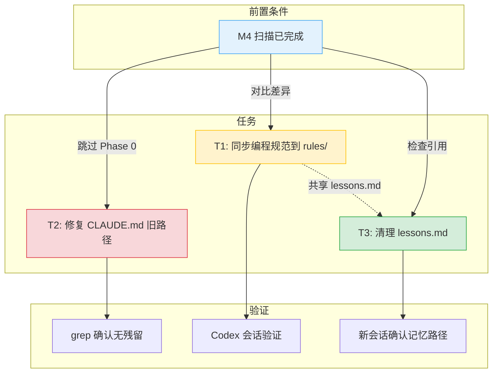

# 06-exec-brief.md -- 执行摘要

> 三大风险与三项可执行任务的优先级排布

## 目录

- [1. 项目概况](#1-项目概况)
- [2. Top 3 风险](#2-top-3-风险)
- [3. 任务优先级矩阵](#3-任务优先级矩阵)
- [4. 任务分解与依赖](#4-任务分解与依赖)
- [5. 工作量估算](#5-工作量估算)
- [6. 路由建议](#6-路由建议)
- [7. 关键发现](#7-关键发现)
- [8. 下一步行动](#8-下一步行动)

---

## 1. 项目概况

本项目是 **Claude Code + Codex MCP 协作框架**，包含 AI 辅助开发流程配置和 Python 图片合并演示应用。

| 指标 | 数值 |
|------|------|
| 总文件数 | ~116 |
| 总 Token 估算 | ~281k |
| 逻辑模块 | 6 个 |
| Hook 脚本函数 | ~60 个（4 个核心脚本） |
| scan.py 函数 | ~30 个（8 个子命令） |
| Skills | 27 个 |
| 工作流文档 | 10 个 |
| 规则文件 | 8 个 |

**六大逻辑模块**：

| 模块 | 路径 | 职责 |
|------|------|------|
| Hook 脚本 | `.claude/scripts/` | Git 安全防护 + 自动提交 |
| Skills | `.claude/skills/` | 27 个技能定义 |
| 工作流 | `.claude/workflows/` | 10 种场景路由 + 全局常量 |
| 规则 | `.claude/rules/` | 代码风格 + 安全 + 测试规范 |
| 图片合并应用 | `image-merger/src/` | CLI + GUI 图片合并 |
| 扫描工具 | `.claude/skills/largebase-structured-scan/` | 结构化代码库扫描 |

---

## 2. Top 3 风险

### 风险 1: `constants.md` 变更 (HIGH)

`claude-workflow-constants.md` 是全系统"单一真相来源"，被 8 个工作流和 4 个 Hook 脚本引用。修改将级联影响所有 Codex 调用参数、Git 安全约束、Context 健康检查门禁。

**缓解**：修改必须两轮独立 Review（CC + Codex 深度），修改后重新运行全部 8 个子命令验证。

### 风险 2: `scan.py` 管线中断 (HIGH)

`scan.py` 提供 8 个子命令，是 largebase-structured-scan skill 的核心依赖。子命令签名变更或 bug 将导致扫描初始化失败、数据提取中断、查询不可用。

**缓解**：修改后运行 `verify --mode M4` 确认产物完整。

### 风险 3: Hook 脚本 bug (HIGH)

4 个 Hook 脚本覆盖删除拦截、Git 安全、合并范围、自动备份四个维度。bug 可能导致误阻断正常操作、误放行危险操作。

**缓解**：修改后用真实 git 操作测试（commit、push、merge）。

---

## 3. 任务优先级矩阵

以下 SVG 四象限矩阵按重要性（纵轴）和紧迫性（横轴）排布 3 个建议任务。

<svg viewBox="0 0 600 420" xmlns="http://www.w3.org/2000/svg">
<defs>
<marker id="ax" markerWidth="8" markerHeight="8" refX="6" refY="3" orient="auto">
<path d="M0,0 L0,6 L8,3 z" fill="#546e7a"/>
</marker>
</defs>
<g id="background">
<rect x="0" y="0" width="600" height="420" fill="#fafafa"/>
<rect x="80" y="30" width="240" height="180" fill="#e8f5e9" stroke="#a5d6a7" stroke-width="1"/>
<rect x="320" y="30" width="240" height="180" fill="#fce4ec" stroke="#ef9a9a" stroke-width="1"/>
<rect x="80" y="210" width="240" height="180" fill="#e3f2fd" stroke="#90caf9" stroke-width="1"/>
<rect x="320" y="210" width="240" height="180" fill="#fff3e0" stroke="#ffcc80" stroke-width="1"/>
<line x1="80" y1="210" x2="560" y2="210" stroke="#78909c" stroke-width="1" stroke-dasharray="6,3"/>
<line x1="320" y1="30" x2="320" y2="390" stroke="#78909c" stroke-width="1" stroke-dasharray="6,3"/>
<line x1="80" y1="390" x2="560" y2="390" stroke="#546e7a" stroke-width="1.5" marker-end="url(#ax)"/>
<line x1="80" y1="390" x2="80" y2="30" stroke="#546e7a" stroke-width="1.5" marker-end="url(#ax)"/>
</g>
<g id="edges"/>
<g id="nodes">
<rect x="140" y="80" width="120" height="70" rx="8" fill="#c8e6c9" stroke="#43a047" stroke-width="2"/>
<rect x="380" y="60" width="120" height="70" rx="8" fill="#ef9a9a" stroke="#e53935" stroke-width="2"/>
<rect x="140" y="280" width="120" height="70" rx="8" fill="#bbdefb" stroke="#1e88e5" stroke-width="1.5"/>
</g>
<g id="labels">
<text x="300" y="410" text-anchor="middle" font-size="11" fill="#546e7a">紧迫性 --></text>
<text x="30" y="210" text-anchor="middle" font-size="11" fill="#546e7a" transform="rotate(-90, 30, 210)">重要性 --></text>
<text x="200" y="25" text-anchor="middle" font-size="10" font-weight="bold" fill="#2e7d32">重要不紧迫</text>
<text x="440" y="25" text-anchor="middle" font-size="10" font-weight="bold" fill="#c62828">重要且紧迫</text>
<text x="200" y="205" text-anchor="middle" font-size="10" font-weight="bold" fill="#1565c0">不重要不紧迫</text>
<text x="440" y="205" text-anchor="middle" font-size="10" font-weight="bold" fill="#e65100">紧迫不重要</text>
<text x="200" y="105" text-anchor="middle" font-size="10" font-weight="bold" fill="#1b5e20">T1: 同步规则</text>
<text x="200" y="120" text-anchor="middle" font-size="9" fill="#4caf50">MEDIUM / ~2h</text>
<text x="200" y="133" text-anchor="middle" font-size="8" fill="#78909c">docs/编程规范/ -> rules/</text>
<text x="440" y="85" text-anchor="middle" font-size="10" font-weight="bold" fill="#b71c1c">T2: 修复路径</text>
<text x="440" y="100" text-anchor="middle" font-size="9" fill="#e53935">HIGH / ~30min</text>
<text x="440" y="113" text-anchor="middle" font-size="8" fill="#78909c">instructions/ -> rules/</text>
<text x="200" y="305" text-anchor="middle" font-size="10" font-weight="bold" fill="#0d47a1">T3: 清理 lessons</text>
<text x="200" y="320" text-anchor="middle" font-size="9" fill="#1e88e5">LOW / ~15min</text>
<text x="200" y="333" text-anchor="middle" font-size="8" fill="#78909c">统一记忆路径</text>
</g>
</svg>

**矩阵结论**：T2（修复旧路径引用）位于"重要且紧迫"象限，应立即执行。T1（同步规则）重要但不紧迫，可安排在本轮。T3（清理 lessons）优先级最低，可延后。

---

## 4. 任务分解与依赖

以下 Mermaid 图展示 3 个任务之间的依赖关系和执行顺序建议。

**依赖分析**：T2 完全独立，可立即执行。T1 和 T3 都涉及 `lessons.md` 路径更新，存在弱依赖 -- 建议先做 T3 清理旧引用，再做 T1 写入新规则，避免冲突。

---

## 5. 工作量估算

以下 SVG 水平条形图展示 3 个任务的工作量对比。

<svg viewBox="0 0 560 200" xmlns="http://www.w3.org/2000/svg">
<defs/>
<g id="background">
<rect x="0" y="0" width="560" height="200" fill="#fafafa"/>
<line x1="200" y1="30" x2="200" y2="180" stroke="#cfd8dc" stroke-width="1" stroke-dasharray="4,2"/>
<line x1="320" y1="30" x2="320" y2="180" stroke="#cfd8dc" stroke-width="1" stroke-dasharray="4,2"/>
<line x1="440" y1="30" x2="440" y2="180" stroke="#cfd8dc" stroke-width="1" stroke-dasharray="4,2"/>
</g>
<g id="edges"/>
<g id="nodes">
<rect x="200" y="45" width="48" height="30" rx="4" fill="#e53935"/>
<rect x="200" y="95" width="240" height="30" rx="4" fill="#ff9800"/>
<rect x="200" y="145" width="24" height="30" rx="4" fill="#4caf50"/>
</g>
<g id="labels">
<text x="100" y="65" text-anchor="middle" font-size="11" fill="#212121">T2: 修复路径</text>
<text x="100" y="115" text-anchor="middle" font-size="11" fill="#212121">T1: 同步规则</text>
<text x="100" y="165" text-anchor="middle" font-size="11" fill="#212121">T3: 清理 lessons</text>
<text x="224" y="65" text-anchor="middle" font-size="10" font-weight="bold" fill="#ffffff">30min</text>
<text x="320" y="115" text-anchor="middle" font-size="10" font-weight="bold" fill="#ffffff">~2h</text>
<text x="212" y="165" text-anchor="middle" font-size="10" font-weight="bold" fill="#ffffff">15min</text>
<text x="200" y="195" text-anchor="middle" font-size="9" fill="#90a4ae">0</text>
<text x="320" y="195" text-anchor="middle" font-size="9" fill="#90a4ae">1h</text>
<text x="440" y="195" text-anchor="middle" font-size="9" fill="#90a4ae">2h</text>
<text x="280" y="20" text-anchor="middle" font-size="12" font-weight="bold" fill="#37474f">工作量估算（合计 ~2h45min）</text>
<text x="460" y="65" font-size="9" fill="#78909c">HIGH</text>
<text x="460" y="115" font-size="9" fill="#78909c">MEDIUM</text>
<text x="460" y="165" font-size="9" fill="#78909c">LOW</text>
</g>
</svg>

**估算总结**：总工作量约 2 小时 45 分钟。T1（同步规则）占 73% 工时，因其需对比两套规则差异并精简写入。T2 和 T3 均为小型修复，可快速完成。

---

## 6. 路由建议

3 个任务存在弱依赖（T1 和 T3 共享 `lessons.md` 路径），建议使用并行工作流。

| 场景 | 推荐路由 | 理由 |
|------|---------|------|
| 仅执行 T2 | `claude-workflow-complex.md` | 单任务，diff <50 行可考虑简单模式 |
| 3 个任务一起做 | `claude-workflow-parallel.md` | 多任务可解耦，T2 独立并行 |
| T1 + T3 顺序做 | `claude-workflow-complex.md` | 有弱依赖，顺序执行更安全 |

**建议**：3 个任务一起做时走 `claude-workflow-parallel.md`。T2 完全独立可先行，T3 和 T1 按顺序执行。

---

## 7. 关键发现

### 架构发现

1. **单一真相来源架构**：`claude-workflow-constants.md` 是全系统核心，所有工作流引用此文件。良好设计但也意味着最大单点风险。

2. **Hook 链完整性**：4 个 Hook 脚本覆盖删除拦截、Git 安全、合并范围、自动备份四个维度，形成纵深防御。

3. **scan.py 成熟度高**：8 个子命令覆盖完整扫描生命周期，支持增量模式和 tree-sitter 降级。

### 一致性发现

4. **规则三源体系存在滞后**：`docs/编程规范/`（扩展）到 `.claude/rules/`（已部署）三层之间存在同步延迟。

5. **lessons.md 双引用未统一**：`constants.md` 仍引用旧路径 `tasks/lessons.md`，与新位置 `.claude/memory/lessons/` 不一致。

6. **旧路径残留**：CLAUDE.md 扫描摘要区域仍引用 `.claude/instructions/`，应更新为 `.claude/rules/`。

### 质量发现

7. **代码质量良好**：Hook 脚本和 scan.py 均遵循规范（类型标注、docstring、错误处理），无裸 except 或硬编码 secrets。

8. **SVG 图表补全**：上一版扫描报告（2026-03-01）零 SVG 图表，本次全部补全为内联 SVG。

---

## 8. 下一步行动

| 优先级 | 行动 | 预估工作量 | 执行方式 | 路由 |
|--------|------|-----------|---------|------|
| P1 | 修复 CLAUDE.md 旧路径引用 | ~30min | CC 直接做 | 简单模式 |
| P2 | 同步 docs/编程规范/ 到 .claude/rules/ | ~2h | Codex | complex / parallel |
| P3 | 清理 tasks/lessons.md 双引用 | ~15min | CC 直接做 | 简单模式 |

**执行顺序建议**：P1（T2）立即执行 -> P3（T3）随后清理 -> P2（T1）最后做（需对比差异）。P1 和 P3 均 <20 行无逻辑变更，CC 直接做即可。P2 需理解规则差异并精简写入，建议交 Codex。
