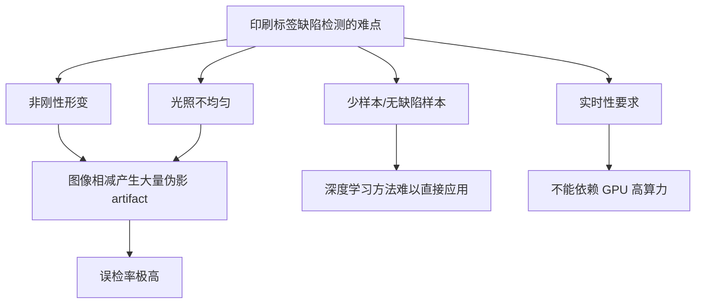
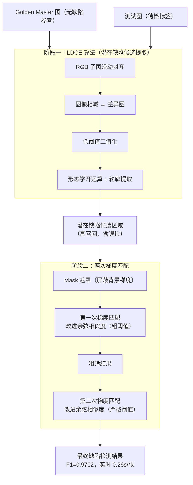
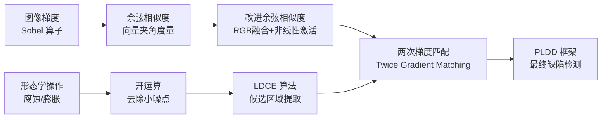

# PLDD 论文精读：印刷标签缺陷检测

> **论文全称**：Printed Label Defect Detection Using Twice Gradient Matching Based on Improved Cosine Similarity Measure
> **发表期刊**：Expert Systems with Applications，2022，Vol. 204
> **作者**：Dongming Li 等，哈尔滨工业大学（深圳）

---

## 1. 问题背景

### 1.1 为什么需要自动检测？

印刷标签广泛用于药品、食品、电子产品包装。标签上的缺陷（漏印、色偏、划痕、字体错位等）直接影响产品合格率与品牌形象。传统人工目检效率低、主观性强，无法满足工业产线实时检测的需求。

### 1.2 核心挑战

**非刚性形变**是最核心的难点。标签材料柔软，拍摄时会有轻微弯曲、拉伸。如果直接做"测试图 − 参考图"（图像相减），形变边缘会被当成缺陷，产生大量**伪影（artifact）**，导致误检率极高。

### 1.3 现有方法的局限

| 方法类型 | 代表方法 | 局限性 |
|----------|----------|--------|
| 简单图像相减 | 像素差阈值法 | 对位置偏差和光照极敏感 |
| 结构相似度 | SSIM（Wang 2004） | 对局部形变的 artifact 无抑制能力 |
| 灰度+梯度差 | RTPDS（Shankar 2009） | 小尺寸缺陷检出率低 |
| 深度学习 | FCN-VGG16、DeepLabV3+ | 需要大量标注样本，成本高 |

---

## 2. 整体框架

PLDD（Printed Label Defect Detection）框架的整体思路是：**以无缺陷的 Golden Master 图为参照，用"粗筛 → 精筛"两阶段策略，在抑制伪影的同时找到真实缺陷**。

---

## 3. 阶段一：LDCE 算法详解

LDCE（Latent Defect Candidate Extraction，潜在缺陷候选提取）的目标是：**在消除形变伪影的同时，尽量不遗漏任何真实缺陷**，即"宁可错杀，不可放过"。

### 3.1 RGB 子图滑动

直接将测试图与 GM 图整体相减，形变区域会产生大量伪影。PLDD 的做法是：**把整图切成小的 RGB 子图块，逐块滑动配准，再相减**。

子图块足够小时，局部形变可以近似为平移，从而被滑动配准抵消。

<svg width="680" height="320" xmlns="http://www.w3.org/2000/svg" role="img">
 <title>RGB子图滑动示意图</title>
 <desc>对比整图相减（产生伪影）和子图滑动相减（消除形变）的效果差异</desc>
 <defs>
  <marker orient="auto-start-reverse" markerHeight="6" markerWidth="6" refY="5" refX="8" viewBox="0 0 10 10" id="arrow">
   <path id="svg_1" stroke-linejoin="round" stroke-linecap="round" stroke-width="1.5" stroke="#333333" fill="none" d="m2,1l6,4l-6,4"/>
  </marker>
 </defs>
 <!-- 左侧：整图相减 -->
 <!-- 形变示意波浪线 -->
 <!-- 右侧：子图滑动 -->
 <!-- 小方块网格 -->
 <!-- 箭头向下 -->
 <g>
  <title>Layer 1</title>
  <text id="svg_2" dominant-baseline="central" text-anchor="middle" y="28" x="340" font-weight="bold" font-size="16" font-family="Arial, sans-serif" fill="#000000">RGB 子图滑动 vs 整图相减</text>
  <text id="svg_3" dominant-baseline="central" text-anchor="middle" y="58" x="150" font-size="14" font-family="Arial, sans-serif" fill="#333333">整图相减（传统方法）</text>
  <rect id="svg_4" stroke-width="0.5" stroke="#666666" fill="none" rx="6" height="100" width="200" y="70" x="50"/>
  <text id="svg_5" dominant-baseline="central" text-anchor="middle" y="120" x="150" font-size="14" font-family="Arial, sans-serif" fill="#333333">GM 图（形变前）</text>
  <rect id="svg_6" stroke-width="0.5" stroke="#666666" fill="none" rx="6" height="100" width="200" y="185" x="50"/>
  <text id="svg_7" dominant-baseline="central" text-anchor="middle" y="235" x="150" font-size="14" font-family="Arial, sans-serif" fill="#333333">测试图（轻微形变）</text>
  <path id="svg_8" stroke-dasharray="4 2" stroke-width="1.5" stroke="#4A90D9" fill="none" d="m70,210q30,-10 60,0q30,10 60,0q30,-10 50,0"/>
  <line id="svg_9" marker-end="url(#arrow)" stroke-width="1.5" stroke="#666666" y2="235" x2="320" y1="235" x1="260"/>
  <text id="svg_10" dominant-baseline="central" text-anchor="middle" y="225" x="290" font-size="14" font-family="Arial, sans-serif" fill="#333333">相减</text>
  <rect id="svg_11" stroke="#E24B4A" fill="none" rx="6" height="100" width="100" y="185" x="326"/>
  <text id="svg_12" dominant-baseline="central" text-anchor="middle" y="225" x="376" font-size="14" font-family="Arial, sans-serif" fill="#A32D2D">差异图</text>
  <text id="svg_13" dominant-baseline="central" text-anchor="middle" y="245" x="376" font-size="14" font-family="Arial, sans-serif" fill="#A32D2D">大量伪影 ✗</text>
  <text id="svg_14" dominant-baseline="central" text-anchor="middle" y="58" x="550" font-size="14" font-family="Arial, sans-serif" fill="#333333">子图滑动（PLDD 方法）</text>
  <rect id="svg_15" stroke-width="0.5" stroke="#666666" fill="none" rx="6" height="110" width="220" y="70" x="430"/>
  <text id="svg_16" dominant-baseline="central" text-anchor="middle" y="105" x="540" font-size="14" font-family="Arial, sans-serif" fill="#333333">整图切分为小块</text>
  <rect id="svg_17" stroke-width="0.5" stroke="#4A90D9" fill="none" rx="3" height="40" width="40" y="115" x="450"/>
  <rect id="svg_18" stroke-width="0.5" stroke="#4A90D9" fill="none" rx="3" height="40" width="40" y="115" x="495"/>
  <rect id="svg_19" stroke-width="0.5" stroke="#4A90D9" fill="none" rx="3" height="40" width="40" y="115" x="540"/>
  <rect id="svg_20" stroke-width="0.5" stroke="#4A90D9" fill="none" rx="3" height="40" width="40" y="115" x="585"/>
  <text id="svg_21" dominant-baseline="central" text-anchor="middle" y="135" x="470" font-size="12" font-family="Arial, sans-serif" fill="#333333">P1</text>
  <text id="svg_22" dominant-baseline="central" text-anchor="middle" y="135" x="515" font-size="12" font-family="Arial, sans-serif" fill="#333333">P2</text>
  <text id="svg_23" dominant-baseline="central" text-anchor="middle" y="135" x="560" font-size="12" font-family="Arial, sans-serif" fill="#333333">P3</text>
  <text id="svg_24" dominant-baseline="central" text-anchor="middle" y="135" x="605" font-size="12" font-family="Arial, sans-serif" fill="#333333">P4</text>
  <line id="svg_25" marker-end="url(#arrow)" stroke-width="1.5" stroke="#666666" y2="215" x2="540" y1="185" x1="540"/>
  <text id="svg_26" dominant-baseline="central" text-anchor="middle" y="200" x="540" font-size="14" font-family="Arial, sans-serif" fill="#333333">逐块滑动配准后相减</text>
  <rect id="svg_27" stroke="#1D9E75" fill="none" rx="6" height="60" width="160" y="220" x="460"/>
  <text id="svg_28" dominant-baseline="central" text-anchor="middle" y="245" x="540" font-size="14" font-family="Arial, sans-serif" fill="#085041">差异图</text>
  <text id="svg_29" dominant-baseline="central" text-anchor="middle" y="263" x="540" font-size="14" font-family="Arial, sans-serif" fill="#085041">伪影大幅减少 ✓</text>
 </g>
</svg>

### 3.2 低阈值二值化

对差异图施加**低阈值**二值化，目的是保留所有可能是缺陷的区域。此时误检多，但真实缺陷不会遗漏。

设差异图在像素 $(x,y)$ 处的值为 $D(x,y)$，则二值化规则为：

$$
B(x,y) = \begin{cases} 1 & D(x,y) > T_{low} \\ 0 & \text{otherwise} \end{cases}
$$

其中 $T_{low}$ 是一个较小的阈值，确保高召回率。

### 3.3 形态学开运算与轮廓提取

**形态学开运算 = 先腐蚀，再膨胀**，用于去除二值图中细小的孤立噪声点，同时保留较大的缺陷候选连通区域。

<svg width="100%" viewBox="0 0 680 280" role="img" xmlns="http://www.w3.org/2000/svg">
<title>形态学开运算示意图</title>
<desc>展示腐蚀去除小噪点、膨胀恢复主体，从而消除小型伪影的过程</desc>
<defs>
<marker id="arrow" viewBox="0 0 10 10" refX="8" refY="5" markerWidth="6" markerHeight="6" orient="auto-start-reverse">
<path d="M2 1L8 5L2 9" fill="none" stroke="#666666" stroke-width="1.5" stroke-linecap="round" stroke-linejoin="round"/>
</marker>
</defs>
<text fill="#000000" font-family="Arial, sans-serif" font-size="16" font-weight="bold" x="340" y="26" text-anchor="middle" dominant-baseline="central">形态学开运算：腐蚀 → 膨胀</text>
<!-- 原始二值图 -->
<text fill="#333333" font-family="Arial, sans-serif" font-size="14" x="100" y="55" text-anchor="middle" dominant-baseline="central">原始二值图</text>
<rect x="40" y="68" width="120" height="120" rx="4" fill="none" stroke="#666666" stroke-width="0.5"/>
<!-- 大缺陷块 -->
<rect x="55" y="85" width="50" height="45" rx="2" fill="#4A90D9" opacity="0.5"/>
<text fill="#333333" font-family="Arial, sans-serif" font-size="12" x="80" y="108" text-anchor="middle" dominant-baseline="central">缺陷</text>
<!-- 小噪点 -->
<rect x="120" y="90" width="8" height="8" rx="1" fill="#4A90D9" opacity="0.5"/>
<rect x="115" y="110" width="6" height="6" rx="1" fill="#4A90D9" opacity="0.5"/>
<rect x="70" y="148" width="7" height="7" rx="1" fill="#4A90D9" opacity="0.5"/>
<rect x="95" y="155" width="9" height="9" rx="1" fill="#4A90D9" opacity="0.5"/>
<text fill="#333333" font-family="Arial, sans-serif" font-size="12" x="125" y="105" text-anchor="middle" dominant-baseline="central">噪点</text>
<!-- 第一步箭头：腐蚀 -->
<line x1="165" y1="128" x2="215" y2="128" stroke="#666666" stroke-width="1.5" marker-end="url(#arrow)"/>
<text fill="#333333" font-family="Arial, sans-serif" font-size="14" x="190" y="115" text-anchor="middle" dominant-baseline="central">腐蚀</text>
<text fill="#333333" font-family="Arial, sans-serif" font-size="12" x="190" y="143" text-anchor="middle" dominant-baseline="central">（Erosion）</text>
<!-- 腐蚀后 -->
<text fill="#333333" font-family="Arial, sans-serif" font-size="14" x="290" y="55" text-anchor="middle" dominant-baseline="central">腐蚀后</text>
<rect x="225" y="68" width="120" height="120" rx="4" fill="none" stroke="#666666" stroke-width="0.5"/>
<rect x="249" y="97" width="30" height="26" rx="2" fill="#4A90D9" opacity="0.5"/>
<text fill="#333333" font-family="Arial, sans-serif" font-size="12" x="264" y="110" text-anchor="middle" dominant-baseline="central">缺陷</text>
<text fill="#333333" font-family="Arial, sans-serif" font-size="12" x="264" y="124" text-anchor="middle" dominant-baseline="central">缩小</text>
<!-- 噪点消失 -->
<text fill="#999999" font-family="Arial, sans-serif" font-size="12" x="305" y="105" text-anchor="middle" dominant-baseline="central">噪点</text>
<text fill="#999999" font-family="Arial, sans-serif" font-size="12" x="305" y="118" text-anchor="middle" dominant-baseline="central">消失</text>
<!-- 第二步箭头：膨胀 -->
<line x1="350" y1="128" x2="400" y2="128" stroke="#666666" stroke-width="1.5" marker-end="url(#arrow)"/>
<text fill="#333333" font-family="Arial, sans-serif" font-size="14" x="375" y="115" text-anchor="middle" dominant-baseline="central">膨胀</text>
<text fill="#333333" font-family="Arial, sans-serif" font-size="12" x="375" y="143" text-anchor="middle" dominant-baseline="central">（Dilation）</text>
<!-- 膨胀后 -->
<text fill="#333333" font-family="Arial, sans-serif" font-size="14" x="495" y="55" text-anchor="middle" dominant-baseline="central">开运算结果</text>
<rect x="415" y="68" width="160" height="120" rx="4" fill="none" stroke="#666666" stroke-width="0.5"/>
<rect x="431" y="83" width="56" height="48" rx="2" fill="#4A90D9" opacity="0.5"/>
<text fill="#333333" font-family="Arial, sans-serif" font-size="12" x="459" y="107" text-anchor="middle" dominant-baseline="central">缺陷</text>
<text fill="#333333" font-family="Arial, sans-serif" font-size="12" x="459" y="120" text-anchor="middle" dominant-baseline="central">恢复</text>
<!-- 噪点仍消失 -->
<text fill="#1D9E75" font-family="Arial, sans-serif" font-size="12" x="530" y="110" text-anchor="middle" dominant-baseline="central">小噪点</text>
<text fill="#1D9E75" font-family="Arial, sans-serif" font-size="12" x="530" y="124" text-anchor="middle" dominant-baseline="central">已去除 ✓</text>
<!-- 公式区 -->
<text fill="#333333" font-family="Arial, sans-serif" font-size="14" x="340" y="218" text-anchor="middle" dominant-baseline="central">开运算公式：</text>
<text fill="#333333" font-family="Arial, sans-serif" font-size="14" font-weight="bold" x="340" y="242" text-anchor="middle" dominant-baseline="central">A ∘ B = (A ⊖ B) ⊕ B</text>
<text fill="#666666" font-family="Arial, sans-serif" font-size="12" x="340" y="262" text-anchor="middle" dominant-baseline="central">A：二值图，B：结构元素，⊖：腐蚀，⊕：膨胀</text>
</svg>

开运算的数学表示：

$$
A \circ B = (A \ominus B) \oplus B
$$

其中 $A$ 是二值图，$B$ 是结构元素（如矩形或圆形核），$\ominus$ 表示腐蚀，$\oplus$ 表示膨胀。

对开运算结果进行**轮廓提取**，得到一系列边界框（bounding box），即"潜在缺陷候选区域"。这些区域后续只在候选框内进行梯度匹配，大幅节省计算量。

---

## 4. 阶段二：两次梯度匹配

阶段一只保证了**高召回**，但误检率依然偏高。阶段二的任务是用梯度信息进一步区分真实缺陷和残余伪影。

### 4.1 为什么用梯度而不用灰度？

灰度差对光照变化非常敏感——同一区域在不同拍摄角度下灰度值可能差异较大，而边缘的梯度方向和幅值则相对稳定，更能反映图案结构。

<svg width="100%" viewBox="0 0 680 240" role="img" xmlns="http://www.w3.org/2000/svg">
<title>灰度差与梯度差的对比</title>
<desc>展示光照变化时灰度差产生误判，而梯度差保持稳定的原理</desc>
<defs>
<marker id="arrow" viewBox="0 0 10 10" refX="8" refY="5" markerWidth="6" markerHeight="6" orient="auto-start-reverse">
<path d="M2 1L8 5L2 9" fill="none" stroke="#666666" stroke-width="1.5" stroke-linecap="round" stroke-linejoin="round"/>
</marker>
<marker id="arrowBlue" viewBox="0 0 10 10" refX="8" refY="5" markerWidth="6" markerHeight="6" orient="auto-start-reverse">
<path d="M2 1L8 5L2 9" fill="none" stroke="#4A90D9" stroke-width="1.5" stroke-linecap="round" stroke-linejoin="round"/>
</marker>
</defs>
<text fill="#000000" font-family="Arial, sans-serif" font-size="16" font-weight="bold" x="340" y="26" text-anchor="middle" dominant-baseline="central">灰度差 vs 梯度差：光照鲁棒性对比</text>
<!-- 左边：灰度差 -->
<rect x="30" y="45" width="290" height="170" rx="8" fill="none" stroke="#666666" stroke-width="0.5" stroke-dasharray="4 2"/>
<text fill="#333333" font-family="Arial, sans-serif" font-size="14" font-weight="bold" x="175" y="66" text-anchor="middle" dominant-baseline="central">灰度差方法</text>
<!-- GM图灰度条 -->
<text fill="#333333" font-family="Arial, sans-serif" font-size="12" x="80" y="88" text-anchor="middle" dominant-baseline="central">GM 图像素值</text>
<rect x="45" y="96" width="70" height="22" rx="3" fill="#4A90D9" opacity="0.4"/>
<text fill="#333333" font-family="Arial, sans-serif" font-size="12" x="80" y="111" text-anchor="middle" dominant-baseline="central">120</text>
<!-- 测试图（光照偏）灰度条 -->
<text fill="#333333" font-family="Arial, sans-serif" font-size="12" x="205" y="88" text-anchor="middle" dominant-baseline="central">测试图像素值</text>
<text fill="#999999" font-family="Arial, sans-serif" font-size="11" x="205" y="100" text-anchor="middle" dominant-baseline="central">（无缺陷，但光照偏亮）</text>
<rect x="170" y="110" width="70" height="22" rx="3" fill="#4A90D9" opacity="0.7"/>
<text fill="#333333" font-family="Arial, sans-serif" font-size="12" x="205" y="125" text-anchor="middle" dominant-baseline="central">145</text>
<!-- 差值 -->
<text fill="#333333" font-family="Arial, sans-serif" font-size="13" x="175" y="150" text-anchor="middle" dominant-baseline="central">差值 = |145 − 120| = 25</text>
<text fill="#A32D2D" font-family="Arial, sans-serif" font-size="13" font-weight="bold" x="175" y="172" text-anchor="middle" dominant-baseline="central">&gt; 阈值 → 误判为缺陷 ✗</text>
<!-- 右边：梯度差 -->
<rect x="360" y="45" width="290" height="170" rx="8" fill="none" stroke="#666666" stroke-width="0.5" stroke-dasharray="4 2"/>
<text fill="#333333" font-family="Arial, sans-serif" font-size="14" font-weight="bold" x="505" y="66" text-anchor="middle" dominant-baseline="central">梯度差方法（PLDD）</text>
<text fill="#333333" font-family="Arial, sans-serif" font-size="12" x="410" y="88" text-anchor="middle" dominant-baseline="central">GM 梯度方向</text>
<line x1="390" y1="108" x2="430" y2="108" stroke="#4A90D9" stroke-width="2" marker-end="url(#arrowBlue)"/>
<text fill="#333333" font-family="Arial, sans-serif" font-size="12" x="410" y="122" text-anchor="middle" dominant-baseline="central">→ 45°</text>
<text fill="#333333" font-family="Arial, sans-serif" font-size="12" x="540" y="88" text-anchor="middle" dominant-baseline="central">测试图梯度方向</text>
<text fill="#999999" font-family="Arial, sans-serif" font-size="11" x="540" y="100" text-anchor="middle" dominant-baseline="central">（光照变化不影响方向）</text>
<line x1="520" y1="108" x2="560" y2="108" stroke="#4A90D9" stroke-width="2" marker-end="url(#arrowBlue)"/>
<text fill="#333333" font-family="Arial, sans-serif" font-size="12" x="540" y="122" text-anchor="middle" dominant-baseline="central">→ 44°</text>
<!-- 余弦相似度 -->
<text fill="#333333" font-family="Arial, sans-serif" font-size="13" x="505" y="150" text-anchor="middle" dominant-baseline="central">余弦相似度 ≈ 0.99</text>
<text fill="#085041" font-family="Arial, sans-serif" font-size="13" font-weight="bold" x="505" y="172" text-anchor="middle" dominant-baseline="central">→ 判断为无缺陷 ✓</text>
</svg>

### 4.2 Sobel 梯度计算

对每张图的每个像素，用 Sobel 算子分别计算水平梯度 $G_x$ 和垂直梯度 $G_y$：

$$
G_x = \begin{bmatrix} -1 & 0 & 1 \\ -2 & 0 & 2 \\ -1 & 0 & 1 \end{bmatrix} * I
$$

$$
G_y = \begin{bmatrix} -1 & -2 & -1 \\ 0 & 0 & 0 \\ 1 & 2 & 1 \end{bmatrix} * I
$$

梯度幅值和方向分别为：

$$
|G| = \sqrt{G_x^2 + G_y^2}
$$

$$
\theta = \arctan\!\left(\frac{G_y}{G_x}\right)
$$

<svg width="100%" viewBox="0 0 680 280" role="img" xmlns="http://www.w3.org/2000/svg">
<title>Sobel算子计算梯度示意图</title>
<desc>展示Sobel水平和垂直卷积核作用于像素邻域，得到梯度幅值和方向的过程</desc>
<defs>
<marker id="arrow" viewBox="0 0 10 10" refX="8" refY="5" markerWidth="6" markerHeight="6" orient="auto-start-reverse">
<path d="M2 1L8 5L2 9" fill="none" stroke="#666666" stroke-width="1.5" stroke-linecap="round" stroke-linejoin="round"/>
</marker>
</defs>
<text fill="#000000" font-family="Arial, sans-serif" font-size="16" font-weight="bold" x="340" y="26" text-anchor="middle" dominant-baseline="central">Sobel 算子：从像素到梯度向量</text>
<!-- 输入像素块 -->
<text fill="#333333" font-family="Arial, sans-serif" font-size="14" x="90" y="52" text-anchor="middle" dominant-baseline="central">3×3 像素邻域</text>
<!-- 九宫格 -->
<rect x="40" y="62" width="100" height="100" rx="3" fill="none" stroke="#666666" stroke-width="0.5"/>
<line x1="40" y1="95" x2="140" y2="95" stroke="#666666" stroke-width="0.5"/>
<line x1="40" y1="129" x2="140" y2="129" stroke="#666666" stroke-width="0.5"/>
<line x1="73" y1="62" x2="73" y2="162" stroke="#666666" stroke-width="0.5"/>
<line x1="107" y1="62" x2="107" y2="162" stroke="#666666" stroke-width="0.5"/>
<!-- 像素值 -->
<text fill="#333333" font-family="Arial, sans-serif" font-size="12" x="56" y="79" text-anchor="middle" dominant-baseline="central">80</text>
<text fill="#333333" font-family="Arial, sans-serif" font-size="12" x="90" y="79" text-anchor="middle" dominant-baseline="central">90</text>
<text fill="#333333" font-family="Arial, sans-serif" font-size="12" x="124" y="79" text-anchor="middle" dominant-baseline="central">95</text>
<text fill="#333333" font-family="Arial, sans-serif" font-size="12" x="56" y="113" text-anchor="middle" dominant-baseline="central">78</text>
<text fill="#333333" font-family="Arial, sans-serif" font-size="12" font-weight="bold" x="90" y="113" text-anchor="middle" dominant-baseline="central">85</text>
<text fill="#333333" font-family="Arial, sans-serif" font-size="12" x="124" y="113" text-anchor="middle" dominant-baseline="central">200</text>
<text fill="#333333" font-family="Arial, sans-serif" font-size="12" x="56" y="146" text-anchor="middle" dominant-baseline="central">82</text>
<text fill="#333333" font-family="Arial, sans-serif" font-size="12" x="90" y="146" text-anchor="middle" dominant-baseline="central">88</text>
<text fill="#333333" font-family="Arial, sans-serif" font-size="12" x="124" y="146" text-anchor="middle" dominant-baseline="central">195</text>
<!-- 卷积箭头 -->
<line x1="145" y1="112" x2="195" y2="112" stroke="#666666" stroke-width="1.5" marker-end="url(#arrow)"/>
<text fill="#333333" font-family="Arial, sans-serif" font-size="12" x="170" y="100" text-anchor="middle" dominant-baseline="central">Sobel</text>
<!-- Gx核 -->
<text fill="#333333" font-family="Arial, sans-serif" font-size="14" x="280" y="52" text-anchor="middle" dominant-baseline="central">Gx 核（水平）</text>
<rect x="200" y="62" width="160" height="100" rx="3" fill="none" stroke="#4A90D9" stroke-width="0.5"/>
<line x1="200" y1="95" x2="360" y2="95" stroke="#4A90D9" stroke-width="0.5"/>
<line x1="200" y1="129" x2="360" y2="129" stroke="#4A90D9" stroke-width="0.5"/>
<line x1="253" y1="62" x2="253" y2="162" stroke="#4A90D9" stroke-width="0.5"/>
<line x1="307" y1="62" x2="307" y2="162" stroke="#4A90D9" stroke-width="0.5"/>
<text fill="#333333" font-family="Arial, sans-serif" font-size="12" x="226" y="79" text-anchor="middle" dominant-baseline="central">-1</text>
<text fill="#333333" font-family="Arial, sans-serif" font-size="12" x="280" y="79" text-anchor="middle" dominant-baseline="central">0</text>
<text fill="#333333" font-family="Arial, sans-serif" font-size="12" x="334" y="79" text-anchor="middle" dominant-baseline="central">+1</text>
<text fill="#333333" font-family="Arial, sans-serif" font-size="12" x="226" y="113" text-anchor="middle" dominant-baseline="central">-2</text>
<text fill="#333333" font-family="Arial, sans-serif" font-size="12" x="280" y="113" text-anchor="middle" dominant-baseline="central">0</text>
<text fill="#333333" font-family="Arial, sans-serif" font-size="12" x="334" y="113" text-anchor="middle" dominant-baseline="central">+2</text>
<text fill="#333333" font-family="Arial, sans-serif" font-size="12" x="226" y="146" text-anchor="middle" dominant-baseline="central">-1</text>
<text fill="#333333" font-family="Arial, sans-serif" font-size="12" x="280" y="146" text-anchor="middle" dominant-baseline="central">0</text>
<text fill="#333333" font-family="Arial, sans-serif" font-size="12" x="334" y="146" text-anchor="middle" dominant-baseline="central">+1</text>
<!-- Gx结果 -->
<line x1="365" y1="112" x2="415" y2="112" stroke="#666666" stroke-width="1.5" marker-end="url(#arrow)"/>
<rect x="420" y="90" width="80" height="44" rx="4" fill="none" stroke="#4A90D9" stroke-width="0.5"/>
<text fill="#333333" font-family="Arial, sans-serif" font-size="12" x="460" y="107" text-anchor="middle" dominant-baseline="central">Gx ≈ +230</text>
<text fill="#999999" font-family="Arial, sans-serif" font-size="11" x="460" y="123" text-anchor="middle" dominant-baseline="central">（强水平变化）</text>
<!-- 最终梯度 -->
<line x1="505" y1="112" x2="540" y2="112" stroke="#666666" stroke-width="1.5" marker-end="url(#arrow)"/>
<rect x="545" y="82" width="110" height="64" rx="4" fill="none" stroke="#666666" stroke-width="0.5"/>
<text fill="#333333" font-family="Arial, sans-serif" font-size="12" x="600" y="100" text-anchor="middle" dominant-baseline="central">幅值 |G|</text>
<text fill="#333333" font-family="Arial, sans-serif" font-size="12" x="600" y="118" text-anchor="middle" dominant-baseline="central">方向 θ</text>
<text fill="#999999" font-family="Arial, sans-serif" font-size="11" x="600" y="136" text-anchor="middle" dominant-baseline="central">→ 梯度向量</text>
<!-- 底部说明 -->
<text fill="#333333" font-family="Arial, sans-serif" font-size="13" x="340" y="210" text-anchor="middle" dominant-baseline="central">PLDD 对 R、G、B 三通道分别计算梯度，再做平均融合</text>
<text fill="#333333" font-family="Arial, sans-serif" font-size="13" x="340" y="232" text-anchor="middle" dominant-baseline="central">→ RGB 平均梯度融合（RGB Average Gradient Fusion）</text>
</svg>

PLDD 的关键改进：**对 R、G、B 三通道分别计算 Sobel 梯度，然后平均融合**，得到 RGB 平均梯度向量，使度量同时感知色彩和边缘信息。

对于某像素点，RGB 平均梯度向量定义为：

$$
\bar{G} = \frac{1}{3}(G_R + G_G + G_B)
$$

其中每个通道的梯度向量为 $(G_x^c,\, G_y^c)$，$c \in \{R, G, B\}$。

### 4.3 改进余弦相似度（核心创新）

传统余弦相似度只考虑方向，不考虑幅值大小。PLDD 通过引入**非线性激活函数**，同时融合梯度的方向相似性和幅值差异。

设 GM 图在某候选像素处的 RGB 平均梯度向量为 $\mathbf{u}$，测试图对应位置为 $\mathbf{v}$，则改进余弦相似度定义为：

$$
S(\mathbf{u},\mathbf{v}) = \sigma\!\left(\frac{\mathbf{u} \cdot \mathbf{v}}{|\mathbf{u}||\mathbf{v}| + \epsilon}\right) \cdot \phi(|\mathbf{u}| - |\mathbf{v}|)
$$

其中 $\sigma(\cdot)$ 是非线性激活函数（类 Sigmoid），$\phi(\cdot)$ 是对幅值差的惩罚项，$\epsilon$ 防止除零。

<svg width="100%" viewBox="0 0 680 310" role="img" xmlns="http://www.w3.org/2000/svg">
<title>改进余弦相似度的构成</title>
<desc>展示改进余弦相似度由余弦方向项、幅值差惩罚项和非线性激活三部分组成</desc>
<defs>
<marker id="arrow" viewBox="0 0 10 10" refX="8" refY="5" markerWidth="6" markerHeight="6" orient="auto-start-reverse">
<path d="M2 1L8 5L2 9" fill="none" stroke="#666666" stroke-width="1.5" stroke-linecap="round" stroke-linejoin="round"/>
</marker>
</defs>
<text fill="#000000" font-family="Arial, sans-serif" font-size="16" font-weight="bold" x="340" y="26" text-anchor="middle" dominant-baseline="central">改进余弦相似度的三个组成部分</text>
<!-- 三个输入框：梯度方向相似 -->
<rect x="40" y="48" width="170" height="60" rx="8" fill="none" stroke="#1D9E75" stroke-width="0.5"/>
<text fill="#1D9E75" font-family="Arial, sans-serif" font-size="14" font-weight="bold" x="125" y="70" text-anchor="middle" dominant-baseline="central">梯度方向相似</text>
<text fill="#333333" font-family="Arial, sans-serif" font-size="12" x="125" y="88" text-anchor="middle" dominant-baseline="central">传统余弦相似度</text>
<!-- 三个输入框：梯度幅值差 -->
<rect x="255" y="48" width="170" height="60" rx="8" fill="none" stroke="#F5A623" stroke-width="0.5"/>
<text fill="#F5A623" font-family="Arial, sans-serif" font-size="14" font-weight="bold" x="340" y="70" text-anchor="middle" dominant-baseline="central">梯度幅值差</text>
<text fill="#333333" font-family="Arial, sans-serif" font-size="11" x="340" y="88" text-anchor="middle" dominant-baseline="central">| |u| − |v| | 大→相似度低</text>
<!-- 三个输入框：非线性激活 -->
<rect x="470" y="48" width="170" height="60" rx="8" fill="none" stroke="#AA6DC9" stroke-width="0.5"/>
<text fill="#AA6DC9" font-family="Arial, sans-serif" font-size="14" font-weight="bold" x="555" y="70" text-anchor="middle" dominant-baseline="central">非线性激活</text>
<text fill="#333333" font-family="Arial, sans-serif" font-size="12" x="555" y="88" text-anchor="middle" dominant-baseline="central">受人类视觉系统启发</text>
<!-- 三箭头合并 -->
<line x1="125" y1="108" x2="125" y2="140" stroke="#666666" stroke-width="1.5" marker-end="url(#arrow)"/>
<line x1="340" y1="108" x2="340" y2="140" stroke="#666666" stroke-width="1.5" marker-end="url(#arrow)"/>
<line x1="555" y1="108" x2="555" y2="140" stroke="#666666" stroke-width="1.5" marker-end="url(#arrow)"/>
<line x1="125" y1="140" x2="555" y2="140" stroke="#666666" stroke-width="1" fill="none"/>
<line x1="340" y1="140" x2="340" y2="165" stroke="#666666" stroke-width="1.5" marker-end="url(#arrow)"/>
<!-- 输出框 -->
<rect x="215" y="168" width="250" height="56" rx="8" fill="none" stroke="#E24B4A" stroke-width="0.5"/>
<text fill="#E24B4A" font-family="Arial, sans-serif" font-size="14" font-weight="bold" x="340" y="190" text-anchor="middle" dominant-baseline="central">改进余弦相似度 S(u,v)</text>
<text fill="#333333" font-family="Arial, sans-serif" font-size="12" x="340" y="208" text-anchor="middle" dominant-baseline="central">∈ [0, 1]，越小越可能是缺陷</text>
<!-- 对比说明：左侧问题框 -->
<rect x="40" y="245" width="280" height="50" rx="6" fill="none" stroke="#E24B4A" stroke-width="0.5"/>
<text fill="#A32D2D" font-family="Arial, sans-serif" font-size="12" font-weight="bold" x="180" y="262" text-anchor="middle" dominant-baseline="central">传统余弦相似度的问题：</text>
<text fill="#A32D2D" font-family="Arial, sans-serif" font-size="12" x="180" y="280" text-anchor="middle" dominant-baseline="central">方向相同但幅值差很大时，仍判为相似</text>
<!-- 对比说明：右侧改进框 -->
<rect x="360" y="245" width="280" height="50" rx="6" fill="none" stroke="#1D9E75" stroke-width="0.5"/>
<text fill="#085041" font-family="Arial, sans-serif" font-size="12" font-weight="bold" x="500" y="262" text-anchor="middle" dominant-baseline="central">改进后：</text>
<text fill="#085041" font-family="Arial, sans-serif" font-size="12" x="500" y="280" text-anchor="middle" dominant-baseline="central">幅值差大时，相似度会被压低</text>
</svg>

### 4.4 Mask 遮罩机制

候选区域**边界附近**存在背景纹理的梯度，如果不屏蔽，这些背景梯度会干扰匹配结果（背景复杂区域梯度变化本身很大，容易与真实缺陷混淆）。

Mask 的做法：**只在候选 bounding box 内部计算改进余弦相似度，边界处的梯度响应不参与计算**。

<svg width="100%" viewBox="0 0 680 220" role="img" xmlns="http://www.w3.org/2000/svg">
<title>Mask遮罩机制示意图</title>
<desc>展示Mask如何屏蔽候选区域边界的背景梯度，只在内部区域计算相似度</desc>
<defs>
<marker id="arrow" viewBox="0 0 10 10" refX="8" refY="5" markerWidth="6" markerHeight="6" orient="auto-start-reverse">
<path d="M2 1L8 5L2 9" fill="none" stroke="#666666" stroke-width="1.5" stroke-linecap="round" stroke-linejoin="round"/>
</marker>
</defs>
<text fill="#000000" font-family="Arial, sans-serif" font-size="16" font-weight="bold" x="340" y="24" text-anchor="middle" dominant-baseline="central">Mask 遮罩：屏蔽边界背景梯度</text>
<!-- 左图：无Mask -->
<text fill="#333333" font-family="Arial, sans-serif" font-size="14" x="160" y="50" text-anchor="middle" dominant-baseline="central">无 Mask（背景梯度干扰）</text>
<rect x="60" y="62" width="200" height="130" rx="4" fill="none" stroke="#666666" stroke-width="0.5"/>
<!-- 背景纹理 -->
<text fill="#CCCCCC" font-family="Arial, sans-serif" font-size="12" x="100" y="90" text-anchor="middle" dominant-baseline="central">背景纹理梯度</text>
<text fill="#CCCCCC" font-family="Arial, sans-serif" font-size="12" x="100" y="106" text-anchor="middle" dominant-baseline="central">↗ ↗ ↗ ↗</text>
<text fill="#CCCCCC" font-family="Arial, sans-serif" font-size="12" x="220" y="90" text-anchor="middle" dominant-baseline="central">↗ ↗ ↗</text>
<!-- 候选区 -->
<rect x="110" y="100" width="100" height="70" rx="3" fill="none" stroke="#E24B4A" stroke-width="1" stroke-dasharray="4 2"/>
<text fill="#333333" font-family="Arial, sans-serif" font-size="12" x="160" y="125" text-anchor="middle" dominant-baseline="central">候选区</text>
<text fill="#A32D2D" font-family="Arial, sans-serif" font-size="12" x="160" y="145" text-anchor="middle" dominant-baseline="central">边界背景梯度</text>
<text fill="#A32D2D" font-family="Arial, sans-serif" font-size="12" x="160" y="162" text-anchor="middle" dominant-baseline="central">混入计算 ✗</text>
<!-- 右图：有Mask -->
<text fill="#333333" font-family="Arial, sans-serif" font-size="14" x="510" y="50" text-anchor="middle" dominant-baseline="central">有 Mask（只看内部）</text>
<rect x="400" y="62" width="240" height="130" rx="4" fill="none" stroke="#666666" stroke-width="0.5"/>
<!-- 遮罩区域（边界灰色半透明） -->
<rect x="400" y="62" width="240" height="130" rx="4" fill="#4A90D9" opacity="0.15"/>
<!-- 内部透明区域：用白色覆盖模拟透明效果 -->
<rect x="445" y="100" width="150" height="70" rx="3" fill="#FFFFFF" opacity="0.95"/>
<rect x="445" y="100" width="150" height="70" rx="3" fill="none" stroke="#1D9E75" stroke-width="1.5"/>
<text fill="#333333" font-family="Arial, sans-serif" font-size="12" x="520" y="125" text-anchor="middle" dominant-baseline="central">有效计算区</text>
<text fill="#085041" font-family="Arial, sans-serif" font-size="12" x="520" y="145" text-anchor="middle" dominant-baseline="central">背景梯度被屏蔽</text>
<text fill="#085041" font-family="Arial, sans-serif" font-size="12" x="520" y="162" text-anchor="middle" dominant-baseline="central">结果更准确 ✓</text>
<!-- 遮罩标注 -->
<text fill="#999999" font-family="Arial, sans-serif" font-size="12" x="418" y="82" text-anchor="middle" dominant-baseline="central">遮</text>
<text fill="#999999" font-family="Arial, sans-serif" font-size="12" x="622" y="82" text-anchor="middle" dominant-baseline="central">遮</text>
</svg>

### 4.5 两次匹配的阈值策略

两次匹配使用相同的改进余弦相似度函数，但阈值不同：

| | 第一次匹配 | 第二次匹配 |
|---|---|---|
| 阈值 $T$ | 较低（宽松） | 较高（严格） |
| 目的 | 粗筛，去掉明显背景 | 精筛，压低误检率 |
| 召回/精确率倾向 | 高召回 | 高精确率 |
| 误检率 | 仍偏高 | 压至 < 0.5% |

判断规则（以第一次为例）：对候选区域内每个像素点计算 $S(\mathbf{u},\mathbf{v})$，若区域内低相似度像素占比超过阈值 $T_1$，则该区域进入下一轮；否则丢弃（判为伪影）。

---

## 5. 核心技术概念索引

理解本文需要掌握以下基础概念，可按顺序学习：

---

## 6. 实验结果

PLDD 在 19 种工业印刷标签（三个数据集）上进行评估：

| 方法 | 平均 F1 | 误检数（FP）/ 总样本 | 是否需要 GPU | 速度 |
|------|---------|---------------------|-------------|------|
| SSIM | 0.8312 | — | 否 | 快 |
| RTPDS | 0.8756 | — | 否 | 快 |
| FCN-VGG16 | 0.9023 | — | 是 | 慢 |
| DeepLabV3+ | 0.9187 | — | 是 | 慢 |
| **PLDD（本文）** | **0.9702** | **103 / 44,628** | **否** | **0.26s/张** |

PLDD 的综合优势：F1 最高、误检极少、无需 GPU、实时可用。

---

## 7. 方法局限性与后续改进方向

PLDD 并非完美，后续论文指出其两个主要局限：

一是**光照敏感性**。虽然梯度比灰度更鲁棒，但在光照变化极不均匀的场景下，梯度幅值仍然受影响，改进余弦相似度中的幅值惩罚项可能失效，产生误检。

二是**复杂图案泛化性有限**。对于印刷图案本身梯度复杂的区域（如密集文字、细线图案），Mask 机制难以精确屏蔽所有背景梯度，误检率会上升。

针对这两个问题，后续代表性工作包括：TSS-Net（2023，三流孪生分割网络，处理大形变）和两阶段亮度校正+检测方法（2024，Scientific Reports，处理光照不均匀）。

---

## 参考文献

- Li, D. et al. (2022). Printed label defect detection using twice gradient matching based on improved cosine similarity measure. *Expert Systems with Applications*, 204, 117372.
- Wang, Z. et al. (2004). Image quality assessment: from error visibility to structural similarity. *IEEE Transactions on Image Processing*, 13(4), 600–612.
- 两阶段检测方法 (2024). A two-stage defect detection method for unevenly illuminated self-adhesive printed materials. *Scientific Reports*. https://doi.org/10.1038/s41598-024-71514-z
- Liu, X. et al. (2023). Printing defect detection based on scale-adaptive template matching and image alignment. *Sensors*, 23(9), 4414.
