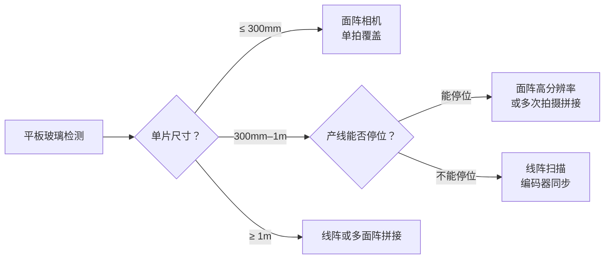
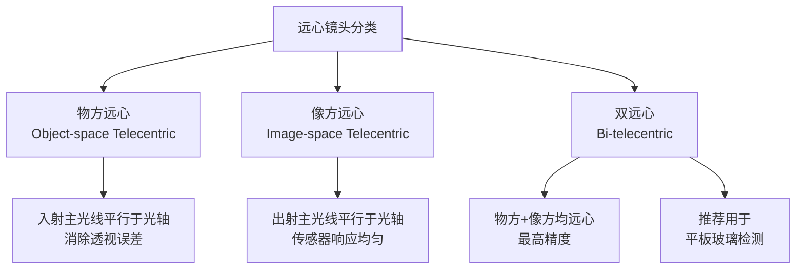
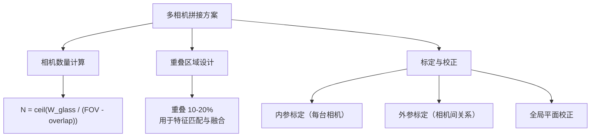
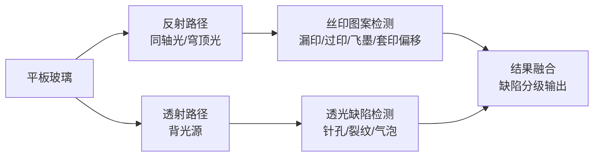
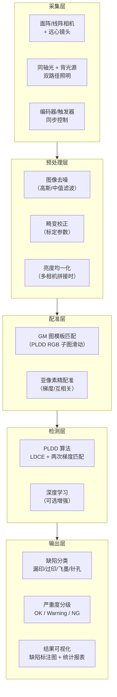

# 平板玻璃丝印缺陷检测 — 工程落地调研综述

> 从算法到产线：平板玻璃表面丝印印刷缺陷检测的硬件选型、光学方案与系统架构全景。

## 目录

- [执行摘要](#执行摘要)
- [全局决策流程](#全局决策流程)
- [一、应用场景定义](#一应用场景定义)
- [二、线阵相机 vs 面阵相机](#二线阵相机-vs-面阵相机)
- [三、图像抖动与运动模糊](#三图像抖动与运动模糊)
- [四、镜头畸变与远心镜头](#四镜头畸变与远心镜头)
- [五、大幅面多相机拼接](#五大幅面多相机拼接)
- [六、光学打光方案](#六光学打光方案)
- [七、整体系统架构建议](#七整体系统架构建议)
- [附录：选型速查表](#附录选型速查表)

---

## 执行摘要

**结论：PARTIAL — 技术方案可行，关键风险在大幅面覆盖与光照均匀性。**

| 维度 | 状态 | 说明 |
|------|------|------|
| 相机选型 | 明确 | 单工位用面阵，连续产线/大幅面用线阵 |
| 抖动控制 | 可控 | 刚性玻璃+固定工位，相机抖动量级小 |
| 镜头方案 | 明确 | 远心镜头消除透视畸变，推荐双远心 |
| 多相机拼接 | 有风险 | 玻璃幅面可达 2m+，拼接精度和标定是瓶颈 |
| 打光方案 | 需验证 | 丝印墨层+玻璃透射/反射双路径，需实地试光 |
| 系统架构 | 明确 | 采集 → 预处理 → 配准 → 检测 → 分级输出 |

---

## 全局决策流程

```mermaid
flowchart TD
    START["开始：平板玻璃丝印检测需求"] --> Q1{"检测对象尺寸？"}
    Q1 -->|"≤ 300mm 单工位"| AREA["面阵相机方案\n单相机 + 远心镜头"]
    Q1 -->|"300mm–1m"| Q2{"产线节拍要求？"}
    Q1 -->|"≥ 1m 大幅面"| MULTI["多相机拼接方案\n线阵 or 多面阵"}
    Q2 -->|"≤ 2s/片"| LINE1["线阵相机\n扫描式采集"]
    Q2 -->|"无严格节拍"| AREA2["面阵相机\n高分辨率单拍"]
    AREA --> LIGHT["光学方案选型"]
    LINE1 --> LIGHT
    AREA2 --> LIGHT
    MULTI --> LIGHT
    LIGHT --> L1{"丝印面可否透光？"}
    L1 -->|"是（透明玻璃）"| TRANS["背光源 + 反射组合"]
    L1 -->|"否（镀膜/有色）"| REF["同轴光/穹顶光 反射方案"]
    TRANS --> ARCH["系统架构设计"]
    REF --> ARCH
    ARCH --> ALGO["接入检测算法\nPLDD / 深度学习"]
```

---

## 一、应用场景定义

**目标场景**：平板玻璃制品（手机盖板、家电面板、建筑装饰玻璃等）表面丝印（丝网印刷）图案的缺陷检测。

### 1.1 被检对象特征

| 特征 | 描述 | 对检测的影响 |
|------|------|------------|
| 基材 | 平板玻璃，刚性不变形 | 无柔性拉伸问题，几何关系稳定 |
| 表面 | 丝印墨层，可能多色套印 | 需区分颜色差异缺陷 vs 正常色差 |
| 幅面 | 小件（手机）50–150mm 到大件（建筑玻璃）1–3m | 决定单相机 vs 多相机拼接 |
| 反射 | 玻璃高反射率 | 打光方案需避开镜面反射 |
| 透射 | 透明/半透明基材 | 可利用背光透射检测 |

### 1.2 常见丝印缺陷类型

| 缺陷类型 | 表现 | 检测难点 |
|---------|------|---------|
| 漏印（Missing） | 图案部分未印出 | 需与 GM 图精确配准对比 |
| 过印（Overprint） | 墨迹超出设计边界 | 边缘模糊区域易误报 |
| 套印偏移 | 多色套印位置偏差 | 需亚像素级配准精度 |
| 墨点/飞墨 | 非图案区域出现墨点 | 小目标检测，信噪比低 |
| 划伤 | 玻璃表面线性伤痕 | 需与丝印线条区分 |
| 针孔 | 小面积透光点 | 需背光才能检出 |

### 1.3 与卷材印刷的关键差异

| 维度 | 卷材印刷（标签/包装） | 平板玻璃丝印 |
|------|---------------------|------------|
| 基材变形 | 柔性拉伸、抖动 | **刚性不变形** |
| 运动方式 | 连续卷材运动 | 离散片状，可停位检测 |
| 图像采集 | 线阵扫描为主 | 面阵单拍或线阵扫描均可 |
| 光照挑战 | 材料反光均匀 | **玻璃镜面反射严重** |
| 幅面 | 通常 ≤ 500mm | **可达 3m+** |

---

## 二、线阵相机 vs 面阵相机

> 核心结论：平板玻璃场景下，**面阵相机是首选**（离散片状、可停位）；大幅面或连续产线才考虑线阵。

### 2.1 方案对比

| 维度 | 面阵相机（Area Scan） | 线阵相机（Line Scan） |
|------|---------------------|---------------------|
| 采集方式 | 一次曝光获取完整 2D 图像 | 逐行扫描，拼接成完整图像 |
| 适用场景 | 离散件、可停位、小幅面 | 连续运动、大幅面、高分辨率 |
| 安装复杂度 | 低（单拍即得） | 高（需编码器同步、行拼接） |
| 分辨率 | 受传感器尺寸限制（典型 5K–20K 像素宽） | 单行可达 2K–16K，拼接后无上限 |
| 速度 | 受帧率限制（典型 30–200 fps） | 行频可达 10K–200K 行/秒 |
| 运动模糊 | 全局快门可消除 | 需编码器精确同步 |
| 成本 | 中等 | 较高（相机 + 编码器 + 同步硬件） |

### 2.2 平板玻璃场景选型建议



**推荐方案**：

- **手机/小家电盖板（≤ 150mm）**：单台面阵相机（12K–20K 分辨率）+ 双远心镜头，一拍覆盖
- **中型面板（150–500mm）**：面阵相机多次拍摄拼接，或单台高分辨率线阵
- **大型建筑玻璃（≥ 1m）**：多台线阵相机并行扫描，或多台面阵相机阵列

### 2.3 常见踩坑点

| 踩坑 | 原因 | 规避方法 |
|------|------|---------|
| 面阵分辨率不够 | 单片传感器尺寸有限 | 先算 FOV 和像素精度需求再选型 |
| 线阵行拼接错位 | 编码器分辨率不足或抖动 | 编码器精度 ≥ 0.01mm/脉冲 |
| 颜色失真 | 线阵彩色相机用棱镜分光 | 需校准三通道空间对齐 |
| 触发延迟 | 软件触发延迟大 | 用硬件外触发（编码器信号直连） |

---

## 三、图像抖动与运动模糊

> 核心结论：平板玻璃刚性不变形，**抖动源主要是相机振动和传送带机械振动**，量级可控。

### 3.1 抖动源分析

| 抖动源 | 幅度量级 | 影响程度 | 解决方案 |
|--------|---------|---------|---------|
| 相机支架振动 | 0.01–0.1mm | 中 | 加固支架、减震垫 |
| 传送带振动 | 0.05–0.5mm | 高（面阵停位时小） | 停位稳定后触发 |
| 编码器抖动 | 亚像素级 | 低 | 高分辨率编码器 |
| 玻璃放置偏移 | 0.5–2mm | 中 | 机械定位 + 软件配准 |

### 3.2 停位检测 vs 在线扫描

| 维度 | 停位检测（推荐） | 在线扫描 |
|------|---------------|---------|
| 抖动影响 | **极小**（静止后采集） | 需编码器同步补偿 |
| 运动模糊 | 无 | 需控制曝光时间 |
| 产线节拍 | 增加停位时间 | 连续不停 |
| 图像质量 | **高**（无运动退化） | 取决于同步精度 |
| 适用 | 玻璃面积 ≤ 500mm | 大幅面连续产线 |

**工程建议**：平板玻璃产线如果能实现停位（机械手或定位台），**优先选择停位检测**，彻底消除运动模糊问题。

### 3.3 运动模糊补偿（在线扫描时）

在线扫描无法停位时的补偿方案：

| 方案 | 原理 | 适用条件 |
|------|------|---------|
| 缩短曝光时间 | 减少运动积分时间 | 光源足够强 |
| 全局快门相机 | 整帧同时曝光 | 面阵相机首选 |
| 编码器外触发 | 速度-行频精确同步 | 线阵相机标配 |
| 软件去模糊 | 维纳滤波/Lucy-Richardson | 模糊核已知且均匀 |

### 3.4 常见踩坑点

| 踩坑 | 原因 | 规避方法 |
|------|------|---------|
| 传送带未停稳就拍照 | 节拍太紧 | 加延时，检测振动传感器信号 |
| 编码器脉冲频率与行频不匹配 | 分频比设置错误 | 实测速度，计算确认 |
| 支架共振 | 电机频率与支架固有频率接近 | 加减震垫或改支架结构 |
| 玻璃表面反光随角度变化 | 微小振动改变反射角 | 用同轴光或穹顶光消除方向性 |

---

## 四、镜头畸变与远心镜头

> 核心结论：平板玻璃检测**必须用远心镜头**，消除透视畸变和景深问题。

### 4.1 普通镜头的畸变问题

| 畸变类型 | 表现 | 对缺陷检测的影响 |
|---------|------|----------------|
| 径向畸变 | 边缘区域线条弯曲 | GM 图与测试图边缘配准失败 |
| 梯形畸变 | 矩形变梯形 | 尺寸测量不准 |
| 透视误差 | 物距变化导致放大率变化 | 玻璃微倾斜 → 边缘像素尺寸不同 |

### 4.2 远心镜头类型对比



| 类型 | 放大率稳定性 | 景深 | 成本 | 适用场景 |
|------|------------|------|------|---------|
| 物方远心 | 好（物距变化不敏感） | 中 | 中 | 平面检测、尺寸测量 |
| 像方远心 | 一般 | 大 | 中 | 与传感器匹配 |
| **双远心** | **最佳** | **最大** | **高** | **高精度平板检测（推荐）** |
| 普通镜头 | 差（物距敏感） | 小 | 低 | 不推荐 |

### 4.3 远心镜头选型关键参数

| 参数 | 说明 | 选型建议 |
|------|------|---------|
| 放大率 | 决定传感器尺寸与 FOV 的关系 | 根据像素精度需求反算 |
| FOV | 镜头可覆盖的视场范围 | 需 > 被检物尺寸 + 余量 |
| 景深 | 成像清晰的高度范围 | 玻璃平整则要求不高 |
| 数值孔径（NA） | 影响分辨率和光通量 | 高分辨率需求选大 NA |
| 接口 | C-mount / F-mount / M42 / M72 | 与相机匹配 |

### 4.4 常见踩坑点

| 踩坑 | 原因 | 规避方法 |
|------|------|---------|
| 远心镜头 FOV 不够 | 远心镜头 FOV 受直径限制，成本随 FOV 暴增 | FOV > 200mm 考虑多相机拼接 |
| 工作距离安装错误 | 远心镜头有固定工作距离 | 严格按规格书安装 |
| 光源口径小于镜头 | 远心镜头要求光源均匀覆盖全 FOV | 光源口径 ≥ FOV 对角线 |
| 普通镜头凑合用 | 径向畸变导致边缘配准失败 | 必须用远心或做畸变标定校正 |

---

## 五、大幅面多相机拼接

> 核心结论：建筑玻璃等大幅面（≥ 1m）场景，**多相机拼接是必选项**，精度瓶颈在标定和重叠区融合。

### 5.1 拼接方案对比

| 方案 | 原理 | 精度 | 复杂度 | 适用幅面 |
|------|------|------|--------|---------|
| 多面阵阵列 | 多台面阵相机，各自拍一块，软件拼接 | 中 | 中 | 1–3m |
| 单线阵扫描 | 一台线阵相机横跨全幅宽 | 高 | 高 | 任意宽度 |
| 多线阵并行 | 多台线阵分段扫描 | 高 | 高 | > 2m |
| 单面阵多次拍摄 | 机械移动相机，多次拍摄拼接 | 中 | 低 | 1–2m |

### 5.2 拼接关键参数



**相机数量估算**：

$$
N = \left\lceil \frac{W_{glass}}{FOV_{single} - W_{overlap}} \right\rceil
$$

其中 $W_{glass}$ 为玻璃宽度，$FOV_{single}$ 为单台相机视场，$W_{overlap}$ 为重叠区域宽度。

### 5.3 标定流程

| 步骤 | 方法 | 精度要求 |
|------|------|---------|
| 单相机内参标定 | 棋盘格/标定板，张正友法 | 径向畸变 < 0.1 pixel |
| 相机间外参标定 | 重叠区域特征点匹配 | 对齐误差 < 0.5 pixel |
| 全局平面校正 | 大标定板或精密网格 | 优于 1 pixel / FOV |
| 亮度均一化 | 重叠区直方图匹配 | 灰度差 < 5% |

### 5.4 常见踩坑点

| 踩坑 | 原因 | 规避方法 |
|------|------|---------|
| 拼接缝可见 | 重叠区融合算法差 | 渐变加权融合（Feathering） |
| 亮度不均匀 | 各相机曝光/增益不一致 | 统一参数 + 软件均一化 |
| 标定后精度不够 | 标定板精度不足或环境变化 | 定期重新标定（建议每周） |
| 远心镜头 FOV 不够大 | 远心镜头直径限制 FOV | 大 FOV 远心镜头（如 Opto Engineering TC 系列） |
| 温漂 | 镜头焦距随温度微变 | 预热稳定后标定，车间温控 |

---

## 六、光学打光方案

> 核心结论：平板玻璃丝印检测需要**反射光看墨层 + 背光看针孔/透光缺陷**，双路径组合。

### 6.1 照明几何分类

<svg viewBox="0 0 700 340" xmlns="http://www.w3.org/2000/svg">
<defs>
<marker id="arr2" markerWidth="8" markerHeight="8" refX="6" refY="3" orient="auto">
<path d="M0,0 L0,6 L8,3 z" fill="#555"/>
</marker>
</defs>
<g id="background">
<rect x="10" y="10" width="680" height="320" rx="8" fill="#fafafa" stroke="#ddd" stroke-width="1"/>
</g>
<g id="edges">
<!-- Bright field -->
<line x1="120" y1="90" x2="120" y2="150" stroke="#4a9edd" stroke-width="2" marker-end="url(#arr2)"/>
<line x1="120" y1="150" x2="120" y2="210" stroke="#4a9edd" stroke-width="2" marker-end="url(#arr2)"/>
<!-- Dark field -->
<line x1="300" y1="100" x2="250" y2="150" stroke="#e8a735" stroke-width="2" marker-end="url(#arr2)"/>
<line x1="300" y1="100" x2="350" y2="150" stroke="#e8a735" stroke-width="2" marker-end="url(#arr2)"/>
<line x1="250" y1="155" x2="300" y2="210" stroke="#e8a735" stroke-width="1.5" stroke-dasharray="4 3"/>
<line x1="350" y1="155" x2="300" y2="210" stroke="#e8a735" stroke-width="1.5" stroke-dasharray="4 3"/>
<!-- Coaxial -->
<line x1="500" y1="70" x2="500" y2="100" stroke="#4add6a" stroke-width="2" marker-end="url(#arr2)"/>
<line x1="500" y1="140" x2="500" y2="210" stroke="#4add6a" stroke-width="2" marker-end="url(#arr2)"/>
<rect x="480" y="100" width="40" height="40" rx="4" fill="none" stroke="#4add6a" stroke-width="1.5"/>
<!-- Back light -->
<line x1="620" y1="150" x2="620" y2="210" stroke="#dd4a4a" stroke-width="2" marker-end="url(#arr2)"/>
<line x1="620" y1="210" x2="620" y2="260" stroke="#dd4a4a" stroke-width="2" marker-end="url(#arr2)"/>
</g>
<g id="nodes">
<rect x="60" y="50" width="120" height="40" rx="6" fill="#e8f4fd" stroke="#4a9edd" stroke-width="1.5"/>
<rect x="60" y="150" width="120" height="20" rx="3" fill="#f0f0f0" stroke="#999" stroke-width="1"/>
<rect x="240" y="50" width="120" height="50" rx="6" fill="#fdf5e8" stroke="#e8a735" stroke-width="1.5"/>
<rect x="240" y="150" width="120" height="20" rx="3" fill="#f0f0f0" stroke="#999" stroke-width="1"/>
<rect x="440" y="50" width="120" height="40" rx="6" fill="#e8fde8" stroke="#4add6a" stroke-width="1.5"/>
<rect x="440" y="150" width="120" height="20" rx="3" fill="#f0f0f0" stroke="#999" stroke-width="1"/>
<rect x="560" y="260" width="120" height="30" rx="6" fill="#fde8e8" stroke="#dd4a4a" stroke-width="1.5"/>
<rect x="560" y="150" width="120" height="20" rx="3" fill="#f0f0f0" stroke="#999" stroke-width="1"/>
</g>
<g id="labels">
<text x="120" y="75" text-anchor="middle" font-size="13" font-weight="bold" fill="#1a5f8a">明场照明</text>
<text x="120" y="175" text-anchor="middle" font-size="11" fill="#666">玻璃表面</text>
<text x="120" y="240" text-anchor="middle" font-size="11" fill="#4a9edd">光源 45-90 度</text>
<text x="120" y="258" text-anchor="middle" font-size="11" fill="#4a9edd">看墨层图案</text>
<text x="300" y="75" text-anchor="middle" font-size="13" font-weight="bold" fill="#7a4a1a">暗场照明</text>
<text x="300" y="95" text-anchor="middle" font-size="11" fill="#666">低角度掠射</text>
<text x="300" y="175" text-anchor="middle" font-size="11" fill="#666">玻璃表面</text>
<text x="300" y="240" text-anchor="middle" font-size="11" fill="#e8a735">看划痕/凹凸</text>
<text x="300" y="258" text-anchor="middle" font-size="11" fill="#e8a735">缺陷高亮</text>
<text x="500" y="75" text-anchor="middle" font-size="13" font-weight="bold" fill="#1a7a2a">同轴照明</text>
<text x="500" y="115" text-anchor="middle" font-size="10" fill="#1a7a2a">分光镜</text>
<text x="500" y="175" text-anchor="middle" font-size="11" fill="#666">玻璃表面</text>
<text x="500" y="240" text-anchor="middle" font-size="11" fill="#4add6a">消除镜面反射</text>
<text x="500" y="258" text-anchor="middle" font-size="11" fill="#4add6a">高反射率表面</text>
<text x="620" y="175" text-anchor="middle" font-size="11" fill="#666">玻璃</text>
<text x="620" y="280" text-anchor="middle" font-size="13" font-weight="bold" fill="#a32d2d">背光源</text>
<text x="620" y="310" text-anchor="middle" font-size="11" fill="#dd4a4a">看针孔/透光缺陷</text>
</g>
</svg>

### 6.2 光源类型选型

| 光源类型 | 原理 | 适用缺陷 | 优缺点 |
|---------|------|---------|--------|
| **环形光** | 360 度环绕照射 | 均匀表面缺陷 | 照明均匀，但玻璃反射可能形成光环 |
| **同轴光** | 分光镜沿光轴照射 | 高反射面、丝印图案 | **消除镜面反射，平板玻璃首选** |
| **穹顶光（Dome）** | 球面漫反射，360 度均匀 | 曲面/高反射面 | 漫射均匀，但体积大 |
| **条形光** | 线性照射 | 线阵扫描场景 | 配合线阵相机 |
| **背光源** | 穿透式底部照射 | 针孔、透光缺陷 | **检测针孔缺陷必须用** |
| **低角度暗场** | 掠射角度照射 | 划伤、凹凸 | 缺陷高亮，背景暗 |

### 6.3 丝印检测推荐方案

**双路径组合照明**：

| 路径 | 光源 | 检测内容 | 相机 |
|------|------|---------|------|
| 反射路径 | 同轴光 + 穹顶光 | 丝印图案完整性（漏印/过印/飞墨） | 面阵/线阵 |
| 透射路径 | 背光源 | 针孔、裂纹、透光缺陷 | 面阵/线阵 |



### 6.4 频闪与恒光选择

| 维度 | 恒光（Continuous） | 频闪（Strobe） |
|------|-------------------|---------------|
| 热量 | 高（LED 持续发热） | 低（短脉冲） |
| 亮度 | 受 LED 持续功率限制 | **峰值亮度可达 10x** |
| 寿命 | 正常衰减 | 更长（占空比低） |
| 同步 | 不需要 | 需与相机曝光同步 |
| 适用 | 低速、面阵停位 | **高速线阵、在线检测** |

**推荐**：停位检测用恒光，在线扫描用频闪同步。

### 6.5 常见踩坑点

| 踩坑 | 原因 | 规避方法 |
|------|------|---------|
| 玻璃镜面反射进镜头 | 光源角度与反射角重合 | 用同轴光避开反射，或调整角度 |
| 丝印墨层反光差异大 | 不同颜色墨层反射率不同 | 多通道/多曝光方案 |
| 背光源亮度不均匀 | 大面积背光中心亮边缘暗 | 用导光板均化 |
| 环境光干扰 | 车间照明不均匀 | 遮光罩 + 高强度光源压制环境光 |
| 频闪与曝光不同步 | 亮条纹或暗条纹 | 硬件触发同步 |

---

## 七、整体系统架构建议

> 核心结论：采集 → 预处理 → 配准 → 检测 → 分级，五级流水线。

### 7.1 系统架构图



### 7.2 硬件 BOM 参考

| 组件 | 推荐选型 | 预算量级 | 说明 |
|------|---------|---------|------|
| 相机 | 面阵 12K–20K CMOS 全局快门 | ¥5K–30K | Basler/海康/大恒 |
| 镜头 | 双远心镜头 | ¥3K–20K | Opto Engineering/Computar |
| 光源 | 同轴光 + 背光源 | ¥2K–10K | 奥普特(CPT)/ CCS |
| 标定板 | 玻璃刻线标定板 | ¥500–3K | 精度 ±0.001mm |
| 编码器 | 增量式旋转编码器 | ¥500–3K | 线阵扫描时需要 |
| 工控机 | i7/i9 + 16GB + GPU（可选） | ¥8K–30K | 算法处理 |
| 传送/定位 | 步进电机 + 定位台 | ¥5K–20K | 玻璃精确定位 |

### 7.3 软件处理流水线

| 阶段 | 处理内容 | 耗时参考 | 关键参数 |
|------|---------|---------|---------|
| 图像采集 | 触发 → 曝光 → 传输 | 10–50ms | 曝光时间、触发模式 |
| 预处理 | 去噪 + 畸变校正 + 均一化 | 20–80ms | 滤波核大小、标定参数 |
| 图像配准 | GM 图与测试图对齐 | 50–200ms | 搜索范围、匹配精度 |
| 缺陷检测 | PLDD / DL 模型推理 | 100–300ms | 阈值参数、模型复杂度 |
| 结果输出 | 分类 + 分级 + 标注 | 10–30ms | 分级标准 |
| **总计** | | **200–660ms** | 满足 < 1s/片 |

### 7.4 常见踩坑点

| 踩坑 | 原因 | 规避方法 |
|------|------|---------|
| 标定参数过期 | 镜头/相机位置微移 | 定期复标（建议每周） |
| GM 图过时 | 丝印网版更换后图案微变 | 换版时更新 GM 图 |
| 环境温度变化 | 热胀冷缩导致精度漂移 | 车间温控 ±2 度 |
| 网络延迟 | GigE 相机丢帧 | 用 CameraLink/USB3 或万兆网 |
| 处理超时 | 算法复杂度随缺陷数增加 | 设定 ROI，只在候选区精检测 |

---

## 附录：选型速查表

### 按玻璃尺寸选型

| 玻璃尺寸 | 相机 | 镜头 | 光源 | 拼接 |
|---------|------|------|------|------|
| ≤ 100mm（手机盖板） | 单面阵 5K | 双远心 | 同轴 + 背光 | 不需要 |
| 100–300mm（小家电） | 单面阵 12K–20K | 双远心 | 同轴 + 背光 | 不需要 |
| 300mm–1m（大家电） | 高分面阵 or 线阵 | 双远心 | 同轴 + 条形光 | 可能需要 2 台 |
| ≥ 1m（建筑玻璃） | 多线阵 or 多面阵 | 各配远心 | 条形光阵列 + 背光 | **必须拼接** |

### 关键厂商参考

| 类别 | 厂商 | 特点 |
|------|------|------|
| 相机 | Basler / 海康机器人 / 大恒 / JAI | 覆盖面阵、线阵全系列 |
| 远心镜头 | Opto Engineering / Computar / Edmund | Opto Engineering 在大 FOV 远心领域领先 |
| 光源 | 奥普特(CPT) / CCS / TB | 奥普特国内最全，CCS 日本品质 |
| 标定板 | 大凡光学 / Edmund | 精度 ±0.001mm 可选 |
| 系统集成 | 凌云光 / 埃科光电 / 双元科技 | 完整解决方案 |

---

## 参考来源

- [EET China — 机器视觉工业缺陷检测全面解析](https://www.eet-china.com/mp/a489328.html)
- [Cognex — Line Scan vs Area Scan Technology](https://www.cognex.com/en/tools-and-resources/resource-center/line-scan-vs-area-scan-technology)
- [TPL Vision — Line Scan vs Area Scan Lighting](https://www.tpl-vision.com/knowledge-hub/enhancing-inspection-accuracy-line-scan-vs-area-scan-lighting/)
- [Opto Engineering — Telecentric Lenses Tutorial](https://www.opto-e.com/en/resources/tutorials/telecentric-lenses-tutorial)
- [Edmund Optics — Large FOV Telecentrics](https://www.edmundoptics.com/knowledge-center/trending-in-optics/large-fov-telecentrics/)
- [Opto Engineering — Illumination Geometries and Techniques](https://www.opto-e.com/en/basics/illumination-geometries-and-techniques)
- [Intelgic — Line Scan vs Area Scan Cameras](https://intelgic.com/line-scan-vs-area-scan-cameras-machine-vision)
- [CSDN — 线阵面阵相机运动模糊分析](https://blog.csdn.net/weixin_29273849/article/details/158243702)
- [凌云光 — PCB 高速彩色分时频闪检测方案](https://www.lusterinc.com/%E5%87%8C%E4%BA%91%E5%85%89jai%E8%81%94%E5%90%88%E4%BA%AE%E7%9B%B8visionchina2026%EF%BC%8C%E4%BA%94%E5%A4%A7%E4%BA%A7%E5%93%81%E7%BA%BF%E5%BC%95%E9%A2%86%E6%9C%BA%E5%99%A8%E8%A7%86%E8%A7%89/)
- [专利 CN206772850U — CCD 线扫相机编码器同步系统](https://patents.google.com/patent/CN206772850U/zh)
- [腾讯云 — 单色线阵相机结合特殊光源方案](https://cloud.tencent.com/developer/article/2604796)
