# 印刷标签缺陷检测：文献地图与复现指南

> 以 PLDD（2022）为核心，梳理 7 篇关键文献的逻辑关系、核心方法与复现要点。

---

## 一、文献全局关系图

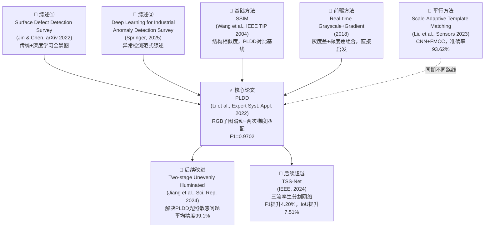

---

## 二、时间线与技术演进

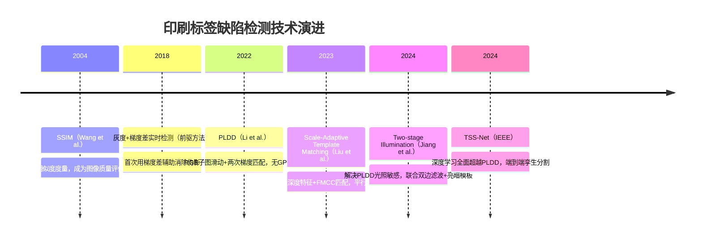

---

## 三、文献详解

### 文献 0（综述入门）：Surface Defect Detection Survey

**基本信息**

- 作者：Qifan Jin, Li Chen（郑州大学）
- 来源：arXiv:2203.05733，2022，开放获取
- 链接：https://arxiv.org/pdf/2203.05733

**为什么要先读这篇**

这篇综述专门面向**小样本标注场景**（与工业现实高度吻合），系统梳理了传统方法和深度学习方法两大分支，是进入该领域最省力的入口。读完后你能快速定位 PLDD 在整个技术谱系中的位置。

**核心内容结构**

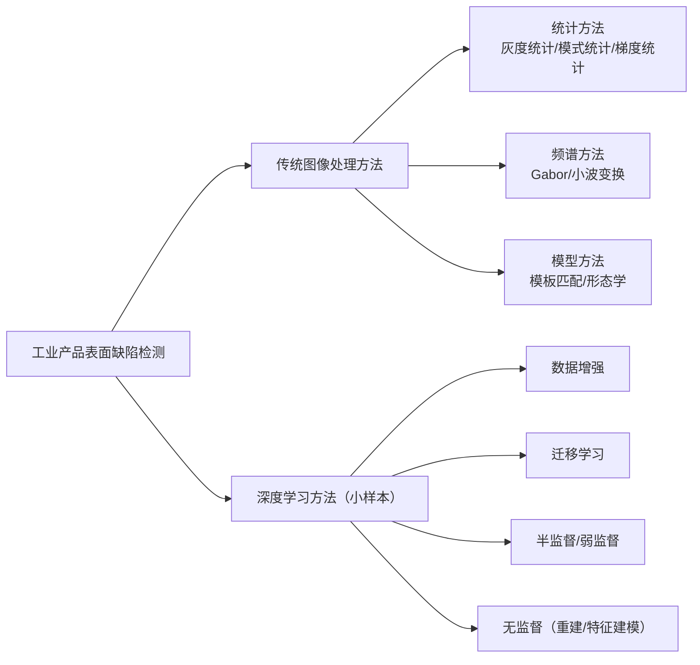

**复现关联**：PLDD 属于"模型方法"中的模板匹配分支，结合了梯度统计。读懂这篇综述的第 2 节（传统方法）后再看 PLDD 会轻松很多。

---

### 文献 1（综述进阶）：Deep Learning for Industrial Visual Anomaly Detection Survey

**基本信息**

- 来源：Artificial Intelligence Review，Springer，2025
- 链接：https://link.springer.com/article/10.1007/s10462-025-11287-7
- PMC 全文：https://pmc.ncbi.nlm.nih.gov/articles/PMC12230580/

**核心贡献**

系统梳理了工业视觉异常检测的深度学习范式，覆盖以下四类方法：

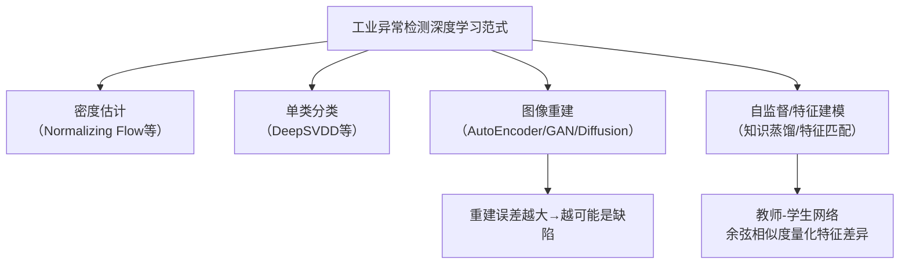

**复现关联**：TSS-Net 属于"特征建模"路线。若你后续想把 PLDD 升级为深度学习版本，这篇综述是关键参考。特别注意其中对**孪生网络**和**知识蒸馏**的介绍。

---

### 文献 2（基础前置）：SSIM — Image Quality Assessment

**基本信息**

- 作者：Zhou Wang, Alan Bovik, Hamid Sheikh, Eero Simoncelli
- 来源：IEEE Transactions on Image Processing，Vol.13，No.4，2004，pp.600–612
- DOI：10.1109/TIP.2003.819861
- 全文：https://ece.uwaterloo.ca/~z70wang/publications/ssim.pdf

**为什么是前置知识**

PLDD 的对比实验直接与 SSIM 比较，且改进余弦相似度在设计思路上受 SSIM"结构信息"哲学启发。理解 SSIM 的三个分量有助于理解为什么 PLDD 选择梯度而非像素差。

**SSIM 的核心思想**

SSIM 认为人类视觉系统对**结构信息**的变化最敏感，而非绝对像素差。给定两个图像信号 $$x$$ 和 $$y$$，SSIM 从三个维度度量相似度：

$$
\text{SSIM}(x, y) = [l(x,y)]^\alpha \cdot [c(x,y)]^\beta \cdot [s(x,y)]^\gamma
$$

三个分量分别为：

$$
l(x,y) = \frac{2\mu_x \mu_y + C_1}{\mu_x^2 + \mu_y^2 + C_1}
$$

$$
c(x,y) = \frac{2\sigma_x \sigma_y + C_2}{\sigma_x^2 + \sigma_y^2 + C_2}
$$

$$
s(x,y) = \frac{\sigma_{xy} + C_3}{\sigma_x \sigma_y + C_3}
$$

其中 $$\mu$$ 为均值，$$\sigma$$ 为标准差，$$\sigma_{xy}$$ 为协方差，$$C_1, C_2, C_3$$ 为稳定常数。

<svg width="100%" viewBox="0 0 680 200" role="img" xmlns="http://www.w3.org/2000/svg">
<title>SSIM三个分量示意图</title>
<desc>SSIM由亮度、对比度、结构三个分量相乘得到，范围0到1</desc>
<defs>
<marker id="arrow" viewBox="0 0 10 10" refX="8" refY="5" markerWidth="6" markerHeight="6" orient="auto-start-reverse">
<path d="M2 1L8 5L2 9" fill="none" stroke="#666666" stroke-width="1.5" stroke-linecap="round" stroke-linejoin="round"/>
</marker>
</defs>
<text fill="#000000" font-family="Arial, sans-serif" font-size="16" font-weight="bold" x="340" y="24" text-anchor="middle" dominant-baseline="central">SSIM = 亮度 × 对比度 × 结构</text>
<!-- 亮度分量（蓝色） -->
<rect x="30" y="44" width="160" height="72" rx="8" fill="none" stroke="#4A90D9" stroke-width="0.5"/>
<text fill="#4A90D9" font-family="Arial, sans-serif" font-size="14" font-weight="bold" x="110" y="70" text-anchor="middle" dominant-baseline="central">亮度 l(x,y)</text>
<text fill="#333333" font-family="Arial, sans-serif" font-size="12" x="110" y="90" text-anchor="middle" dominant-baseline="central">均值之比</text>
<text fill="#666666" font-family="Arial, sans-serif" font-size="11" x="110" y="108" text-anchor="middle" dominant-baseline="central">μx 与 μy 接近→高</text>
<!-- 乘号 -->
<text fill="#333333" font-family="Arial, sans-serif" font-size="18" font-weight="bold" x="210" y="80" text-anchor="middle" dominant-baseline="central">×</text>
<!-- 对比度分量（绿色） -->
<rect x="230" y="44" width="160" height="72" rx="8" fill="none" stroke="#1D9E75" stroke-width="0.5"/>
<text fill="#1D9E75" font-family="Arial, sans-serif" font-size="14" font-weight="bold" x="310" y="70" text-anchor="middle" dominant-baseline="central">对比度 c(x,y)</text>
<text fill="#333333" font-family="Arial, sans-serif" font-size="12" x="310" y="90" text-anchor="middle" dominant-baseline="central">方差之比</text>
<text fill="#666666" font-family="Arial, sans-serif" font-size="11" x="310" y="108" text-anchor="middle" dominant-baseline="central">σx 与 σy 接近→高</text>
<!-- 乘号 -->
<text fill="#333333" font-family="Arial, sans-serif" font-size="18" font-weight="bold" x="410" y="80" text-anchor="middle" dominant-baseline="central">×</text>
<!-- 结构分量（橙色） -->
<rect x="430" y="44" width="160" height="72" rx="8" fill="none" stroke="#F5A623" stroke-width="0.5"/>
<text fill="#F5A623" font-family="Arial, sans-serif" font-size="14" font-weight="bold" x="510" y="70" text-anchor="middle" dominant-baseline="central">结构 s(x,y)</text>
<text fill="#333333" font-family="Arial, sans-serif" font-size="12" x="510" y="90" text-anchor="middle" dominant-baseline="central">协方差/相关性</text>
<text fill="#666666" font-family="Arial, sans-serif" font-size="11" x="510" y="108" text-anchor="middle" dominant-baseline="central">纹理结构相似→高</text>
<!-- 底部说明 -->
<text fill="#333333" font-family="Arial, sans-serif" font-size="12" x="340" y="155" text-anchor="middle" dominant-baseline="central">SSIM ∈ [0,1]，值越大越相似；实际使用时取局部窗口滑动计算均值 MSSIM</text>
<text fill="#333333" font-family="Arial, sans-serif" font-size="12" x="340" y="178" text-anchor="middle" dominant-baseline="central">PLDD 的改进余弦相似度在"结构"维度进行了梯度化替换，更适合印刷图案</text>
</svg>

**SSIM 的局限（为何 PLDD 要改进）**：SSIM 基于灰度值计算，对光照偏移（均值变化）鲁棒性有限；且未专门针对梯度方向建模，无法有效区分形变伪影与真实缺陷。

**复现要点**：用 `skimage.metrics.structural_similarity` 可一行调用；复现 PLDD 时需要将 SSIM 作为对比基线，在相同数据集上跑出其 F1 分数做比较。

---

### 文献 3（直接前驱）：Real-time Defect Detection Based on Grayscale and Gradient Differences

**基本信息**

- 发表：2018，ResearchGate 可获取
- 链接：https://www.researchgate.net/publication/323893228

**核心思路**

这篇论文首次提出用**灰度差 + 梯度差的组合**来消除伪影，是 PLDD 最直接的思想来源。

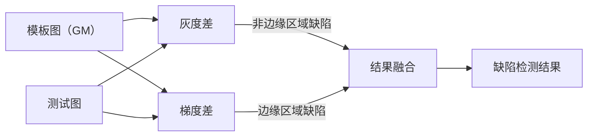

**与 PLDD 的关键区别**

| 维度 | 2018 灰度+梯度差 | PLDD（2022） |
|------|----------------|-------------|
| 梯度度量 | 简单梯度幅值差 $\|G_1\| - \|G_2\|$ | 改进余弦相似度（方向+幅值融合） |
| Artifact 消除 | 双图融合 | RGB 子图滑动配准 |
| RGB 处理 | 灰度化后单通道 | 三通道分别计算后平均融合 |
| 两次匹配 | 无 | 粗筛+精筛两轮 |

**复现关联**：复现 PLDD 前建议先实现这篇方法作为中间基线，有助于理解每个改进步骤的具体收益。

---

### 文献 4（核心论文）：PLDD — Printed Label Defect Detection

**基本信息**

- 作者：Dongming Li 等，哈尔滨工业大学（深圳）
- 来源：Expert Systems with Applications，Vol.204，2022，117372
- DOI：10.1016/j.eswa.2022.117372

**整体框架**

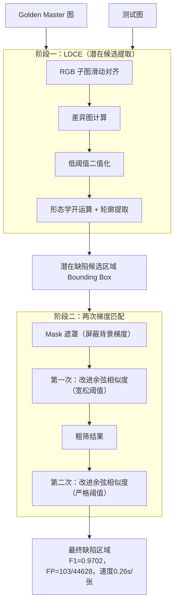

**改进余弦相似度的数学构造**

首先对 R、G、B 三通道分别用 Sobel 算子计算梯度，得到各通道梯度向量，然后做通道平均融合：

$$
\bar{G}(x,y) = \frac{1}{3}\bigl(G_R(x,y) + G_G(x,y) + G_B(x,y)\bigr)
$$

其中每通道 Sobel 梯度为：

$$
G_c = \bigl(G_x^c,\; G_y^c\bigr), \quad G_x^c = K_x * I_c, \quad G_y^c = K_y * I_c
$$

$$
K_x = \begin{bmatrix}-1&0&1\\-2&0&2\\-1&0&1\end{bmatrix}, \quad K_y = \begin{bmatrix}-1&-2&-1\\0&0&0\\1&2&1\end{bmatrix}
$$

设 GM 图在像素 $$(i,j)$$ 处的 RGB 平均梯度向量为 $$\mathbf{u}$$，测试图对应位置为 $$\mathbf{v}$$，改进余弦相似度定义为：

$$
S(\mathbf{u}, \mathbf{v}) = \sigma\!\left(\frac{\mathbf{u} \cdot \mathbf{v}}{|\mathbf{u}||\mathbf{v}| + \varepsilon}\right) \cdot \phi\!\left(|\mathbf{u}| - |\mathbf{v}|\right)
$$

其中 $$\sigma(\cdot)$$ 为非线性激活（受人类视觉系统启发），$$\phi(\cdot)$$ 为对梯度幅值差的惩罚函数，$$\varepsilon$$ 防止除零。

<svg width="100%" viewBox="0 0 680 280" role="img" xmlns="http://www.w3.org/2000/svg">
<title>改进余弦相似度与传统余弦相似度的对比</title>
<desc>左侧展示传统余弦相似度只看方向，右侧展示改进版同时考虑幅值差的惩罚</desc>
<defs>
<marker id="arrow" viewBox="0 0 10 10" refX="8" refY="5" markerWidth="6" markerHeight="6" orient="auto-start-reverse">
<path d="M2 1L8 5L2 9" fill="none" stroke="#666666" stroke-width="1.5" stroke-linecap="round" stroke-linejoin="round"/>
</marker>
<marker id="arrowBlue" viewBox="0 0 10 10" refX="8" refY="5" markerWidth="6" markerHeight="6" orient="auto-start-reverse">
<path d="M2 1L8 5L2 9" fill="none" stroke="#4A90D9" stroke-width="1.5" stroke-linecap="round" stroke-linejoin="round"/>
</marker>
</defs>
<text fill="#000000" font-family="Arial, sans-serif" font-size="16" font-weight="bold" x="340" y="24" text-anchor="middle" dominant-baseline="central">传统余弦相似度 vs 改进版（PLDD）</text>
<!-- 左侧：传统 -->
<rect x="30" y="44" width="290" height="210" rx="10" fill="none" stroke="#E24B4A" stroke-width="0.5" stroke-dasharray="5 3"/>
<text fill="#A32D2D" font-family="Arial, sans-serif" font-size="14" font-weight="bold" x="175" y="64" text-anchor="middle" dominant-baseline="central">传统余弦相似度</text>
<!-- 向量图 -->
<line x1="100" y1="190" x2="180" y2="110" stroke="#4A90D9" stroke-width="2" marker-end="url(#arrowBlue)"/>
<text fill="#333333" font-family="Arial, sans-serif" font-size="11" x="190" y="108" text-anchor="middle" dominant-baseline="central">u（GM梯度，小幅值）</text>
<line x1="100" y1="190" x2="230" y2="116" stroke="#4A90D9" stroke-width="2" marker-end="url(#arrowBlue)"/>
<text fill="#333333" font-family="Arial, sans-serif" font-size="11" x="240" y="114" text-anchor="middle" dominant-baseline="central">v（测试梯度，大幅值）</text>
<!-- 弧线表示角度 -->
<path d="M 120 174 A 26 26 0 0 1 132 158" fill="none" stroke="#666666" stroke-width="1"/>
<text fill="#666666" font-family="Arial, sans-serif" font-size="11" x="140" y="168" text-anchor="start" dominant-baseline="central">θ≈5°</text>
<text fill="#A32D2D" font-family="Arial, sans-serif" font-size="12" font-weight="bold" x="175" y="218" text-anchor="middle" dominant-baseline="central">cos(θ) ≈ 0.996 → 判为相似</text>
<text fill="#A32D2D" font-family="Arial, sans-serif" font-size="12" font-weight="bold" x="175" y="238" text-anchor="middle" dominant-baseline="central">但幅值差很大！误判为无缺陷 ✗</text>
<!-- 右侧：改进版 -->
<rect x="360" y="44" width="290" height="210" rx="10" fill="none" stroke="#1D9E75" stroke-width="0.5" stroke-dasharray="5 3"/>
<text fill="#085041" font-family="Arial, sans-serif" font-size="14" font-weight="bold" x="505" y="64" text-anchor="middle" dominant-baseline="central">改进余弦相似度（PLDD）</text>
<!-- 同样的向量 -->
<line x1="430" y1="190" x2="510" y2="110" stroke="#4A90D9" stroke-width="2" marker-end="url(#arrowBlue)"/>
<line x1="430" y1="190" x2="560" y2="116" stroke="#4A90D9" stroke-width="2.5" marker-end="url(#arrowBlue)"/>
<!-- 幅值差标注 -->
<line x1="510" y1="110" x2="560" y2="116" stroke="#E24B4A" stroke-width="1" stroke-dasharray="3 2"/>
<text fill="#A32D2D" font-family="Arial, sans-serif" font-size="11" x="540" y="104" text-anchor="middle" dominant-baseline="central">幅值差 Δ|G|</text>
<!-- 激活函数压低 -->
<text fill="#085041" font-family="Arial, sans-serif" font-size="13" font-weight="bold" x="505" y="218" text-anchor="middle" dominant-baseline="central">S = cos(θ) × φ(Δ|G|)</text>
<text fill="#085041" font-family="Arial, sans-serif" font-size="12" font-weight="bold" x="505" y="238" text-anchor="middle" dominant-baseline="central">幅值差大→S被压低→判为缺陷 ✓</text>
</svg>

**两次匹配的阈值策略**

| | 第一次匹配 | 第二次匹配 |
|---|---|---|
| 阈值 $$T$$ | 低（宽松） | 高（严格） |
| 目标 | 去掉明显背景，保高召回 | 精筛，误检率 < 0.5% |
| 输入 | LDCE 候选区域 | 第一次粗筛结果 |

**实验性能（三个工业数据集）**

| 方法 | 平均 F1 | 是否需要 GPU | 速度 |
|------|---------|-------------|------|
| SSIM | 0.8312 | 否 | 快 |
| FCN-VGG16 | 0.9023 | 是 | 慢 |
| DeepLabV3+ | 0.9187 | 是 | 慢 |
| **PLDD（本文）** | **0.9702** | **否** | **0.26s/张** |

**复现要点清单**

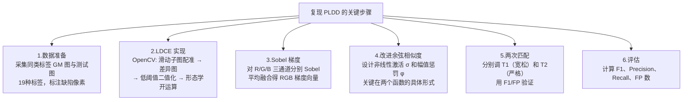

---

### 文献 5（平行方法）：Scale-Adaptive Template Matching and Image Alignment

**基本信息**

- 作者：Xinyu Liu 等，长江大学
- 来源：Sensors，2023，Vol.23，No.9，4414
- DOI：10.3390/s23094414
- 全文（开放）：https://pmc.ncbi.nlm.nih.gov/articles/PMC10181735/

**核心思路**

这篇论文与 PLDD 在同一问题上走了完全不同的路线——用 CNN 提取深度特征代替手工梯度。

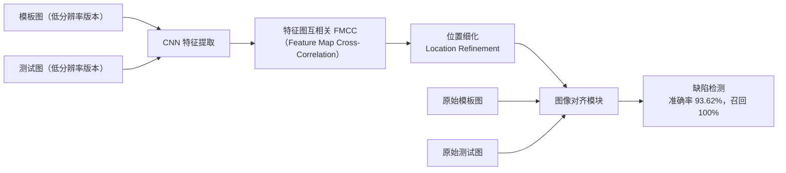

**FMCC（特征图互相关）**

传统模板匹配用像素互相关（NCC），这篇论文用 CNN 输出的特征图做互相关。设模板特征图为 $$\mathbf{F}_t$$，测试图特征图为 $$\mathbf{F}_s$$，FMCC 定义为：

$$
\text{FMCC}(\mathbf{F}_t, \mathbf{F}_s) = \frac{\mathbf{F}_t \cdot \mathbf{F}_s}{\|\mathbf{F}_t\| \cdot \|\mathbf{F}_s\|}
$$

**与 PLDD 的对比**

| 维度 | PLDD（2022） | Scale-Adaptive（2023） |
|------|-------------|----------------------|
| 特征提取 | 手工 Sobel 梯度 | CNN 深度特征 |
| 匹配度量 | 改进余弦相似度 | FMCC |
| 对齐方式 | RGB 子图滑动 | 学习式图像对齐模块 |
| 准确率 | F1=0.9702 | Accuracy=93.62% |
| 需要 GPU | 否 | 是 |
| 需要训练数据 | 仅需 GM 图 | 需要有标注的训练集 |

**复现关联**：如果你的场景有足够标注数据且有 GPU，这篇方法的准确率更高、抗干扰能力更强。若资源受限，PLDD 是更实用的选择。

---

### 文献 6（后续改进）：Two-stage Defect Detection for Unevenly Illuminated Printed Materials

**基本信息**

- 作者：Qing Jiang 等，中国计量大学
- 来源：Scientific Reports，2024，Vol.14，20547
- DOI：10.1038/s41598-024-71514-z
- 全文（开放）：https://www.nature.com/articles/s41598-024-71514-z

**动机：PLDD 的哪个缺陷被解决了**

这篇论文在摘要中明确指出：PLDD 对光照变化敏感，在不均匀光照下伪缺陷增多。其解决方案分为两步：

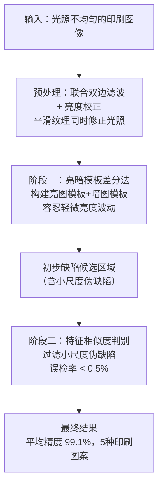

**亮暗模板差分法**

针对光照偏亮或偏暗的情况，分别构造"亮模板"和"暗模板"，取两者差分结果的并集：

$$
D_{final}(x,y) = D_{bright}(x,y) \cup D_{dark}(x,y)
$$

其中 $$D_{bright}$$ 和 $$D_{dark}$$ 分别为与亮/暗参考模板做差分后的缺陷图。

<svg width="100%" viewBox="0 0 680 220" role="img" xmlns="http://www.w3.org/2000/svg">
<title>亮暗模板差分法示意图</title>
<desc>分别与亮模板和暗模板做差分，取并集，对抗光照波动</desc>
<defs>
<marker id="arrow" viewBox="0 0 10 10" refX="8" refY="5" markerWidth="6" markerHeight="6" orient="auto-start-reverse">
<path d="M2 1L8 5L2 9" fill="none" stroke="#666666" stroke-width="1.5" stroke-linecap="round" stroke-linejoin="round"/>
</marker>
</defs>
<text fill="#000000" font-family="Arial, sans-serif" font-size="16" font-weight="bold" x="340" y="24" text-anchor="middle" dominant-baseline="central">亮暗模板差分组合策略</text>
<!-- 测试图 -->
<rect x="40" y="48" width="120" height="52" rx="8" fill="none" stroke="#888888" stroke-width="0.5"/>
<text fill="#333333" font-family="Arial, sans-serif" font-size="14" font-weight="bold" x="100" y="68" text-anchor="middle" dominant-baseline="central">测试图</text>
<text fill="#666666" font-family="Arial, sans-serif" font-size="12" x="100" y="86" text-anchor="middle" dominant-baseline="central">光照不均匀</text>
<!-- 分叉线 -->
<line x1="100" y1="100" x2="100" y2="124" stroke="#666666" stroke-width="1"/>
<line x1="100" y1="124" x2="230" y2="124" stroke="#666666" stroke-width="1"/>
<line x1="100" y1="124" x2="230" y2="164" stroke="#666666" stroke-width="1"/>
<line x1="230" y1="124" x2="230" y2="130" stroke="#666666" stroke-width="1.5" marker-end="url(#arrow)"/>
<line x1="230" y1="164" x2="230" y2="140" stroke="#666666" stroke-width="1.5" marker-end="url(#arrow)"/>
<!-- 亮模板 -->
<rect x="170" y="48" width="120" height="52" rx="8" fill="none" stroke="#F5A623" stroke-width="0.5"/>
<text fill="#F5A623" font-family="Arial, sans-serif" font-size="14" font-weight="bold" x="230" y="68" text-anchor="middle" dominant-baseline="central">亮模板</text>
<text fill="#666666" font-family="Arial, sans-serif" font-size="12" x="230" y="86" text-anchor="middle" dominant-baseline="central">偏亮参考图</text>
<!-- 暗模板 -->
<rect x="170" y="140" width="120" height="52" rx="8" fill="none" stroke="#4A90D9" stroke-width="0.5"/>
<text fill="#4A90D9" font-family="Arial, sans-serif" font-size="14" font-weight="bold" x="230" y="160" text-anchor="middle" dominant-baseline="central">暗模板</text>
<text fill="#666666" font-family="Arial, sans-serif" font-size="12" x="230" y="178" text-anchor="middle" dominant-baseline="central">偏暗参考图</text>
<!-- 差分结果连接线 -->
<line x1="290" y1="74" x2="360" y2="100" stroke="#666666" stroke-width="1.5" marker-end="url(#arrow)"/>
<line x1="290" y1="166" x2="360" y2="140" stroke="#666666" stroke-width="1.5" marker-end="url(#arrow)"/>
<text fill="#666666" font-family="Arial, sans-serif" font-size="11" x="325" y="88" text-anchor="middle" dominant-baseline="central">差分①</text>
<text fill="#666666" font-family="Arial, sans-serif" font-size="11" x="325" y="152" text-anchor="middle" dominant-baseline="central">差分②</text>
<!-- 并集 -->
<rect x="362" y="90" width="120" height="56" rx="8" fill="none" stroke="#1D9E75" stroke-width="0.5"/>
<text fill="#1D9E75" font-family="Arial, sans-serif" font-size="14" font-weight="bold" x="422" y="110" text-anchor="middle" dominant-baseline="central">并集 D_final</text>
<text fill="#666666" font-family="Arial, sans-serif" font-size="11" x="422" y="128" text-anchor="middle" dominant-baseline="central">覆盖两种光照</text>
<line x1="482" y1="118" x2="530" y2="118" stroke="#666666" stroke-width="1.5" marker-end="url(#arrow)"/>
<!-- 阶段二过滤 -->
<rect x="532" y="90" width="120" height="56" rx="8" fill="none" stroke="#1D9E75" stroke-width="0.5"/>
<text fill="#1D9E75" font-family="Arial, sans-serif" font-size="14" font-weight="bold" x="592" y="110" text-anchor="middle" dominant-baseline="central">特征相似度</text>
<text fill="#666666" font-family="Arial, sans-serif" font-size="11" x="592" y="128" text-anchor="middle" dominant-baseline="central">过滤小伪缺陷</text>
</svg>

**复现关联**：如果你的实际场景存在光照不均匀（车间灯光、反光等），这篇论文的"亮度校正 → 亮暗模板"预处理方案可以直接插入 PLDD 流程的前端，作为增强模块。

---

### 文献 7（最新超越）：TSS-Net — Triple-stream Siamese Segmentation Network

**基本信息**

- 来源：IEEE Transactions（IEEE Xplore），2024
- 链接：https://ieeexplore.ieee.org/document/10726567/

**核心创新**

TSS-Net 用深度学习完全替代手工特征，解决了 PLDD 面对**大形变**和**未见缺陷**时泛化能力不足的问题。

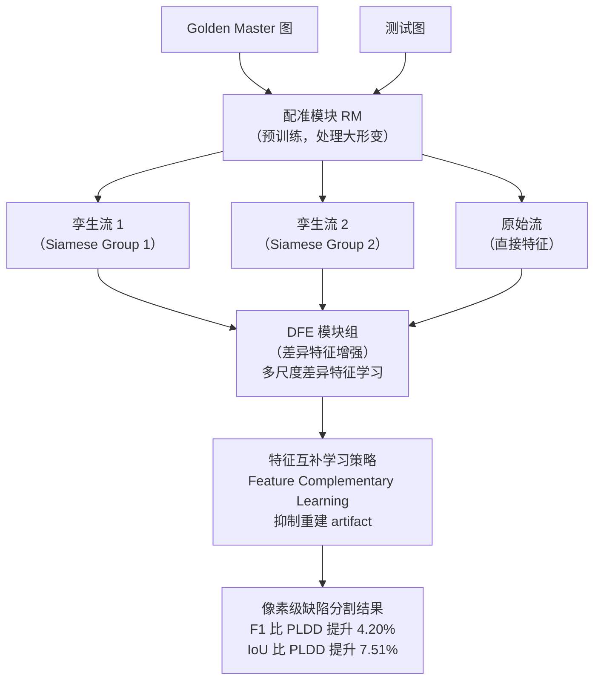

**三流结构的设计逻辑**

两条孪生流分别学习"变形前后"的差异特征，第三流保留原始特征防止信息损失；DFE 模块在多个尺度上强制网络关注差异区域而忽略不变区域。

**与 PLDD 的性能对比**

| 方法 | F1 | IoU | 是否端到端 | 训练数据需求 |
|------|-----|-----|----------|------------|
| PLDD | 0.9702 | ~0.90 | 否 | 仅需 GM 图 |
| TSS-Net | **+4.20%** | **+7.51%** | 是 | 需标注数据 |

**复现关联**：TSS-Net 是"如果你有 GPU 和标注数据"的终极选择。其配准模块（RM）的预训练策略和 DFE 的多尺度差异增强思路，也可以抽取出来嫁接到其他检测框架中。

---

## 四、复现路径建议

根据资源情况选择不同的复现路线：

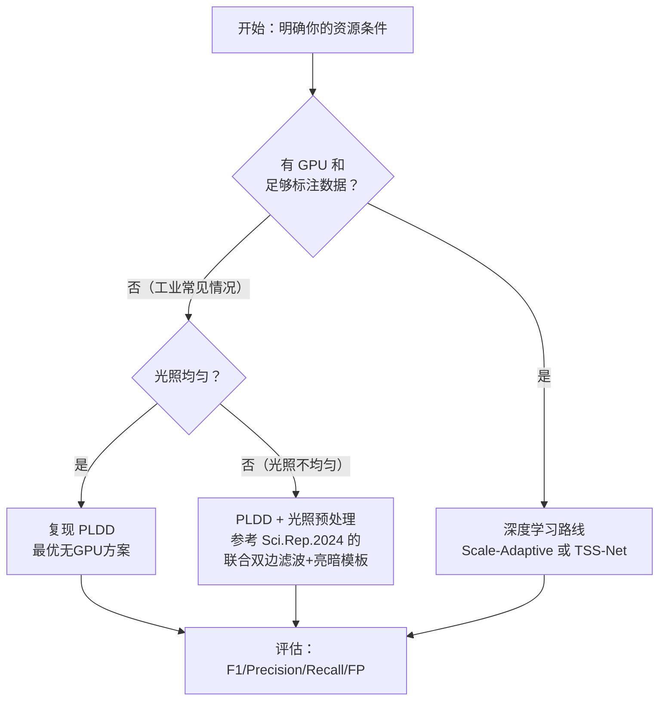

**逐步复现 PLDD 的工具推荐**

| 步骤 | 推荐工具/库 |
|------|------------|
| 图像读取与预处理 | OpenCV (`cv2`) |
| Sobel 梯度 | `cv2.Sobel` |
| 形态学操作 | `cv2.morphologyEx(MORPH_OPEN)` |
| 轮廓提取 | `cv2.findContours` |
| 余弦相似度 | `numpy` 向量运算 |
| 评估指标 | `sklearn.metrics`（F1、Precision、Recall） |
| SSIM 基线 | `skimage.metrics.structural_similarity` |

---

## 五、参考文献汇总

| # | 文献 | 年份 | 获取方式 |
|---|------|------|---------|
| 0 | Jin & Chen, Surface Defect Detection Survey | 2022 | arXiv 免费 |
| 1 | Deep Learning Anomaly Detection Survey | 2025 | Springer/PMC |
| 2 | Wang et al., SSIM | 2004 | 作者主页免费 |
| 3 | Real-time Grayscale+Gradient Detection | 2018 | ResearchGate |
| 4 | Li et al., PLDD（核心） | 2022 | ScienceDirect |
| 5 | Liu et al., Scale-Adaptive Matching | 2023 | PMC 免费 |
| 6 | Jiang et al., Two-stage Illumination | 2024 | Nature 免费 |
| 7 | TSS-Net | 2024 | IEEE Xplore |
