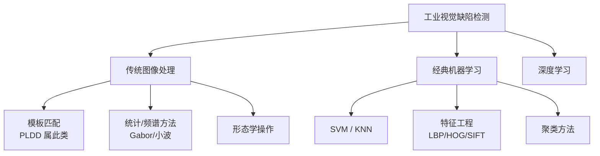
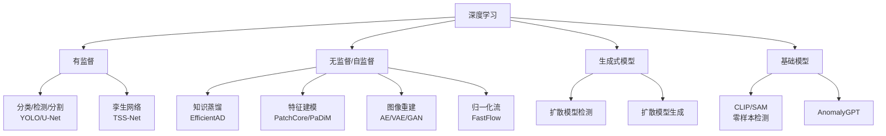
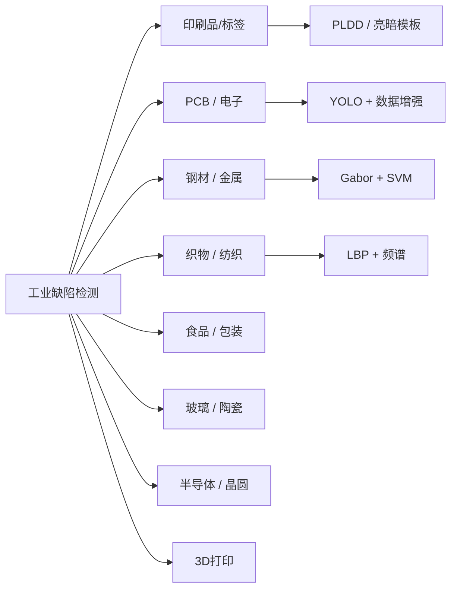
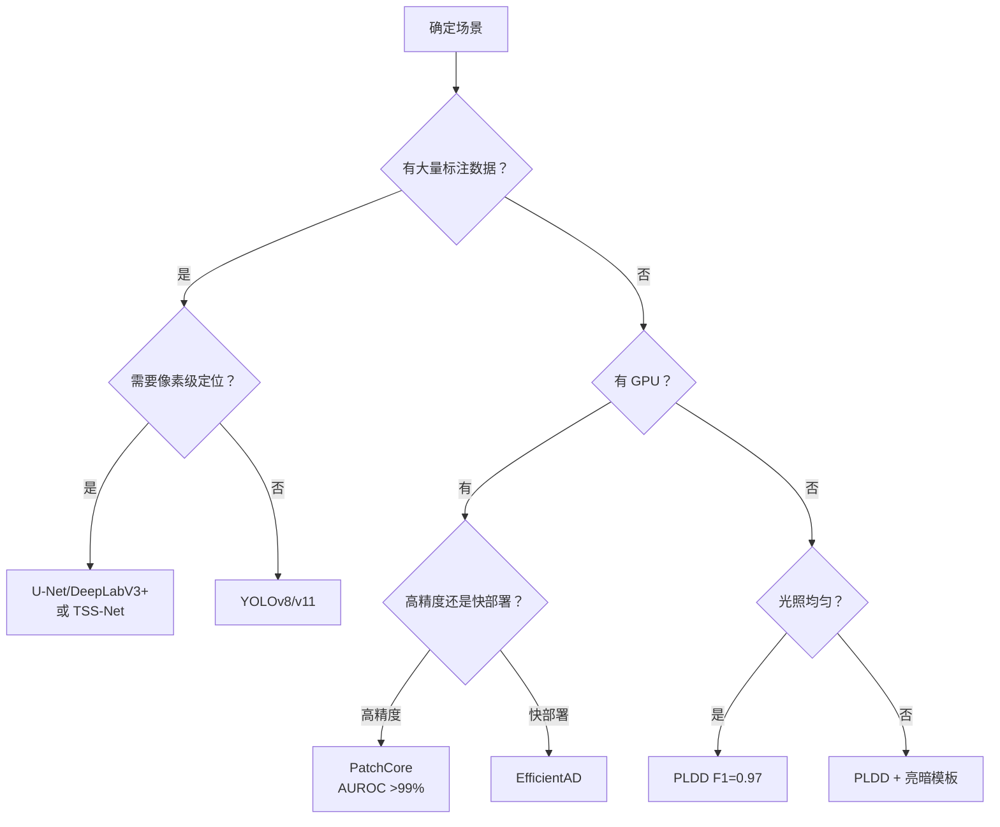
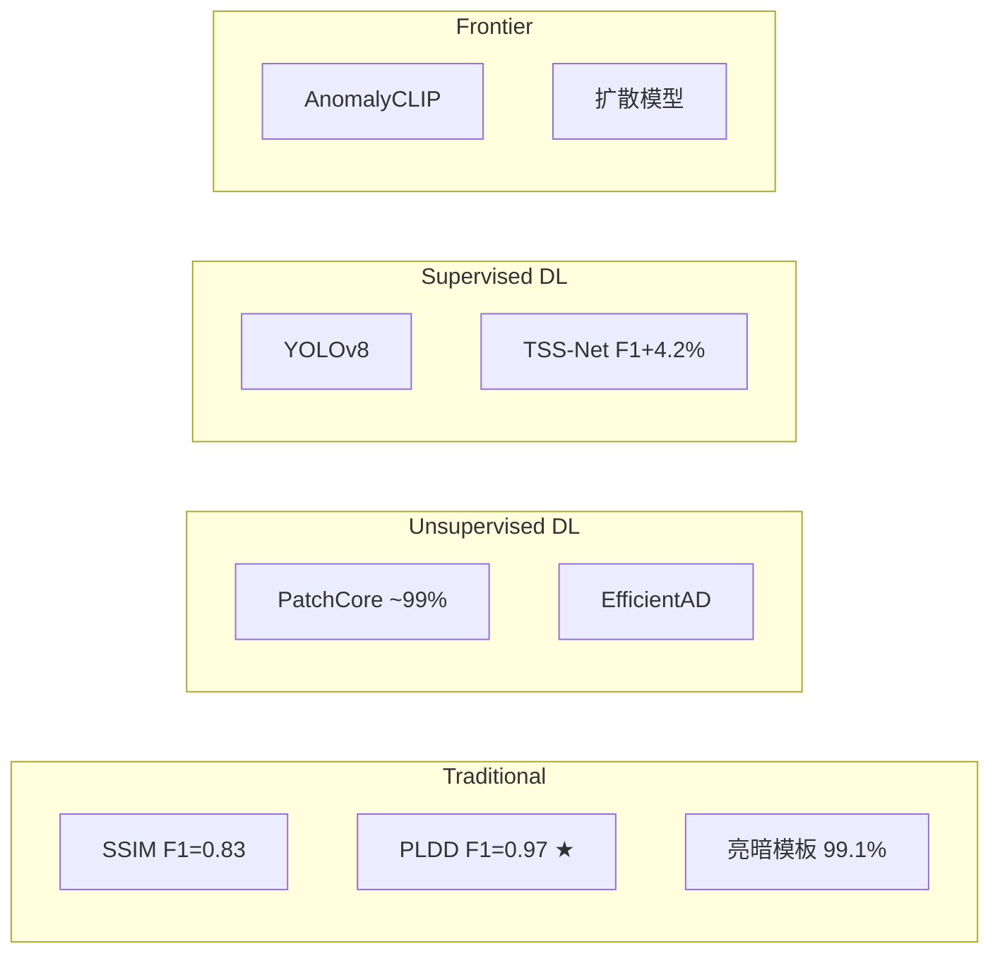

# 印刷检测行业技术全景调研

> 六大技术路线 × 十大应用领域，从传统方法到基础模型的行业全景。

## 目录

- [一、全局视图](#一全局视图)
- [二、核心概念](#二核心概念)
- [三、六大技术路线详解](#三六大技术路线详解)
- [四、应用领域地图](#四应用领域地图)
- [五、基准数据集与排行榜](#五基准数据集与排行榜)
- [六、行业工具与框架](#六行业工具与框架)
- [七、必读综述导航](#七必读综述导航)
- [八、技术选型决策树](#八技术选型决策树)
- [九、趋势与 PLDD 定位](#九趋势与-pldd-定位)
- [附录：术语表](#附录术语表)

---

## 一、全局视图

> 工业缺陷检测已从传统图像处理发展到基础模型时代，六大路线并行演进。

### 技术路线总览（传统 + 经典 ML）



### 技术路线总览（深度学习分支）



### 技术成熟度光谱

<svg viewBox="0 0 720 220" xmlns="http://www.w3.org/2000/svg">
<defs>
<linearGradient id="g1" x1="0" y1="0" x2="1" y2="0">
<stop offset="0%" stop-color="#4a9edd"/>
<stop offset="100%" stop-color="#1a5f8a"/>
</linearGradient>
<marker id="arr" markerWidth="8" markerHeight="8" refX="6" refY="3" orient="auto">
<path d="M0,0 L0,6 L8,3 z" fill="#555"/>
</marker>
</defs>
<g id="background">
<rect x="30" y="20" width="660" height="40" rx="6" fill="#f0f4f8"/>
<rect x="30" y="80" width="660" height="120" rx="8" fill="#fafafa" stroke="#ddd" stroke-width="1"/>
</g>
<g id="edges">
<line x1="60" y1="65" x2="60" y2="78" stroke="#555" stroke-width="1.2" marker-end="url(#arr)"/>
<line x1="360" y1="65" x2="360" y2="78" stroke="#555" stroke-width="1.2" marker-end="url(#arr)"/>
<line x1="660" y1="65" x2="660" y2="78" stroke="#555" stroke-width="1.2" marker-end="url(#arr)"/>
</g>
<g id="nodes">
<rect x="30" y="25" width="660" height="30" rx="4" fill="url(#g1)" opacity="0.8"/>
</g>
<g id="labels">
<text x="45" y="45" font-size="13" font-weight="bold" fill="#fff">工业成熟</text>
<text x="645" y="45" font-size="13" font-weight="bold" fill="#fff" text-anchor="end">研究前沿</text>
<text x="60" y="105" font-size="12" font-weight="bold" fill="#1a5f8a">传统方法</text>
<text x="60" y="122" font-size="11" fill="#333">PLDD / SSIM / Gabor</text>
<text x="60" y="139" font-size="10" fill="#666">无 GPU，实时，F1≈0.97</text>
<text x="260" y="105" font-size="12" font-weight="bold" fill="#1a5f8a">无监督 DL</text>
<text x="260" y="122" font-size="11" fill="#333">PatchCore / EfficientAD</text>
<text x="260" y="139" font-size="10" fill="#666">需 GPU，AUROC >99%</text>
<text x="460" y="105" font-size="12" font-weight="bold" fill="#1a5f8a">有监督 DL</text>
<text x="460" y="122" font-size="11" fill="#333">YOLOv8 / TSS-Net</text>
<text x="460" y="139" font-size="10" fill="#666">需标注+GPU，精度最高</text>
<text x="600" y="105" font-size="12" font-weight="bold" fill="#c44">前沿探索</text>
<text x="600" y="122" font-size="11" fill="#333">扩散 / CLIP / AnomalyGPT</text>
<text x="600" y="139" font-size="10" fill="#666">零样本，精度待验证</text>
<text x="60" y="175" font-size="11" fill="#888">部署门槛低 ←</text>
<text x="660" y="175" font-size="11" fill="#888" text-anchor="end">→ 数据需求低</text>
</g>
</svg>

---

## 二、核心概念

> 理解本文档需要的关键术语，首次出现时在括号内标注英文。

| 术语 | 英文 | 含义 |
|------|------|------|
| **GM 图** | Golden Master | 标准无缺陷模板图像，作为检测基准 |
| **AUROC** | Area Under ROC Curve | 异常检测核心指标，越高越好，1.0 为满分 |
| **F1** | F1-Score | 精确率和召回率的调和平均，0-1 越高越好 |
| **IoU** | Intersection over Union | 像素级分割精度指标，预测与标注的重叠度 |
| **PRO** | Per-Region Overlap | MVTec 基准专用指标，按连通区域加权 |
| **LDCE** | Latent Defect Candidate Extraction | PLDD 第一阶段，潜在缺陷候选提取 |
| **知识蒸馏** | Knowledge Distillation | 教师网络→学生网络，用特征差异检测异常 |
| **孪生网络** | Siamese Network | 双分支共享权重网络，学习成对样本差异 |
| **归一化流** | Normalizing Flow | 可逆变换建模正常分布，偏离即异常 |
| **PatchCore** | — | 当前最流行的无监督异常检测方法，CoreSet + patch 匹配 |
| **零样本检测** | Zero-shot Detection | 无需目标类训练数据即可检测，依赖基础模型 |

---

## 三、六大技术路线详解

### 路线 1：传统图像处理

> 无数据依赖、无 GPU，适合产线边缘设备实时部署。

**代表方法**：模板匹配、梯度差分、SSIM、形态学

| 方法 | 核心思路 | 优点 | 局限 |
|------|---------|------|------|
| PLDD（2022） | RGB 子图滑动 + 两次梯度匹配 | 无 GPU 实时，F1=0.97 | 光照敏感，大形变不足 |
| 灰度+梯度差分（2018） | 灰度差与梯度差融合 | 极快 | 精度有限 |
| SSIM（2004） | 结构相似度度量 | 通用基线 | 对光照偏移鲁棒性差 |
| Gabor 滤波 | 纹理方向性分析 | 钢材/织物适用 | 参数调优困难 |
| 亮暗模板差分（2024） | 亮/暗双模板取并集 | 抗光照不均匀 | 需多模板 |

**适用**：标注数据极少、算力有限、实时性要求高。

---

### 路线 2：经典机器学习

> 小样本友好、可解释性强，手工特征上限有限。

| 方法 | 特征 | 分类器 | 适用 |
|------|------|--------|------|
| LBP + SVM | 局部二值模式纹理 | SVM | 织物/木材 |
| HOG + SVM | 梯度方向直方图 | SVM | 钢材表面 |
| SIFT 匹配 | 尺度不变特征 | KNN/模板 | 变形容忍 |
| Gabor + PCA | 频谱特征降维 | SVM/贝叶斯 | 纹理均匀表面 |

---

### 路线 3：深度学习（有监督）

> 有充足标注 + GPU 时精度最高，但工业场景标注成本是核心瓶颈。

| 方法类型 | 代表网络 | 检测粒度 | 数据需求 |
|---------|---------|---------|---------|
| 分类 | ResNet / EfficientNet | 图像级 | 中等 |
| 目标检测 | YOLOv8 / Faster R-CNN | 框级 | 大量 |
| 语义分割 | U-Net / DeepLabV3+ | 像素级 | 大量+像素标注 |
| 孪生分割 | TSS-Net（2024） | 像素级 | 中等+GM 图 |

**关键洞察**：

- PLDD 论文中 FCN-VGG16 的 F1=0.90、DeepLabV3+ 的 F1=0.92，均低于 PLDD 的 0.97——**训练数据不足时有监督 DL 反而不如传统方法**
- TSS-Net（2024）用三流孪生结构超越 PLDD（F1 +4.2%, IoU +7.5%），但需 GPU 和标注数据
- YOLO 系列（v5/v8/v11）是实时检测主流选择

---

### 路线 4：无监督/自监督异常检测

> 2022-2025 年最活跃方向，解决"缺陷样本极少"的工业核心痛点。

#### 4.1 知识蒸馏（Student-Teacher）

```text
教师网络（预训练） → 提取正常样本特征
学生网络（训练）   → 学习模仿教师
检测时：师生特征差异大 → 异常
```

| 方法 | 年份 | 机构 | 特点 |
|------|------|------|------|
| STFPM | 2021 | Amazon | 特征金字塔匹配 |
| EfficientAD | 2024 | Siemens | 轻量高效，工业可用 |
| 逆向蒸馏 | 2024 | — | 反转蒸馏方向提升性能 |
| 多模态蒸馏 MMRD | 2024 | — | 支持 3D 点云异常检测 |

#### 4.2 特征建模（Feature Embedding）

```text
正常样本 → 预训练网络提取特征 → 建模正常分布
测试样本 → 同网络提取特征 → 偏离分布即异常
```

| 方法 | 年份 | 核心思想 | MVTec AUROC |
|------|------|---------|-------------|
| PaDiM | 2021 | 多元高斯建模 patch 特征 | ~95% |
| SPADE | 2021 | KNN 匹配正常 patch | ~95% |
| **PatchCore** | 2022 | CoreSet 采样 + patch 匹配 | **~99%** |
| **SimpleNet** | 2023 | 简单线性判别 | **99.6%** |
| CFA | 2022 | 耦合超球面特征适配 | ~98% |

**PatchCore 是当前工业部署最广泛的无监督方法**，仅需正常样本训练。

#### 4.3 归一化流与图像重建

| 方法类型 | 代表 | 思路 |
|---------|------|------|
| 归一化流 | CFLOW-AD / FastFlow / MSFlow | 可逆变换建模正常密度 |
| 自编码器（AE） | Encoder-Decoder | 重建误差大→异常 |
| 变分 AE（VAE） | 概率编码 | 捕捉正常分布 |
| GAN | 生成器+判别器 | 重建+判别双信号 |

---

### 路线 5：扩散模型

> 2024-2025 最热新方向，检测和生成双重用途。

#### 5.1 用于异常检测（重建式）


扩散模型只学会重建正常样本，缺陷区域重建失败→差异图定位异常。

#### 5.2 用于缺陷数据生成（解决数据稀缺）

| 方法 | 年份 | 特点 |
|------|------|------|
| AnomalyDiffusion | 2024 | 条件扩散生成缺陷 |
| TF-IDG | 2025 | 无训练，单样本生成 |
| Structured-GDM | 2025 | 独立控制缺陷属性 |
| DIAG | 2025 | 无训练，基于 LDM 生成 |
| Text-Guided | 2025 | 文本引导缺陷生成 |

**关键意义**：工业最大痛点是缺陷样本少。扩散模型可批量合成逼真缺陷图像用于训练。

---

### 路线 6：基础模型

> 从专用模型到通用基础模型，零样本/少样本检测能力越来越强。

| 方法 | 年份 | 基础模型 | 核心思路 |
|------|------|---------|---------|
| WinCLIP | 2023 | CLIP | 窗口化零样本异常检测 |
| AnomalyCLIP | 2024 | CLIP | 可学习的异常文本提示 |
| SAA / SAA+ | 2024 | SAM | Segment Anything 辅助分割 |
| AnomalyGPT | 2024 | LLM + 视觉 | 大语言模型异常检测对话 |

综述参考：[Foundation-Model-Based Industrial Defect Detection Survey](https://arxiv.org/html/2502.19106v1)

---

## 四、应用领域地图

> 缺陷检测覆盖十大工业领域，各领域方法偏好差异显著。



### 各领域特点与方法选择

| 应用领域 | 缺陷类型 | 常用方法 | 数据难度 | 代表数据集 |
|---------|---------|---------|---------|-----------|
| **印刷标签** | 漏印/过印/偏色/模糊 | 模板匹配+梯度（PLDD） | 中 | 自建 |
| **PCB 板** | 短路/断路/缺件/偏移 | YOLO/U-Net + 数据增强 | 中 | [DeepPCB](https://github.com/tangsanjin/DeepPCB) |
| **钢材表面** | 划痕/裂纹/氧化/凹坑 | Gabor + SVM / YOLO | 低 | NEU-CLS, GC10-DET |
| **织物** | 断经/断纬/油污/破洞 | LBP + Gabor / U-Net | 低 | AITEX |
| **半导体晶圆** | 颗粒/划痕/图案缺陷 | 统计模式 / CNN | 高 | [WM-811K](https://www.kaggle.com/datasets/qingyi/wm811k-wafer-map) |
| **3D 打印** | 层缺陷/翘曲/孔洞 | 热成像 + CNN / 点云 | 高 | 自建 |
| **玻璃/陶瓷** | 裂纹/气泡/杂质 | 多视角 + DL | 高 | 自建 |

---

## 五、基准数据集与排行榜

> MVTec AD 是异常检测领域的 ImageNet，所有新方法必须在其上报告结果。

### 通用异常检测基准

| 数据集 | 年份 | 类别数 | 样本数 | 任务 | 评价标准 |
|--------|------|--------|--------|------|---------|
| **MVTec AD** | 2019 | 15 | ~5K | 异常检测+定位 | AUROC, PRO |
| **MVTec AD 2** | 2025 | — | — | 异常检测 | VAND 3.0 多指标 |
| **VisA** | 2022 | 12 | ~10K | 异常检测 | AUROC, PRO |
| **Real-IAD** | 2024 | 30 | 150K | 大规模真实工业 | 多指标 |
| **MPDD** | 2021 | 6 | ~1.3K | 金属表面 | AUROC |

### 领域专用数据集

| 数据集 | 领域 | 缺陷类别 | 开放获取 |
|--------|------|---------|---------|
| [DeepPCB](https://github.com/tangsanjin/DeepPCB) | PCB | 6 种 | GitHub |
| [PCB Defect](https://www.nature.com/articles/s41597-024-03656-8) | PCB | 9 种 | Nature |
| NEU-CLS | 钢材 | 6 种 | 公开 |
| GC10-DET | 金属 | 10 种 | 公开 |
| AITEX | 纺织 | 7 种 | 公开 |
| WM-811K | 晶圆 | 8 种 | Kaggle |
| DAGM 2007 | 纹理 | 10 类 | 官方申请 |

### MVTec AD 排行榜（截至 2025 年底）

<svg viewBox="0 0 560 200" xmlns="http://www.w3.org/2000/svg">
<defs>
<linearGradient id="bar1" x1="0" y1="0" x2="1" y2="0">
<stop offset="0%" stop-color="#4a9edd"/>
<stop offset="100%" stop-color="#2d7ab5"/>
</linearGradient>
<linearGradient id="bar2" x1="0" y1="0" x2="1" y2="0">
<stop offset="0%" stop-color="#5bb5e0"/>
<stop offset="100%" stop-color="#3d8fc0"/>
</linearGradient>
<linearGradient id="bar3" x1="0" y1="0" x2="1" y2="0">
<stop offset="0%" stop-color="#7dcce8"/>
<stop offset="100%" stop-color="#5bb5d8"/>
</linearGradient>
<linearGradient id="bar4" x1="0" y1="0" x2="1" y2="0">
<stop offset="0%" stop-color="#a8dff0"/>
<stop offset="100%" stop-color="#88c8e0"/>
</linearGradient>
</defs>
<g id="background">
<rect x="0" y="0" width="560" height="200" fill="#fafafa" rx="8"/>
</g>
<g id="edges">
<line x1="140" y1="30" x2="540" y2="30" stroke="#eee" stroke-width="1"/>
<line x1="140" y1="70" x2="540" y2="70" stroke="#eee" stroke-width="1"/>
<line x1="140" y1="110" x2="540" y2="110" stroke="#eee" stroke-width="1"/>
<line x1="140" y1="150" x2="540" y2="150" stroke="#eee" stroke-width="1"/>
</g>
<g id="nodes">
<rect x="140" y="18" width="392" height="24" rx="4" fill="url(#bar1)"/>
<rect x="140" y="58" width="384" height="24" rx="4" fill="url(#bar2)"/>
<rect x="140" y="98" width="360" height="24" rx="4" fill="url(#bar3)"/>
<rect x="140" y="138" width="280" height="24" rx="4" fill="url(#bar4)"/>
</g>
<g id="labels">
<text x="135" y="34" font-size="12" font-weight="bold" fill="#1a5f8a" text-anchor="end">SimpleNet</text>
<text x="135" y="74" font-size="12" font-weight="bold" fill="#1a5f8a" text-anchor="end">PatchCore</text>
<text x="135" y="114" font-size="12" font-weight="bold" fill="#1a5f8a" text-anchor="end">EfficientAD</text>
<text x="135" y="154" font-size="12" font-weight="bold" fill="#1a5f8a" text-anchor="end">PaDiM</text>
<text x="535" y="34" font-size="11" font-weight="bold" fill="#fff" text-anchor="end">99.6%</text>
<text x="527" y="74" font-size="11" font-weight="bold" fill="#fff" text-anchor="end">99.1%</text>
<text x="498" y="114" font-size="11" font-weight="bold" fill="#fff" text-anchor="end">~98.5%</text>
<text x="418" y="154" font-size="11" font-weight="bold" fill="#fff" text-anchor="end">~95%</text>
<text x="340" y="185" font-size="11" fill="#888" text-anchor="middle">Image AUROC（越高越好，满分 100%）</text>
</g>
</svg>

> 排行榜参考：[CodeSOTA MVTec AD](https://www.codesota.com/benchmark/mvtec-ad) · [VAND 3.0 @ CVPR 2025](https://sites.google.com/view/vand30cvpr2025/challenge)

---

## 六、行业工具与框架

> Anomalib 是工业异常检测的一站式开源框架，支持 15+ 方法。

### 开源框架

| 框架 | 维护方 | 支持方法 | 定位 |
|------|--------|---------|------|
| [Anomalib](https://github.com/openvinotoolkit/anomalib) | Intel / OpenVINO | PatchCore, PaDiM, EfficientAD 等 15+ | 工业异常检测一站式 |
| [MMDetection](https://github.com/open-mmlab/mmdetection) | OpenMMLab | YOLO, Faster R-CNN, Mask R-CNN | 通用目标检测 |
| [Ultralytics](https://github.com/ultralytics/ultralytics) | Ultralytics | YOLOv5/v8/v11 | 最易用 YOLO 生态 |
| [SAM](https://github.com/facebookresearch/segment-anything) | Meta | 零样本分割 | 通用分割基础模型 |

### 商业解决方案

| 厂商 | 产品 | 特点 |
|------|------|------|
| [Cognex](https://www.cognex.com/en/applications/automated-defect-detection/printed-label-inspection-and-verification/automated-print-quality-inspection-and-verification) | In-Sight / ViDi | AI+传统混合，印刷标签专用 |
| [MVTec](https://www.mvtec.com/application-areas/applications/quality-inspection) | MERLIC / HALCON | 工业机器视觉标准软件 |
| [Teledyne](https://www.teledynevisionsolutions.com/solutions/machine-vision/print-inspection/) | 线扫相机系统 | 连续印刷/卷材检测 |

### 学术资源索引

| 资源 | 说明 |
|------|------|
| [Awesome Industrial AD](https://github.com/m-3lab/awesome-industrial-anomaly-detection) | 论文+代码+数据集大全 |
| [Awesome Anomaly Generation](https://github.com/yuxin-jiang/Awesome-Anomaly-Generation) | 缺陷生成方法汇总 |
| [DMAD Survey](https://github.com/fdjingliu/DMAD) | 扩散模型异常检测综述 |
| [IAD-Survey](https://github.com/IHPCRits/IAD-Survey) | 工业异常检测综述论文集 |

---

## 七、必读综述导航

> 按推荐优先级排序，覆盖入门→进阶→前沿三个层次。

### 入门级（理解全景）

| # | 综述 | 年份 | 链接 | 适合人群 |
|---|------|------|------|---------|
| 1 | Surface Defect Detection Survey | 2022 | [arXiv:2203.05733](https://arxiv.org/pdf/2203.05733) | 传统+DL 全景入门 |
| 2 | A Survey on Visual Anomaly Detection | 2024 | [arXiv:2401.16402](https://arxiv.org/abs/2401.16402) | 三大挑战分析 |
| 3 | Critical Analysis for Visual Industrial AD | 2025 | [arXiv:2503.23451](https://arxiv.org/html/2503.23451v1) | 工程实践导向 |

### 进阶级（深入方法论）

| # | 综述 | 年份 | 链接 | 覆盖范围 |
|---|------|------|------|---------|
| 4 | DL for Industrial Visual AD | 2025 | [Springer](https://link.springer.com/article/10.1007/s10462-025-11287-7) | 异常检测范式全覆盖 |
| 5 | Industrial Anomalies Synthesis | 2025 | [arXiv:2502.16412](https://arxiv.org/html/2502.16412v1) | 缺陷合成方法大全 |
| 6 | AD and Generation with Diffusion Models | 2025 | [arXiv:2506.09368](https://arxiv.org/abs/2506.09368) | 扩散模型×异常检测 |
| 7 | Foundation-Model-Based Defect Detection | 2025 | [arXiv:2502.19106](https://arxiv.org/html/2502.19106v1) | 基础模型前沿 |

### 中文综述

| # | 综述 | 来源 | 链接 |
|---|------|------|------|
| 8 | 工业视觉异常检测：架构/模态/学习范式 | 信号处理 | [PDF](https://signal.ejournal.org.cn/cn/article/pdf/preview/10.12466/xhcl.2026.02.012.pdf) |
| 9 | 视觉工业缺陷检测：→基础模型演进 | 自动化学报 | [链接](https://www.aas.net.cn/cn/article/doi/10.16383/j.aas.c250594?viewType=HTML) |
| 10 | 面向视觉算法的知识蒸馏综述 | 计算机研究与发展 | [链接](https://crad.ict.ac.cn/article/doi/10.7544/issn1000-1239.202440694) |
| 11 | ML-Driven Material Defect Detection | ACM | [链接](https://dl.acm.org/doi/10.1145/3730576) |

---

## 八、技术选型决策树

> 根据资源条件（标注数据 / GPU / 光照环境）选择最优技术路线。



### 典型场景推荐

| 场景 | 推荐方案 | 理由 |
|------|---------|------|
| 印刷标签，无 GPU，无标注 | PLDD | 无 GPU 实时，仅需 GM 图 |
| 印刷标签，光照不均匀 | PLDD + 亮暗模板预处理 | 直接解决光照痛点 |
| 印刷标签，有 GPU + 标注 | TSS-Net / YOLOv8 | 精度最高 |
| PCB 检测，有 GPU | YOLOv8 + 扩散生成增强 | 缺陷少，生成补数据 |
| 通用工业，无缺陷样本 | PatchCore（Anomalib） | 仅需正常样本，AUROC >99% |
| 研究前沿/未知缺陷 | AnomalyCLIP + SAM | 零样本+通用分割 |

---

## 九、趋势与 PLDD 定位

> 三大趋势并行演进：少标注化、扩散模型化、基础模型化。

### 2024-2025 三大趋势

1. **无监督→少样本→零样本**
   - PatchCore（无监督 99%）→ AnomalyCLIP（零样本）→ AnomalyGPT（语言交互）
   - 核心方向：越来越少的标注数据需求

2. **扩散模型双重用途**
   - 检测端：扩散重建式异常检测（比 AE 更精确）
   - 数据端：扩散生成逼真缺陷图像（解决数据稀缺）
   - [TF-IDG（ICCV 2025）](https://openaccess.thecvf.com/content/ICCV2025/papers/Xu_Training-Free_Industrial_Defect_Generation_with_Diffusion_Models_ICCV_2025_paper.pdf) 甚至无需训练

3. **基础模型渗透工业**
   - CLIP/SAM/LLM 从通用领域进入工业检测
   - 带来零样本泛化能力，但精度仍需验证

### PLDD 在行业中的定位



**PLDD 核心竞争力**：在"无 GPU + 无标注数据"约束下达到 F1=0.97，是传统方法的性能天花板。

**升级路径**：
- 短期：加入光照预处理（Jiang 2024）
- 中期：用 PatchCore/Anomalib 替代梯度匹配阶段
- 长期：迁移到 TSS-Net 或扩散模型框架

---

## 附录：术语表

| 缩写 | 全称 | 中文 |
|------|------|------|
| PLDD | Printed Label Defect Detection | 印刷标签缺陷检测 |
| LDCE | Latent Defect Candidate Extraction | 潜在缺陷候选提取 |
| SSIM | Structural Similarity Index | 结构相似度指数 |
| GM | Golden Master | 标准模板图 |
| AE | AutoEncoder | 自编码器 |
| VAE | Variational AutoEncoder | 变分自编码器 |
| GAN | Generative Adversarial Network | 生成对抗网络 |
| DDPM | Denoising Diffusion Probabilistic Model | 去噪扩散概率模型 |
| LBP | Local Binary Pattern | 局部二值模式 |
| HOG | Histogram of Oriented Gradients | 梯度方向直方图 |
| SIFT | Scale-Invariant Feature Transform | 尺度不变特征变换 |
| FMCC | Feature Map Cross-Correlation | 特征图互相关 |
| CLIP | Contrastive Language-Image Pre-training | 对比语言-图像预训练 |
| SAM | Segment Anything Model | 万物分割模型 |
| VAND | Visual Anomaly and Novelty Detection | 视觉异常与新颖性检测 |

---

*调研日期：2026-05-11 | 基于 Web 搜索 + 学术数据库，覆盖 2004-2025 年文献*
