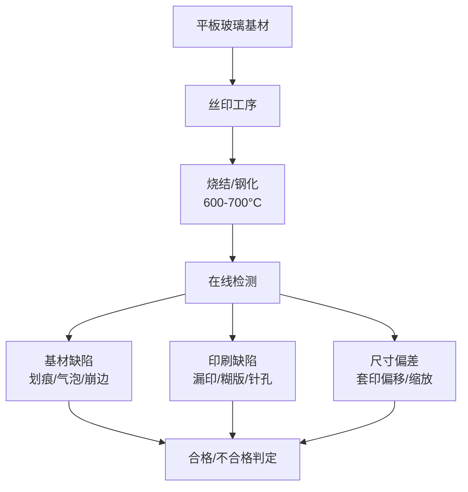
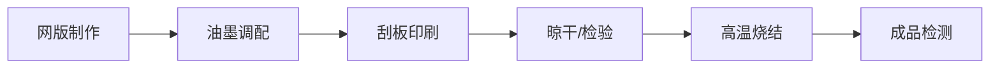
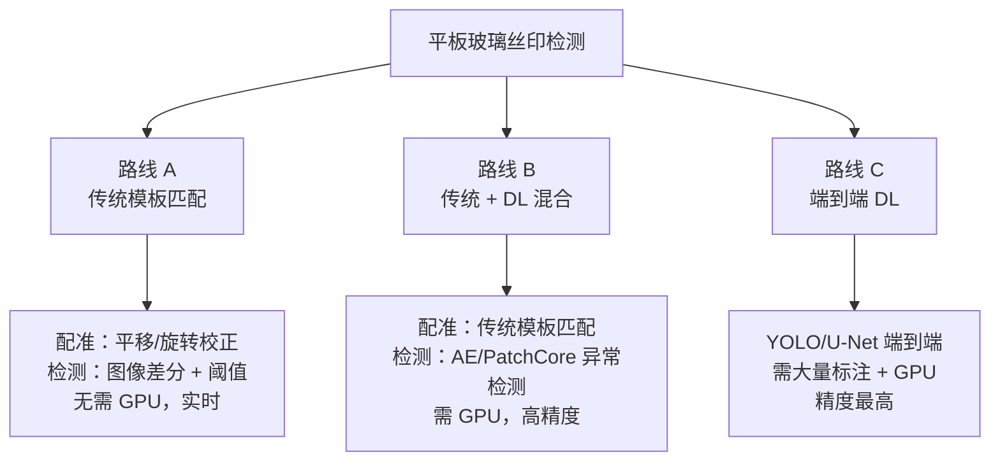
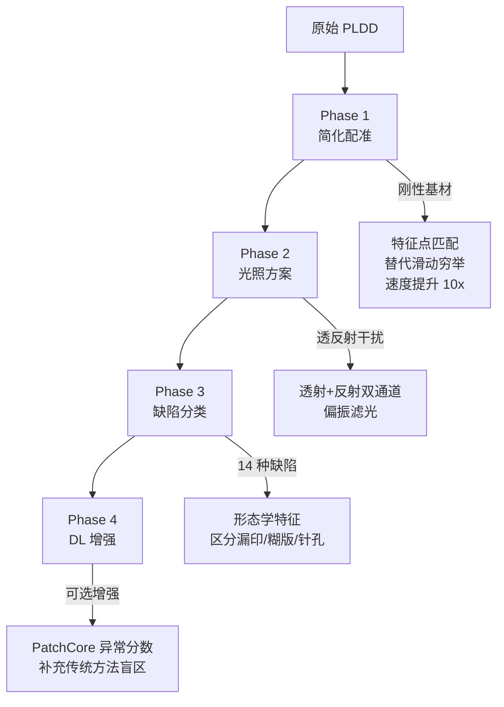

# 平板玻璃丝印缺陷检测技术调研

> 聚焦平板玻璃表面丝印印刷，分析缺陷类型、检测方法与 PLDD 适用性。

## 目录

- [一、全局视图](#一全局视图)
- [二、丝印工艺与缺陷分类](#二丝印工艺与缺陷分类)
- [三、检测方法路线对比](#三检测方法路线对比)
- [四、商业方案与行业实践](#四商业方案与行业实践)
- [五、PLDD 适用性分析](#五pldd-适用性分析)
- [六、技术选型建议](#六技术选型建议)
- [附录：术语表](#附录术语表)

---

## 一、全局视图

> 玻璃丝印 = 刚性基材 + 陶瓷油墨 + 高温烧结，核心检测挑战是透反射干扰和墨层缺陷。

### 检测流程全貌

### 与柔性印刷的关键差异

<svg viewBox="0 0 600 180" xmlns="http://www.w3.org/2000/svg">
<defs>
<marker id="arr2" markerWidth="8" markerHeight="8" refX="6" refY="3" orient="auto">
<path d="M0,0 L0,6 L8,3 z" fill="#555"/>
</marker>
</defs>
<g id="background">
<rect x="20" y="15" width="260" height="150" rx="8" fill="#fef6f0" stroke="#e8a050" stroke-width="1"/>
<rect x="320" y="15" width="260" height="150" rx="8" fill="#f0f8f0" stroke="#50c878" stroke-width="1"/>
</g>
<g id="edges">
<line x1="280" y1="90" x2="318" y2="90" stroke="#555" stroke-width="1.5" marker-end="url(#arr2)"/>
</g>
<g id="nodes"/>
<g id="labels">
<text x="150" y="38" font-size="13" font-weight="bold" fill="#c06020" text-anchor="middle">柔性印刷（PLDD 原场景）</text>
<text x="150" y="60" font-size="11" fill="#333" text-anchor="middle">基材：纸质标签、塑料膜</text>
<text x="150" y="78" font-size="11" fill="#333" text-anchor="middle">形变：弯曲/褶皱/拉伸</text>
<text x="150" y="96" font-size="11" fill="#333" text-anchor="middle">配准：RGB 子图滑动 + 梯度匹配</text>
<text x="150" y="114" font-size="11" fill="#333" text-anchor="middle">光照：可控，白板照明</text>
<text x="150" y="136" font-size="11" fill="#c44" text-anchor="middle">难度：形变大，配准是核心挑战</text>
<text x="450" y="38" font-size="13" font-weight="bold" fill="#207050" text-anchor="middle">刚性玻璃丝印（本项目）</text>
<text x="450" y="60" font-size="11" fill="#333" text-anchor="middle">基材：平板玻璃（刚性）</text>
<text x="450" y="78" font-size="11" fill="#333" text-anchor="middle">形变：极小，仅相机抖动</text>
<text x="450" y="96" font-size="11" fill="#333" text-anchor="middle">配准：简单平移/旋转校正</text>
<text x="450" y="114" font-size="11" fill="#333" text-anchor="middle">光照：透射+反射混合干扰</text>
<text x="450" y="136" font-size="11" fill="#207050" text-anchor="middle">难度：配准简化，光学干扰是核心挑战</text>
</g>
</svg>

---

## 二、丝印工艺与缺陷分类

> 丝印 = 刮板将陶瓷油墨透过网版压印到玻璃上，再高温烧结使墨层与玻璃融合。

### 丝印工艺流程

### 缺陷分类体系

丝印玻璃的缺陷可分为三大类，共 14 种典型缺陷：

#### A. 印刷缺陷（丝印工序引入）

| 缺陷 | 英文 | 特征 | 主要原因 |
|------|------|------|---------|
| **漏印/印不全** | Missing print | 图文区域未着墨或着墨不足 | 网孔堵塞、刮板压力不足、间距过大 |
| **糊版/拖尾** | Smearing/Smudging | 油墨超出设计边界，边缘模糊 | 刮板压力过大、油墨过稀、网版松动 |
| **渗墨/墨晕** | Bleeding | 油墨沿边界向外扩散 | 网版张力不足、油墨粘度偏低 |
| **针孔** | Pinhole | 印刷区域内出现微小未着墨点 | 网版制版缺陷（灰尘/菲林不洁） |
| **锯齿/毛刺** | Edge jaggedness | 图文边缘出现锯齿状毛刺 | 网版分辨率不足、感光胶涂布不均 |
| **墨点/飞墨** | Ink splatter | 非图文区域出现散落墨点 | 网版破损、离版速度过快 |
| **墨层不均** | Uneven thickness | 油墨厚薄不匀，透光率不一致 | 刮板磨损、油墨粘度不均 |
| **堵网** | Mesh clogging | 网孔被干涸油墨堵塞导致连续漏印 | 车间温湿度失控、油墨挥发过快 |

#### B. 基材缺陷（玻璃本身）

| 缺陷 | 英文 | 特征 |
|------|------|------|
| **划痕** | Scratch | 线状透射异常 |
| **气泡** | Air bubble | 圆形亮点或暗点 |
| **崩边/缺口** | Chip/Edge break | 边缘缺失 |
| **夹杂物** | Inclusion | 玻璃内部异质点 |

#### C. 尺寸/位置缺陷

| 缺陷 | 英文 | 特征 |
|------|------|------|
| **套印偏移** | Misregistration | 多色套印时层间错位 |
| **整体偏移** | Position shift | 印刷图案相对玻璃边缘偏移 |

### 缺陷外观示意

<svg viewBox="0 0 640 200" xmlns="http://www.w3.org/2000/svg">
<defs>
<marker id="arr3" markerWidth="6" markerHeight="6" refX="5" refY="3" orient="auto">
<path d="M0,0 L0,6 L6,3 z" fill="#888"/>
</marker>
</defs>
<g id="background">
<rect x="10" y="10" width="620" height="180" rx="6" fill="#fafafa" stroke="#ddd" stroke-width="1"/>
</g>
<g id="nodes">
<!-- 正常印刷块 -->
<rect x="30" y="35" width="80" height="60" rx="4" fill="#4a9edd" opacity="0.8"/>
<!-- 漏印 -->
<rect x="140" y="35" width="80" height="60" rx="4" fill="#4a9edd" opacity="0.8"/>
<rect x="160" y="45" width="15" height="20" rx="2" fill="#fafafa"/>
<!-- 糊版/拖尾 -->
<rect x="250" y="35" width="80" height="60" rx="4" fill="#4a9edd" opacity="0.8"/>
<ellipse cx="290" cy="85" rx="30" ry="8" fill="#4a9edd" opacity="0.3"/>
<!-- 针孔 -->
<rect x="360" y="35" width="80" height="60" rx="4" fill="#4a9edd" opacity="0.8"/>
<circle cx="385" cy="55" r="3" fill="#fafafa"/>
<circle cx="420" cy="70" r="2" fill="#fafafa"/>
<!-- 锯齿 -->
<rect x="470" y="35" width="80" height="60" rx="4" fill="#4a9edd" opacity="0.8"/>
<path d="M470,35 L465,45 L475,50 L468,58 L478,65 L472,72 L480,80 L470,85 L470,35 Z" fill="#4a9edd" opacity="0.5"/>
<!-- 墨点 -->
<rect x="570" y="35" width="60" height="60" rx="4" fill="#4a9edd" opacity="0.8"/>
<circle cx="590" cy="105" r="4" fill="#4a9edd"/>
<circle cx="610" cy="100" r="3" fill="#4a9edd"/>
</g>
<g id="labels">
<text x="70" y="115" font-size="11" fill="#333" text-anchor="middle">正常印刷</text>
<text x="180" y="115" font-size="11" fill="#333" text-anchor="middle">漏印</text>
<text x="290" y="115" font-size="11" fill="#333" text-anchor="middle">糊版/拖尾</text>
<text x="400" y="115" font-size="11" fill="#333" text-anchor="middle">针孔</text>
<text x="510" y="115" font-size="11" fill="#333" text-anchor="middle">锯齿/毛刺</text>
<text x="600" y="115" font-size="11" fill="#333" text-anchor="middle">墨点</text>
<text x="70" y="135" font-size="10" fill="#888" text-anchor="middle">区域完整着墨</text>
<text x="180" y="135" font-size="10" fill="#888" text-anchor="middle">区域空白缺失</text>
<text x="290" y="135" font-size="10" fill="#888" text-anchor="middle">边缘超出扩散</text>
<text x="400" y="135" font-size="10" fill="#888" text-anchor="middle">微小空白点</text>
<text x="510" y="135" font-size="10" fill="#888" text-anchor="middle">边缘锯齿不平</text>
<text x="600" y="135" font-size="10" fill="#888" text-anchor="middle">区域外散落墨点</text>
</g>
</svg>

---

## 三、检测方法路线对比

> 玻璃丝印的特殊性（刚性基材、透反射干扰）使传统路线更可行，DL 是可选增强。

### 三条可选路线

### 路线对比

| 维度 | 路线 A：传统模板匹配 | 路线 B：传统+DL 混合 | 路线 C：端到端 DL |
|------|-------------------|---------------------|------------------|
| **配准** | NCC/形状匹配 | 传统配准 + DL 特征 | DL 端到端 |
| **缺陷检测** | 图像差分 + 阈值 | AE/PatchCore 异常分数 | 语义分割/目标检测 |
| **GPU** | 不需要 | 需要 | 需要 |
| **训练数据** | 仅需 GM 模板 | 仅需正常样本 | 需标注缺陷样本 |
| **漏印检测** | ✅ 差分直接检出 | ✅ 异常分数检出 | ✅ 分割直接检出 |
| **糊版检测** | ⚠️ 需形态学增强 | ✅ 边缘异常检出 | ✅ 分割直接检出 |
| **针孔检测** | ⚠️ 尺寸小，需高分辨率 | ✅ 局部异常敏感 | ✅ 小目标检测 |
| **透反射干扰** | ⚠️ 需光照方案配合 | ⚠️ 需光照方案配合 | ✅ 可学习抗干扰 |
| **部署难度** | 低 | 中 | 高 |
| **速度** | 极快（<0.1s/张） | 快（0.1-0.5s/张） | 中等（0.3-1s/张） |

---

## 四、商业方案与行业实践

> 行业已有多家成熟方案，均采用线扫相机 + 受控照明 + 模板匹配/AI 混合。

### 主流商业系统

| 厂商 | 产品 | 检测能力 | 技术特点 |
|------|------|---------|---------|
| [CUGHER](https://www.cugher.com/vision-system/) | 丝印视觉系统 | 拖尾、扩散、针孔、漏印、墨点、划痕 | 16384 像素线扫相机，交替光源，分辨率 60μm（1m 玻璃） |
| [Synergx](https://synergx.com/synergx-hub/glass-paint-inspection-system-for-flat-glass/) | SURFX PAINT | 色带、渐变带、天线线、印刷边框、标志、划痕 | 远心光学，支持 2m 宽玻璃，反射通道检测银印 |
| [LineScanner](https://www.glassquality.com/products/linescanner/) | LineScanner | 光学缺陷、尺寸偏差、丝印缺陷、热处理缺陷 | 16 位扫描（65536 灰度级），200dpi，AI 缺陷分类 |
| [Matodi Group](https://matodigroup.com/glassinspector-evo/) | GlassInspector EVO | 缺陷检测 + 尺寸测量 + 印刷质量 | 综合检测平台 |
| [AMETEK](https://www.ameteksurfacevision.com/products/smartview/surface-inspection) | SmartView | 表面缺陷检测 | 模块化系统，覆盖纸/塑料/钢/玻璃 |

### 行业关键技术参数

| 参数 | 典型值 | 说明 |
|------|--------|------|
| 相机类型 | 线扫（Line Scan） | 玻璃连续移动，线扫无缝覆盖 |
| 分辨率 | 60-120 μm/pixel | CUGHER 在 1m 玻璃上达 60μm |
| 灰度位深 | 16 位（65536 级） | LineScanner 采用 16 位捕捉微弱缺陷 |
| 检测宽度 | 最高 2000mm | 建筑/汽车玻璃大板 |
| 墨点检测能力 | ≥1mm 直径 | CUGHER 网版破损检测精度 |
| 光源方案 | 交替光源/远心照明/偏振 | 应对玻璃透反射 |

### 学术文献

| 论文 | 年份 | 方向 | 链接 |
|------|------|------|------|
| Mobile Phone Screen Glass Defect Detection | 2016 | 手机玻璃表面缺陷，灵敏度 94% | [ScienceDirect](https://www.sciencedirect.com/science/article/abs/pii/S1568494616305531) |
| Screen-Printed Ink Protrusion Defect on Mobile Glass | — | 丝印墨凸缺陷，弱对比度+镜面反射 | [Francis Press](https://francis-press.com/papers/20266) |
| Efficient Surface Defect Detection in Industrial Screen Printing | 2024 | 工业丝印箔片表面缺陷 | [SAGE Journals](https://journals.sagepub.com/doi/abs/10.3233/ICA-240742) |
| Surface Defect Detection for Phone Back Glass via DL | 2020 | 手机背板玻璃缺陷，DL 方法 | [MDPI](https://www.mdpi.com/2076-3417/10/10/3621) |
| Enhancing Glass Defect Detection with Diffusion Models | 2025 | 扩散模型生成缺陷数据增强 | [arXiv](https://arxiv.org/html/2505.03134v1) |

---

## 五、PLDD 适用性分析

> PLDD 的核心算法（模板匹配 + 梯度匹配）在玻璃丝印场景中高度适配，但需补充光照方案。

### 有利因素

1. **基材刚性，形变极小**：PLDD 的 LDCE 阶段（RGB 子图滑动配准）在柔性标签上需要处理非刚性变形，但玻璃基材几乎无形变，配准简化为平移+微小旋转校正
2. **相机抖动量级小**：玻璃产线相机通常固定安装，抖动在亚像素到数像素级，远小于 PLDD 处理的柔性标签形变
3. **图案固定**：丝印图案（边框/标志/色带）相对简单且重复，模板匹配天然适用
4. **PLDD 的两次梯度匹配**：对边缘缺陷（锯齿/糊版/漏印边缘）检测能力强

### 需要适配的方面

| PLDD 原设计 | 玻璃丝印适配 | 原因 |
|-------------|------------|------|
| RGB 三通道独立梯度计算 | 可能简化为单通道或双通道 | 陶瓷油墨通常为单色（黑色/灰色），RGB 分离增益有限 |
| 白板照明 | 需要**透射+反射双通道**照明 | 玻璃透明，仅反射光检测不到内部缺陷 |
| 低阈值二值化 + 形态学 | 可能需要**自适应阈值** | 玻璃透光率变化（5.6%-92%）导致全局阈值失效 |
| 无光照补偿 | 需加入**光照校正预处理** | 玻璃表面高光/反射干扰 |
| RGB 子图滑动配准 | 简化为**特征点配准** | 刚性基材，无需滑动窗口穷举 |

### PLDD 改造路线图

---

## 六、技术选型建议

> 推荐路线 A（传统模板匹配）起步，验证后再升级到路线 B（传统+DL 混合）。

### 推荐方案

| 阶段 | 方案 | 目标 | GPU 需求 |
|------|------|------|---------|
| **Phase 1** | PLDD 简化版：特征点配准 + 图像差分 | 跑通主流程，检出漏印/墨点 | 无 |
| **Phase 2** | 加入光照方案（透射通道）+ 自适应阈值 | 提升糊版/针孔检出率 | 无 |
| **Phase 3** | 形态学特征 → 规则分类器 | 区分缺陷类型（14 类） | 无 |
| **Phase 4**（可选） | PatchCore/Anomalib 替代梯度匹配阶段 | 提升小缺陷检出，降低误检 | 有 |

### 光照方案（关键基础设施）

玻璃丝印检测的光照方案直接决定成败，比算法选择更重要：

| 照明方式 | 适用缺陷 | 优点 | 缺点 |
|---------|---------|------|------|
| **背光透射** | 漏印、针孔、墨层不均 | 对比度最高，缺陷清晰 | 无法检测表面划痕 |
| **正面反射** | 划痕、墨点、表面缺陷 | 检测表面型缺陷 | 受高光干扰 |
| **偏振照明** | 所有类型 | 抑制镜面反射 | 成本较高 |
| **远心照明** | 尺寸测量、边缘定位 | 无透视畸变 | 视场受限 |
| **交替光源** | 综合检测 | CUGHER 方案，覆盖面广 | 需同步控制 |

### 与已有文献地图的关系

本场景与 [印刷检测行业技术全景调研](印刷检测行业技术全景调研.md) 的关系：

| 维度 | 全景调研 | 本文档 |
|------|---------|--------|
| 范围 | 印刷检测全行业 | 平板玻璃丝印 |
| 技术路线 | 6 条并行 | 3 条可选（A/B/C） |
| 配准挑战 | 柔性形变（核心难点） | 相机抖动（简化问题） |
| 核心挑战 | 算法选择 | **光照方案** + 算法选择 |
| PLDD 适用性 | 作为传统方法代表 | 高度适配，需小改造 |

---

## 附录：术语表

| 术语 | 说明 |
|------|------|
| **丝印/丝网印刷** | Screen Printing，油墨透过网版孔洞转移到基材 |
| **陶瓷油墨** | Ceramic Ink/Frit，含玻璃粉的油墨，高温烧结后与玻璃融合 |
| **烧结/钢化** | Tempering，600-700°C 加热使陶瓷油墨永久附着 |
| **网版** | Screen/Stencil，带有图文孔洞的丝网框架 |
| **刮板** | Squeegee，将油墨压过网版的橡胶条 |
| **糊版** | Smearing，油墨超出设计边界的缺陷 |
| **堵网** | Mesh Clogging，网孔被干油墨堵塞导致漏印 |
| **线扫相机** | Line Scan Camera，单行像素逐行扫描，适合连续运动物体 |
| **远心光学** | Telecentric Optics，消除透视畸变的光学系统 |
| **NCC** | Normalized Cross-Correlation，归一化互相关模板匹配 |
| **GM 图** | Golden Master，无缺陷标准模板图像 |

---

*调研日期：2026-05-11 | 聚焦平板玻璃表面丝印印刷缺陷检测*
