# 基于改进余弦相似度测度的二次梯度匹配印刷标签缺陷检测

Expert Systems With Applications 204 (2022) 117372

**作者**：李东明¹˒²，李金星¹*，范远义²，卢光明¹*，葛杰¹，刘晓阳¹

¹ 哈尔滨工业大学（深圳）计算机科学与技术系，深圳，中国
² 深圳市富贵精密工业有限公司，深圳，中国

---

## 摘要

**关键词**：印刷标签缺陷检测、梯度匹配、伪影、非刚性局部变形、余弦相似度

许多基于视觉的印刷标签缺陷检测方法已被提出以替代低效的人工检测。然而，由于伪影（Artifacts）和噪声区域的存在，通常会导致大量误判。同时，由于大多数印刷标签是非刚性的，容易发生局部变形，在图像相减后会产生大量伪影。本文提出了一种新颖的印刷标签缺陷检测框架（PLDD），基于改进的余弦相似度（Improved Cosine Similarity Measure, ICSM）进行二次梯度匹配。整体思路是将黄金母版（Golden Master, GM）图像与测试图像进行比较。具体而言，首先从RGB子图像中提取潜在缺陷候选（Latent Defect Candidates）以消除伪影。同时引入掩码（Mask）机制以消除缺陷候选周围背景梯度特征的影响。在三个工业数据集上进行了对比实验，结果表明PLDD取得了较高的平均

$$
F_1
$$

分数（0.9702），在44,628个真值中仅有103个误报（FP）。缺陷实时检测的平均耗时为0.26362秒。

---

## 1. 引言

当今全球制造企业面临日益激烈的竞争，提高产品质量是提升竞争力的关键。作为质量控制的第一步，来料质量控制（Incoming Quality Control, IQC）在防止缺陷材料进入生产线、避免浪费方面发挥着至关重要的作用。对于工厂而言，有数千种印刷标签需要检测。理论上，测试印刷标签上任何与黄金母版图像不一致的区域都可以被视为潜在缺陷。GM图像是由专家手动选择的无缺陷图像。印刷缺陷包括污迹、重影、偏移、划痕、过印、漏印和色彩失真等。这些缺陷通常由人工检测，但长期工作会导致视觉疲劳和误判。因此，有必要通过计算机视觉提高印刷标签缺陷检测的性能和经济效率。

过去十年中，一些传统方法已被提出用于印刷标签缺陷检测。Shankar等（2009）首先通过边缘检测识别感兴趣区域（ROI），然后基于阈值进行相关减法缺陷检测。Vans等（2011）提出了一种基于结构相似性指数（SSIM）的可变数据印刷自动在线视觉检测系统。Zhang等（2019）利用明暗模板组合来克服图像位置和光照偏差。这些方法在一定程度上降低了人工成本，但很少有研究关注伪影的负面影响。

近年来，许多基于深度学习的方法被提出。然而，即使这些方法在自然图像上取得了令人满意的成果，也不能直接应用于印刷标签缺陷检测。与ImageNet数据集（超过1400万样本）相比，工业表面缺陷检测最关键的问题是训练样本数量。Haik等（2020）使用包含20,000对图像和40,000个真实缺陷的大数据集进行检测，但实际工业场景中缺陷图像很少。此外，深度学习通常依赖于训练中特定类型的缺陷，对未见类型缺陷的检测非常困难。

根据上述分析，自动印刷标签缺陷检测面临以下挑战：

（1）**如何避免伪影的负面影响？** 大多数印刷标签由非刚性材料制成，由于温度、湿度和应力的变化，容易产生不可逆变形，从而产生伪影。

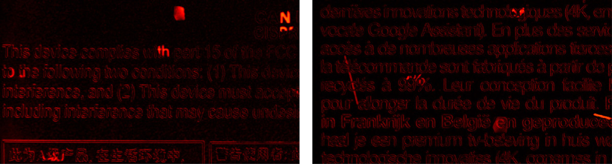

图1展示了通过GM图像与测试图像相减产生的伪影。

（2）**如何检测未见类型的缺陷？** 有数万种印刷标签需要检测，未见类型缺陷是实际应用中的常见场景。使检测算法具有更好的泛化能力是关键。

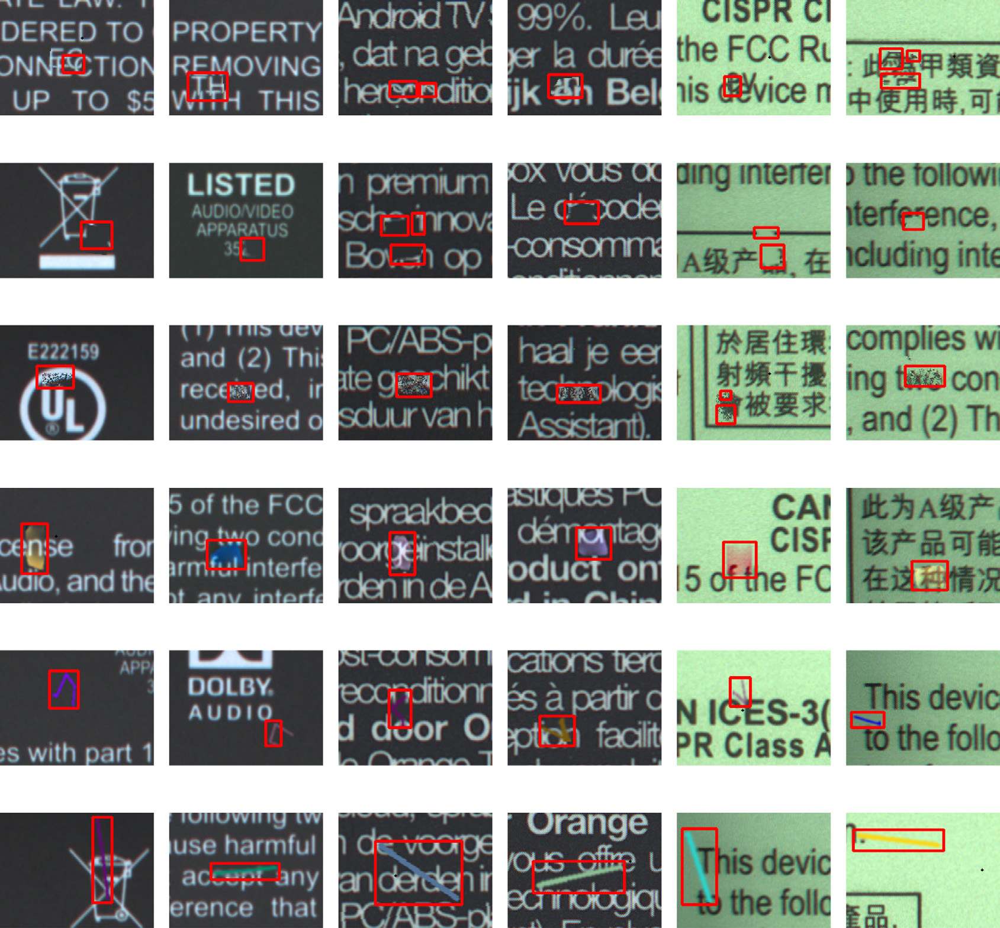

图2展示了一些代表性的印刷标签缺陷样本。

（3）**如何实现实时检测？** 只有实时检测才能最大化生产线的效率，因此需要同时考虑准确性和速度。

为解决上述挑战，本文提出了一种基于传统机器视觉的新型缺陷检测框架。首先提出有效的伪影消除算法，然后利用GM图像和测试图像进行二次匹配以检测未见类型缺陷，并具有实时性能。

**主要贡献**：

（1）提出有效的潜在缺陷候选提取（LDCE）算法，基于子图像滑动和RGB通道色差消除由局部变形引起的伪影。

（2）设计高效的缺陷检测算法，引入掩码减少缺陷候选周围无关梯度特征的影响，采用二次匹配策略同时检测漏印和过印。

（3）提出改进的余弦相似度（ICSM），受人类视觉系统启发，通过RGB平均梯度融合和非线性激活函数融合图像梯度的绝对值和方向信息。

（4）与SSIM、RTPDS、DSIM、FCN-VGG16、DeepLabV3+、Valente等（2020）六种方法进行对比，本框架在实时条件下取得了令人鼓舞的缺陷检测性能，且无需GPU。

---

## 2. 相关工作

### 2.1 基于传统机器视觉的方法

基于传统机器视觉的印刷品缺陷检测已被广泛研究。一种流行的方法是在图像配准后对测试图像和参考图像进行图像减法（Image Subtraction），然后通过阈值检测缺陷。然而，图像减法对图像位置和光照偏差非常敏感。Zhang等（2019）提出了使用明暗模板组合的改进图像减法方法，但在局部变形（特别是非刚性变形）情况下表现不佳。

基于分割和分类的方法也被引入用于印刷图像质量检测。Chen等（2019）提出了一种新的基于分割的局部印刷缺陷检测框架，但仅关注具有一致纹理背景的扫描印刷页面上的灰斑缺陷。

模板匹配方法（Template Matching）在缺陷检测中具有良好的泛化性，因为它关注的是比较图像对之间的相似性，而非不同缺陷类型之间的差异。Ma等（2017）提出了一种基于两次模板匹配的检测算法，但第一次模板匹配基于灰度变换，对光照偏差和噪声敏感。Gong等（2020）引入了可变形模板匹配方法用于曲面玻璃瓶上的透明标签缺陷检测。由于大多数模板匹配方法在每个前景区域上执行，计算量大，且小缺陷难以检测。

此外，相似度度量（Similarity Measure）也被用于印刷品缺陷检测，通常包括结构相似性和余弦相似度。由于局部变形引起的伪影通常出现在轮廓边缘附近，它们本质上与相邻轮廓相似，因此基于相似度测量的方法能够消除这些伪影。在结构相似性方面，DSIM（Vans等，2011）源自SSIM，用于衡量图像之间的不相似度，但逐像素计算导致高计算成本，无法满足实时要求。在余弦相似度方面，Asha等（2012）提出了基于相似性的图案纹理缺陷检测方法。Zhang等（2020）提出了用于纺织行业织物缺陷检测的改进余弦相似度。然而，原始余弦相似度仅考虑两个向量的方向差，不考虑长度差，这增加了缺陷检测的难度。

### 2.2 基于深度学习的方法

自2012年以来，深度学习方法在许多计算机视觉任务中取得了显著性能。基于深度学习的表面缺陷检测方法可总结为以下类别：

（1）**基于图像分类的网络**。Wu等（2017）提出了用于纹理图像的CNN特征提取技术。Deng等（2020）提出了由最大稳定极值区域（MSER）和二分类CNN组成的统一缺陷检测框架。然而，工业场景中印刷标签缺陷类型多样，甚至未知缺陷类型也需要被很好地检测，为分类网络准备训练样本是一项具有挑战性的任务。

（2）**基于目标检测的网络**。Haik等（2020）提出了一种用于检查可变数据印刷（VDP）的新方法，具有超低误报率（0.005%），并使用FlowNet2进行光流计算（配准）。然而，收集和标注大量高质量缺陷图像困难、费时且成本高昂。

（3）**基于自编码器的网络**。Zhao等（2018）结合GAN和自编码器提出了基于正样本训练的缺陷检测模型。Bergmann等（2018）指出了基于自编码器框架中逐像素损失函数的缺点，提出使用SSIM纳入空间信息以改善分割结果。但如果背景过于复杂和随机，自编码器仍然难以重建和修复图像。在印刷标签缺陷检测场景中，印刷品的文本和图案具有很大的多样性。

（4）**基于语义分割的方法**。Yu等（2017）提出了用于工业环境表面缺陷检测的两阶段FCN框架。Tabernik等（2020）提出了基于分割的深度学习架构用于表面裂纹检测，仅使用约25-30个缺陷训练样本。Valente等（2020）提出了基于DeepLabV3+骨干网络的端到端框架，支持全参考（FR）和无参考（NR）两种输入模式。语义分割网络的主要缺点是高计算成本和大量逐像素标注数据的需求。

（5）**基于孪生网络的方法**。Wu等（2019）提出了用于按钮表面缺陷检测的孪生网络。Luan等（2021）将带有缺陷敏感损失函数的孪生网络应用于工业产品缺陷检测。但由于缺陷样本很少，性能较差，且一旦检测对象类别改变，神经网络需要重新训练。

综上所述，深度学习方法也有各种缺点，不能直接应用于印刷标签缺陷检测场景。

---

## 3. 方法论

### 3.1 提出的框架

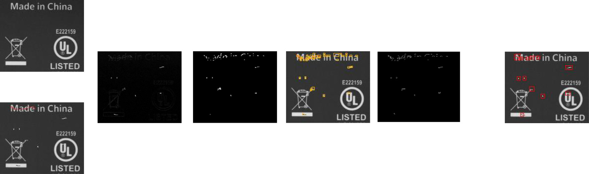

图3说明所提出的框架包含两个主要阶段：**潜在缺陷候选提取**和**二次梯度匹配**。

第一阶段：为消除由局部变形引起的伪影，执行有效的RGB子图像滑动处理以获取差异图像，然后应用低阈值滤波器对图像进行二值化，通过形态学开运算和轮廓提取获取最终的潜在缺陷候选。

第二阶段：框架仅关注潜在缺陷候选而非整个图像。梯度匹配在每个潜在缺陷候选上执行，并结合掩码提取更具判别力的特征。采用二次匹配策略同时检测漏印和过印。此外，受人类视觉系统启发，提出ICSM通过RGB平均梯度融合和非线性激活函数融合图像梯度的绝对值和方向。

### 3.2 图像配准

工业相机实时捕获的图像不可避免地与GM图像存在偏差。因此，在缺陷检测之前应首先对测试图像和GM图像进行配准。本文使用基于形状的模板匹配算法（Dailin等，2013）进行图像配准。配准后，对测试图像和GM图像应用3×3中值滤波器进行去噪。

### 3.3 LDCE算法

图像配准后，需要通过图像减法获取差异图像。然而，RGB绝对减法产生的大量伪影会增加缺陷检测的难度。此外，RGB格式存储的彩色图像不均匀，难以从RGB颜色空间中的距离评估两种颜色的相似性（Johnson等，2010）。CIE L\*u\*v\*颜色空间可以更好地反映物体色差，但非常耗时，难以在仅CPU上实现实时检测。

因此，采用低成本色差近似（Riemersma，2012），其结果与CIE L\*u\*v\*非常接近。详细公式如下：

$$
\Delta C = \sqrt{\left(2 + \frac{r}{256}\right) \cdot \Delta R^2 + 4 \cdot \Delta G^2 + \left(2 + \frac{255 - r}{256}\right) \cdot \Delta B^2} \quad (1)
$$

$$
r = \frac{C_{1,R} + C_{2,R}}{2} \quad (2)
$$

$$
\Delta R = C_{1,R} - C_{2,R} \quad (3)
$$

$$
\Delta G = C_{1,G} - C_{2,G} \quad (4)
$$

$$
\Delta B = C_{1,B} - C_{2,B} \quad (5)
$$

其中

$$
C_{1,R}
$$

、

$$
C_{1,G}
$$

、

$$
C_{1,B}
$$

分别为图像1的R、G、B通道像素值；

$$
C_{2,R}
$$

、

$$
C_{2,G}
$$

、

$$
C_{2,B}
$$

分别为图像2的R、G、B通道像素值；

$$
\Delta C
$$

为色差。黑色的像素灰度值为0，白色为255，按式(1)计算的最大色差值为770，远大于255。因此提出修正版本以与灰度值保持一致：

$$
\Delta C_{revised} = \frac{\Delta C \times 255}{770} \quad (6)
$$

考虑到人类可区分的最小像素值为阈值

$$
T_{filter}
$$

，小于该值的像素应在后续处理中忽略。然后对

$$
\Delta C_{revised}
$$

应用二值化阈值：

$$
d_{bin}(x, y) = \begin{cases} 255, & \text{if } \Delta C_{revised}(x, y) > T_{filter} \\ 0, & \text{otherwise} \end{cases} \quad (7)
$$

其中

$$
d_{bin}
$$

为二值图像

$$
D_{bin}
$$

的像素值，包含真实缺陷和伪影。

基于上述分析，LDCE算法尽可能减少伪影数量，如算法1所述。GM图像和测试图像被分割为

$$
n \times n
$$

个子图像，大小为

$$
w \times h
$$

；

$$
l
$$

为滑动范围；第4节中设置

$$
n = 2
$$

、

$$
l = 5
$$

。对于每个滑动窗口，计算子图像差值之和

$$
\sum \Delta C_{revised}
$$

，选择具有最小

$$
\sum \Delta C_{revised}
$$

的滑动窗口获取最佳差异图像。

**算法1：LDCE**

**输入**：GM和测试（T）图像，

$$
T_{filter}, l, n, w, h
$$

**输出**：包含所有潜在缺陷候选的集合

$$
C
$$

1. 将GM和T图像分割为

$$
n \times n
$$

个子图像，

$$
GM = \{gm_1, gm_2, \ldots, gm_{n \times n}\}
$$

，

$$
T = \{t_1, t_2, \ldots, t_{n \times n}\}
$$

2.

$$
s_{i,j}
$$

表示左上角坐标为

$$
(i, j)
$$

、大小为

$$
w \times h
$$

的子图像

3. **对每个子图像**

$$
gm_k
$$

**执行**：

4. 设

$$
(u, v)
$$

为当前

$$
gm_k
$$

的左上角坐标

5-8. 对

$$
ii \in [-l, +l]
$$

、

$$
jj \in [-l, +l]
$$

，计算每个

$$
s_{u+ii, v+jj}
$$

的

$$
\sum \Delta C_{revised}
$$

9-10. 选择

$$
(i, j) = \arg\min_{i,j} \sum \Delta C_{revised}
$$

11. 将对应的

$$
s_{i,j}
$$

的差分结果复制到

$$
Sub_k
$$

12. **结束循环**

13. 组合差异图像

$$
D = \{Sub_1, Sub_2, \ldots, Sub_{n \times n}\}
$$

，应用阈值

$$
T_{filter}
$$

获取二值图像

$$
D_{bin}
$$

14. 对

$$
D_{bin}
$$

执行形态学开运算提取轮廓，输出包含所有潜在缺陷候选的集合

$$
C
$$

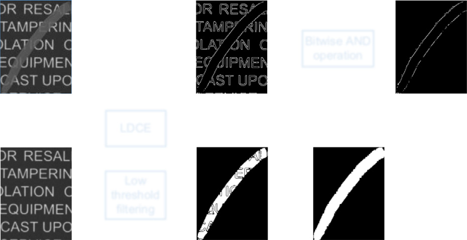

如图3所示，聚集的白色像素即为潜在缺陷候选。随后对二值图像

$$
D_{bin}
$$

应用3×3结构元素的形态学开运算进行去噪。图4简要展示了子图像滑动用于伪影消除和潜在缺陷候选提取的过程。

### 3.4 背景特征滤波的掩码提取

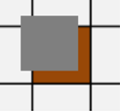

为消除缺陷候选周围背景梯度特征的影响，引入掩码机制，如图5所示。首先通过Canny边缘检测器提取测试子图像的轮廓，阈值分别设为60和130。然后对测试子图像和GM子图像执行绝对减法，应用阈值滤波获取二值图像。此外，对最终差异二值图像执行5×5结构元素的形态学膨胀操作获取膨胀图像。最后执行位与（bitwise AND）操作获取最终掩码，用于后续缺陷检测。

### 3.5 缺陷检测

尽管大多数伪影已被LDCE算法消除，但仍有部分伪影残留，特别是在大型非刚性变形情况下。因此，需要一种判别方法来区分伪影和缺陷。本文仅在上述候选区域上执行检测，相比检测所有区域的方法，具有更好的效率，特别是对小缺陷检测。一般来说，测试图像中的每个区域应与GM图像中对应区域相似，除非包含差异（即缺陷）。

#### 3.5.1 余弦相似度的局限性

余弦相似度基于二维向量之间的角度。平面中两个向量之间的角度

$$
\theta
$$

定义如下：

$$
\cos\theta = \frac{\vec{A} \cdot \vec{B}}{|\vec{A}| \cdot |\vec{B}|} \quad (8)
$$

由于

$$
\cos\theta \in [-1, 1]
$$

，

$$
\cos\theta
$$

可被视为两个向量之间的相似度。通过Sobel算子，可以获取像素在

$$
x
$$

和

$$
y
$$

方向的梯度信息。在每个滑动窗口中，相似度定义如下：

$$
\cos\theta = \frac{\sum_{j=1}^{N} \left(G_{j,x}^T \cdot G_{j,x}^G + G_{j,y}^T \cdot G_{j,y}^G\right)}{\sqrt{\sum_{j=1}^{N} \left[\left(G_{j,x}^T\right)^2 + \left(G_{j,y}^T\right)^2\right]} \cdot \sqrt{\sum_{j=1}^{N} \left[\left(G_{j,x}^G\right)^2 + \left(G_{j,y}^G\right)^2\right]}} \quad (9)
$$

其中

$$
\theta
$$

为两个对应向量之间的角度。然而，原始余弦相似度的局限性明显——它只能评估两个向量之间的角度而不包含长度信息。实际上，这意味着图像对比度的差异未被充分考虑。

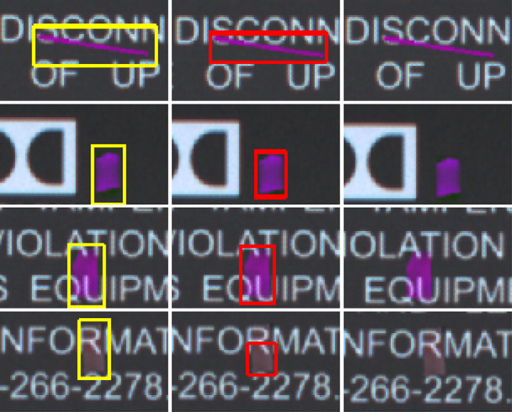

图6展示了这一局限性。

#### 3.5.2 改进的余弦相似度（ICSM）

一般来说，模板匹配可分为像素灰度值匹配和基于边缘的匹配。归一化互相关（NCC）是最著名的像素灰度值匹配算法，但对局部光照变化敏感且计算成本高。基于边缘的匹配对光照变化具有鲁棒性，计算成本低。

ICSM从两个方面进行了改进：

**（1）RGB通道梯度融合**。对于彩色图像，一般方法是在提取梯度之前转换为灰度图像。缺点是可能丢失某些重要的梯度信息，导致对低对比度缺陷的误检测。因此，融合每个RGB通道的梯度以获取更具判别力的梯度特征。

图7中低对比度缺陷被成功检测。

**（2）引入非线性激活函数**。受人类视觉特征启发，将非线性激活函数与原始余弦相似度结合，同时考虑图像梯度向量的长度和方向。人类视觉系统对缺陷的感知取决于缺陷相对于背景的相对亮度，而非绝对亮度。因此引入非线性激活函数以增加非缺陷区域的相似度得分，同时抑制缺陷区域的得分。

ICSM详细公式如式(10)-(19)所示：

$$
Sim\left(T_i, G_i^{(u,v)}\right) = \frac{1}{N} \sum_{j=1}^{N} F(r_j, m_j) \cdot \frac{G_j^T \cdot G_j^G}{|G_j^T| \cdot |G_j^G|} \cdot M_i \quad (10)
$$

其中

$$
Sim(T_i, G_i^{(u,v)})
$$

为子图像

$$
T_i
$$

和

$$
G_i^{(u,v)}
$$

之间的相似度得分；

$$
T_i
$$

为测试图像的第

$$
i
$$

个潜在缺陷候选；

$$
G_i^{(u,v)}
$$

为搜索图像

$$
G_i
$$

上第

$$
i
$$

个潜在缺陷候选的对应滑动窗口，

$$
u \in [0, 2d]
$$

，

$$
v \in [0, 2d]
$$

；

$$
d
$$

为搜索范围的扩展距离；

$$
G_i
$$

是根据

$$
T_i
$$

的相同位置从GM图像裁剪出的区域；

$$
N
$$

为图像

$$
T_i
$$

的Canny特征点数量。

$$
G_{j,x}^G
$$

和

$$
G_{j,y}^G
$$

分别为

$$
G_i
$$

第

$$
j
$$

个特征点在

$$
x
$$

和

$$
y
$$

方向的梯度值；

$$
G_{j,x}^T
$$

和

$$
G_{j,y}^T
$$

分别为

$$
T_i
$$

第

$$
j
$$

个特征点在

$$
x
$$

和

$$
y
$$

方向的梯度值。上述梯度值均通过Sobel算子计算。

$$
M_i
$$

为由图5生成的第

$$
i
$$

个潜在缺陷候选掩码。"&"表示图像按位与操作。

$$
F(r_j, m_j)
$$

为非线性激活函数：

$$
F(r_j, m_j) = \begin{cases} r_j, & \text{if } r_j < T_r \\ m_j, & \text{if } m_j > T_m \\ 0, & \text{otherwise} \end{cases}
$$

$$
T_r
$$

和

$$
T_m
$$

为指定阈值。

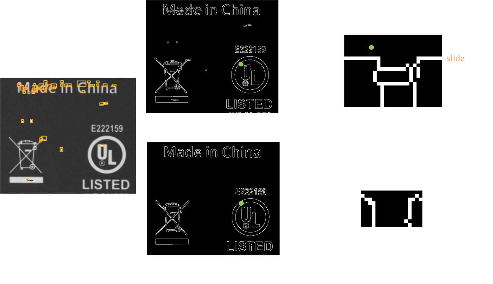

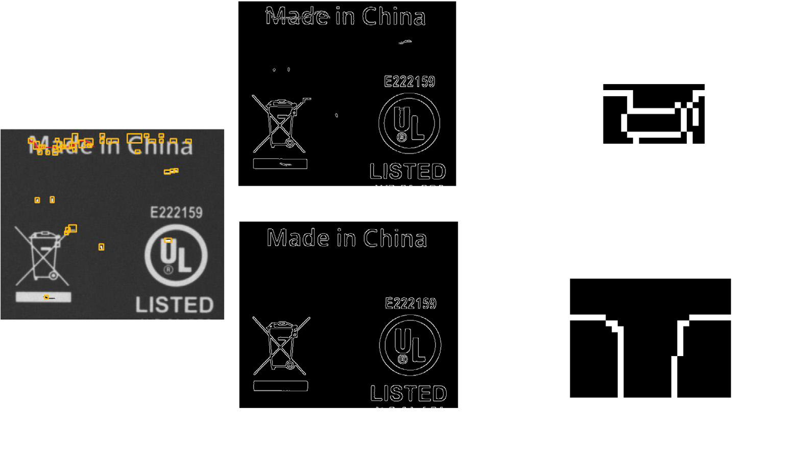

#### 3.5.3 二次梯度匹配缺陷检测

基于式(10)，后续步骤是使用所提出的相似度进行缺陷检测。对于从第3.3节提取的所有潜在缺陷候选，需要测量每个测试子图像与GM子图像之间的相似度。

如图8所示，**T2G梯度匹配**表示

$$
T_i
$$

和

$$
G_i
$$

分别被视为模板子图像和搜索子图像。T2G梯度匹配需要在每个滑动窗口

$$
G_i^{(u,v)}
$$

上执行，目的是释放局部变形的影响。核心思想是：如果在一定邻域内找不到对应的特征匹配，则该区域必定是缺陷。比较所有滑动窗口后，获得一组相似度得分，最高得分将被视为该第

$$
i
$$

个潜在缺陷候选的最终得分

$$
S_i^{T2G}
$$

。

然而，T2G梯度匹配无法检测漏印，因为测试图像上缺乏其梯度特征。相应地，**G2T梯度匹配**将

$$
G_i
$$

和

$$
T_i
$$

分别作为模板和搜索子图像（图9），最高得分作为最终得分

$$
S_i^{G2T}
$$

。与T2G不同，G2T对过印会产生误检测（过印的梯度特征在GM图像上也不存在）。

因此，**二次梯度匹配（T2G & G2T）** 被要求同时检测漏印和过印缺陷。通过相似度得分巧妙融合——选择

$$
G2T
$$

和

$$
T2G
$$

中的最低得分作为第

$$
i
$$

个潜在缺陷候选的最终相似度得分：

$$
S_i = \min\left(S_i^{T2G}, S_i^{G2T}\right) \quad (20)
$$

原因是缺陷往往具有较低的相似度得分。以漏印检测为例，T2G梯度匹配获得比G2T更高的相似度得分，只有较低的得分才能表明存在缺陷。

如表8所示，消融实验证明了T2G和G2T二次梯度匹配的有效性。

最终，对于潜在缺陷候选，如果最终得分

$$
S_i
$$

小于阈值

$$
T_{score}
$$

且像素面积大于阈值

$$
T_{area}
$$

，则判定为缺陷；否则为伪影。

---

## 4. 实验

### 4.1 数据集与人工缺陷模拟

实验在工厂采集的19种印刷标签上进行。其中16种用于CNN训练，另外3种用于性能比较。工业相机获取的原始图像分辨率为4088×3072，裁剪至检测目标大小后通过特征匹配进行配准。大多数图像无缺陷，GM图像由人工经验手动选择。

由于现实世界中缺陷很少，我们使用传统图像处理技术为每张图像随机创建人工缺陷。共有六种缺陷类型：过印（Overprint）、漏印（Missing print）、模糊缺陷（Fuzzy defect）、色斑（Color spot）、短线缺陷（Short linear defect）和长线缺陷（Long linear defect）。由于过印和漏印更为常见，各缺陷类型的概率设置为[0.2, 0.2, 0.15, 0.15, 0.15, 0.15]。不需要人工标注，因为缺陷位置以XML格式记录。

**表1：印刷标签训练数据集汇总**

| 训练数据集 | 原始图像尺寸（W×H×C） | 图像块尺寸（W×H×C） | 总图像块数 | 总缺陷数 |
|---|---|---|---|---|
| Alex | 2768×1584×3 | 256×256×3 | 150 | 150 |
| Com | 2985×2385×3 | 256×256×3 | 200 | 200 |
| Cons | 1210×1396×3 | 256×256×3 | 200 | 200 |
| Dev | 2482×1457×3 | 256×256×3 | 200 | 200 |
| Don | 3300×1316×3 | 256×256×3 | 200 | 200 |
| Fire | 3248×2384×3 | 256×256×3 | 260 | 260 |
| Hello | 2160×1344×3 | 256×256×3 | 260 | 260 |
| Jack | 2694×1568×3 | 256×256×3 | 200 | 200 |
| Lice | 1389×680×3 | 256×256×3 | 38 | 38 |
| Modo | 1041×806×3 | 256×256×3 | 149 | 149 |
| Mohu | 689×703×3 | 256×256×3 | 38 | 38 |
| Nom | 1644×1414×3 | 256×256×3 | 200 | 200 |
| Pow | 2784×1520×3 | 256×256×3 | 290 | 290 |
| Tvbox | 1267×1214×3 | 256×256×3 | 200 | 200 |
| Ubiq | 900×873×3 | 256×256×3 | 200 | 200 |
| War | 833×833×3 | 256×256×3 | 200 | 200 |

为获得良好的训练样本多样性，使用16种印刷标签进行CNN训练，共2985张原始图像，裁剪为256×256×3大小的图像块。每个图像块仅根据上述概率随机生成一个缺陷。

**表2：印刷标签测试数据集汇总**

| 测试数据集 | 尺寸（W×H×C） | 总图像数 | 总缺陷数 |
|---|---|---|---|
| Label-1 | 754×980×3 | 1490 | 15,185 |
| Label-2 | 1249×664×3 | 1464 | 14,642 |
| Label-3 | 1092×714×3 | 1475 | 14,801 |

测试集由Label-1、Label-2和Label-3三个数据集组成，共4429张图像。每张测试图像随机创建10个人工缺陷。总缺陷数分别为15,185、14,642和14,801（包含真实缺陷和人工缺陷）。Label-1、Label-2、Label-3中仅存在285、2和51个真实缺陷。

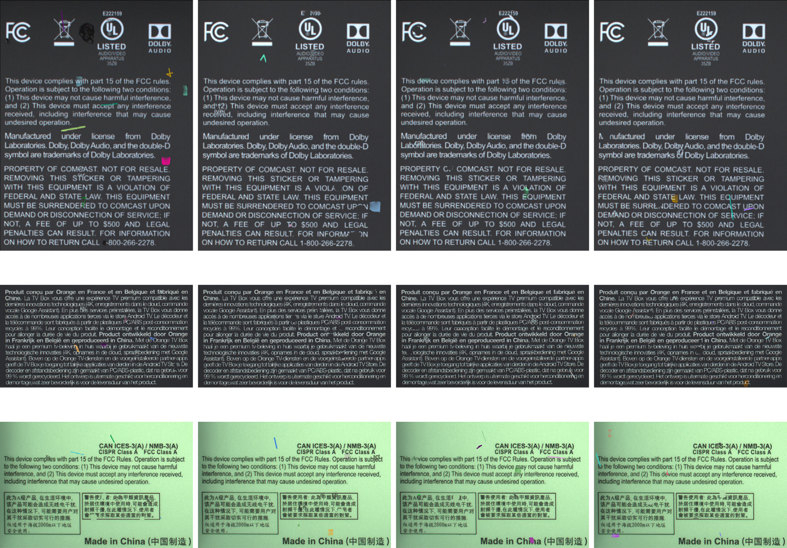

### 4.2 评估指标

为定量评估所提出方法的性能，在目标级别计算召回率（Recall）、精确率（Precision）、漏检率（FNR）和

$$
F_1
$$

分数：

$$
R = \frac{TP}{TP + FN} \quad (21)
$$

$$
P = \frac{TP}{TP + FP} \quad (22)
$$

$$
FNR = \frac{FN}{TP + FN} \quad (23)
$$

$$
F_1 = \frac{2 \cdot P \cdot R}{P + R} \quad (24)
$$

其中真正例（TP）表示被正确预测为缺陷的真实缺陷，FP对应被错误预测为缺陷的非缺陷，假负例（FN）对应被错误识别为非缺陷的真实缺陷。如果与真值边界框的交并比（IoU）大于0.001，则检测为TP。

### 4.3 实现细节

缺陷检测程序使用C++和OpenCV实现，运行在Intel Xeon E5-2620 CPU@2.10GHz、Nvidia RTX2080 Ti GPU（仅用于深度学习方法的评估）、32GB RAM、Ubuntu 16.04系统的服务器上。缺陷模拟程序使用Python 3.6实现。

$$
T_{filter} = 20
$$

，

$$
T_{score} = 0.75
$$

，

$$
T_{area} = 5
$$

。使用openMP（12线程）加速算法。

SSIM和RTPDS均使用C++和OpenCV实现。DSIM在R、G、B颜色平面上分别用C++实现，结果图像通过OR操作合并。

$$
k_{dsim} = 5
$$

，

$$
W_{dsim} = 5
$$

，

$$
T_{score} = 0.75
$$

。以上传统对比方法均基于LDCE提取的ROI执行而非整幅图像。

FCN-VGG16和DeepLabV3+使用2985个256×256×3随机图像块训练，80%训练、20%验证，Adam优化，mini-batch=16，学习率0.001。

### 4.4 与基线方法的比较和时间复杂度

**表3：在数据集（Label-1、Label-2和Label-3）上与现有基线方法的Recall、Precision和**

$$
F_1
$$

**分数对比**

| 方法 | Label-1 | Label-2 | Label-3 | Mean |
|---|---|---|---|---|
| | R / P / $F_1$ | R / P / $F_1$ | R / P / $F_1$ | R / P / $F_1$ |
| SSIM (Wang等, 2004) | 0.9273 / 0.7805 / 0.8751 | 0.9855 / 0.7541 / 0.8594 | 0.9072 / 0.7607 / 0.8059 | 0.9400 / 0.7651 / 0.8468 |
| RTPDS (Shankar等, 2009) | 0.9953 / 0.9959 / 0.9111 | 0.9952 / 0.9178 / 0.9308 | **0.9962** / 0.3911 / 0.3816 | 0.9956 / 0.7683 / 0.5412 |
| DSIM (Vans等, 2011) | 0.4167 / 0.6246 / 0.8242 | 0.3718 / 0.9441 / 0.7181 | 0.3849 / 0.8569 / 0.8468 | 0.3911 / 0.8085 / 0.7964 |
| FCN-VGG16 (Long等, 2015) | 0.8751 / 0.9397 / **0.9688** | 0.8594 / 0.9459 / **0.9721** | 0.8059 / 0.9058 / 0.7647 | 0.8468 / 0.9305 / 0.9019 |
| DeepLabV3+ (Chen等, 2018) | 0.5445 / 0.9998 / 0.6375 | 0.2746 / 0.9968 / 0.4305 | 0.2322 / 0.7808 / 0.2997 | 0.3504 / 0.9258 / 0.4559 |
| Valente等 (2020) | 0.7688 / 0.4237 / 0.5488 | 0.9178 / 0.9459 / 0.9316 | 0.2443 / 0.4332 / 0.5558 | 0.6436 / 0.6009 / 0.6787 |
| **Ours** | 0.9397 / **0.9998** / **0.9688** | **0.9999** / **0.9999** / **0.9721** | 0.9475 / **0.9931** / **0.9697** | **0.9624** / **0.9976** / **0.9702** |

所提出方法取得了最高的平均

$$
F_1
$$

分数0.9702，创造了新的SOTA性能。相比DSIM（0.8468）、FCN-VGG16（0.7647）、DeepLabV3+（0.5558）和Valente等（2020）（0.5488）分别提升了12.34%、20.55%、41.44%和42.14%。

**表4：FP、FN和检测时间对比（均值列最佳结果加粗）**

| 方法 | Mean FP | Mean FN | Mean Time (ms) |
|---|---|---|---|
| SSIM | 42,802.67 | 896.67 | 1244.65 |
| RTPDS | 48,043.67 | **66.33** | 290.39 |
| DSIM | 646.67 | 3,492.00 | 1637.01 |
| FCN-VGG16 | 7,996.33 | 1,316.00 | 100.80 |
| DeepLabV3+ | 18,131.67 | 3,347.67 | **83.46** |
| Valente等 (2020) | 1,035.67 | 8,689.67 | 108.31 |
| **Ours** | **34.33** | 828.33 | 263.62 |

所提出方法具有最低的误分类率，FP最少（34.33）。与SSIM（1244.65ms）和DSIM（1637.01ms）相比，检测时间（263.62ms）明显更短。虽然DeepLabV3+检测时间最短，但需要GPU。

**表5：数据集Label-2上不同图像尺寸的检测时间**

| 缩放率 | 0.2 | 0.4 | 0.6 | 0.8 | 1.0 | 1.2 | 1.4 | 1.6 | 1.8 | 2.0 |
|---|---|---|---|---|---|---|---|---|---|---|
| 尺寸 | 249×132 | 499×265 | 749×398 | 999×531 | 1249×664 | 1498×796 | 1748×929 | 1998×1062 | 2248×1195 | 2498×1328 |
| 检测时间(ms) | 35.52 | 67.6 | 125.86 | 177.03 | 298.49 | 328.64 | 531.32 | 662.80 | 771.85 | 981.25 |

表5表明检测时间随图像尺寸线性增长。即使图像尺寸增加到2498×1328，耗时仍不到1秒。

---

### 4.5 LDCE 算法中调整参数 n 的分析

如 LDCE 算法中所述，测试图像被划分为 

$$
n \times n
$$
 子图像。为了验证 

$$
n
$$
 值对性能的影响，我们通过设置不同的 

$$
n
$$
 值进行了实验，

$$
n \in \{1, 2, 3, \ldots, 9\}
$$
。表 7 展示了基于数据集 Label-1 和 Label-2 的测试结果。在不失一般性的前提下，我们仅在 Label-1 和 Label-2 上进行了验证。基于表 7 的结果，我们的发现总结如下：

- （1）随着 

$$
n
$$
 值减小，总测试时间越来越大。特别是当 

$$
n = 1
$$
 时，平均总时间达到 2319.31 s。原因是在该条件下没有进行伪影消除，大量伪影显著增加了检测时间。

$$
FN
$$
 和 

$$
FP
$$
 的数量逐渐增加，

$$
F_1
$$
 分数逐渐下降。

- （2）随着 

$$
n
$$
 值增大，

$$
FN
$$
 的数量逐渐增加，

$$
F_1
$$
 分数逐渐下降。

$$
n = 9
$$
 时 

$$
FN
$$
 最高（1486.50），

$$
F_1
$$
 最低（0.9474）。

$$
n = 4
$$
 时 

$$
F_1
$$
 最高（0.9705），

$$
FN
$$
 最低（854.00）。对此我们给出如下分析：随着 

$$
n
$$
 越来越大，图像被划分为更小的子图像，导致一些缺陷被切割成小碎片。经过 LDCE 处理后，难以保持原始缺陷的完整性，从而增加了 

$$
FN
$$
 的数量。

- （3）综上所述，为了平衡 

$$
F_1
$$
、总时间、

$$
FP
$$
 和 

$$
FN
$$
，当 

$$
n = 4
$$
 时取得最佳性能。原因是 

$$
n = 4
$$
 具有最高的 

$$
F_1
$$
（0.9705）、最低的 

$$
FN
$$
（854.00）以及较低的 

$$
FP
$$
（2.50）。该 

$$
FP
$$
（2.50）非常接近最低 

$$
FP
$$
（2.00）。同时，总时间（403.49 s）仍然满足实时检测的要求。

**Table 7** — 不同 

$$
n
$$
 值下 PLDD 在数据集 Label-1 和 Label-2 上的性能。均值列的最佳结果以粗体标注。

| $n$ | Label-1 | Label-2 | Mean |
|-----|---------|---------|------|
| | Recall / Precision / $F_1$ / Total time (s) / FP / FN | Recall / Precision / $F_1$ / Total time (s) / FP / FN | $F_1$ / Total time (s) / FP / FN |
| 1 | 0.9155 / 0.9997 / 0.9558 / 2286.34 / 4 / 1283 | 0.9145 / 0.9870 / 0.9520 / 2352.27 / 178 / 1179 | 0.9539 / 2319.31 / 91.00 / 1231.00 |
| 2 | 0.9316 / 0.9996 / 0.9644 / 661.30 / 6 / 1039 | 0.9418 / 0.9963 / 0.9683 / 714.59 / 51 / 852 | 0.9664 / 687.95 / 28.50 / 945.50 |
| 3 | 0.9363 / 0.9996 / 0.9669 / 404.81 / 5 / 967 | 0.9438 / 0.9987 / 0.9705 / 447.00 / 18 / 823 | 0.9687 / 425.91 / 11.50 / 895.00 |
| 4 | 0.9397 / 0.9998 / 0.9688 / 369.99 / 3 / 916 | 0.9459 / 0.9999 / 0.9721 / 436.99 / 2 / 792 | **0.9705** / 403.49 / 2.50 / **854.00** |
| 5 | 0.9403 / 0.9998 / 0.9691 / 377.65 / 3 / 907 | 0.9310 / 0.9982 / 0.9635 / 392.84 / 24 / 1010 | 0.9663 / 385.25 / 13.50 / 958.50 |
| 6 | 0.9370 / 0.9998 / 0.9671 / 359.62 / 3 / 956 | 0.9370 / 0.9999 / 0.9675 / 398.51 / 1 / 922 | 0.9673 / 379.07 / **2.00** / 939.00 |
| 7 | 0.9419 / 0.9998 / 0.9700 / 342.78 / 3 / 883 | 0.9237 / 0.9999 / 0.9603 / 381.77 / 2 / 1117 | 0.9652 / **362.28** / 2.50 / 1000.00 |
| 8 | 0.9353 / 0.9996 / 0.9664 / 353.11 / 5 / 983 | 0.9475 / 0.9999 / 0.9730 / 402.53 / 2 / 769 | 0.9697 / 377.82 / 3.50 / 876.00 |
| 9 | 0.8938 / 0.9997 / 0.9438 / 370.66 / 4 / 1613 | 0.9071 / 0.9990 / 0.9509 / 379.92 / 13 / 1360 | 0.9474 / 375.29 / 8.50 / 1486.50 |

**Table 6** — 各类缺陷在测试数据集（Label-1、Label-2 和 Label-3）上的误分类对比。均值 FNR 的最佳结果以粗体标注。

| 缺陷类别 / 方法 | Label-1 | Label-2 | Label-3 | Mean FNR |
|----------------|---------|---------|---------|----------|
| | 缺陷数 / FN / FNR | 缺陷数 / FN / FNR | 缺陷数 / FN / FNR | 每类 / 所有类别 |
| **过印缺陷** | | | | |
| DSIM (Vans et al., 2011) | 2882 / 608 / 0.2110 | 2931 / 572 / 0.1952 | 2128 / 350 / 0.1645 | 0.1902 / 0.2347 |
| FCN-VGG16 (Long et al., 2015) | 2882 / 484 / 0.1679 | 2931 / 255 / 0.0870 | 2128 / 190 / 0.0893 | 0.1147 / 0.0885 |
| Ours | 2882 / 278 / 0.0965 | 2931 / 117 / 0.0399 | 2128 / 95 / 0.0446 | **0.0603** / **0.0557** |
| **漏印缺陷** | | | | |
| DSIM | 2997 / 29 / 0.0097 | 2931 / 9 / 0.0031 | 3591 / 156 / 0.0434 | 0.0187 / 0.9613 |
| FCN-VGG16 | 2997 / 134 / 0.0447 | 2931 / 95 / 0.0324 | 3591 / 343 / 0.0955 | 0.0885 / 0.0575 |
| Ours | 2997 / 43 / 0.0143 | 2931 / 3 / 0.0010 | 3591 / 18 / 0.0050 | **0.0068** / 0.0112 |
| **模糊印刷缺陷** | | | | |
| DSIM | 2205 / 2146 / 0.9732 | 2246 / 2185 / 0.9728 | 2267 / 2126 / 0.9378 | 0.9613 / 0.1564 |
| FCN-VGG16 | 2205 / 15 / 0.0068 | 2246 / 10 / 0.0045 | 2267 / 22 / 0.0097 | **0.0070** / 0.1366 |
| Ours | 2205 / 42 / 0.0190 | 2246 / 12 / 0.0053 | 2267 / 21 / 0.0093 | 0.0112 / 0.1989 |
| **色斑印刷缺陷** | | | | |
| DSIM | 2618 / 234 / 0.0894 | 2262 / 390 / 0.1724 | 2366 / 491 / 0.2075 | 0.1564 / 0.1293 |
| FCN-VGG16 | 2618 / 317 / 0.1211 | 2262 / 348 / 0.1538 | 2366 / 319 / 0.1348 | 0.1366 / 0.1350 |
| Ours | 2618 / 413 / 0.1578 | 2262 / 519 / 0.2294 | 2366 / 496 / 0.2096 | 0.1989 / **0.0468** |
| **短线印刷缺陷** | | | | |
| DSIM | 2993 / 297 / 0.0992 | 2702 / 422 / 0.1562 | 3033 / 402 / 0.1325 | 0.1293 / 0.0131 |
| FCN-VGG16 | 2993 / 339 / 0.1133 | 2702 / 423 / 0.1566 | 3033 / 410 / 0.1352 | 0.1350 / 0.0550 |
| Ours | 2993 / 130 / 0.0434 | 2702 / 139 / 0.0514 | 3033 / 138 / 0.0455 | **0.0468** / 0.1989 |
| **长线印刷缺陷** | | | | |
| DSIM | 1490 / 19 / 0.0128 | 1570 / 23 / 0.0146 | 1416 / 17 / 0.0120 | 0.0131 / 0.1902 |
| FCN-VGG16 | 1490 / 61 / 0.0409 | 1570 / 73 / 0.0465 | 1416 / 110 / 0.0777 | 0.0550 / 0.1147 |
| Ours | 1490 / 10 / 0.0067 | 1570 / 2 / 0.0013 | 1416 / 9 / 0.0064 | **0.0048** / **0.0603** |

### 4.6 消融实验与定量分析

在缺陷检测中，与 

$$
GM
$$
 图像相似的图像应该获得较高的相似度得分；相反，与 

$$
GM
$$
 图像不同的图像应该获得较低的相似度得分。只有这样，缺陷和伪影才能被容易地区分。然而，图 12 表明基于 SSIM 的相似度度量在某些情况下无法满足缺陷检测的需求，在实际应用中可能导致大量误检。相比之下，我们提出的 ICSM（Improved Cosine Similarity Measure，改进余弦相似度度量）方法提供了与人类视觉特征一致的具有判别力的得分。

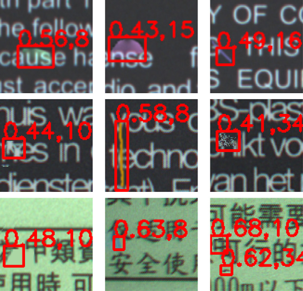

**图 12** SSIM 与 ICSM 相似度度量的对比示例。(a) 和 (c) 完全不同，但它们的 SSIM 相似度得分（0.83）完全相同，(b) 与 

$$
GM
$$
 也是如此。此外，(d) 与 

$$
GM
$$
 明显不同，但其 SSIM 得分高达 0.90。而使用 ICSM 时，所有得分均计算为 0，与人类视觉一致。

此外，如图 13 所示，我们在随机选取的 83 个缺陷样本上进行了原始余弦相似度度量与 ICSM 的对比。显然，ICSM 比原始余弦相似度更具判别力，因为整体得分都有所下降。对于缺陷样本而言，获得较低的相似度得分更为有利。

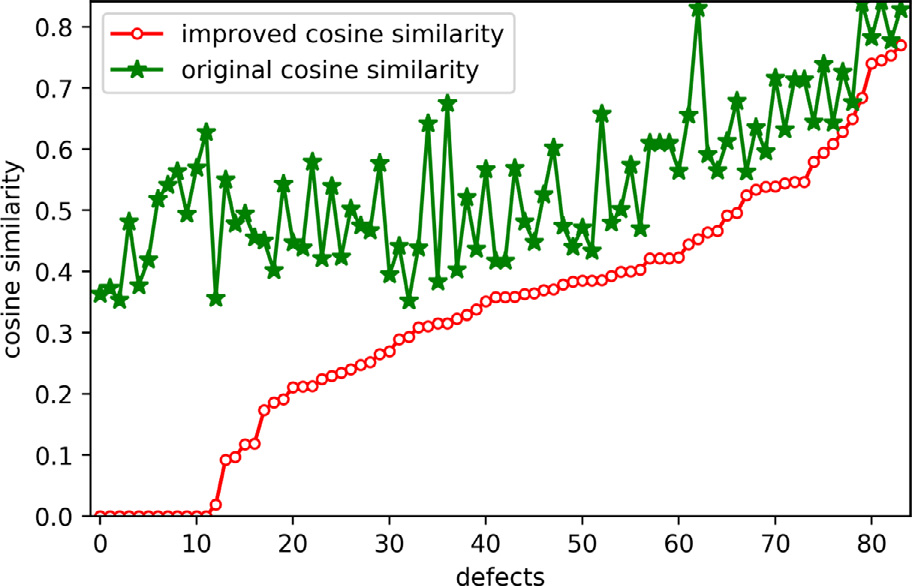

**图 13** 原始余弦相似度与 ICSM 的对比。展示了 83 个缺陷样本。

此外，我们在三个数据集上进行了额外的消融实验，以评估不同改进组件的有效性。共有四个改进组件：Mask（掩码）、ICSM（改进余弦相似度度量）、

$$
T2G
$$
（测试到黄金模板的梯度匹配）和 

$$
G2T
$$
（黄金模板到测试的梯度匹配）。在每次实验中，我们移除一个改进组件来证明其有效性。在表 8 中，分别对不使用 Mask、不使用 ICSM、不使用 

$$
G2T
$$
 和不使用 

$$
T2G
$$
 的方法进行了性能对比，其对应的 

$$
F_1
$$
 分数分别为 0.9500、0.9093、0.9474 和 0.7649。相比之下，所提方法的 

$$
F_1
$$
 分数（0.9702）得益于四个组件的集成，分别提升了 2.02%、6.09%、2.28% 和 20.53%。最显著的改进来自 

$$
T2G
$$
 组件，其次是 ICSM 组件。移除 ICSM 组件后，

$$
F_1
$$
 分数从 0.9702 显著下降至 0.9093。与任何其他组合相比，所提方法还获得了最低的平均 

$$
FN
$$
（828）。不过，所提方法的 

$$
FP
$$
（34）略差于不使用 ICSM 组件的方法。

**Table 8** — 所提方法四个改进组件的消融实验对比。最佳结果以粗体标注。

| Dataset | Mask / ICSM / $G2T$ / $T2G$ | Recall | Precision | $F_1$ | FP | FN |
|---------|---------------------------|--------|-----------|-------|----|----|
| **Label-1** | | | | | | |
| 完整方法 | ✓ / ✓ / ✓ / ✓ | 0.9397 | 0.9998 | **0.9688** | 3 | **916** |
| 去掉 Mask | ✗ / ✓ / ✓ / ✓ | 0.9104 | 0.9999 | 0.9530 | 2 | 1361 |
| 去掉 ICSM | ✓ / ✗ / ✓ / ✓ | 0.8169 | 0.9999 | 0.8992 | **1** | 2781 |
| 去掉 $G2T$ | ✓ / ✓ / ✗ / ✓ | 0.8853 | 0.9998 | 0.9391 | 3 | 1741 |
| 去掉 $T2G$ | ✓ / ✓ / ✓ / ✗ | 0.5768 | 0.9998 | 0.7316 | 2 | 6426 |
| **Label-2** | | | | | | |
| 完整方法 | ✓ / ✓ / ✓ / ✓ | 0.9459 | 0.9999 | **0.9721** | 2 | **792** |
| 去掉 Mask | ✗ / ✓ / ✓ / ✓ | 0.8985 | 0.9998 | 0.9465 | 2 | 1486 |
| 去掉 ICSM | ✓ / ✗ / ✓ / ✓ | 0.8563 | 1.0000 | 0.9226 | **0** | 2104 |
| 去掉 $G2T$ | ✓ / ✓ / ✗ / ✓ | 0.9136 | 0.9999 | 0.9548 | 1 | 1265 |
| 去掉 $T2G$ | ✓ / ✓ / ✓ / ✗ | 0.6987 | 0.9999 | 0.8226 | 1 | 4412 |
| **Label-3** | | | | | | |
| 完整方法 | ✓ / ✓ / ✓ / ✓ | 0.9475 | 0.9931 | **0.9697** | 98 | **777** |
| 去掉 Mask | ✗ / ✓ / ✓ / ✓ | 0.9122 | 0.9919 | 0.9504 | 110 | 1300 |
| 去掉 ICSM | ✓ / ✗ / ✓ / ✓ | 0.8287 | 0.9993 | 0.9061 | **8** | 2535 |
| 去掉 $G2T$ | ✓ / ✓ / ✗ / ✓ | 0.9064 | 0.9945 | 0.9484 | 74 | 1385 |
| 去掉 $T2G$ | ✓ / ✓ / ✓ / ✗ | 0.5894 | 0.9955 | 0.7405 | 39 | 6077 |
| **Mean** | | | | | | |
| 完整方法 | ✓ / ✓ / ✓ / ✓ | 0.9444 | 0.9976 | **0.9702** | 34 | **828** |
| 去掉 Mask | ✗ / ✓ / ✓ / ✓ | 0.9070 | 0.9972 | 0.9500 | 38 | 1382 |
| 去掉 ICSM | ✓ / ✗ / ✓ / ✓ | 0.8340 | 0.9997 | 0.9093 | **3** | 2473 |
| 去掉 $G2T$ | ✓ / ✓ / ✗ / ✓ | 0.9018 | 0.9981 | 0.9474 | 26 | 1464 |
| 去掉 $T2G$ | ✓ / ✓ / ✓ / ✗ | 0.6216 | 0.9984 | 0.7649 | 14 | 5638 |

### 4.7 定性结果

表 9 展示了 RGB 绝对差分与 LDCE 差异之间伪影消除的对比结果。我们观察到 RGB 绝对差分后确实存在大量伪影。然而，这些伪影在经过 LDCE 处理后被显著消除。图 14 进一步展示了不同缺陷类型的检测结果，包括过印（overprint）、漏印（missing print）、模糊缺陷（fuzzy defect）、色斑（color spot）、短线缺陷（short linear defect）和长线缺陷（long linear defect）。此外，图 15 展示了各对比方法与 PLDD（Label-1）之间的可视化对比。对比方法在一定程度上确实存在一些 

$$
FP
$$
 或 

$$
FN
$$
 结果。

**Table 9** — RGB 绝对差分与 LDCE 差异的伪影消除对比。"RGB absdiff"和"LDCE difference"列均通过应用热力图（hot colormap）进行了增强可视化。

（注：Table 9 为图像对比，请参见原文图示。）

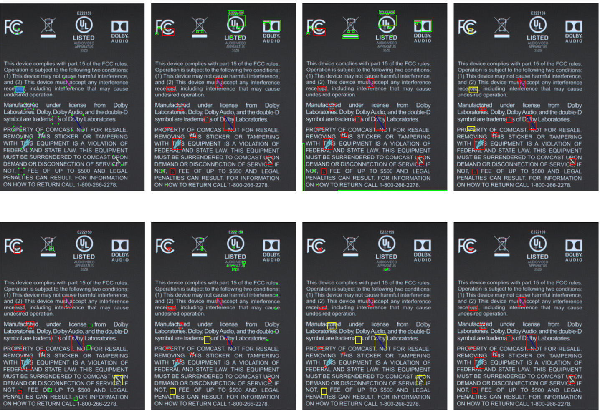

**图 14** 所提框架的印刷标签缺陷检测定性结果。对于每个缺陷 ROI，逗号前的数字表示相似度得分，逗号后的数字表示缺陷像素面积。

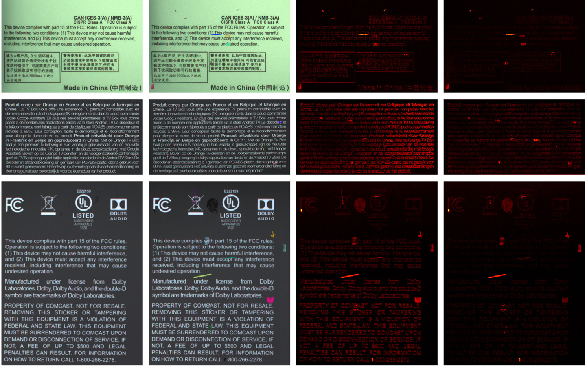

**图 15** SSIM、RTPDS、DSIM、FCN-VGG16、DeepLabV3+、Valente et al. (2020) 和 PLDD（Label-1）之间的可视化对比。

$$
TP
$$
、

$$
FP
$$
 和 

$$
FN
$$
 的结果分别用红色、绿色和黄色边界框标注。(a) 是标注图像（ground truth），其缺陷由 LabelImg 工具（Tzutalin, 2015）标注。

## 5. 结论与未来工作

现有的印刷标签缺陷检测方法中，很少有方法关注伪影消除和对未见类型缺陷的更好泛化能力。本文为了解决这些问题，提出了一种新颖的印刷标签缺陷检测（PLDD，Printed Label Defect Detection）框架。首先，PLDD 通过 LDCE 算法进行伪影消除和潜在缺陷候选提取，在显著去除伪影的同时保留了缺陷。其次，基于改进余弦相似度度量的二次梯度匹配（

$$
T2G
$$
 和 

$$
G2T
$$
）仅在缺陷候选区域上执行。同时引入了掩码（Mask）机制来消除潜在缺陷候选周围背景梯度特征的影响。此外，应用了三个数据集来验证所提框架的泛化能力。最后，进行了对比实验和消融研究，结果表明所提方法达到了当前最优（state-of-the-art）性能。

在 PLDD 中，图像配准是我们方法的第一步，也是后续步骤的关键。然而，经过 LDCE 处理后仍然存在一些伪影，尤其是在大型非刚性变形的情况下。因此，如何提高大变形下的图像配准性能是我们未来工作的主要方向。我们观察到，一些基于深度学习的无监督配准方法在医学图像上已经取得了显著成果。然而，很少有方法关注工业图像的配准。此外，一些低对比度缺陷仍然难以被检测，这将在未来工作中加以改进。

---

## 参考文献

- Asha, V., Bhajantri, N. U., & Nagabhushan, P. (2012). Similarity measures for automatic defect detection on patterned textures. *International Journal of Information and Communication Technology*, *4* (2–4), 118–131.

- Bergmann, P., Löwe, S., Fauser, M., Sattlegger, D., & Steger, C. (2018). Improving unsupervised defect segmentation by applying structural similarity to autoencoders. arXiv preprint arXiv:1807.02011.

- Bouchot, J.-L., Stübl, G., & Moser, B. (2011). A template matching approach based on the discrepancy norm for defect detection on regularly textured surfaces. In *Tenth international conference on quality control by artificial vision, Vol. 8000* (p. 80000K). International Society for Optics and Photonics.

- Chen, Q., Jessome, R., Maggard, E., & Allebach, J. P. (2019). Segmentation-based detection of local defects on printed pages. *Electronic Imaging*, *2019* (10), 301.

- Chen, L.-C., Zhu, Y., Papandreou, G., Schroff, F., & Adam, H. (2018). Encoder-decoder with atrous separable convolution for semantic image segmentation. In *Proceedings of the European conference on computer vision (ECCV)* (pp. 801–818).

- Dagum, L., & Menon, R. (1998). OpenMP: an industry standard API for shared-memory programming. *IEEE Computational Science and Engineering*, *5* (1), 46–55.

- Dailin, Z., Wenguang, C., & Jing, M. (2013). Detection of printed material defects based on shape template matching. *Mechanical and Electronic*, (12), 40–44.

- Deng, J., Dong, W., Socher, R., Li, L.-J., Li, K., & Fei-Fei, L. (2009). ImageNet: A large-scale hierarchical image database. In *2009 IEEE conference on computer vision and pattern recognition* (pp. 248–255).

- Deng, Z., Yan, X., Zhang, S., & Bailey, C. P. (2020). Extremal region analysis based deep learning framework for detecting defects. arXiv preprint arXiv:2003.08525.

- Di, H., Ke, X., Peng, Z., & Dongdong, Z. (2019). Surface defect classification of steels with a new semi-supervised learning method. *Optics and Lasers in Engineering*, *117*, 40–48.

- Ferguson, M. K., Ronay, A., Lee, Y.-T. T., & Law, K. H. (2018). Detection and segmentation of manufacturing defects with convolutional neural networks and transfer learning. *Smart and Sustainable Manufacturing Systems*, *2*.

- Gong, W., Zhang, K., Yang, C., Yi, M., & Wu, J. (2020). Adaptive visual inspection method for transparent label defect detection of curved glass bottle. In *2020 international conference on computer vision, image and deep learning (CVIDL)* (pp. 90–95).

- Haik, O., Perry, O., Chen, E., & Klammer, P. (2020). A novel inspection system for variable data printing using deep learning. In *Proceedings of the IEEE/CVF winter conference on applications of computer vision* (pp. 3541–3550).

- Ilg, E., Mayer, N., Saikia, T., Keuper, M., Dosovitskiy, A., & Brox, T. (2017). FlowNet 2.0: Evolution of optical flow estimation with deep networks. In *Proceedings of the IEEE conference on computer vision and pattern recognition* (pp. 2462–2470).

- Johnson, G. M., Song, X., Montag, E. D., & Fairchild, M. D. (2010). Derivation of a color space for image color difference measurement. *Color Research & Application*, *35* (6), 387–400.

- Long, J., Shelhamer, E., & Darrell, T. (2015). Fully convolutional networks for semantic segmentation. In *Proceedings of the IEEE conference on computer vision and pattern recognition* (pp. 3431–3440).

- Luan, C., Jing, Z., & Zuo, J. (2021). A defect-sensitive loss function based on siamese network to defect detection with imbalanced samples. In *Journal of physics: Conference series, Vol. 1802*. IOP Publishing, Article 042085.

- Ma, B., Zhu, W., Wang, Y., Wu, H., Yang, Y., Fan, H., & Xu, H. (2017). The defect detection of personalized print based on template matching. In *2017 IEEE international conference on unmanned systems (ICUS)* (pp. 266–271).

- Nguyen, N. H. T., Perry, S., Bone, D., Le, H. T., & Nguyen, T. T. (2021). Two-stage convolutional neural network for road crack detection and segmentation. *Expert Systems with Applications*, Article 115718.

- Peng, X., Chen, Y., Xie, J., Liu, H., & Gu, C. (2010). An intelligent online presswork defect detection method and system. In *2010 second international conference on information technology and computer science* (pp. 158–161).

- Riemersma, T. (2012). Colour metric. Retrieved from www.compuphase.com/cmetric.htm (Accessed July 25, 2021).

- Shankar, N., Ravi, N., & Zhong, Z. (2009). A real-time print-defect detection system for web offset printing. *Measurement*, *42* (5), 645–652.

- Tabernik, D., Šela, S., Skvarč, J., & Skočaj, D. (2020). Segmentation-based deep-learning approach for surface-defect detection. *Journal of Intelligent Manufacturing*, *31* (3), 759–776.

- Tsai, D.-M., Lin, C.-T., & Chen, J.-F. (2003). The evaluation of normalized cross correlations for defect detection. *Pattern Recognition Letters*, *24* (15), 2525–2535.

- Tzutalin, D. (2015). LabelImg. Retrieved from GitHub repository https://github.com/tzutalin/labelImg (Accessed July 25, 2021).

- Valente, A., Wada, C., Neves, D., Neves, D., Perez, F., Megeto, G., Cascone, M., Gomes, O., & Lin, Q. (2020). Print defect mapping with semantic segmentation. In *Proceedings of the IEEE/CVF winter conference on applications of computer vision* (pp. 3551–3559).

- Vans, M., Schein, S., Staelin, C., Kisilev, P., Simske, S. J., Dagan, R., & Harush, S. (2011). Automatic visual inspection and defect detection on variable data prints. *Journal of Electronic Imaging*, *20* (1), Article 013010.

- Verikas, A., Lundström, J., Bacauskiene, M., & Gelzinis, A. (2011). Advances in computational intelligence-based print quality assessment and control in offset colour printing. *Expert Systems with Applications*, *38* (10), 13441–13447.

- Wang, Z., Bovik, A. C., Sheikh, H. R., & Simoncelli, E. P. (2004). Image quality assessment: from error visibility to structural similarity. *IEEE Transactions on Image Processing*, *13* (4), 600–612.

- Wu, X., Cao, K., & Gu, X. (2017). A surface defect detection based on convolutional neural network. In *International conference on computer vision systems* (pp. 185–194). Springer.

- Wu, S., Wu, Y., Cao, D., & Zheng, C. (2019). A fast button surface defect detection method based on siamese network with imbalanced samples. *Multimedia Tools and Applications*, *78* (24), 34627–34648.

- Wu, J., Ye, Y., Chen, Y., & Weng, Z. (2018). Spot the difference by object detection. arXiv preprint arXiv:1801.01051.

- Yangping, W., Shaowei, X., Zhengping, Z., Yue, S., & Zhenghai, Z. (2018). Real-time defect detection method for printed images based on grayscale and gradient differences. *Journal of Engineering Science & Technology Review*, *11* (1).

- Yu, Z., Wu, X., & Gu, X. (2017). Fully convolutional networks for surface defect inspection in industrial environment. In *International conference on computer vision systems* (pp. 417–426). Springer.

- Zhang, E., Chen, Y., Gao, M., Duan, J., & Jing, C. (2019). Automatic defect detection for web offset printing based on machine vision. *Applied Sciences*, *9* (17), 3598.

- Zhang, K., Yan, Y., Li, P., Jing, J., Wang, Z., & Xiong, Z. (2020). Fabric defect detection using saliency of multi-scale local steering kernel. *IET Image Processing*, *14* (7), 1265–1272.

- Zhang, H., Jiang, L., & Li, C. (2021). CS-ResNet: Cost-sensitive residual convolutional neural network for PCB cosmetic defect detection. *Expert Systems with Applications*, Article 115673.

- Zhao, Z., Li, B., Dong, R., & Zhao, P. (2018). A surface defect detection method based on positive samples. In *Pacific rim international conference on artificial intelligence* (pp. 473–481). Springer.
