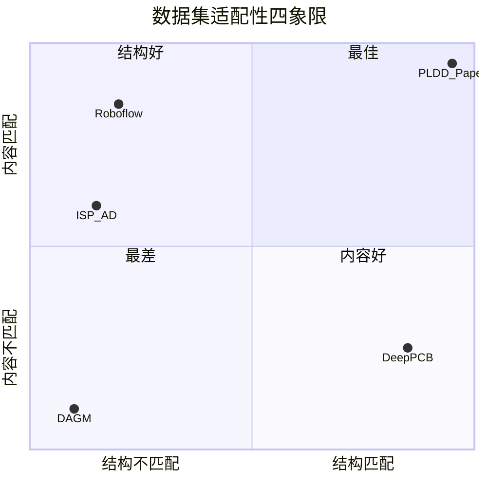
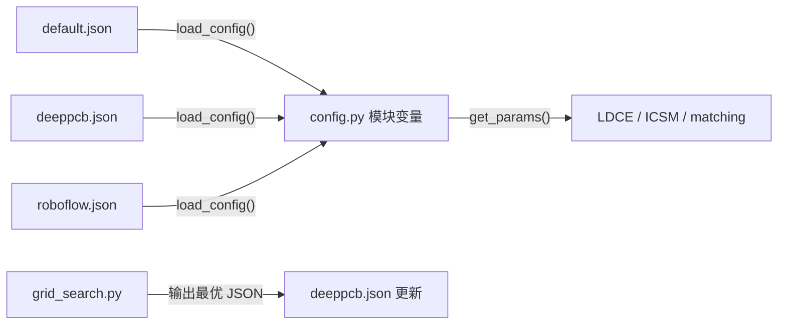
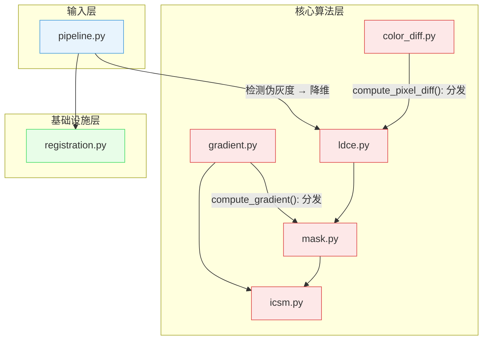

# PLDD 多数据集适配与参数管理方案

> 一套代码 + 多套参数，支持灰度和 RGB 双模式跨数据集评估

## 目录

- [背景与目标](#背景与目标)
- [数据集选型](#数据集选型)
- [参数管理架构](#参数管理架构)
- [灰度适配架构](#灰度适配架构)
- [接口定义](#接口定义)
- [实现状态](#实现状态)
- [风险与约束](#风险与约束)

---

## 背景与目标

PLDD 论文要求输入 **Golden Master（GM）参考图 + 测试图 + 像素级 GT mask** 的三件套，且图像内容为 RGB 印刷标签。经搜索确认，**不存在同时满足"印刷标签 + GM 配对 + 开源"的公开数据集**。

因此需要：
1. 在结构匹配但内容不同的数据集（DeepPCB）上验证**算法框架正确性**
2. 在内容匹配但结构不完整的数据集（Roboflow）上做**补充验证**
3. 参数按数据集独立管理，互不污染
4. 算法模块支持灰度和 RGB 双模式输入

---

## 数据集选型

### 候选数据集对比

| 数据集 | 规模 | GM 配对 | GT 精度 | 图像内容 | 色彩 | 适配难度 |
|--------|------|---------|---------|----------|------|----------|
| **DeepPCB** | 1500 对 | ✅ 原生 | bbox→mask | PCB 电路板 | 灰度 | 低 |
| **Roboflow USM V2** | 793 张 | ❌ 需构造 | 图像级 | 印刷标签 | RGB | 高 |
| **DAGM 2007** | 11500 张 | ❌ 无 | 像素级 | 工业纹理 | 灰度 | 不适用 |
| **ISP-AD** | 55 万张 | ❌ 无 | 分类级 | 丝网印刷 | RGB | 高 |



### 决策结论

**优先使用 DeepPCB**，理由：
- 天然 template+test 配对结构，完美匹配 PLDD 输入
- 1500 对足够统计评估
- 灰度适配改动量小（仅 LDCE 一处）
- **不足**：PCB 非印刷标签，无法验证 RGB 色差模块

**Roboflow 降级为补充**：图像内容匹配但缺少 GM，需构造伪 GM 且 bbox 是图像级标注，评估精度有限。

**DAGM 已关闭**：纹理数据集，任务结构与 PLDD 不匹配。

---

## 参数管理架构

### 设计决策：JSON 参数文件分离

| 方案 | 优点 | 缺点 | 决策 |
|------|------|------|------|
| A. 多个 config_*.py | IDE 补全好 | 需改 import，参数扫描不便 | ✗ |
| B. 单 config.py + 运行时覆盖 | 不改文件 | 参数丢失不可追溯 | ✗ |
| **C. JSON 参数文件 + `load_config()`** | 可追溯、可版本化、扫描直接输出 | 需手动同步 JSON 和代码 | **✓ 采用** |

### 文件结构

```
Project/Label_Detect/configs/
├── default.json        # 论文原始参数（基准，勿改）
├── deeppcb.json        # DeepPCB 灰度 PCB 标定参数
├── roboflow.json       # Roboflow 印刷标签参数（后续）
└── dagm.json           # DAGM 实验参数（归档）
```

### 参数流转



`load_config(path)` 读取 JSON → 覆盖模块级全局变量 → `get_params()` 返回最新 dict。参数扫描脚本直接输出 JSON，无需手动编辑。

### 当前参数值

| 参数 | default（论文） | deeppcb（待标定） | 说明 |
|------|----------------|-------------------|------|
| T_filter | 3 | 3 | 色差/灰度差阈值 |
| T_score | 0.6 | 0.55 | ICSM 相似度阈值 |
| T_r | 0.1 | 0.1 | 幅值比阈值 |
| T_m | 50.0 | 80.0 | 幅值差阈值 |
| n_subimage | 4 | 4 | LDCE 子图分割数 |
| l_slide | 5 | 5 | 滑动范围 |

DeepPCB 参数经过网格搜索标定（进行中），完成后更新 `deeppcb.json`。

---

## 灰度适配架构

DeepPCB 是单通道灰度图（640×640），PLDD 原设计为 RGB。需在 **6 个模块**中加入灰度分支。

### 适配总览



红色 = 需要灰度适配（已改），绿色 = 原生支持灰度。

### 各模块适配策略

| 模块 | 原始要求 | 适配方式 | 改动量 |
|------|---------|---------|--------|
| `color_diff.py` | 3 通道 BGR | 新增 `grayscale_diff()` + `compute_pixel_diff()` 统一分发 | +30 行 |
| `ldce.py` | 3 通道校验 | 放宽为 2D 或 3D，调用 `compute_pixel_diff()` | ~5 行 |
| `gradient.py` | 3 通道 Sobel | 新增 `compute_gradient()` + `_compute_gray_gradient()` | +25 行 |
| `mask.py` | `cvtColor(BGR2GRAY)` | 先检查 `ndim` 再决定是否转换 | ~3 行 |
| `icsm.py` | `compute_rgb_gradient()` | 改调 `compute_gradient()` + 灰度 Canny | ~3 行 |
| `pipeline.py` | `load_image(color=True)` | 检测伪灰度（三通道相同）并降维 | +6 行 |
| `registration.py` | — | 已有 `_to_gray()` 兼容，无需改动 | 0 行 |

### 灰度 vs RGB 差异对比

| 算法步骤 | RGB 模式 | 灰度模式 |
|----------|---------|---------|
| 像素差异 | 加权欧氏色差（R/G/B 三通道加权） | 绝对差值 `|a-b|` |
| 梯度计算 | 三通道 Sobel 平均融合 | 单通道 Sobel |
| 配准 | 转灰度后 ECC | 直接 ECC（更快） |
| ICSM 求解 | 与灰度相同（梯度域不依赖色彩） | 与 RGB 相同 |

---

## 接口定义

### 新增公开接口

| 函数 | 签名 | 说明 | 兼容策略 |
|------|------|------|---------|
| `load_config()` | `(path: str) -> dict` | 加载 JSON 参数文件，覆盖全局变量 | 新增，不影响现有 API |
| `compute_pixel_diff()` | `(img1, img2) -> ndarray` | 自动分发 RGB/灰度差异计算 | 新增，LDCE 内部调用 |
| `compute_gradient()` | `(image) -> (gx, gy, mag)` | 自动分发 RGB/灰度梯度 | 新增，ICSM 和 mask 内部调用 |
| `grayscale_diff()` | `(img1, img2) -> ndarray` | 灰度绝对差值 | 新增 |

### 保持不变的接口

以下接口签名不变，内部透明支持灰度：
- `extract_candidates()` — 接受 `(H,W)` 或 `(H,W,3)`
- `compute_icsm()` — 接受 `(H,W)` 或 `(H,W,3)`
- `detect_defects()` — 接受 `(H,W)` 或 `(H,W,3)`
- `register_images()` — 已原生支持灰度

---

## 实现状态

### 已完成

| 任务 | 提交 | 状态 |
|------|------|------|
| DeepPCB → PLDD 格式转换 | `a97c4b9` | ✅ 1500 对已转换 |
| 6 模块灰度适配 | `a97c4b9` | ✅ 管线跑通 |
| 参数文件分离 + `load_config()` | `8bedbeb` | ✅ JSON 加载正常 |
| DeepPCB 参数网格搜索 | `8bedbeb` | 🔄 后台运行中 |
| 初步评估（10 样本） | — | ✅ F1=0.120 |

### 待完成

| 任务 | 依赖 | 复杂度 | 路由建议 |
|------|------|--------|---------|
| DeepPCB 参数标定完成 | 网格搜索结果 | 低 | 直接执行 |
| DeepPCB 全量评估（500 test） | 参数标定 | 中 | 脚本执行 |
| Roboflow 数据处理方案 | DeepPCB 验证结论 | 高 | 需设计讨论 |
| 印刷标签数据获取策略 | 全部评估完成 | 中 | 调研 |

---

## 风险与约束

### 技术风险

| 风险 | 触发条件 | 缓解措施 |
|------|---------|---------|
| DeepPCB F1 偏低反映算法缺陷而非数据问题 | 参数优化后 F1 < 0.3 | 分析 per-defect-type 指标，确认是否为灰度降级导致 |
| 灰度差阈值与 RGB 色差量级不同 | T_filter 在灰度模式下含义变化 | 网格搜索独立标定 |
| 伪灰度检测误判 | 三通道近似但不完全相同的图像 | pipeline 中加容差检测 |

### 约束条件

- **DeepPCB 无法验证 RGB 色差模块**：LDCE 的色差检测退化为一维差值，无法代表印刷标签场景
- **Roboflow 缺少 GM**：伪 GM 构造方案风险高，评估精度有限
- **参数不可跨数据集复用**：每个数据集需独立标定
- **论文复现完整性受限**：没有真实印刷标签 GM+test 数据，无法达到论文声称的 F1=0.97

### 回滚方案

若灰度适配导致 RGB 模式回归：
- 所有改动向后兼容，RGB 路径未经修改
- `compute_pixel_diff()` 在 RGB 输入时自动走原始 `weighted_euclidean_color_diff()`
- `compute_gradient()` 在 RGB 输入时自动走原始 `compute_rgb_gradient()`

---

## 附录

### A. 数据集元信息

**DeepPCB-PLDD**（转换后）：

```
Data/DeepPCB-PLDD/
├── meta.json     # 1500 项，含 split/defect_types/image_size
├── gm/           # 1500 张 640×640 灰度 PNG
├── test/         # 1500 张 640×640 灰度 PNG
└── gt/           # 1500 张 640×640 二值 mask PNG
```

- Train: 1000 / Test: 500
- 缺陷类型：open, short, mousebite, spur, copper, pin-hole
- 每张图含 3-12 个 bbox 缺陷标注
- 来源：`tangsanli5201/DeepPCB`（CC BY 4.0）

**Roboflow Label Printing Defect V2**（原始）：

```
Data/Roboflow Label Printing V2/
└── Label Printing Defect Version 2.v25-original-images.coco/
    ├── train/   # 557 张 + _annotations.coco.json
    ├── valid/   # 118 张
    ├── test/    # 118 张
    └── README.roboflow.txt
```

- 总计 793 张 RGB 图像（~496×378）
- 类别：Defect (537) / No-Defect (536)
- 标注：COCO bbox（图像级，非像素级）
- 来源：马来西亚理科大学（CC BY 4.0）

### B. 关键文件索引

| 文件 | 职责 |
|------|------|
| `src/config.py` | 参数定义 + `load_config()` + `get_params()` |
| `src/color_diff.py` | RGB 加权色差 / 灰度差统一分发 |
| `src/gradient.py` | RGB 平均梯度 / 灰度梯度统一分发 |
| `src/ldce.py` | LDCE 候选提取（双模式） |
| `src/icsm.py` | ICSM 相似度（双模式） |
| `src/mask.py` | 候选掩码 + 背景掩码（双模式） |
| `src/pipeline.py` | 全流程入口（自动检测伪灰度） |
| `scripts/convert_deeppcb.py` | DeepPCB → PLDD 格式转换 |
| `scripts/deeppcb_grid_search.py` | DeepPCB 参数网格搜索 |
| `configs/default.json` | 论文基准参数 |
| `configs/deeppcb.json` | DeepPCB 标定参数 |
