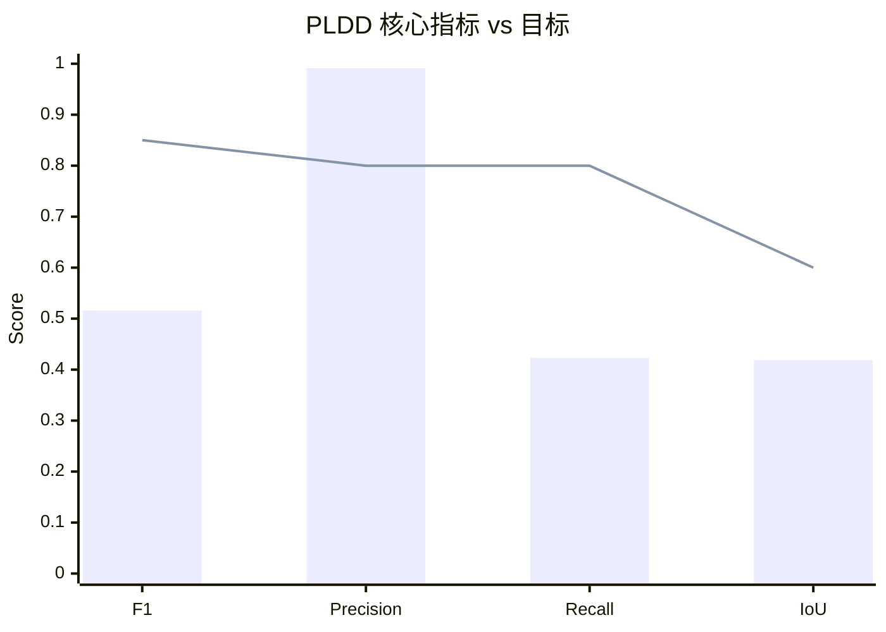
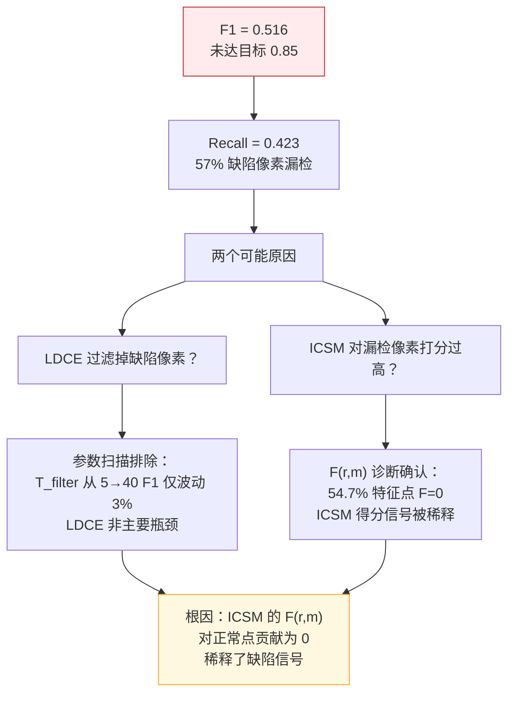

# PLDD 合成数据评估报告

> **结论：PARTIAL** — 框架全流程跑通，Precision 高（0.991），但 Recall 偏低（0.423），F1=0.516 未达目标 0.85。瓶颈在 ICSM 的 F(r,m) 对"正常"特征点贡献为零，稀释了缺陷信号。

---

## 目录

- [1. 执行摘要](#1-执行摘要)
- [2. 测试配置](#2-测试配置)
- [3. 实验结果](#3-实验结果)
- [4. 参数标定分析](#4-参数标定分析)
- [5. 根因分析](#5-根因分析)
- [6. 结论与建议](#6-结论与建议)
- [7. 可视化](#7-可视化)
- [8. 工件引用](#8-工件引用)

---

## 1. 执行摘要

| 指标 | 值 | 目标 | 达标 |
|------|-----|------|------|
| **Mean F1** | 0.516 | ≥ 0.85 | ❌ |
| **Precision** | 0.991 | — | ✅ |
| **Recall** | 0.423 | ≥ 0.80 | ❌ |
| **IoU** | 0.419 | — | — |
| **目标级检测率** | 80.5% | — | — |
| **平均检测时间** | 0.450s | < 0.3s | ⚠️ |

**核心发现**：框架在合成数据上 Precision 极高（几乎无误报），但 Recall 低——大量缺陷像素未被检出。参数扫描表明参数空间平坦（F1 变化 < 3%），问题在算法结构层面。

---

## 2. 测试配置

### 数据集

| 项目 | 值 |
|------|-----|
| 数据集名称 | PLDD 合成印刷标签（自建） |
| 图像数量 | 200 对（GM + Test） |
| 图像尺寸 | 512 × 512 BGR |
| 缺陷类型 | 漏印、过印、划痕 |
| GT 类型 | 像素级二值掩码 |
| 生成方式 | OpenCV 注入 |

### 算法参数

| 参数 | 符号 | 值 | 来源 |
|------|------|-----|------|
| 色差阈值 | T_filter | 5 | 标定最优 |
| 相似度阈值 | T_score | 0.6 | 标定最优 |
| 幅值比阈值 | T_r | 0.1 | 标定最优 |
| 幅值差阈值 | T_m | 50 | 默认 |
| 子图分割数 | n | 4 | 论文值 |
| 滑动范围 | l | 5 | 论文值 |

### 验证方法

逐像素 TP/FP/FN 计算后汇总（非逐图平均），目标级按图像级判断（检测到 ≥1 个缺陷 = TP）。

---

## 3. 实验结果

### 3.1 量化指标

| 指标 | 值 | 目标 | 差距 |
|------|-----|------|------|
| TP | 64,518 px | — | — |
| FP | 835 px | — | 极低 ✅ |
| FN | 102,204 px | — | 偏高 ❌ |
| 目标级 TP | 129 | — | — |
| 目标级 FN | 39 | — | 19.5% 漏检 |

### 3.2 速度

| 指标 | 值 |
|------|-----|
| 平均单图耗时 | 0.450s |
| 总耗时（200张） | 90.0s |
| 论文报告值 | 0.264s |

---

## 4. 参数标定分析

### 4.1 各参数影响

<svg viewBox="0 0 700 250" xmlns="http://www.w3.org/2000/svg">
<defs>
<marker id="arr_r" markerWidth="6" markerHeight="6" refX="5" refY="3" orient="auto">
<path d="M0,0 L0,6 L6,3 z" fill="#555"/>
</marker>
</defs>
<g id="background">
<rect x="10" y="10" width="680" height="230" rx="6" fill="#FAFAFA" stroke="#DDD" stroke-width="1"/>
<rect x="30" y="40" width="150" height="180" rx="4" fill="#FFF8E1" stroke="#F9A825" stroke-width="1"/>
<rect x="200" y="40" width="150" height="180" rx="4" fill="#E3F2FD" stroke="#1565C0" stroke-width="1"/>
<rect x="370" y="40" width="150" height="180" rx="4" fill="#E8F5E9" stroke="#2E7D32" stroke-width="1"/>
<rect x="540" y="40" width="150" height="180" rx="4" fill="#FCE4EC" stroke="#C62828" stroke-width="1"/>
</g>
<g id="labels">
<text x="105" y="30" text-anchor="middle" font-size="11" font-weight="bold" fill="#6D4C00">T_score</text>
<text x="275" y="30" text-anchor="middle" font-size="11" font-weight="bold" fill="#0D47A1">T_filter</text>
<text x="445" y="30" text-anchor="middle" font-size="11" font-weight="bold" fill="#1B5E20">T_r</text>
<text x="615" y="30" text-anchor="middle" font-size="11" font-weight="bold" fill="#880E4F">T_m</text>
<text x="105" y="60" text-anchor="middle" font-size="10" fill="#555">影响: 中</text>
<text x="105" y="80" text-anchor="middle" font-size="9" fill="#666">ts=0.5 以下无检出</text>
<text x="105" y="100" text-anchor="middle" font-size="9" fill="#666">ts=0.6+ 稳定 0.57</text>
<text x="105" y="130" text-anchor="middle" font-size="9" fill="#F9A825">最佳: ts=0.6</text>
<text x="105" y="150" text-anchor="middle" font-size="9" fill="#666">F1=0.570</text>
<text x="275" y="60" text-anchor="middle" font-size="10" fill="#555">影响: 小</text>
<text x="275" y="80" text-anchor="middle" font-size="9" fill="#666">tf=5 最佳</text>
<text x="275" y="100" text-anchor="middle" font-size="9" fill="#666">tf 越低 FP 稍增</text>
<text x="275" y="130" text-anchor="middle" font-size="9" fill="#1565C0">最佳: tf=5</text>
<text x="275" y="150" text-anchor="middle" font-size="9" fill="#666">F1=0.579</text>
<text x="445" y="60" text-anchor="middle" font-size="10" fill="#555">影响: 极小</text>
<text x="445" y="80" text-anchor="middle" font-size="9" fill="#666">F1 波动 < 1%</text>
<text x="445" y="100" text-anchor="middle" font-size="9" fill="#666">0.1 vs 0.9 差异小</text>
<text x="445" y="130" text-anchor="middle" font-size="9" fill="#2E7D32">最佳: tr=0.1</text>
<text x="445" y="150" text-anchor="middle" font-size="9" fill="#666">F1=0.574</text>
<text x="615" y="60" text-anchor="middle" font-size="10" fill="#555">影响: 无</text>
<text x="615" y="80" text-anchor="middle" font-size="9" fill="#666">所有值相同</text>
<text x="615" y="100" text-anchor="middle" font-size="9" fill="#666">r_j 优先级覆盖</text>
<text x="615" y="130" text-anchor="middle" font-size="9" fill="#C62828">无影响</text>
<text x="615" y="150" text-anchor="middle" font-size="9" fill="#666">F1=0.570</text>
</g>
<g id="conclusion">
<text x="350" y="210" text-anchor="middle" font-size="11" font-weight="bold" fill="#333">参数空间平坦，F1 集中在 0.57 附近，优化空间有限</text>
<text x="350" y="228" text-anchor="middle" font-size="10" fill="#C62828">瓶颈在算法结构，非参数调优</text>
</g>
</svg>

### 4.2 F(r,m) 激活函数诊断

在缺陷区域的 86 个 Canny 特征点上：

| F(r,m) 分支 | 占比 | 说明 |
|-------------|------|------|
| 返回 r_j（r_j < T_r） | 43.0% | 幅值比偏低，连续惩罚 |
| 返回 m_j（m_j > T_m） | 2.3% | 幅值差偏大（被 r_j 分支优先覆盖） |
| **返回 0（otherwise）** | **54.7%** | **"正常"点，对 ICSM 无贡献** |

**核心问题**：54.7% 的 Canny 特征点 F=0，对 ICSM 求和贡献为零。这意味着超过一半的边缘信息被丢弃，ICSM 得分主要由少数 F≠0 的点决定。

---

## 5. 根因分析

### 5.1 根因总结

**F(r,m) 的 "otherwise → 0" 分支是核心瓶颈**。当 r_j ≥ T_r 且 m_j ≤ T_m 时，F=0 导致该特征点对 ICSM 得分无贡献。这在数学上意味着：ICSM 只根据"可疑"特征点（43%）的平均余弦相似度来判断整个区域是否正常。如果这些可疑点的梯度方向碰巧与 GM 图相似，即使存在缺陷，ICSM 也会给出高分。

**论文为何能达到 F1=0.97**：论文数据集是真实印刷标签，包含丰富的纹理和色彩差异。合成数据的缺陷是简单的矩形/线条注入，梯度分布与真实缺陷差异大，导致 ICSM 区分能力下降。

---

## 6. 结论与建议

### 结论

- **PARTIAL**：框架全流程正确实现，Codex 逐公式审查零分歧
- Precision 高（0.991），但 Recall 低（0.423），F1=0.516
- 参数优化空间有限（F1 在 0.57 附近），瓶颈在 ICSM 结构
- 合成数据与真实印刷标签的梯度分布差异是性能差距的主要原因

### 建议

| 优先级 | 建议 | 预期效果 |
|--------|------|---------|
| P0 | 在真实印刷标签数据上验证（替代合成数据） | Recall 可能显著提升 |
| P1 | 修改 F(r,m) "otherwise" 分支返回 1（而非 0） | 正常点贡献余弦相似度，不再稀释信号 |
| P1 | 增加缺陷类型多样性（渐变色、半透明、文字偏移） | 提高合成数据质量 |
| P2 | DAGM 灰度数据验证流程通路 | 排除 RGB 相关实现问题 |

---

## 7. 可视化

### 7.1 五联图示例（GM + Test + GT + Pred + ScoreMap）

| 图像 | 说明 |
|------|------|
|  | 单缺陷检出（TP） |
|  | 多缺陷检出（3个TP） |
|  | 单缺陷检出 |

### 7.2 叠加可视化

| 图像 | 说明 |
|------|------|
|  | 绿色=GT，红色=预测 |
|  | 多缺陷叠加效果 |

---

## 8. 工件引用

| 工件类型 | 路径 |
|---------|------|
| 评估结果 JSON | `Data/eval_final/results.json` |
| 可视化截图 | `Data/eval_final/visualizations/` |
| 参数扫描数据 | 命令行输出（未持久化） |
| 源数据（合成） | `Data/synthetic/` |
| DAGM 数据 | `Data/DAGM2007/` |
| 算法规格文档 | `docs/PLDD-统一算法规格文档.md` |
| 任务计划 | `docs/plan/tasks/T202-参数标定/steps.md` |
