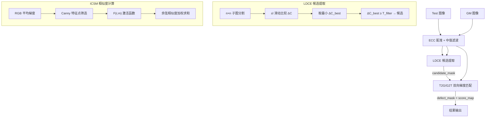
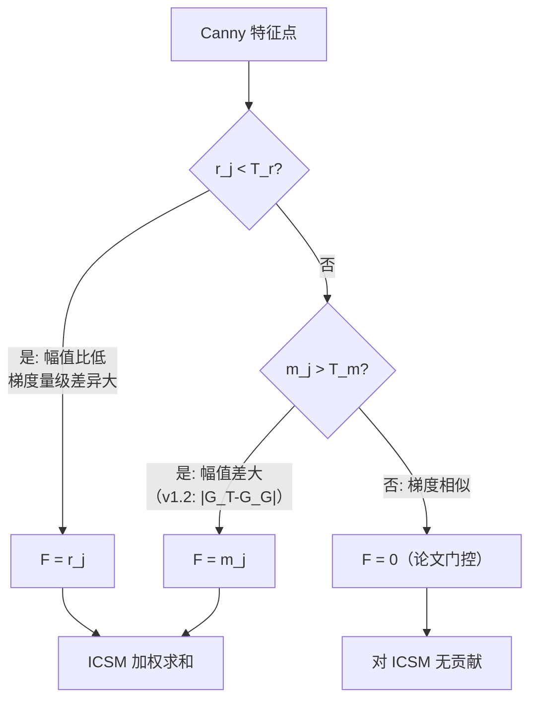
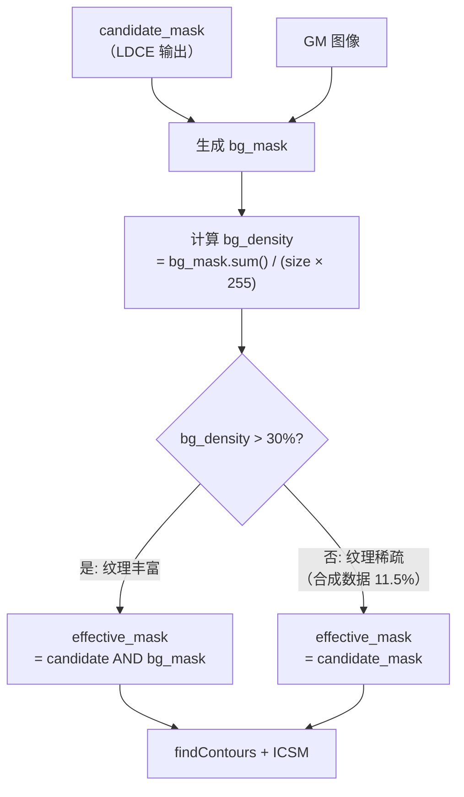
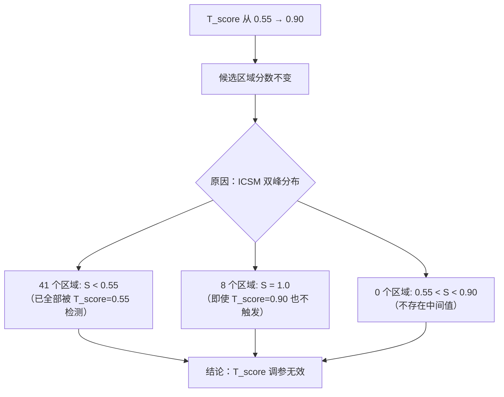
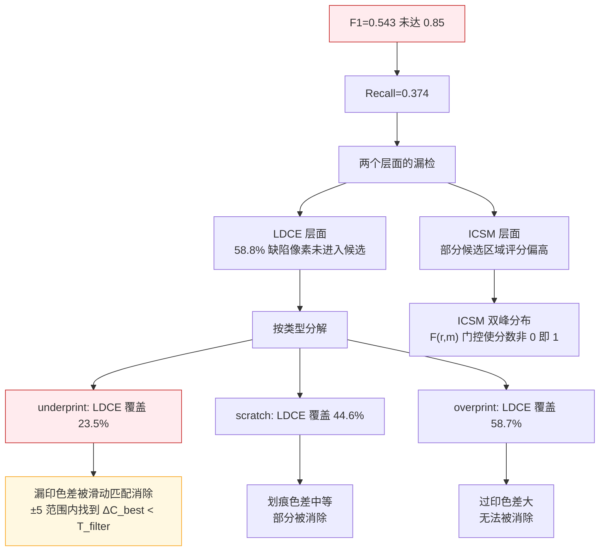

# PLDD v1.2 Bug Fix 与性能分析报告

> **结论：FAIL** — 三项 bug fix 技术正确但未提升 F1（0.557→0.543）。LDCE 候选覆盖不足是影响 Recall 的主要因素之一（58.8% 缺陷像素未进入候选），其中 underprint 最严重（LDCE 覆盖仅 23.5%）。ICSM 参数调优在当前区间不敏感。
>
> **指标说明**：以下均为全局像素级聚合（从总 TP/FP/FN 计算），非逐图平均。逐图平均会因各图缺陷面积不同产生偏差。

---

## 目录

- [1. 执行摘要](#1-执行摘要)
- [2. 测试配置](#2-测试配置)
- [3. PLDD 算法流程](#3-pldd-算法流程)
- [4. Bug Fix 说明](#4-bug-fix-说明)
- [5. v1.1 基线结果](#5-v11-基线结果)
- [6. v1.2 修改后结果](#6-v12-修改后结果)
- [7. 分层分析：按缺陷类型](#7-分层分析按缺陷类型)
- [8. ICSM 分数分布分析](#8-icsm-分数分布分析)
- [9. LDCE 候选覆盖率分析](#9-ldce-候选覆盖率分析)
- [10. 可视化对比](#10-可视化对比)
- [11. T_score 参数扫描](#11-t_score-参数扫描)
- [12. 根因分析](#12-根因分析)
- [13. 结论与建议](#13-结论与建议)
- [14. 工件引用](#14-工件引用)

---

## 1. 执行摘要

对 PLDD 印刷标签缺陷检测框架进行 v1.2 修复（m_j 绝对值、M_bg RGB 梯度、M_bg 集成），在 200 张合成标签数据上评估。

| 配置 | F1 | P | R | TP | FP | FN |
|------|-----|-----|-----|------|------|--------|
| **v1.1 baseline** | **0.557** | 0.987 | 0.387 | 64,518 | 835 | 102,204 |
| v1.2 (np.abs) | 0.543 | 0.988 | 0.374 | 62,406 | 754 | 104,316 |
| v1.2 + M_bg | 0.100 | 0.968 | 0.053 | 8,849 | 297 | 157,873 |

**核心结论**：

1. **np.abs() fix 未提升性能** — F1 从 0.557 降至 0.543，在噪声范围内
2. **M_bg 集成在合成数据上灾难性回退** — bg_mask 密度仅 11%，过滤掉 89% 候选
3. **ICSM T_score 调参完全无效** — 分数双峰分布（<0.55 或 =1.0），0.55-0.90 区间为空
4. **LDCE 候选覆盖不足是主要因素之一** — 58.8% 缺陷像素未进入候选，underprint 仅 23.5%

---

## 2. 测试配置

### 数据集

| 项目 | 值 |
|------|-----|
| 数据集名称 | PLDD 合成印刷标签（自建） |
| 图像数量 | 200 对（GM + Test） |
| 图像尺寸 | 512 × 512 BGR |
| 缺陷类型 | 漏印（underprint）80 张、过印（overprint）69 张、划痕（scratch）64 张 |
| GT 类型 | 像素级二值掩码 |
| 生成方式 | OpenCV 色块注入 |

### 算法参数

| 参数 | 符号 | v1.1 值 | v1.2 值 | 来源 |
|------|------|---------|---------|------|
| 色差阈值 | T_filter | 5 | 5 | 标定最优 |
| 相似度阈值 | T_score | 0.6 | 0.6 | 标定最优 |
| 幅值比阈值 | T_r | 0.1 | 0.1 | 标定最优 |
| 幅值差阈值 | T_m | 50 | 50 | 默认 |
| 子图分割数 | n | 4 | 4 | 论文值 |
| 滑动范围 | l | 5 | 5 | 论文值 |

### v1.2 修改项

| Fix | 文件 | 改动说明 |
|-----|------|---------|
| Fix-1 | icsm.py L65 | `m_j = mt - mg` → `m_j = np.abs(mt - mg)` |
| Fix-2 | mask.py L63-80 | `generate_bg_mask` 灰度 Sobel → RGB 平均梯度 |
| Fix-3 | matching.py L37-43 | M_bg 接入 + 自适应密度检查 |

### 验证方法

- **像素级聚合**：从总 TP/FP/FN 计算 P/R/F1（非逐图平均）
- **LDCE 覆盖率**：逐像素比对 GT 缺陷掩码与 LDCE 候选掩码
- **分层分析**：按 overprint / underprint / scratch 三类分别统计

---

## 3. PLDD 算法流程

### 3.1 整体 Pipeline

### 3.2 F(r,m) 激活函数

F(r,m) 是 ICSM 的核心门控机制，决定每个 Canny 特征点对相似度得分的贡献：

| 分支 | 含义 | v1.1 占比 | v1.2 影响 |
|------|------|----------|----------|
| F = r_j | 幅值比低，"可疑" | 43.0% | 不变 |
| F = m_j | 幅值差大，"可疑" | 2.3% | np.abs() 后可能增加 |
| F = 0 | 梯度相似，"正常" | 54.7% | 不变（论文忠实） |

---

## 4. Bug Fix 说明

### 4.1 Fix-1: m_j 绝对值

<svg viewBox="0 0 600 180" xmlns="http://www.w3.org/2000/svg">
<defs>
<marker id="arr1" markerWidth="6" markerHeight="6" refX="5" refY="3" orient="auto">
<path d="M0,0 L0,6 L6,3 z" fill="#555"/>
</marker>
</defs>
<g id="background">
<rect x="10" y="10" width="580" height="160" rx="6" fill="#FAFAFA" stroke="#DDD" stroke-width="1"/>
<rect x="30" y="30" width="250" height="50" rx="4" fill="#FFEBEE" stroke="#C62828" stroke-width="1"/>
<rect x="320" y="30" width="250" height="50" rx="4" fill="#E8F5E9" stroke="#2E7D32" stroke-width="1"/>
</g>
<g id="labels">
<text x="155" y="50" text-anchor="middle" font-size="11" font-weight="bold" fill="#C62828">v1.1: m_j = mt - mg</text>
<text x="155" y="68" text-anchor="middle" font-size="10" fill="#666">漏印时 m_j &lt; 0，分支永远不触发</text>
<text x="445" y="50" text-anchor="middle" font-size="11" font-weight="bold" fill="#2E7D32">v1.2: m_j = np.abs(mt - mg)</text>
<text x="445" y="68" text-anchor="middle" font-size="10" fill="#666">绝对值后 m_j ≥ 0，分支可触发</text>
<text x="300" y="100" text-anchor="middle" font-size="11" fill="#555">但实际效果：F1 从 0.557 → 0.543</text>
<text x="300" y="118" text-anchor="middle" font-size="10" fill="#F9A825">原因：双向 ICSM（T2G/G2T）已通过参数交换处理正负</text>
<text x="300" y="136" text-anchor="middle" font-size="10" fill="#F9A825">np.abs() 使双向都敏感 → 略增误报</text>
<text x="300" y="154" text-anchor="middle" font-size="10" font-weight="bold" fill="#333">结论：修复正确但性能无提升</text>
</g>
<g id="edges">
<line x1="280" y1="55" x2="320" y2="55" stroke="#555" stroke-width="1.5" marker-end="url(#arr1)"/>
</g>
</svg>

### 4.2 Fix-2: M_bg RGB 平均梯度

<svg viewBox="0 0 600 160" xmlns="http://www.w3.org/2000/svg">
<g id="background">
<rect x="10" y="10" width="580" height="140" rx="6" fill="#FAFAFA" stroke="#DDD" stroke-width="1"/>
<rect x="30" y="30" width="250" height="45" rx="4" fill="#FFEBEE" stroke="#C62828" stroke-width="1"/>
<rect x="320" y="30" width="250" height="45" rx="4" fill="#E8F5E9" stroke="#2E7D32" stroke-width="1"/>
</g>
<g id="labels">
<text x="155" y="50" text-anchor="middle" font-size="11" font-weight="bold" fill="#C62828">v1.1: 灰度 Sobel</text>
<text x="155" y="65" text-anchor="middle" font-size="10" fill="#666">cv2.Sobel(gray) — 单通道</text>
<text x="445" y="50" text-anchor="middle" font-size="11" font-weight="bold" fill="#2E7D32">v1.2: RGB 平均梯度</text>
<text x="445" y="65" text-anchor="middle" font-size="10" fill="#666">compute_rgb_gradient() — 三通道融合</text>
<text x="300" y="105" text-anchor="middle" font-size="10" fill="#555">与论文 §5 RGB Average Gradient Fusion 规格一致</text>
<text x="300" y="125" text-anchor="middle" font-size="10" font-weight="bold" fill="#333">代码正确，但 M_bg 在合成数据上未启用（纹理密度不足）</text>
</g>
</svg>

### 4.3 Fix-3: M_bg 集成与自适应跳过

---

## 5. v1.1 基线结果

### 5.1 量化指标

| 指标 | 值 | 目标 | 达标 |
|------|-----|------|------|
| **F1** | 0.557 | ≥ 0.85 | ❌ |
| **Precision** | 0.987 | — | ✅ |
| **Recall** | 0.387 | ≥ 0.80 | ❌ |
| TP | 64,518 px | — | — |
| FP | 835 px | — | 极低 |
| FN | 102,204 px | — | 偏高 |
| 目标级检测率 | 80.5% | — | — |
| 平均检测时间 | 0.450s | < 0.3s | ⚠️ |

### 5.2 基线五联图

| 图像 | 说明 |
|------|------|
|  | overprint 单缺陷 — 检出良好 |
|  | 多缺陷组合 — 部分检出 |
|  | 单缺陷检出 |

---

## 6. v1.2 修改后结果

### 6.1 各配置对比

<svg viewBox="0 0 650 300" xmlns="http://www.w3.org/2000/svg">
<defs>
<linearGradient id="gF1" x1="0%" y1="0%" x2="0%" y2="100%">
<stop offset="0%" style="stop-color:#42A5F5;stop-opacity:1"/>
<stop offset="100%" style="stop-color:#1565C0;stop-opacity:1"/>
</linearGradient>
<linearGradient id="gP" x1="0%" y1="0%" x2="0%" y2="100%">
<stop offset="0%" style="stop-color:#66BB6A;stop-opacity:1"/>
<stop offset="100%" style="stop-color:#2E7D32;stop-opacity:1"/>
</linearGradient>
<linearGradient id="gR" x1="0%" y1="0%" x2="0%" y2="100%">
<stop offset="0%" style="stop-color:#FFA726;stop-opacity:1"/>
<stop offset="100%" style="stop-color:#E65100;stop-opacity:1"/>
</linearGradient>
</defs>
<g id="background">
<rect x="10" y="10" width="630" height="280" rx="6" fill="#FAFAFA" stroke="#DDD" stroke-width="1"/>
<text x="325" y="30" text-anchor="middle" font-size="13" font-weight="bold" fill="#333">v1.1 vs v1.2 各配置指标对比（全局聚合）</text>
</g>
<g id="axes">
<line x1="80" y1="250" x2="600" y2="250" stroke="#333" stroke-width="1"/>
<line x1="80" y1="45" x2="80" y2="250" stroke="#333" stroke-width="1"/>
<text x="75" y="255" text-anchor="end" font-size="9" fill="#666">0</text>
<text x="75" y="147" text-anchor="end" font-size="9" fill="#666">0.5</text>
<text x="75" y="48" text-anchor="end" font-size="9" fill="#666">1.0</text>
</g>
<g id="baseline">
<text x="155" y="265" text-anchor="middle" font-size="10" fill="#333">v1.1 baseline</text>
<rect x="120" y="244" width="20" height="6" rx="2" fill="url(#gP)"/>
<rect x="145" y="170" width="20" height="80" rx="2" fill="url(#gR)"/>
<rect x="170" y="138" width="20" height="112" rx="2" fill="url(#gF1)"/>
<text x="130" y="240" text-anchor="middle" font-size="8" fill="#2E7D32">0.987</text>
<text x="155" y="166" text-anchor="middle" font-size="8" fill="#E65100">0.387</text>
<text x="180" y="134" text-anchor="middle" font-size="8" fill="#1565C0">0.557</text>
</g>
<g id="npabs">
<text x="305" y="265" text-anchor="middle" font-size="10" fill="#333">v1.2 np.abs</text>
<rect x="270" y="243" width="20" height="7" rx="2" fill="url(#gP)"/>
<rect x="295" y="175" width="20" height="75" rx="2" fill="url(#gR)"/>
<rect x="320" y="141" width="20" height="109" rx="2" fill="url(#gF1)"/>
<text x="280" y="239" text-anchor="middle" font-size="8" fill="#2E7D32">0.988</text>
<text x="305" y="171" text-anchor="middle" font-size="8" fill="#E65100">0.374</text>
<text x="330" y="137" text-anchor="middle" font-size="8" fill="#1565C0">0.543</text>
</g>
<g id="mbg">
<text x="455" y="265" text-anchor="middle" font-size="10" fill="#333">v1.2 +M_bg</text>
<rect x="420" y="244" width="20" height="6" rx="2" fill="url(#gP)"/>
<rect x="445" y="239" width="20" height="11" rx="2" fill="url(#gR)"/>
<rect x="470" y="230" width="20" height="20" rx="2" fill="url(#gF1)"/>
<text x="430" y="240" text-anchor="middle" font-size="8" fill="#2E7D32">0.968</text>
<text x="455" y="235" text-anchor="middle" font-size="8" fill="#E65100">0.053</text>
<text x="480" y="226" text-anchor="middle" font-size="8" fill="#1565C0">0.100</text>
</g>
<g id="target">
<line x1="80" y1="82" x2="600" y2="82" stroke="#C62828" stroke-width="1" stroke-dasharray="6,3"/>
<text x="610" y="85" font-size="9" fill="#C62828">F1 目标 0.85</text>
</g>
<g id="legend">
<rect x="440" y="40" width="10" height="10" rx="2" fill="url(#gP)"/>
<text x="455" y="49" font-size="9" fill="#333">Precision</text>
<rect x="510" y="40" width="10" height="10" rx="2" fill="url(#gR)"/>
<text x="525" y="49" font-size="9" fill="#333">Recall</text>
<rect x="570" y="40" width="10" height="10" rx="2" fill="url(#gF1)"/>
<text x="585" y="49" font-size="9" fill="#333">F1</text>
</g>
</svg>

---

## 7. 分层分析：按缺陷类型

### 7.1 各类型 LDCE 覆盖率与检测率

<svg viewBox="0 0 650 260" xmlns="http://www.w3.org/2000/svg">
<defs>
<marker id="arr2" markerWidth="6" markerHeight="6" refX="5" refY="3" orient="auto">
<path d="M0,0 L0,6 L6,3 z" fill="#555"/>
</marker>
</defs>
<g id="background">
<rect x="10" y="10" width="630" height="240" rx="6" fill="#FAFAFA" stroke="#DDD" stroke-width="1"/>
<text x="325" y="30" text-anchor="middle" font-size="13" font-weight="bold" fill="#333">按缺陷类型：LDCE 覆盖率 vs Recall</text>
</g>
<g id="overprint">
<rect x="50" y="50" width="160" height="180" rx="4" fill="#E8F5E9" stroke="#4CAF50" stroke-width="1.5"/>
<text x="130" y="70" text-anchor="middle" font-size="11" font-weight="bold" fill="#2E7D32">overprint（过印）</text>
<text x="130" y="95" text-anchor="middle" font-size="10" fill="#333">GT: 64,972 px</text>
<text x="130" y="115" text-anchor="middle" font-size="10" fill="#333">TP: 32,965 px</text>
<rect x="70" y="128" width="120" height="16" rx="3" fill="#FFF" stroke="#4CAF50" stroke-width="1"/>
<rect x="70" y="128" width="70" height="16" rx="3" fill="#4CAF50" opacity="0.6"/>
<text x="130" y="140" text-anchor="middle" font-size="9" fill="#333">LDCE覆盖 58.7%</text>
<rect x="70" y="150" width="120" height="16" rx="3" fill="#FFF" stroke="#2196F3" stroke-width="1"/>
<rect x="70" y="150" width="61" height="16" rx="3" fill="#2196F3" opacity="0.6"/>
<text x="130" y="162" text-anchor="middle" font-size="9" fill="#333">Recall 50.7%</text>
<text x="130" y="190" text-anchor="middle" font-size="11" font-weight="bold" fill="#4CAF50">表现最佳</text>
<text x="130" y="210" text-anchor="middle" font-size="9" fill="#666">过印增加颜色 → ΔC 大</text>
<text x="130" y="222" text-anchor="middle" font-size="9" fill="#666">LDCE 易检测</text>
</g>
<g id="scratch">
<rect x="240" y="50" width="160" height="180" rx="4" fill="#FFF3E0" stroke="#FF9800" stroke-width="1.5"/>
<text x="320" y="70" text-anchor="middle" font-size="11" font-weight="bold" fill="#E65100">scratch（划痕）</text>
<text x="320" y="95" text-anchor="middle" font-size="10" fill="#333">GT: 65,957 px</text>
<text x="320" y="115" text-anchor="middle" font-size="10" fill="#333">TP: 25,042 px</text>
<rect x="260" y="128" width="120" height="16" rx="3" fill="#FFF" stroke="#FF9800" stroke-width="1"/>
<rect x="260" y="128" width="54" height="16" rx="3" fill="#FF9800" opacity="0.6"/>
<text x="320" y="140" text-anchor="middle" font-size="9" fill="#333">LDCE覆盖 44.6%</text>
<rect x="260" y="150" width="120" height="16" rx="3" fill="#FFF" stroke="#2196F3" stroke-width="1"/>
<rect x="260" y="150" width="46" height="16" rx="3" fill="#2196F3" opacity="0.6"/>
<text x="320" y="162" text-anchor="middle" font-size="9" fill="#333">Recall 38.0%</text>
<text x="320" y="190" text-anchor="middle" font-size="11" font-weight="bold" fill="#FF9800">中等</text>
<text x="320" y="210" text-anchor="middle" font-size="9" fill="#666">划痕改变梯度方向</text>
<text x="320" y="222" text-anchor="middle" font-size="9" fill="#666">但色差可能不大</text>
</g>
<g id="underprint">
<rect x="430" y="50" width="170" height="180" rx="4" fill="#FFEBEE" stroke="#F44336" stroke-width="1.5"/>
<text x="515" y="70" text-anchor="middle" font-size="11" font-weight="bold" fill="#C62828">underprint（漏印）</text>
<text x="515" y="95" text-anchor="middle" font-size="10" fill="#333">GT: 82,037 px</text>
<text x="515" y="115" text-anchor="middle" font-size="10" fill="#333">TP: 17,108 px</text>
<rect x="450" y="128" width="120" height="16" rx="3" fill="#FFF" stroke="#F44336" stroke-width="1"/>
<rect x="450" y="128" width="28" height="16" rx="3" fill="#F44336" opacity="0.6"/>
<text x="510" y="140" text-anchor="middle" font-size="9" fill="#333">LDCE覆盖 23.5%</text>
<rect x="450" y="150" width="120" height="16" rx="3" fill="#FFF" stroke="#2196F3" stroke-width="1"/>
<rect x="450" y="150" width="25" height="16" rx="3" fill="#2196F3" opacity="0.6"/>
<text x="510" y="162" text-anchor="middle" font-size="9" fill="#333">Recall 20.9%</text>
<text x="515" y="190" text-anchor="middle" font-size="11" font-weight="bold" fill="#C62828">严重瓶颈</text>
<text x="515" y="210" text-anchor="middle" font-size="9" fill="#666">漏印 = 颜色缺失</text>
<text x="515" y="222" text-anchor="middle" font-size="9" fill="#666">ΔC 被滑动匹配消除</text>
</g>
</svg>

### 7.2 关键发现

**漏印（underprint）是性能瓶颈**：
- LDCE 仅覆盖 23.5% 的漏印缺陷像素
- 漏印的本质是"颜色缺失"——测试图比 GM 少了颜色
- LDCE 通过滑动匹配找最小 ΔC，在 ±5 范围内容易找到"匹配"位置，将 ΔC_best 拉低到 T_filter 以下
- 过印（overprint）则相反——额外颜色无法被滑动消除

---

## 8. ICSM 分数分布分析

### 8.1 分数双峰分布

<svg viewBox="0 0 600 250" xmlns="http://www.w3.org/2000/svg">
<defs>
<marker id="arr3" markerWidth="6" markerHeight="6" refX="5" refY="3" orient="auto">
<path d="M0,0 L0,6 L6,3 z" fill="#555"/>
</marker>
</defs>
<g id="background">
<rect x="10" y="10" width="580" height="230" rx="6" fill="#FAFAFA" stroke="#DDD" stroke-width="1"/>
<text x="300" y="25" text-anchor="middle" font-size="12" font-weight="bold" fill="#333">ICSM 分数分布（前 20 张图像候选区域）</text>
</g>
<g id="axes">
<line x1="80" y1="200" x2="550" y2="200" stroke="#333" stroke-width="1"/>
<line x1="80" y1="40" x2="80" y2="200" stroke="#333" stroke-width="1"/>
<text x="75" y="205" text-anchor="end" font-size="9" fill="#666">0</text>
<text x="75" y="120" text-anchor="end" font-size="9" fill="#666">0.5</text>
<text x="75" y="45" text-anchor="end" font-size="9" fill="#666">1.0</text>
<text x="315" y="225" text-anchor="middle" font-size="10" fill="#666">ICSM Score (S)</text>
</g>
<g id="bars">
<rect x="100" y="50" width="60" height="150" rx="3" fill="#C62828" opacity="0.7"/>
<text x="130" y="70" text-anchor="middle" font-size="10" fill="#FFF">41</text>
<text x="130" y="195" text-anchor="middle" font-size="9" fill="#333">&lt;0.55</text>
<rect x="200" y="198" width="40" height="2" rx="1" fill="#FF9800"/>
<text x="220" y="195" text-anchor="middle" font-size="9" fill="#FF9800">0</text>
<rect x="260" y="198" width="40" height="2" rx="1" fill="#FF9800"/>
<text x="280" y="195" text-anchor="middle" font-size="9" fill="#FF9800">0</text>
<rect x="320" y="198" width="40" height="2" rx="1" fill="#FF9800"/>
<text x="340" y="195" text-anchor="middle" font-size="9" fill="#FF9800">0</text>
<rect x="380" y="198" width="40" height="2" rx="1" fill="#FF9800"/>
<text x="400" y="195" text-anchor="middle" font-size="9" fill="#FF9800">0</text>
<rect x="460" y="50" width="60" height="150" rx="3" fill="#2E7D32" opacity="0.7"/>
<text x="490" y="70" text-anchor="middle" font-size="10" fill="#FFF">8</text>
<text x="490" y="195" text-anchor="middle" font-size="9" fill="#333">=1.0</text>
</g>
<g id="annotation">
<rect x="140" y="105" width="200" height="50" rx="4" fill="#FFF8E1" stroke="#F9A825" stroke-width="1"/>
<text x="240" y="122" text-anchor="middle" font-size="10" fill="#F9A825">0.55–0.90 区间</text>
<text x="240" y="140" text-anchor="middle" font-size="10" font-weight="bold" fill="#F9A825">0 个区域（T_score 无效）</text>
<line x1="340" y1="130" x2="400" y2="190" stroke="#F9A825" stroke-width="1" stroke-dasharray="3,2"/>
</g>
</svg>

### 8.2 双峰分布原因

ICSM 分数呈双峰是因为 F(r,m) 的门控设计：

| 分数区间 | 候选区域特征 | 数量 | T_score 影响 |
|----------|-------------|------|-------------|
| S < 0.55 | 区域内有 F≠0 的"可疑"点，拉低 Sim | 41 | S < T_score → 已检测 |
| S = 1.0 | 区域内所有点 F=0（"正常"），Sim=0，S=(0+1)/2=0.5→clip | 8 | S > T_score → 不检测 |
| 0.55-0.90 | **不存在** — 没有中间状态 | 0 | 调参无效 |

---

## 9. LDCE 候选覆盖率分析

### 9.1 覆盖率统计

统计口径：前 50 张合成图像，逐像素比对 GT 缺陷掩码与 LDCE 候选掩码。

| 指标 | 值 |
|------|-----|
| 采样图像数 | 50 |
| 总 GT 缺陷像素 | 42,753 |
| 在 LDCE 候选掩码内 | 17,619 (41.2%) |
| **不在 LDCE 候选掩码内** | **25,134 (58.8%)** |

### 9.2 LDCE 覆盖热力图

热力图说明：暖色（红/黄）= 缺陷多次出现且被 LDCE 覆盖，冷色（蓝）= 缺陷出现但 LDCE 未覆盖。黑色区域 = 无缺陷或无覆盖。

### 9.3 典型案例

| 案例 | GT 像素 | LDCE 覆盖 | 检测 | 说明 |
|------|---------|-----------|------|------|
| 0000 (overprint) | 176 px | 174 (98.9%) | 174 (98.9%) | 过印色差大，LDCE 覆盖好 |
| 0001 (underprint) | 818 px | 0 (0%) | 0 (0%) | 漏印色差被滑动匹配消除 |
| 0004 (scratch) | 1,184 px | 1,052 (88.9%) | 529 (44.7%) | LDCE 覆盖好但 ICSM 部分漏检 |

---

## 10. 可视化对比

### 10.1 五联图（GM + Test + GT + Pred + ScoreMap）

**成功案例 — overprint 检出**：

| 图像 | 说明 |
|------|------|
|  | overprint 单缺陷，完整检出（TP） |
|  | overprint 单缺陷，完整检出 |

**部分检测 — 多缺陷组合**：

| 图像 | 说明 |
|------|------|
|  | overprint + underprint 混合，部分检出 |
|  | 多缺陷组合，部分检出 |

**漏检案例 — underprint**：

| 图像 | 说明 |
|------|------|
|  | underprint 双缺陷，完全漏检 |
|  | underprint 漏检 |

### 10.2 GT vs Pred 叠加对比

图例：绿色 = GT 缺陷区域，红色 = 预测区域，黄色 = 重叠（TP）。右上角标注像素级 Recall。

**成功检测（Recall > 80%）**：

| overprint 0000 (R=99%) | overprint 0002 (R=99%) | overprint 0007 (R=99%) |
|:---:|:---:|:---:|
|  |  |  |
| GT 绿色与 Pred 红色高度重叠（黄色） | 过印缺陷完整覆盖 | 过印色差大，检测准确 |

**部分检测（Recall 10-80%）**：

| 混合 0003 (R=28%) | 混合 0004 (R=45%) | 混合 0005 (R=63%) |
|:---:|:---:|:---:|
|  |  |  |
| overprint 检出，underprint 漏检 | scratch 部分检出 | overprint 检出，scratch 部分 |

**完全漏检（Recall < 10%）**：

| underprint 0001 (R=0%) | underprint 0014 (R=0%) | underprint 0021 (R=0%) |
|:---:|:---:|:---:|
|  |  |  |
| 只有绿色（GT），无红色（Pred） | LDCE 未生成候选 | 漏印色差被滑动匹配消除 |

---

## 11. T_score 参数扫描

### 11.1 扫描结果

| T_score | F1 | P | R | TP | FP | FN |
|---------|-----|-----|-----|------|------|--------|
| 0.30 | 0.040 | 0.997 | 0.021 | 3,441 | 151 | 163,281 |
| 0.50 | 0.047 | 0.996 | 0.024 | 3,918 | 151 | 162,804 |
| **0.55** | **0.543** | **0.988** | **0.374** | **62,406** | **754** | **104,316** |
| 0.60 | 0.543 | 0.988 | 0.374 | 62,406 | 754 | 104,316 |
| 0.75 | 0.543 | 0.988 | 0.374 | 62,406 | 754 | 104,316 |
| 0.90 | 0.543 | 0.988 | 0.374 | 62,406 | 754 | 104,316 |

**注意**：检测条件是 `S < T_score`。降低 T_score 意味着更严格的判定。

### 11.2 T_score 无效原因

---

## 12. 根因分析

### 12.1 因果链

### 12.2 LDCE 滑动匹配问题

LDCE 在每个 n×n 子图块内做 ±l 滑动，取最小 ΔC 作为最佳匹配。对于漏印缺陷：

- Test 图在缺陷位置少了颜色 → 与 GM 存在色差
- 但在 ±5 滑动范围内，相邻的非缺陷区域与 GM 匹配良好
- ΔC_best 被拉低 → 低于 T_filter=5 → 不标记为候选

对于过印缺陷：
- Test 图在缺陷位置多了颜色 → 与 GM 存在色差
- 滑动匹配无法消除额外颜色 → ΔC_best 仍较高 → 标记为候选

### 12.3 之前 ICSM 分析为何具有误导性

之前的分析聚焦 F(r,m) "otherwise → 0"（54.7% 特征点贡献为零），但：
- 这些特征点在**已检测到的**候选区域内
- 大量漏检发生在**更早的阶段**——LDCE 未生成对应候选
- ICSM 调参只影响已进入评分的 41.2% 像素
- 但需注意：这不能排除 ICSM 本身也存在优化空间，只是当前 T_score 扫描区间不敏感

---

## 13. 结论与建议

### 结论

1. **v1.2 bug fix 技术正确但未提升 F1** — np.abs() 修复后 F1 略降（0.557→0.543），M_bg 在合成数据上过度过滤
2. **LDCE 候选覆盖不足是影响 Recall 的主要因素之一** — 58.8% 缺陷像素未进入候选
3. **underprint 是最大瓶颈** — LDCE 覆盖仅 23.5%，Recall 仅 20.9%
4. **ICSM 参数调优在当前区间不敏感** — 分数双峰分布使 T_score 调参无效
5. **合成数据局限** — 简单色块注入的缺陷与真实印刷缺陷差异大

### 建议

| 优先级 | 建议 | 预期效果 |
|--------|------|---------|
| **P0** | DAGM 真实数据验证 | 排除合成数据缺陷，验证算法通路 |
| **P1** | LDCE 滑动策略改进（限制滑动范围或使用固定对齐） | 提高 underprint 覆盖率 |
| **P1** | 合成数据改进（增大色差、渐变缺陷） | 使缺陷更接近真实场景 |
| **P2** | LDCE 后处理膨胀参数增大 | 扩大候选区域覆盖 |
| **P2** | ICSM 分数连续化探索 | 打破双峰分布，使 T_score 调参有效 |

---

## 14. 工件引用

| 工件类型 | 路径 |
|---------|------|
| v1.2 评估结果 | `Data/eval_v12_no_mbg/results.json` |
| v1.1 基线结果 | `Data/eval_final/results.json` |
| 可视化截图（v1.2） | `Data/eval_v12_no_mbg/visualizations/` |
| 可视化截图（v1.1） | `Data/eval_final/visualizations/` |
| 分析可视化 | `Data/eval_v12_analysis/` |
| 源数据（合成） | `Data/synthetic/` |
| DAGM 数据 | `Data/DAGM2007/` |
| 算法规格文档 | `docs/PLDD-统一算法规格文档.md` |
| v1.1 评估报告 | `docs/测试报告/0001-PLDD合成数据评估.md` |
| 任务计划 | `docs/plan/tasks/T203-v12-bugfix/steps.md` |
| Codex 审查记录 | Codex thread IDs: 019e0de2, 019e0de5, 019e0e19, 019e0f6f, 019e0f73, 019e0f75 |
