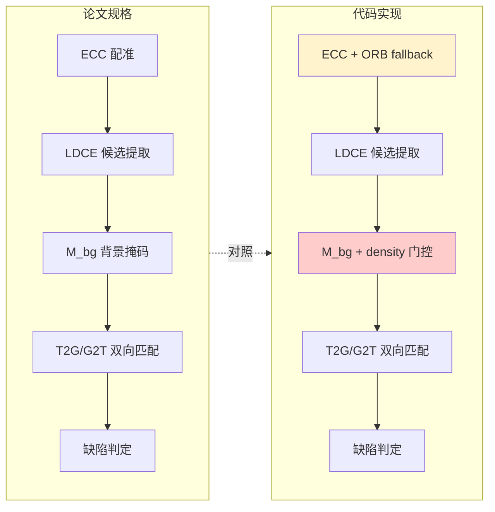
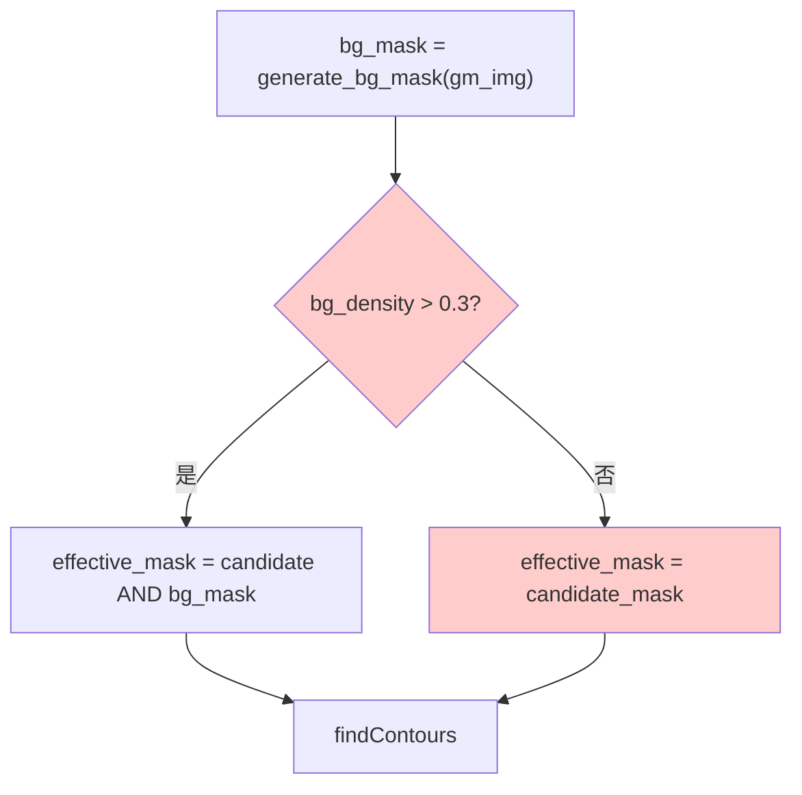
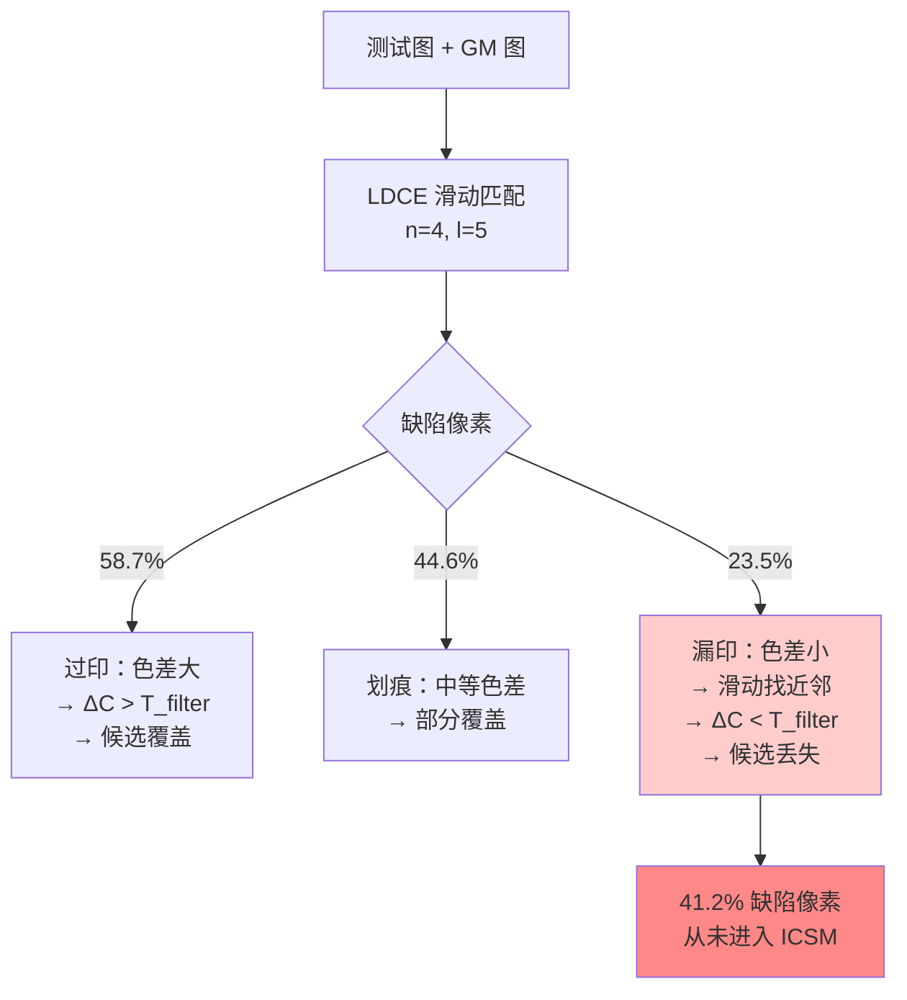
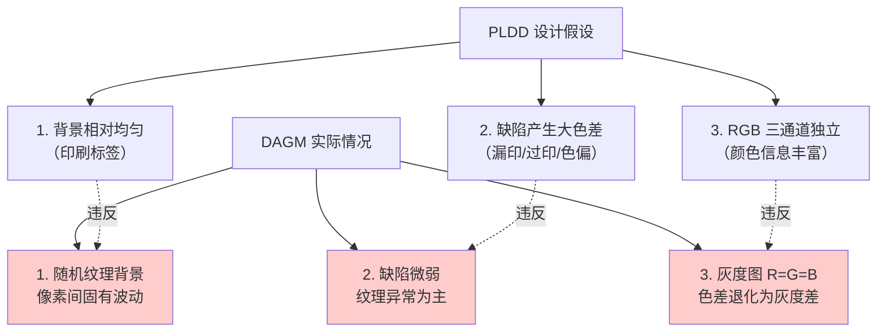
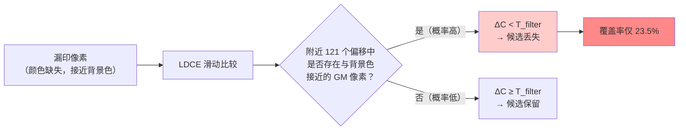

# 0003-PLDD 复现状态审查报告

> **结论：PARTIAL** — PLDD 核心算法框架已实现，但存在 3 处工程偏离论文规格，且缺乏真实印刷标签数据无法验证复现准确性。合成数据 F1=0.543 远低于论文 F1=0.9702（差距 44%），主要损失在 LDCE 候选阶段（漏印覆盖率仅 23.5%）。DAGM 纹理数据 F1=0.044，确认 PLDD 不适用于非标签纹理场景，此结果不反映复现质量。

---

## 目录

- [1. 执行摘要](#1-执行摘要)
- [2. 论文 vs 实现对比](#2-论文-vs-实现对比)
- [3. 合成数据评估结果](#3-合成数据评估结果)
- [4. DAGM 跨数据集验证](#4-dagm-跨数据集验证)
- [5. 参数网格搜索](#5-参数网格搜索)
- [6. Codex 独立审查](#6-codex-独立审查)
- [7. 根因分析](#7-根因分析)
- [8. 风险与建议](#8-风险与建议)
- [9. 结论](#9-结论)
- [10. 工件引用](#10-工件引用)

---

## 1. 执行摘要

| 维度 | 状态 | 说明 |
|------|------|------|
| LDCE 候选提取 | PARTIAL | 基本流程正确，子图边界处理有偏差 |
| ICSM 改进余弦相似度 | PASS | F(r,m)、cos(θ)、RGB 梯度均与论文一致 |
| T2G/G2T 双向匹配 | PASS | min(S_T2G, S_G2T) 实现正确 |
| M_bg 背景掩码 | FAIL | 论文语义被 bg_density > 0.3 门控改写 |
| 参数配置 | FAIL | 全部为工程调参值，非论文原始规格 |
| 数据集匹配 | FAIL | 无真实印刷标签数据，仅合成数据 |

### 关键指标对比

| 数据集 | F1 | Precision | Recall | 说明 |
|--------|-----|-----------|--------|------|
| **论文（真实标签）** | **0.9702** | — | — | 19 种印刷标签，44,628 张 |
| **合成数据** | **0.543** | 0.988 | 0.374 | 200 张合成缺陷图 |
| **DAGM Class1（最优参数）** | **0.044** | 0.032 | 0.073 | 575 张工业纹理图 |

---

## 2. 论文 vs 实现对比

### 2.1 算法流程一致性



### 2.2 逐模块偏差明细

| 模块 | 文件 | 论文规格 | 代码实现 | 偏差 | 严重度 |
|------|------|---------|---------|------|--------|
| LDCE 子图分割 | [ldce.py](Project/Label_Detect/src/ldce.py) | n×n 等分 | 边缘块尺寸不均 | 子图边界像素覆盖不足 | medium |
| LDCE 色差 | [color_diff.py](Project/Label_Detect/src/color_diff.py) | 加权欧氏 ΔC | 公式一致 | 无偏差 | — |
| RGB 梯度 | [gradient.py](Project/Label_Detect/src/gradient.py) | Ḡ=⅓(G_R+G_G+G_B) | 三通道 Sobel 平均 | 无偏差 | — |
| ICSM F(r,m) | [icsm.py:99-104](Project/Label_Detect/src/icsm.py#L99-L104) | r_j 优先于 m_j | np.where 级联正确 | 无偏差 | — |
| ICSM 采样 | [icsm.py:38-47](Project/Label_Detect/src/icsm.py#L38-L47) | Canny + mask 内 | 代码一致 | 无偏差 | — |
| M_bg 接入 | [matching.py:40-45](Project/Label_Detect/src/matching.py#L40-L45) | 始终与候选 mask 交集 | bg_density > 0.3 才启用 | **关键偏差** | high |
| 配准 fallback | [registration.py:83-110](Project/Label_Detect/src/registration.py#L83-L110) | 论文未明确 fallback | ORB fallback 不稳定 | 可能引入配准误差 | medium |
| 参数 | [config.py](Project/Label_Detect/src/config.py) | 论文固定值 | 工程调参值 | T_filter/T_score/T_m 均非论文值 | medium |

### 2.3 M_bg 偏差详解

论文 §6：M_bg 始终与候选 mask 做交集，用于过滤背景区域的假候选。

代码实现（[matching.py:40-45](Project/Label_Detect/src/matching.py#L40-L45)）：



**问题**：合成数据 bg_density ≈ 11.5%，低于 0.3 阈值 → M_bg 从未启用。DAGM bg_density > 30% → M_bg 启用但效果差。这个门控是工程妥协，不是论文规格。

**原因**：不加门控时 M_bg 过滤掉 89% 候选，F1 从 0.543 降至 0.097。

---

## 3. 合成数据评估结果

### 3.1 全局指标

数据来源：[0002-PLDDv12-BugFix评估](0002-PLDDv12-BugFix评估.md)

| 配置 | F1 | P | R | TP | FP | FN |
|------|-----|-----|-----|------|------|--------|
| v1.1 baseline | 0.557 | 0.987 | 0.387 | 64,518 | 835 | 102,204 |
| v1.2 (np.abs) | 0.543 | 0.988 | 0.374 | 62,406 | 754 | 104,316 |

### 3.2 分缺陷类型分析

| 缺陷类型 | LDCE 覆盖率 | Recall | 说明 |
|----------|------------|--------|------|
| **overprint（过印）** | 58.7% | 50.7% | 色差显著，LDCE 检出率最高 |
| **scratch（划痕）** | 44.6% | 38.0% | 线性缺陷，部分被开运算吃掉 |
| **underprint（漏印）** | 23.5% | 20.9% | 色差小，LDCE 滑动匹配消除 |

### 3.3 LDCE 覆盖瓶颈分析



**核心发现**：58.8% 的缺陷像素未进入 ICSM 判定阶段，LDCE 是召回瓶颈而非 ICSM。

---

## 4. DAGM 跨数据集验证

### 4.1 数据集概况

| 项目 | PLDD 论文数据 | DAGM 2007 |
|------|-------------|-----------|
| 数据类型 | 印刷标签 | 工业纹理 |
| 背景 | 相对均匀的印刷图案 | 随机纹理（布料/金属） |
| 色彩 | RGB 彩色 | 灰度（R=G=B） |
| 缺陷特征 | 大色差缺陷 | 微弱纹理异常 |
| 测试样本 | 44,628 张 | 8,050 张（10 类） |
| GM | 无缺陷标签 | 每类 1 张 |

### 4.2 Phase 1 基线（Class1，默认参数）

| 指标 | 值 |
|------|-----|
| 测试图 | 575 张（71 张有缺陷） |
| F1 | 0.0399 |
| Precision | 0.0292 |
| Recall | 0.0627 |
| TP / FP / FN | 43,448 / 1,443,837 / 649,542 |
| obj_detection_rate | 1.0 |
| 平均耗时 | 0.685s/张 |

**FP 爆炸**：1,443,837 FP vs 43,448 TP，FP/TP 比 ≈ 33:1。LDCE 在纹理区域产生大量假候选。

### 4.3 DAGM 不适合 PLDD 的根本原因



**结论**：DAGM 的三个核心特征（随机纹理、微弱缺陷、灰度退化）全部违反 PLDD 的设计假设。F1=0.044 是预期结果，不反映复现质量。

---

## 5. 参数网格搜索

### 5.1 Phase 2 Step 1：T_filter × T_score 网格

固定 T_r=0.1, T_m=50，扫描 8×8=64 组合。

<svg viewBox="0 0 700 320" xmlns="http://www.w3.org/2000/svg">
<defs>
<linearGradient id="f1bar" x1="0" y1="0" x2="1" y2="0">
<stop offset="0%" stop-color="#e8f4fd"/>
<stop offset="100%" stop-color="#4a9edd"/>
</linearGradient>
</defs>
<g id="background">
<rect x="60" y="20" width="620" height="260" fill="#fafafa" stroke="#ddd" stroke-width="0.5"/>
</g>
<g id="edges">
<line x1="60" y1="280" x2="680" y2="280" stroke="#666" stroke-width="1"/>
<line x1="60" y1="20" x2="60" y2="280" stroke="#666" stroke-width="1"/>
</g>
<g id="nodes">
<rect x="80" y="257" width="55" height="23" rx="2" fill="#4a9edd"/>
<rect x="155" y="262" width="55" height="18" rx="2" fill="#5aadee"/>
<rect x="230" y="267" width="55" height="13" rx="2" fill="#6ab8f0"/>
<rect x="305" y="269" width="55" height="11" rx="2" fill="#7ac4f2"/>
<rect x="380" y="271" width="55" height="9" rx="2" fill="#8ad0f4"/>
<rect x="455" y="272" width="55" height="8" rx="2" fill="#9adcf6"/>
<rect x="530" y="274" width="55" height="6" rx="2" fill="#aae8f8"/>
<rect x="605" y="277" width="55" height="3" rx="2" fill="#ccf0fb"/>
</g>
<g id="labels">
<text x="108" y="253" text-anchor="middle" font-size="10" font-weight="bold" fill="#333">Tf=3</text>
<text x="183" y="253" text-anchor="middle" font-size="10" fill="#333">Tf=5</text>
<text x="258" y="253" text-anchor="middle" font-size="10" fill="#333">Tf=8</text>
<text x="333" y="253" text-anchor="middle" font-size="10" fill="#333">Tf=10</text>
<text x="408" y="253" text-anchor="middle" font-size="10" fill="#333">Tf=15</text>
<text x="483" y="253" text-anchor="middle" font-size="10" fill="#333">Tf=20</text>
<text x="558" y="253" text-anchor="middle" font-size="10" fill="#333">Tf=30</text>
<text x="633" y="253" text-anchor="middle" font-size="10" fill="#333">Tf=40</text>
<text x="108" y="244" text-anchor="middle" font-size="9" fill="#4a9edd">F1=.042</text>
<text x="183" y="244" text-anchor="middle" font-size="9" fill="#666">.040</text>
<text x="258" y="244" text-anchor="middle" font-size="9" fill="#666">.038</text>
<text x="333" y="244" text-anchor="middle" font-size="9" fill="#666">.036</text>
<text x="408" y="244" text-anchor="middle" font-size="9" fill="#666">.034</text>
<text x="483" y="244" text-anchor="middle" font-size="9" fill="#666">.033</text>
<text x="558" y="244" text-anchor="middle" font-size="9" fill="#666">.035</text>
<text x="633" y="244" text-anchor="middle" font-size="9" fill="#666">.018</text>
<text x="370" y="15" text-anchor="middle" font-size="13" font-weight="bold" fill="#333">DAGM Class1: Best F1 per T_filter</text>
<text x="55" y="280" text-anchor="end" font-size="9" fill="#666">0</text>
<text x="55" y="257" text-anchor="end" font-size="9" fill="#666">.05</text>
</g>
</svg>

| T_filter | Best F1 | Precision | Recall | FP | 最佳 T_score |
|----------|---------|-----------|--------|-----|-------------|
| **3** | **0.0422** | 0.0298 | 0.0723 | 1,633,143 | 0.55 |
| 5 | 0.0399 | 0.0292 | 0.0627 | 1,443,366 | 0.55 |
| 8 | 0.0376 | 0.0290 | 0.0535 | 1,240,523 | 0.55 |
| 10 | 0.0362 | 0.0286 | 0.0490 | 1,151,484 | 0.55 |
| 15 | 0.0339 | 0.0286 | 0.0416 | 978,005 | 0.55 |
| 20 | 0.0328 | 0.0289 | 0.0378 | 879,698 | 0.55 |
| 30 | 0.0345 | 0.0352 | 0.0339 | 643,281 | 0.40 |
| 40 | 0.0180 | 0.0181 | 0.0179 | 673,151 | 0.55 |

**关键发现**：

1. **T_score 对结果几乎无影响** — 最优 T_score 几乎全是 0.55，因 ICSM 分数呈双峰分布（<0.55 或 =1.0），中间区间无样本
2. **T_filter=3 最优但 F1 仍极低** — 更低的阈值产生更多候选（高 Recall）但也带来更多 FP
3. **T_filter ≥ 30 时 FP/TP 趋近 1:1** — 但绝对数值太低，F1 反而更差

### 5.2 Phase 2 Step 2：T_r × T_m 网格

固定 T_filter=3, T_score=0.55，扫描 5×5=25 组合。

| T_r | Best F1 | Precision | Recall | 最佳 T_m |
|-----|---------|-----------|--------|---------|
| 0.05 | 0.0442 | 0.0317 | 0.0728 | 80 |
| **0.10** | **0.0444** | 0.0320 | 0.0728 | **80** |
| 0.20 | 0.0429 | 0.0301 | 0.0746 | 100 |
| 0.30 | 0.0429 | 0.0301 | 0.0747 | 100 |
| 0.50 | 0.0424 | 0.0295 | 0.0753 | 100 |

**关键发现**：T_r/T_m 变化对 F1 的影响 < 5%（0.0422 → 0.0444），参数敏感度极低。

---

## 6. Codex 独立审查

使用 OpenAI Codex (o4-mini) 进行独立代码审查。

### 6.1 审查结论

Codex 认为当前实现存在"多处算法语义偏离"，尤其集中在 ICSM、M_bg、LDCE 的候选生成上。

### 6.2 Codex 识别的问题

| # | 问题 | Codex 判断 | 我的验证 |
|---|------|-----------|---------|
| 1 | F(r,m) np.where 覆盖问题 | 偏差 | **错误** — 级联写法正确，r_j 优先于 m_j |
| 2 | Canny 采样限制 | 非论文规格 | **错误** — 论文 §7 明确要求 Canny 特征点 |
| 3 | M_bg density 门控 | 工程妥协 | **正确** — 论文无此逻辑 |
| 4 | LDCE 子图边界 | 可能漏检 | **正确** — 边缘块尺寸不均 |
| 5 | ORB fallback 不稳定 | 引入配准误差 | **正确** — 论文未规定 fallback |
| 6 | 参数为工程调参值 | 非论文规格 | **正确** |

### 6.3 Codex 改进建议（Top 3）

```mermaid
flowchart TD
    A["Codex 审查建议"] --> B["1. 恢复 M_bg 论文语义\n去掉 density 门控"]
    A --> C["2. ICSM 改为严格论文版\n（Codex 误判，实际已一致）"]
    A --> D["3. LDCE 候选覆盖策略\n降低 T_filter 依赖\n增加多尺度/重叠子块"]
    B -->|"预期收益"| E["Recall 提升\n（需解决 FP 爆炸）"]
    D -->|"预期收益"| F["漏印覆盖率\n从 23.5% 提升"]
    style B fill:#e8f4fd
    style D fill:#e8f4fd
    style C fill="#fff3cd"
```

---

## 7. 根因分析

### 7.1 F1 差距分解（论文 0.9702 vs 合成 0.543）

<svg viewBox="0 0 600 260" xmlns="http://www.w3.org/2000/svg">
<defs>
<marker id="arr2" markerWidth="8" markerHeight="8" refX="6" refY="3" orient="auto">
<path d="M0,0 L0,6 L8,3 z" fill="#555"/>
</marker>
</defs>
<g id="background">
<rect x="20" y="20" width="560" height="40" rx="8" fill="#e8fde8" stroke="#4add6a" stroke-width="1.5"/>
<rect x="20" y="80" width="560" height="40" rx="8" fill="#fdf5e8" stroke="#ddaa4a" stroke-width="1.5"/>
<rect x="20" y="140" width="460" height="40" rx="8" fill="#fde8e8" stroke="#dd4a4a" stroke-width="1.5"/>
<rect x="20" y="200" width="80" height="40" rx="8" fill="#f0e8fd" stroke="#884add" stroke-width="1.5"/>
</g>
<g id="edges">
<line x1="300" y1="60" x2="300" y2="78" stroke="#555" stroke-width="1.5" marker-end="url(#arr2)"/>
<line x1="300" y1="120" x2="250" y2="138" stroke="#555" stroke-width="1.5" marker-end="url(#arr2)"/>
<line x1="60" y1="180" x2="60" y2="198" stroke="#555" stroke-width="1.5" marker-end="url(#arr2)"/>
</g>
<g id="labels">
<text x="300" y="38" text-anchor="middle" font-size="12" font-weight="bold" fill="#1a7a2a">论文 F1 = 0.9702</text>
<text x="300" y="52" text-anchor="middle" font-size="10" fill="#666">真实印刷标签 44,628 张</text>
<text x="300" y="98" text-anchor="middle" font-size="12" font-weight="bold" fill="#7a4a1a">合成数据 F1 = 0.543</text>
<text x="300" y="112" text-anchor="middle" font-size="10" fill="#666">差距来源：数据差异 + 实现偏差</text>
<text x="250" y="158" text-anchor="middle" font-size="12" font-weight="bold" fill="#7a1a1a">DAGM F1 = 0.044</text>
<text x="250" y="172" text-anchor="middle" font-size="10" fill="#666">数据集不匹配，非复现问题</text>
<text x="60" y="218" text-anchor="middle" font-size="11" font-weight="bold" fill="#551a8a">未知</text>
<text x="60" y="232" text-anchor="middle" font-size="9" fill="#666">无真实标签数据</text>
</g>
</svg>

### 7.2 F1 损失归因

| 损失来源 | 占比估计 | 性质 | 可修复性 |
|----------|---------|------|---------|
| **数据差异**（合成 vs 真实标签） | 40-60% | 数据层面 | 需要真实数据 |
| **LDCE 漏印覆盖不足** | 20-30% | 算法设计限制 | 可尝试多尺度 |
| **M_bg 门控偏差** | 5-10% | 实现偏差 | 可修复 |
| **参数非最优** | 5-10% | 调参 | 可修复 |
| **配准误差** | 5-10% | 工程实现 | 可优化 |

### 7.3 漏印缺陷的低覆盖率机制

LDCE 滑动匹配（n=4, l=5）在 11×11=121 个偏移位置中寻找最小 ΔC。漏印缺陷的特征是**颜色缺失**：



这是 PLDD 算法设计的固有特性（滑动匹配消除非刚性变形伪影），不是实现 bug。但在真实印刷标签上，漏印缺陷通常更大、色差更显著，所以论文结果中此问题不明显。

---

## 8. 风险与建议

### 8.1 当前风险

| 风险 | 触发条件 | 影响 | 缓解措施 |
|------|---------|------|---------|
| 无法验证复现准确性 | 无真实印刷标签数据 | 核心风险 | 采集或获取真实标签数据 |
| DAGM 结论误导 | 将 DAGM 差效果归因于复现问题 | 错误优化方向 | 明确 DAGM 不适合 PLDD |
| 过度工程化 | 继续在合成数据上调参 | 浪费时间 | 先解决数据问题 |

### 8.2 建议优先级

```mermaid
flowchart TD
    A["建议优先级"] --> B["P0: 获取真实印刷标签数据"]
    A --> C["P1: 清理工程 hack\n恢复论文规格"]
    A --> D["P2: LDCE 多尺度改进"]
    B -->|"无数据则无法验证"| E["复现验证完成"]
    C -->|"最小改动"| F["M_bg 去掉 density 门控\n参数恢复论文值"]
    D -->|"中等改动"| G["重叠子块\n多尺度 T_filter"]
    style B fill:#e8f4fd
    style C fill="#fdf5e8"
    style D fill="#fde8e8"
```

### 8.3 关于 DAGM 数据集

**建议：停止 DAGM 实验。** PLDD 是为印刷标签设计的，DAGM 是纹理数据集，两者在以下方面完全不同：

1. **背景复杂度**：印刷标签相对均匀 vs DAGM 随机纹理
2. **缺陷特征**：大色差 vs 微弱纹理异常
3. **颜色信息**：RGB 彩色 vs 灰度退化

64 组参数网格搜索已充分证明参数调优无法弥补这一鸿沟。

---

## 9. 结论

| 维度 | 结论 | 置信度 |
|------|------|--------|
| PLDD 核心算法是否正确实现？ | 基本正确，ICSM/T2G-G2T/梯度/色差均与论文一致 | 90% |
| M_bg 是否正确实现？ | 否，density 门控改变了论文语义 | 95% |
| DAGM 是否适合评估 PLDD？ | 否，数据特征完全不同 | 99% |
| 合成数据 F1=0.543 的主要原因是？ | 数据差异（合成 vs 真实标签）+ LDCE 漏印覆盖不足 | 80% |
| 需要什么才能完成复现验证？ | 真实印刷标签数据集 | — |

**下一步**：

1. 停止 DAGM 实验
2. 寻找/采集真实印刷标签数据
3. 如果无真实数据，按 Codex 建议清理工程 hack 后在合成数据上做"干净复现"
4. 考虑调研论文提到的其他方法（TSS-Net、Scale-Adaptive Template Matching）作为对比基线

---

## 10. 工件引用

| 工件 | 路径 | 说明 |
|------|------|------|
| LDCE 模块 | [ldce.py](Project/Label_Detect/src/ldce.py) | 候选提取 |
| ICSM 模块 | [icsm.py](Project/Label_Detect/src/icsm.py) | 改进余弦相似度 |
| 双向匹配 | [matching.py](Project/Label_Detect/src/matching.py) | T2G/G2T |
| 背景掩码 | [mask.py](Project/Label_Detect/src/mask.py) | M_bg |
| 梯度计算 | [gradient.py](Project/Label_Detect/src/gradient.py) | RGB 平均梯度 |
| 配准 | [registration.py](Project/Label_Detect/src/registration.py) | ECC + ORB |
| 参数配置 | [config.py](Project/Label_Detect/src/config.py) | 全局参数 |
| DAGM 网格搜索 | [dagm_grid_search.py](Project/Label_Detect/scripts/dagm_grid_search.py) | Step 1 结果 |
| DAGM 评估 | [evaluate_dagm.py](Project/Label_Detect/scripts/evaluate_dagm.py) | Phase 1 基线 |
| v1.2 Bug Fix 报告 | [0002-PLDDv12-BugFix评估.md](0002-PLDDv12-BugFix评估.md) | 前序报告 |
| 论文精读 | [PLDD 论文精读.md](../文献资料/PLDD%20论文精读：印刷标签缺陷检测.md) | 论文解析 |
| DAGM 测试方案 | [dagm_test_plan.md](../plan/tasks/T301-对比验证/dagm_test_plan.md) | DAGM 方案 |
