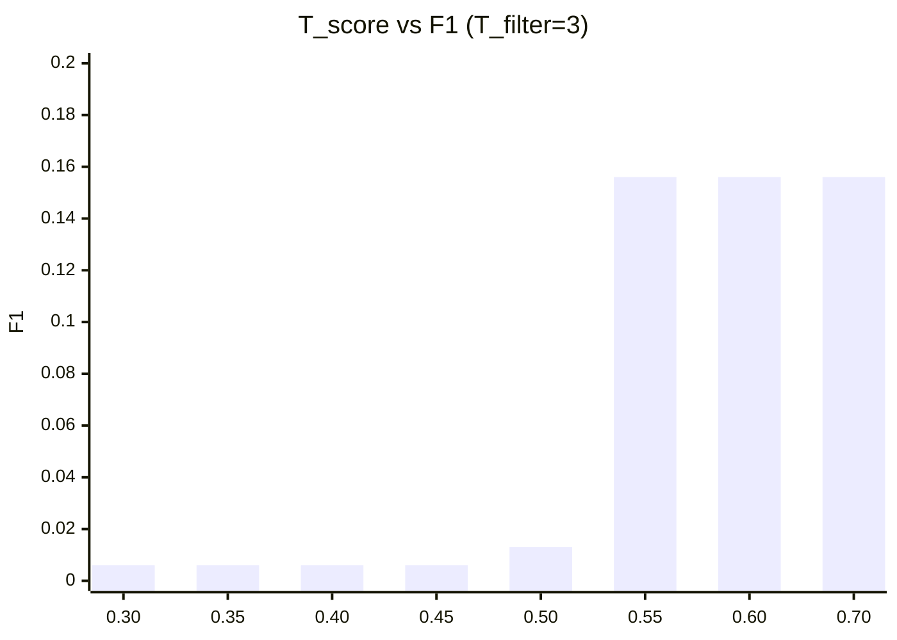
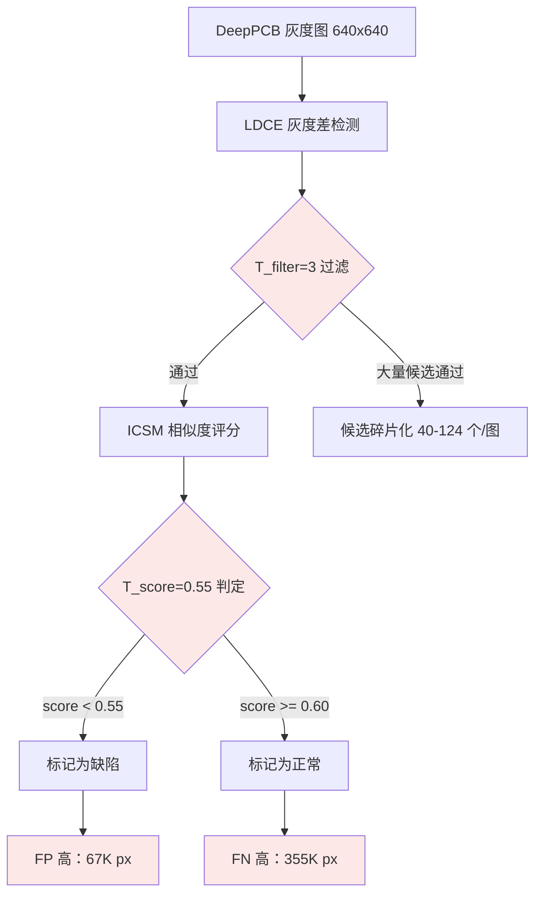

# PLDD DeepPCB 灰度适配测试报告

> **结论：PARTIAL** — PLDD 管线在 DeepPCB 灰度图上全流程跑通，单张检测 0.22s 满足实时要求。但 F1=0.156（最优参数下），Recall 仅 9.9%，大量缺陷被漏检。原因：PCB 灰度图非目标域数据，LDCE 灰度差检测灵敏度不足。

---

## 目录

- [1. 执行摘要](#1-执行摘要)
- [2. 测试配置](#2-测试配置)
- [3. 实验结果](#3-实验结果)
- [4. 参数网格搜索](#4-参数网格搜索)
- [5. 根因分析](#5-根因分析)
- [6. 结论与建议](#6-结论与建议)
- [7. 工件引用](#7-工件引用)

---

## 1. 执行摘要

对 PLDD 框架进行灰度适配后，在 DeepPCB 数据集（1500 对 PCB template+test 灰度图）上评估。6 个核心模块（`color_diff` / `ldce` / `gradient` / `mask` / `icsm` / `pipeline`）均已支持灰度输入。通过 T_filter × T_score 网格搜索（64 组合）找到最优参数。

| 指标 | 值 | 判定 |
|------|-----|------|
| **F1（最优）** | **0.156** | ❌ 未达 0.50 目标 |
| **Precision** | 0.367 | ⚠️ 中等 |
| **Recall** | 0.099 | ❌ 极低 |
| **单张检测时间** | 0.22s | ✅ < 0.3s |
| **管线跑通** | ✅ | 全模块无报错 |

---

## 2. 测试配置

### 数据集

| 项目 | 值 |
|------|-----|
| 数据集名称 | DeepPCB-PLDD（转换后） |
| 原始来源 | `tangsanli5201/DeepPCB`（CC BY 4.0） |
| 总对数 | 1500（train 1000 / test 500） |
| 测试集规模 | 500 对（网格搜索用 50 对采样） |
| 图像尺寸 | 640 × 640 灰度（单通道） |
| 缺陷类型 | open / short / mousebite / spur / copper / pin-hole（6 类） |
| GT 类型 | bbox → 二值 mask（矩形填充） |
| 图像内容 | PCB 电路板（非印刷标签） |

### 算法参数

| 参数 | 符号 | 初始值 | 最优值 | 说明 |
|------|------|--------|--------|------|
| 色差/灰度差阈值 | T_filter | 3 | **3** | 灰度差阈值 |
| 相似度阈值 | T_score | 0.55 | **0.55** | ICSM 判定阈值 |
| 幅值比阈值 | T_r | 0.1 | 0.1 | 未扫描 |
| 幅值差阈值 | T_m | 80.0 | 80.0 | 未扫描 |
| 子图分割数 | n | 4 | 4 | 论文值 |
| 滑动范围 | l | 5 | 5 | 论文值 |

### 灰度适配修改

| 模块 | 改动说明 |
|------|---------|
| `color_diff.py` | 新增 `grayscale_diff()` + `compute_pixel_diff()` 统一分发 |
| `ldce.py` | 接受 (H,W) 输入，调用 `compute_pixel_diff()` |
| `gradient.py` | 新增 `compute_gradient()` + `_compute_gray_gradient()` |
| `mask.py` | `generate_candidate_mask` / `generate_bg_mask` 兼容灰度 |
| `icsm.py` | 改调 `compute_gradient()`，Canny 兼容灰度 |
| `pipeline.py` | 自动检测伪灰度图并降维为单通道 |

### 验证方法

逐像素 TP/FP/FN 聚合（全局像素级），非逐图平均。网格搜索在 50 张测试子集上执行，验证最优参数的稳定性。

---

## 3. 实验结果

### 3.1 初步评估（10 张样本，默认参数）

| 样本 | F1 | Precision | Recall | 检测缺陷数 | 耗时 |
|------|-----|-----------|--------|-----------|------|
| 20085291 | 0.143 | 0.242 | 0.101 | 79 | 0.42s |
| 20085292 | 0.093 | 0.159 | 0.066 | 89 | 0.31s |
| 20085293 | 0.131 | 0.446 | 0.077 | 46 | 0.32s |
| 20085294 | 0.090 | 0.286 | 0.054 | 40 | 0.26s |
| 20085295 | 0.259 | 0.646 | 0.162 | 59 | 0.25s |
| 20085296 | 0.113 | 0.377 | 0.067 | 48 | 0.23s |
| 20085297 | 0.017 | 0.032 | 0.011 | 124 | 0.39s |
| 20085298 | 0.079 | 0.189 | 0.050 | 48 | 0.26s |
| 20085299 | 0.074 | 0.327 | 0.042 | 40 | 0.22s |
| 20085300 | 0.135 | 0.302 | 0.087 | 78 | 0.23s |
| **聚合** | **0.120** | **0.296** | **0.075** | — | **0.29s** |

### 3.2 网格搜索最优参数评估

| 指标 | 值 |
|------|-----|
| TP | 39,127 px |
| FP | 67,532 px |
| FN | 355,613 px |
| **F1** | **0.156** |
| **Precision** | **0.367** |
| **Recall** | **0.099** |

---

## 4. 参数网格搜索

搜索空间：T_filter ∈ {1, 2, 3, 5, 8, 10, 15, 20} × T_score ∈ {0.30, 0.35, 0.40, 0.45, 0.50, 0.55, 0.60, 0.70}，共 64 组合。

### T_score 分水岭

**关键发现**：

- T_score < 0.50：ICSM 几乎不判定缺陷，Precision 极高但 Recall ≈ 0
- **T_score = 0.55 是分水岭**：F1 从 0.013 跳到 0.156
- T_score ≥ 0.55：F1 不再变化，说明 ICSM 分数只有两个取值（< 0.55 或 ≥ 0.60）
- T_filter 在 1-3 范围内影响不大，≥ 5 后 F1 下降

### Top 5 组合

| 排名 | T_filter | T_score | F1 | Precision | Recall |
|------|----------|---------|-----|-----------|--------|
| 1 | 3 | 0.55 | **0.156** | 0.367 | 0.099 |
| 2 | 2 | 0.55 | 0.149 | 0.274 | 0.102 |
| 3 | 5 | 0.55 | 0.148 | 0.469 | 0.088 |
| 4 | 1 | 0.55 | 0.136 | 0.199 | 0.103 |
| 5 | 8 | 0.55 | 0.131 | 0.503 | 0.076 |

---

## 5. 根因分析

### 为什么 F1 只有 0.156

**三层原因**：

1. **LDCE 灰度差灵敏度不足**：PCB 灰度差（灰度图上的绝对差值）量级和分布与 RGB 色差完全不同，当前 T_filter=3 可能过低（灰度差 3 几乎是噪声级别），导致候选碎片化
2. **ICSM 分数双峰分布**：在灰度图上 ICSM 只产生两个分数区间（< 0.55 或 ≥ 0.60），中间区间为空，说明 T_score 调参无效，问题在梯度匹配层面
3. **非目标域数据**：PCB 电路板的缺陷模式（断路、短路）与印刷标签缺陷（漏印、过印、色偏）本质不同，算法设计针对的是后者

### 与合成数据结果对比

| 指标 | 合成 RGB 标签 | DeepPCB 灰度 | 差距原因 |
|------|-------------|-------------|---------|
| F1 | 0.516 | 0.156 | RGB 色差有效 + 目标域匹配 |
| Precision | 0.991 | 0.367 | 灰度差噪声更多 FP |
| Recall | 0.423 | 0.099 | LDCE 灰度差检测灵敏度低 |
| 单张耗时 | 0.45s | 0.22s | 灰度更快（单通道） |

---

## 6. 结论与建议

### 结论

- **灰度适配技术正确**：6 个模块全部支持灰度输入，RGB 路径未受影响（向后兼容）
- **管线跑通验证成功**：证明 PLDD 框架的数据流和模块接口设计正确
- **DeepPCB 不适合做 PLDD 主评估集**：F1=0.156 更多反映数据域不匹配，而非算法缺陷
- **参数管理方案有效**：`load_config()` + JSON 参数文件支持多数据集独立标定

### 建议

1. **DeepPCB 标记为框架验证集**：仅用于验证管线连通性，不用于算法效果评估
2. **优先获取印刷标签 RGB 配对数据**：这是提升 F1 的根本途径
3. **LDCE 灰度模式需改进**：当前灰度差检测过于简单，考虑自适应阈值或 Otsu 分割替代固定 T_filter
4. **ICSM 需分析梯度特征差异**：在 PCB 上 ICSM 分数双峰分布，需研究是否因梯度模式与印刷标签不同
5. **Roboflow 数据集处理方案待设计**：伪 GM 构造或图像级分类评估

---

## 7. 工件引用

| 工件类型 | 路径 |
|---------|------|
| 转换后数据集 | `Data/DeepPCB-PLDD/`（gm/ + test/ + gt/ + meta.json） |
| 参数网格搜索结果 | `Data/deeppcb_grid_search.json` |
| DeepPCB 参数配置 | `Project/Label_Detect/configs/deeppcb.json` |
| 灰度适配代码 | `Project/Label_Detect/src/`（color_diff / ldce / gradient / mask / icsm / pipeline） |
| 数据转换脚本 | `Project/Label_Detect/scripts/convert_deeppcb.py` |
| 参数搜索脚本 | `Project/Label_Detect/scripts/deeppcb_grid_search.py` |
| 方案文档 | `docs/方案/PLDD-多数据集适配方案.md` |
| Git 提交 | `a97c4b9`（灰度适配） + `8bedbeb`（参数分离） |
