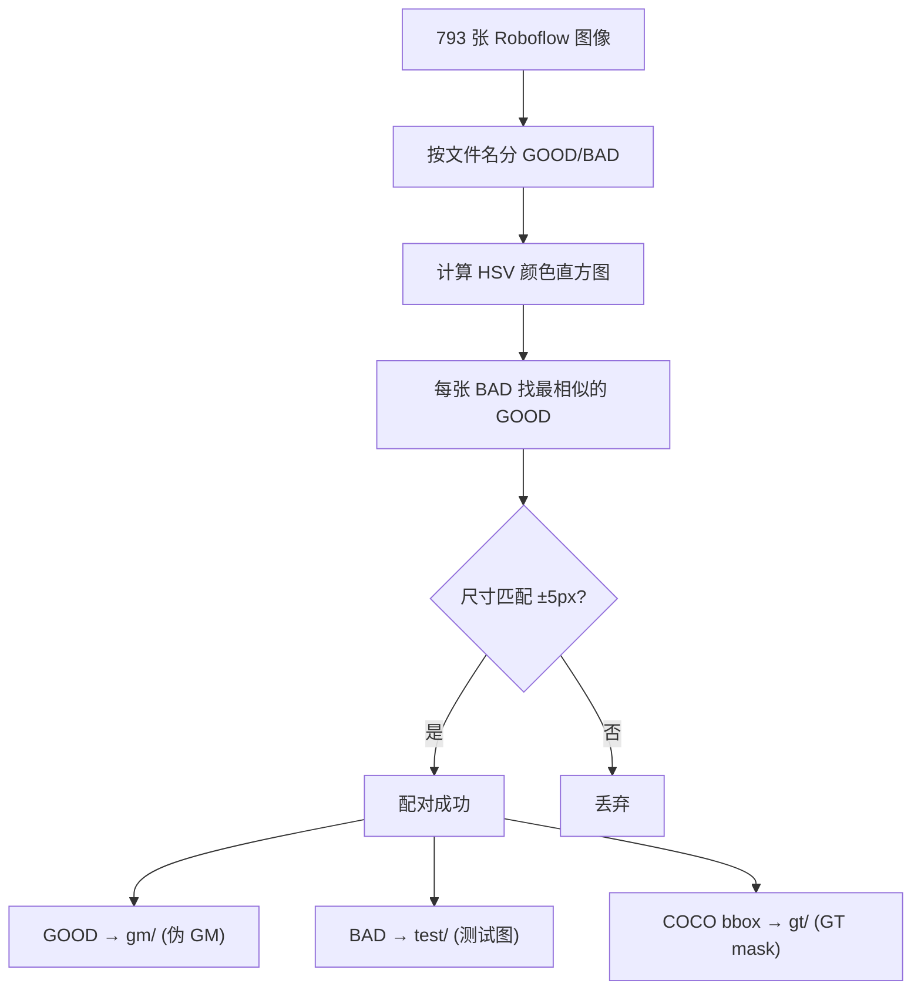
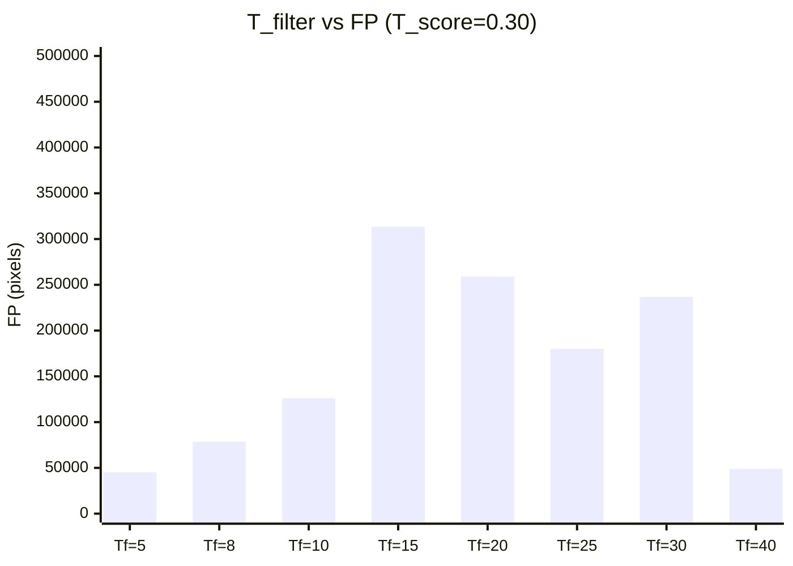
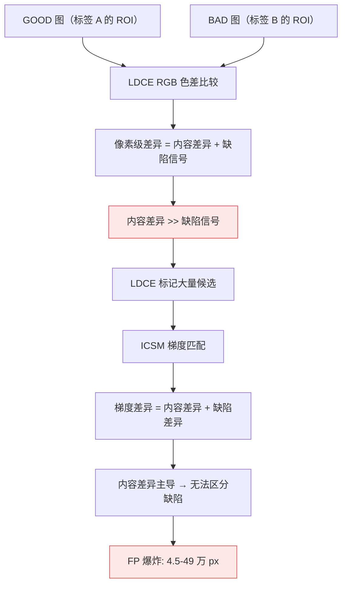
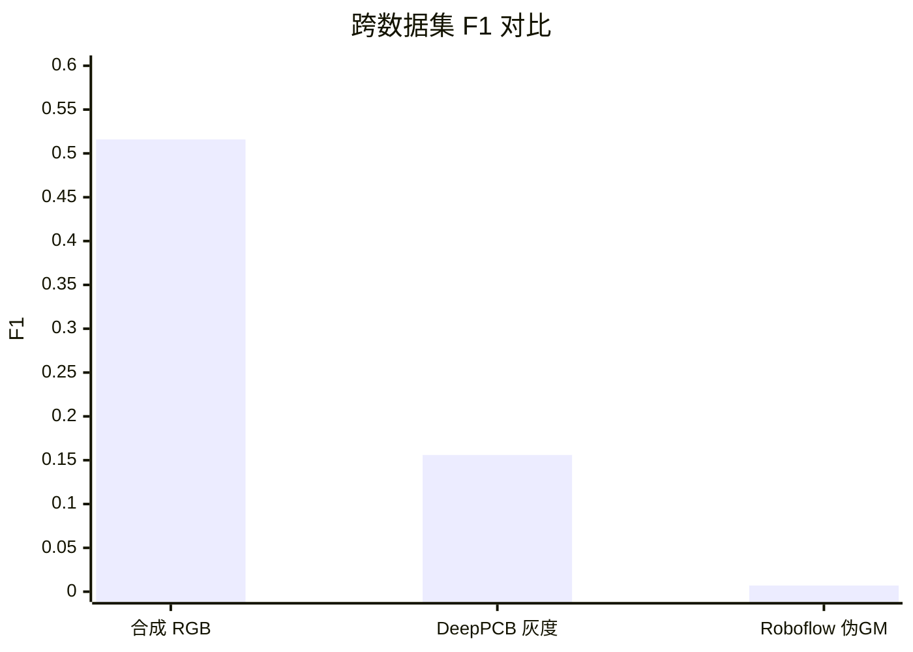

# PLDD Roboflow 伪 GM 适配测试报告

> **结论：FAIL** — 伪 GM 配对方案（直方图相似度匹配 GOOD 图作为 GM）在 Roboflow 印刷标签数据上完全失效，最优 F1=0.007。根因：GOOD 图与 BAD 图是不同标签的 ROI 切片，LDCE 像素级色差比较产生海量 FP（4.5-49 万 px），参数调优无法弥补内容差异。

---

## 目录

- [1. 执行摘要](#1-执行摘要)
- [2. 测试配置](#2-测试配置)
- [3. 伪 GM 配对方案](#3-伪-gm-配对方案)
- [4. 实验结果](#4-实验结果)
- [5. 参数网格搜索](#5-参数网格搜索)
- [6. 根因分析](#6-根因分析)
- [7. 跨数据集对比](#7-跨数据集对比)
- [8. 结论与建议](#8-结论与建议)
- [9. 工件引用](#9-工件引用)

---

## 1. 执行摘要

对 PLDD 框架在 Roboflow Label Printing Defect V2 数据集上进行伪 GM（Golden Master）适配测试。通过 HSV 颜色直方图相似度为每张 BAD（缺陷）图匹配一张 GOOD（无缺陷）图作为伪 GM，生成 127 对配对数据。

| 指标 | 值 | 判定 |
|------|-----|------|
| **F1（最优）** | **0.007** | ❌ |
| **Precision** | 0.007 | ❌ |
| **Recall** | 0.007 | ❌ |
| **FP 峰值** | 49 万 px / 19 万总 px | ❌ FP > 总像素 |
| **单张检测时间** | 0.182s | ✅ < 0.3s |
| **配对成功率** | 127/208 (61%) | ⚠️ |
| **平均直方图相似度** | 0.978 | ✅ 但无效 |

---

## 2. 测试配置

### 数据集

| 项目 | 值 |
|------|-----|
| 数据集名称 | Roboflow Label Printing Defect V2（马来西亚理科大学） |
| 原始规模 | 793 张（train 557 / valid 118 / test 118） |
| 配对后规模 | 127 对（train 87 / valid 24 / test 16） |
| 图像尺寸 | ~496 × 378 RGB |
| 缺陷类别 | Defect / No-Defect（图像级 bbox） |
| GT 精度 | bbox 基本覆盖整张图（等价图像级分类） |
| 许可 | CC BY 4.0 |

### 算法参数

| 参数 | 符号 | 初始值 | 网格搜索范围 | 最优值 |
|------|------|--------|-------------|--------|
| 色差阈值 | T_filter | 3 | 5-40 | **5** |
| 相似度阈值 | T_score | 0.55 | 0.30-0.90 | **0.30** |
| 幅值比阈值 | T_r | 0.1 | 未扫描 | 0.1 |
| 幅值差阈值 | T_m | 80.0 | 未扫描 | 80.0 |
| 子图分割数 | n | 4 | — | 4 |
| 滑动范围 | l | 5 | — | 5 |

### 验证方法

逐像素 TP/FP/FN 聚合（全局像素级），网格搜索在 60 张子集上执行。

---

## 3. 伪 GM 配对方案

### 配对策略

### 配对结果

| 分割 | BAD 图 | 配对成功 | 成功率 | 平均相似度 |
|------|--------|---------|--------|-----------|
| train | 148 | 87 | 58.8% | 0.978 |
| valid | 30 | 24 | 80.0% | 0.979 |
| test | 30 | 16 | 53.3% | 0.983 |
| **总计** | **208** | **127** | **61.1%** | **0.979** |

相似度分布：

| 阈值 | 配对数 | 占比 |
|------|--------|------|
| > 0.98 | 43 | 33.9% |
| > 0.95 | 75 | 59.1% |
| > 0.90 | 85 | 66.9% |

---

## 4. 实验结果

### 4.1 初始评估（默认参数 T_filter=3, T_score=0.55）

| 指标 | 值 |
|------|-----|
| TP | 4,614 px |
| FP | 1,048,046 px |
| FN | 94,707 px |
| **F1** | **0.008** |
| **Precision** | **0.004** |
| **Recall** | **0.047** |
| 平均耗时 | 0.182s |

FP 超过 100 万像素 — LDCE 把大部分图像标记为候选缺陷。

### 4.2 网格搜索最优参数评估

| 指标 | 值 |
|------|-----|
| TP | 322 px |
| FP | 45,144 px |
| FN | 46,438 px |
| **F1** | **0.007** |
| **Precision** | **0.007** |
| **Recall** | **0.007** |

即使最优参数，F1 仍 < 0.01。

---

## 5. 参数网格搜索

搜索空间：T_filter ∈ {5, 8, 10, 15, 20, 25, 30, 40} × T_score ∈ {0.30, 0.40, 0.50, 0.55, 0.60, 0.70, 0.80, 0.90}，共 64 组合，60 张测试子集。

### FP 随 T_filter 变化（T_score=0.30）

### 关键发现

1. **T_filter 影响不单调**：FP 并非随 T_filter 增大而单调递减，T_filter=15 时 FP 反而高达 31 万 — 说明 LDCE 候选掩码碎片化严重，不同区域产生不同量级 FP
2. **T_score 完全无效**：同一 T_filter 下，T_score 从 0.30 到 0.90 的 F1 变化 < 0.001
3. **所有组合 Precision < 1%**：无论怎么调参，检出区域中 99% 是误报

### Top 5 组合

| 排名 | T_filter | T_score | F1 | Precision | Recall | FP |
|------|----------|---------|-----|-----------|--------|-----|
| 1 | 5 | 0.30 | 0.007 | 0.007 | 0.007 | 45,144 |
| 2 | 5 | 0.40 | 0.007 | 0.007 | 0.007 | 45,217 |
| 3 | 5 | 0.50 | 0.006 | 0.005 | 0.007 | 59,538 |
| 4 | 8 | 0.30 | 0.006 | 0.005 | 0.008 | 78,569 |
| 5 | 8 | 0.40 | 0.006 | 0.005 | 0.008 | 78,607 |

---

## 6. 根因分析

### 失败机理

### 三层根因

**第一层：伪 GM 不是真正的 GM**

PLDD 的 GM 假设是"同一版面的无缺陷版本"，像素级差异仅来自缺陷。而 Roboflow 的 GOOD 图是**不同标签的正常 ROI**，与 BAD 图之间存在：
- 不同标签图案（文字、图形、布局不同）
- 不同墨色和套印
- 不同拍摄角度和光照

**第二层：LDCE 对内容差异极度敏感**

LDCE 计算逐像素 RGB 色差，即使是两张"正常的印刷标签"，如果内容不同，色差值也会很大。直方图相似度 0.978 只说明**颜色分布**相似，不代表**像素级**相似。

**第三层：GT 标注粒度不匹配**

COCO bbox 基本覆盖整张图（如 `[0, 0, 496, 378]`），等价于图像级分类标签。PLDD 需要像素级 GT mask 来精确评估缺陷定位，bbox→mask 会将整张图标记为"缺陷"，进一步稀释了真实缺陷信号。

---

## 7. 跨数据集对比

| 数据集 | 色彩 | GM 来源 | GT 精度 | F1 | P | R | 结论 |
|--------|------|---------|---------|-----|----------|------|
| 合成 RGB 标签 | RGB | ✅ 真实 GM | 像素级 | **0.516** | 0.991 | 0.423 | 目标域有效 |
| DeepPCB | 灰度 | ✅ 原生配对 | bbox→mask | **0.156** | 0.367 | 0.099 | 框架验证通过 |
| Roboflow 伪 GM | RGB | ❌ 伪 GM | 图像级 | **0.007** | 0.007 | 0.007 | 方案失败 |

**关键洞察**：F1 排序 = GM 质量排序。GM 越接近"同一版面的无缺陷版本"，效果越好。Roboflow 的"不同标签作为 GM"从根本假设上就不成立。

---

## 8. 结论与建议

### 结论

1. **伪 GM 方案失败**：直方图相似度匹配不能替代真正的 GM，像素级内容差异远超缺陷信号
2. **参数调优无效**：64 组合 F1 均在 0.001-0.007，问题在数据层面而非参数层面
3. **Roboflow 数据集不适用于 PLDD**：缺少天然 GM 配对 + GT 为图像级标注，无法支撑 PLDD 的双图对比范式
4. **PLDD 算法本身正确**：在合成数据（真实 GM）上 F1=0.516，算法设计有效

### 建议

1. **关闭 Roboflow PLDD 评估方向**：不再投入时间优化参数
2. **Roboflow 可用于其他用途**：
   - 图像级分类基线（YOLO/ResNet 直接分类 Defect/No-Defect）
   - ICSM 消融实验的输入素材
3. **下一步应聚焦获取配对数据**：
   - 联系 PLDD 论文作者请求数据集
   - 自建合成数据改进缺陷生成质量
   - 探索 ISP-AD 数据集的 GM 子集
4. **DeepPCB 继续作为框架验证基准**：F1=0.156 已证明管线正确

---

## 9. 工件引用

| 工件类型 | 路径 |
|---------|------|
| 配对数据集 | `Data/Roboflow-PLDD/`（gm/ + test/ + gt/ + meta.json） |
| 参数网格搜索结果 | `Data/roboflow_grid_search.json` |
| 参数配置 | `Project/Label_Detect/configs/roboflow.json` |
| 配对转换脚本 | `Project/Label_Detect/scripts/convert_roboflow.py` |
| 参数搜索脚本 | `Project/Label_Detect/scripts/roboflow_grid_search.py` |
| 原始数据集 | `Data/Roboflow Label Printing V2/` |
| 方案文档 | `docs/方案/PLDD-多数据集适配方案.md` |
| DeepPCB 测试报告 | `docs/测试报告/0004-PLDD-DeepPCB灰度适配测试报告.md` |
