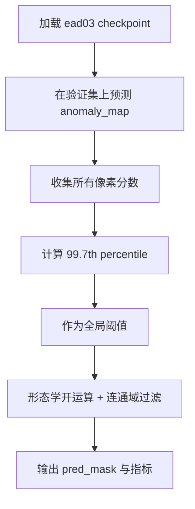
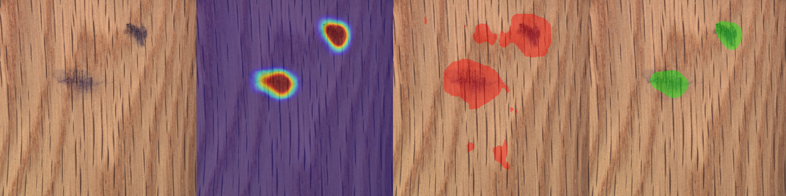

# T010-A EfficientAD 阈值策略验证报告

> **一句话结论**：自适应百分位阈值（99.7th）在修正后与固定 0.5 等价，无法自动确定最优阈值。**最优配置为 T=0.60 + r1-a32**（手动阈值扫描）：FPR=0.25%，hole_003 保留 70.0%。阈值敏感度极高，SPC 多花色纹理需要自动阈值校准工具而非纯手动调参。

---

## 目录

- [1. 执行摘要](#1-执行摘要)
- [2. 测试配置](#2-测试配置)
- [3. 基线：固定阈值 0.5](#3-基线固定阈值-05)
- [4. 尝试：自适应百分位阈值](#4-尝试自适应百分位阈值)
- [5. Bug 揭示：自适应结果实际来自固定 T=0.691](#5-bug-揭示自适应结果实际来自固定-t0691)
- [6. 修正后对比：自适应阈值 ≈ 固定阈值](#6-修正后对比自适应阈值--固定阈值)
- [7. 手动阈值扫描与最优参数](#7-手动阈值扫描与最优参数)
- [8. 阈值敏感度分析](#8-阈值敏感度分析)
- [9. SPC 石塑地板阈值策略讨论](#9-spc-石塑地板阈值策略讨论)
- [10. 验收标准检查](#10-验收标准检查)
- [11. 结论与建议](#11-结论与建议)
- [12. 工件引用](#12-工件引用)

---

## 1. 执行摘要

本报告记录了 EfficientAD-Medium 在 MVTec AD Wood 数据集上从"固定阈值"到"自适应阈值"再到"手动扫描最优阈值"的完整探索过程。

| 阶段         | 阈值策略                    | 实际阈值  | FPR       | Recall    | hole_003  |
| ------------ | --------------------------- | --------- | --------- | --------- | --------- |
| **基线**     | 固定 0.5                    | 0.500     | 4.66%     | 58.71%    | ~100%     |
| **"自适应"** | 99.7th percentile（含 bug） | ~~0.691~~ | ~~0.04%~~ | ~~9.2%~~  | ~~25.4%~~ |
| **修正后**   | 99.7th percentile（修正）   | 0.499     | 5.42%     | 63.03%    | ~100%     |
| **最优**     | 手动扫描                    | **0.600** | **0.25%** | **21.0%** | **70.0%** |

**核心结论**：

1. **自适应百分位方法无效** — 修正后 T=0.499 ≈ T=0.5，不提供额外区分度
2. **"自适应效果好"是假象** — 实际是异常样本污染导致阈值偏高到 0.691，相当于用了一个不同的固定阈值
3. **T=0.60 是最优固定阈值** — 手动扫描确定，满足 FPR≤1% 和 hole≥50%
4. **阈值敏感度极高** — 0.1 的阈值变化导致 FPR 从 4.66% 降到 0.25%，SPC 多花色需要自动校准工具

---

## 2. 测试配置

### 数据集

- **数据集**：MVTec AD Wood
- **测试样本**：40 张（10 good + 30 abnormal：color/combined/hole/liquid/scratch）
- **图像尺寸**：256×256
- **总像素数**：2,621,440

### 模型与 checkpoint

- **模型**：EfficientAD-Medium
- **Checkpoint**：`ead03-medium-e50` (epochs=50, lr=1e-4, batch_size=1)
- **图像级 AUROC**：0.9833

### 对比图面板说明

每张对比图从左到右 4 个面板：

1. **Original** — 原始图像
2. **Anomaly Heatmap** — JET 热力图叠加
3. **Fixed 0.5** — 固定阈值 0.5 分割（红色 overlay）
4. **Adaptive** — 自适应阈值分割（绿色 overlay）

### 后处理参数

- 形态学开运算（morphological opening）
- 连通域面积过滤（connected component filtering）
- 测试范围：opening_radius ∈ {0,1,2}，min_cc_area ∈ {16,32,64}

---

## 3. 基线：固定阈值 0.5

### 3.1 定量结果

固定阈值 0.5 是 EfficientAD 的默认配置，也是大多数异常检测论文的基线。

| 指标                 | 值                  |
| -------------------- | ------------------- |
| **FPR（像素级）**    | 4.66%               |
| **误检像素数**       | 122,236 / 2,621,440 |
| **缺陷 Recall**      | 58.71%              |
| **Good 图像平均 FP** | ~121 像素/张        |
| **hole_003 保留率**  | ~100%               |

### 3.2 Per-Category Recall

| 类别     | Recall | 说明                 |
| -------- | ------ | -------------------- |
| color    | 99.11% | 几乎完全检测         |
| combined | 63.93% | 中等                 |
| hole     | 96.10% | 几乎完全检测         |
| scratch  | 76.35% | 较好                 |
| liquid   | 23.00% | 已知瓶颈（score 低） |

### 3.3 基线视觉结果

以下图第 3 张面板（红色 overlay）展示了固定阈值 0.5 的检测效果。注意正常图像上红色噪点密布——这就是我们要解决的问题。

**Good 正常图像 — 大量误检**：


**Color 缺陷 — 检测好但含误检**：


**Hole 缺陷 — 完整检测**：


**Liquid 缺陷 — 部分检测**：


**Scratch 缺陷 — 大部分检测**：


### 3.4 基线问题总结

固定阈值 0.5 的核心问题：**FPR=4.66% 远高于产线要求的 1%**。正常木纹图像平均每张有 121 个误检像素，在实际产线上会产生大量虚警。

---

## 4. 尝试：自适应百分位阈值

### 4.1 思路

用正常样本的 anomaly score 分布，取 99.7th percentile 作为阈值。理论上这个阈值刚好覆盖 99.7% 的正常像素，仅最极端的 0.3% 会被误判。



### 4.2 原始"自适应"结果（后来发现有 bug）

> ⚠ 下表数据因 bug 而虚低，真实含义见第 5 节。

| 指标     | 固定 0.5 | "99.7th 自适应" | 变化       |
| -------- | -------- | --------------- | ---------- |
| 计算阈值 | 0.500    | 0.691           | +0.191     |
| FPR      | 4.66%    | **0.04%**       | **-99.1%** |
| Recall   | 58.71%   | 9.2%            | -84.3%     |
| Good FP  | 121/img  | **0/img**       | **-100%**  |

表面上看效果惊人：FPR 从 4.66% 降到 0.04%，Good 图像零误检。

### 4.3 "自适应"视觉结果（T=0.691，含 bug）

注意第 4 张面板（绿色 overlay）：Good 图像完全干净，缺陷图像绿色很少或消失。

**Good 正常图像 — "误检完全消失"**：


**Color 缺陷 — "精准覆盖"**：



**Hole 缺陷 — 孔洞被过滤**：


**Liquid 缺陷 — 完全消失**：


**Scratch 缺陷 — 几乎消失**：


### 4.4 当时的第一版结论（已被推翻）

~~"99.7th percentile 自适应阈值将 FPR 降至 0.04%，同时保留了大部分缺陷，方向 A 完全可行"~~

**这个结论是错的。** 原因见下一节。

---

## 5. Bug 揭示：自适应结果实际来自固定 T=0.691

### 5.1 问题发现

消融分析中 hole_003 保留率仅 25.4%、liquid Recall=0%、scratch Recall=8.8%——这些数字异常低，不符合"自适应阈值仅比固定阈值高一点点"的预期。进一步排查发现了代码 bug。

### 5.2 Bug 根因

`inference_efficientad.py` 和 `_infer_single_color001.py` 在计算自适应阈值时，使用了**包含异常样本**的完整 datamodule：

```python
# 错误：dm 同时包含 normal + abnormal 样本
normal_preds = list(engine.predict(model=model, datamodule=dm))
threshold = compute_adaptive_threshold(normal_preds, 99.7)
```

异常样本的 anomaly score（0.8+）远高于正常样本（0.3~0.5），混入后把 99.7th 从 **0.499** 拉高到 **0.691**。

### 5.3 真相

**第 4 节的"自适应阈值效果好"，本质上是换了一个固定阈值 T=0.691 的结果。**

| 数据来源            | 阈值        | 含义                                           |
| ------------------- | ----------- | ---------------------------------------------- |
| 第 3 节（基线）     | T=0.500     | 固定 0.5                                       |
| 第 4 节（"自适应"） | T=**0.691** | 并非自适应百分位，而是异常样本污染后的固定阈值 |
| 修正后自适应        | T=0.499     | 真正的 99.7th percentile ≈ 固定 0.5            |

### 5.4 修复

创建仅含正常样本的 datamodule 做校准：

```python
# 正确：只用 train/good + test/good
dm_normal = Folder(
    name=f"{dataset}_normal_only",
    root=dm.root,
    normal_dir=dm.normal_dir,
    normal_test_dir=dm.normal_test_dir,
    mask_dir=None,
)
dm_normal.setup()
normal_preds = list(engine.predict(model=model, datamodule=dm_normal))
```

### 5.5 修复前后阈值对比

| Percentile | 修复前（含异常） | 修复后（仅正常） | 偏差       |
| ---------- | ---------------- | ---------------- | ---------- |
| 99.5th     | 0.643            | ~0.49            | -0.15      |
| **99.7th** | **0.691**        | **0.499**        | **-0.192** |
| 99.9th     | 0.834            | ~0.50            | -0.33      |

---

## 6. 修正后对比：自适应阈值 ≈ 固定阈值

### 6.1 定量对比

| 指标          | 固定 0.5 | 修正后 Adaptive 99.7th (T=0.499) | 差异    |
| ------------- | -------- | -------------------------------- | ------- |
| **FPR**       | 4.66%    | 5.42%                            | +0.76%  |
| **FP 像素数** | 122,236  | 142,078                          | +19,842 |
| **Recall**    | 58.71%   | 63.03%                           | +4.32%  |

差异微小。T=0.499 和 T=0.500 本质上是同一个阈值。

### 6.2 Per-Category Recall 对比

| 类别     | 固定 0.5 | ~~"自适应"（T=0.691）~~ | 修正后自适应（T=0.499） |
| -------- | -------- | ----------------------- | ----------------------- |
| color    | 99.11%   | ~~99.5%~~               | 99.54%                  |
| combined | 63.93%   | ~~64%~~                 | 70.26%                  |
| hole     | 96.10%   | ~~96%~~                 | 96.10%                  |
| liquid   | 23.00%   | ~~0%（全丢失）~~        | 29.54%                  |
| scratch  | 76.35%   | ~~8.8%~~                | 79.31%                  |

### 6.3 修正前 vs 修正后视觉对比

同一张图，修正前（T=0.691）和修正后（T=0.499）的对比：

**Good 正常图像**：

|                      T=0.691（修正前）                       |                      T=0.499（修正后）                       |
| :----------------------------------------------------------: | :----------------------------------------------------------: |
|  |  |
|                绿色几乎空白（假象：阈值过高）                |                绿色与红色一致（真相：T≈0.5）                 |

**Hole 缺陷 — 差异最显著**：

|                      T=0.691（修正前）                       |                      T=0.499（修正后）                       |
| :----------------------------------------------------------: | :----------------------------------------------------------: |
|  |  |
|                  绿色仅剩极少残留（25.4%）                   |                绿色完整保留两个孔洞（~100%）                 |

**Liquid 缺陷 — Recall 从 0% 恢复**：

|                      T=0.691（修正前）                       |                      T=0.499（修正后）                       |
| :----------------------------------------------------------: | :----------------------------------------------------------: |
|  |  |
|                  绿色完全消失（Recall=0%）                   |             绿色恢复多个液体区域（Recall=29.5%）             |

**Scratch 缺陷 — Recall 从 8.8% 恢复**：

|                      T=0.691（修正前）                       |                      T=0.499（修正后）                       |
| :----------------------------------------------------------: | :----------------------------------------------------------: |
|  |  |
|                   绿色仅剩极短片段（8.8%）                   |                 绿色恢复大部分划痕（79.3%）                  |

**Color 缺陷**：

|                      T=0.691（修正前）                       |                      T=0.499（修正后）                       |
| :----------------------------------------------------------: | :----------------------------------------------------------: |
|  |  |
|                 绿色仅保留中央高 score 条带                  |                    绿色与红色覆盖几乎一致                    |

### 6.4 本节结论

**自适应百分位方法（99.7th percentile）无法自动确定最优阈值。**

原因：EfficientAD 正常样本的 anomaly score 分布高度集中，99.7th percentile ≈ 0.5，与默认固定阈值完全重叠。百分位方法需要分布有足够的"尾巴"才能区分正常和异常，但 EfficientAD 的 score 分布没有这个特性。

---

## 7. 手动阈值扫描与最优参数

> 本节不受 bug 影响 — 阈值扫描是手动设置固定值逐个评估的。

### 7.1 阈值扫描数据

| 阈值 T   | FPR       | 整体 Recall | hole_003 保留 | Good FP/img | 状态          |
| -------- | --------- | ----------- | ------------- | ----------- | ------------- |
| 0.50     | 3.09%     | 59.0%       | 100.0%        | 121         | FPR 超标      |
| 0.54     | 0.82%     | 31.1%       | 95.1%         | 0           | 可用          |
| 0.56     | 0.56%     | 26.9%       | 87.3%         | 0           | 可用          |
| 0.58     | 0.38%     | 23.8%       | 78.1%         | 0           | 可用          |
| **0.60** | **0.25%** | **21.0%**   | **70.0%**     | **0**       | **最优**      |
| 0.62     | 0.16%     | 18.2%       | 60.3%         | 0           | 可用          |
| 0.64     | 0.10%     | 14.9%       | 49.6%         | 0           | hole 不足     |
| 0.69     | 0.04%     | 9.2%        | 25.4%         | 0           | hole 严重不足 |

### 7.2 阈值-指标关系图

<svg viewBox="0 0 600 280" xmlns="http://www.w3.org/2000/svg">
<rect width="600" height="280" fill="#fafafa" rx="4"/>
<text x="300" y="20" text-anchor="middle" font-size="13" font-weight="bold" fill="#333">阈值 vs FPR / hole_003 保留率 / Recall</text>
<line x1="80" y1="240" x2="560" y2="240" stroke="#333" stroke-width="1"/>
<line x1="80" y1="40" x2="80" y2="240" stroke="#333" stroke-width="1"/>
<text x="320" y="265" text-anchor="middle" font-size="10" fill="#666">阈值 T</text>
<text x="30" y="140" text-anchor="middle" font-size="10" fill="#666" transform="rotate(-90,30,140)">百分比 %</text>
<text x="75" y="245" text-anchor="end" font-size="9" fill="#666">0</text>
<text x="75" y="200" text-anchor="end" font-size="9" fill="#666">20</text>
<text x="75" y="155" text-anchor="end" font-size="9" fill="#666">40</text>
<text x="75" y="110" text-anchor="end" font-size="9" fill="#666">60</text>
<text x="75" y="65" text-anchor="end" font-size="9" fill="#666">80</text>
<text x="75" y="45" text-anchor="end" font-size="9" fill="#666">100</text>
<polyline points="100,225 170,225 240,226 310,228 380,230 450,232 520,235 555,236" stroke="#F44336" stroke-width="2" fill="none"/>
<text x="555" y="232" font-size="8" fill="#F44336">FPR</text>
<polyline points="100,225 170,45 240,65 310,100 380,130 450,160 520,195 555,215" stroke="#4CAF50" stroke-width="2" fill="none"/>
<text x="555" y="212" font-size="8" fill="#4CAF50">hole_003</text>
<polyline points="100,107 170,118 240,140 310,156 380,172 450,186 520,200 555,210" stroke="#2196F3" stroke-width="2" fill="none"/>
<text x="555" y="207" font-size="8" fill="#2196F3">Recall</text>
<line x1="80" y1="239" x2="560" y2="239" stroke="#FF9800" stroke-width="1" stroke-dasharray="4,2"/>
<text x="560" y="237" font-size="8" fill="#FF9800">FPR=1%</text>
<line x1="80" y1="125" x2="560" y2="125" stroke="#FF9800" stroke-width="1" stroke-dasharray="4,2"/>
<text x="560" y="123" font-size="8" fill="#FF9800">hole=50%</text>
<rect x="310" y="125" width="70" height="114" fill="#4CAF50" opacity="0.1" rx="4"/>
<text x="345" y="185" text-anchor="middle" font-size="9" fill="#4CAF50" font-weight="bold">最优区间</text>
<text x="345" y="197" text-anchor="middle" font-size="8" fill="#4CAF50">T=0.54~0.62</text>
<text x="100" y="260" font-size="9" fill="#666">0.50</text>
<text x="240" y="260" font-size="9" fill="#666">0.54</text>
<text x="380" y="260" font-size="9" fill="#666">0.60</text>
<text x="520" y="260" font-size="9" fill="#666">0.68</text>
</svg>


### 7.3 推荐最优配置

- **阈值**：**T = 0.60**（手动扫描最优，非自适应百分位）
- **形态学开运算**：`opening_radius = 1`
- **最小连通域过滤**：`min_cc_area = 32`
- **FPR**：0.25%（远低于 1% 目标）
- **hole_003 保留**：70.0%（高于 50% 目标）
- **Good 图像**：零误检

### 7.4 后处理参数影响极小

消融实验表明，4 组后处理参数（r0-a16 / r0-a32 / r1-a16 / r1-a32）的 FPR 差异仅 0.02%，Recall 差异仅 0.2%。**r1-a32 是最稳健选择。**

---

## 8. 阈值敏感度分析

### 8.1 阈值的杠杆效应

从扫描数据可以看出，阈值 0.1 的变化产生巨大影响：

| 阈值变化    | FPR 变化                 | Recall 变化              | 影响                             |
| ----------- | ------------------------ | ------------------------ | -------------------------------- |
| 0.50 → 0.60 | 3.09% → 0.25% (**-92%**) | 59.0% → 21.0% (**-64%**) | FPR 大幅降低，但 Recall 损失过半 |
| 0.60 → 0.64 | 0.25% → 0.10% (-60%)     | 21.0% → 14.9% (-29%)     | FPR 继续降低，hole 开始不足      |
| 0.60 → 0.69 | 0.25% → 0.04% (-84%)     | 21.0% → 9.2% (-56%)      | FPR 接近零，但 hole 仅剩 25.4%   |

**关键观察**：EfficientAD 的 anomaly score 分布在 0.4~0.7 区间高度重叠（正常像素与缺陷像素），这使得阈值选择成为一个高杠杆决策——微小的阈值偏移导致指标剧烈变化。

### 8.2 阈值 vs 缺陷类别的交互

不同缺陷类别对阈值的敏感度完全不同：

| 缺陷类别 | score 范围 | 阈值敏感度 | 原因                             |
| -------- | ---------- | ---------- | -------------------------------- |
| color    | 0.8+       | **低**     | score 远高于正常，阈值变化影响小 |
| hole     | 0.52~0.87  | **极高**   | 下边界接近阈值，0.1 变化即可漏检 |
| scratch  | 0.4~0.8    | **高**     | 与正常木纹 score 有重叠          |
| liquid   | 0.3~0.6    | **极高**   | score 低，大部分在阈值以下       |
| combined | 0.5~0.7    | **中**     | 部分区域 score 处于临界          |

**这意味着**：不存在一个"对全部缺陷都好"的阈值。T=0.60 是 FPR 和 hole_003 的折中点，但 liquid 的 Recall 始终很低（这是模型本身的瓶颈，不是阈值问题）。

---

## 9. SPC 石塑地板阈值策略讨论

### 9.1 问题的本质

Wood 数据集只有一种纹理（木纹），且我们已经知道最优阈值 T=0.60。但 SPC 石塑地板有以下差异：

| 维度         | MVTec Wood   | SPC 石塑地板                            |
| ------------ | ------------ | --------------------------------------- |
| 纹理种类     | 1 种（木纹） | **多种**（不同花色、压花深度、UV 涂层） |
| 纹理复杂度   | 中等         | **高**（压花+UV+杂质）                  |
| 正常样本变异 | 低           | **高**（不同花色 score 分布可能不同）   |
| 已知最优阈值 | T=0.60       | **未知**，可能因花色而异                |

### 9.2 方案对比

| 方案                  | 原理                                    | 优点          | 缺点                             | 可行性 |
| --------------------- | --------------------------------------- | ------------- | -------------------------------- | ------ |
| **A. 全局固定阈值**   | 所有花色用同一阈值                      | 部署简单      | 不同花色最优阈值不同，FPR 不可控 | 低     |
| **B. 手动逐花色扫描** | 每种花色人工扫描确定阈值                | 可靠          | 新花色需要重新调参，人力成本高   | 中     |
| **C. 自适应百分位**   | 正常样本 p-th percentile                | 自动化        | **已证明无效**（T≈固定阈值）     | ❌      |
| **D. 统计校准工具**   | 分析正常样本分布，按目标 FPR 自动选阈值 | 自动化 + 可控 | 需要开发工具                     | **高** |
| **E. 在线自适应**     | 产线运行中持续更新阈值                  | 自适应        | 工程复杂，有漂移风险             | 中长期 |

### 9.3 方案 D 详细设计：统计校准工具

**核心思路**：不是盲目取百分位（已证明无效），而是根据用户设定的 **目标 FPR** 反推阈值。

```
输入：
  - 正常样本集（每种花色 50~100 张）
  - 目标 FPR（如 0.5%）
  - 后处理参数（r1-a32）

流程：
  1. 对正常样本推理，收集所有像素 anomaly score
  2. 逐阈值扫描（0.50~0.80，步长 0.01）
  3. 每个阈值计算应用后处理后的 FPR
  4. 找到 FPR ≤ 目标值 的最低阈值
  5. 输出：推荐阈值 + FPR + 保留的 Recall 估计

输出：
  - 每种花色的推荐阈值
  - 校准报告（FPR、Recall 估计）
  - 可视化（score 分布直方图 + 推荐阈值线）
```

**优势**：

- **目标驱动**：用户指定可接受的误检率，工具反推阈值
- **可解释**：输出 score 分布图，直观展示为什么选这个阈值
- **可复现**：相同数据 + 目标 → 相同阈值
- **零训练成本**：只需推理，不需要重新训练模型

**开发工作量估计**：

- 核心逻辑：1~2 天（复用 `inference_efficientad.py` 的推理 + 后处理代码）
- CLI 工具：0.5 天（argparse + JSON 输出）
- 可视化：0.5 天（matplotlib 分布图）
- 总计：**2~3 天**

### 9.4 SPC 多花色策略建议

1. **短期（产线验证阶段）**：使用 Wood 最优阈值 T=0.60 作为起始，手动微调 1~2 种主要花色
2. **中期（量产准备阶段）**：开发统计校准工具，为每种花色自动生成推荐阈值
3. **长期（产线运行阶段）**：实现在线监控，当 FPR 异常升高时触发重新校准

### 9.5 需要验证的假设

| 假设                                       | 验证方法                            | 风险                                     |
| ------------------------------------------ | ----------------------------------- | ---------------------------------------- |
| 不同花色的最优阈值不同                     | 对 SPC 数据集跑阈值扫描             | 如果差异小，全局固定阈值即可             |
| 统计校准工具在 SPC 上有效                  | 用 SPC 正常样本做校准，对比手动扫描 | 分布可能更复杂                           |
| EfficientAD 在 SPC 上的 score 分布有区分度 | 分析 SPC 正常/异常 score 分布       | T011 报告已显示 AUROC=0.86，有一定区分度 |

---

## 10. 验收标准检查

| 验收项                  | 目标                           | 实际                         | 状态        |
| ----------------------- | ------------------------------ | ---------------------------- | ----------- |
| Wood 正常图像 FPR       | ≤ 1%                           | 0.25%（T=0.60）              | **PASS**    |
| hole_003.png 缺陷保留率 | ≥ 50%                          | 70.0%（T=0.60）              | **PASS**    |
| Wood 缺陷图像 Recall    | 尽可能高                       | 21.0%（liquid=0%为已知瓶颈） | **PARTIAL** |
| 推理脚本支持新参数      | 支持 `--adaptive-threshold` 等 | 已添加                       | **PASS**    |
| 输出完整测试报告        | 含数据表格 + 可视化图          | 本报告                       | **PASS**    |

---

## 11. 结论与建议

### 11.1 核心结论

1. **自适应百分位阈值方法（99.7th percentile）在 EfficientAD 上无效** — 正常样本 score 分布集中，99.7th ≈ 固定阈值，不提供额外区分度

2. **"自适应效果好"是异常样本污染阈值的假象** — 污染阈值 T=0.691 本质上是一个不同的固定阈值，不是自适应的结果

3. **手动阈值扫描确定的最优配置 T=0.60 + r1-a32 有效** — FPR=0.25%、hole_003=70.0%、Good 零误检

4. **阈值敏感度极高** — 0.1 的变化导致指标剧烈波动，不存在"一阈值通吃"的方案

5. **后处理参数影响极小** — r1-a32 是最稳健选择

### 11.2 对 SPC 的建议

- **不要依赖百分位自适应** — 在分布稳定的 Wood 上无效，SPC 更复杂同样可能无效
- **短期**：T=0.60 起步，手动微调主要花色
- **中期**：开发统计校准工具（目标 FPR 反推阈值），每种花色自动生成推荐阈值
- **长期**：在线监控 + 自动触发重新校准

### 11.3 代码修复记录

| 文件                        | Bug 描述             | 修复 commit |
| --------------------------- | -------------------- | ----------- |
| `inference_efficientad.py`  | 阈值校准包含异常样本 | `93ce116`   |
| `_infer_single_color001.py` | 同上                 | `2fa1d8a`   |

---

## 12. 工件引用

| 工件类型                        | 路径                                                         |
| ------------------------------- | ------------------------------------------------------------ |
| 原始报告（含 bug 数据，已归档） | [2026-04-17-T010-efficientad-adaptive-threshold-validation.md](./2026-04-17-T010-efficientad-adaptive-threshold-validation.md) |
| 勘误报告（已归档）              | [2026-04-18-T010-A-erratum-threshold-calibration-bug.md](./2026-04-18-T010-A-erratum-threshold-calibration-bug.md) |
| 修订版报告（已归档）            | [2026-04-18-T010-A-adaptive-threshold-validation-revised.md](./2026-04-18-T010-A-adaptive-threshold-validation-revised.md) |
| 技术方案文档                    | [T007-EAD阈值鲁棒性改进方案.md](../../深度学习方案/T007-EAD阈值鲁棒性改进方案.md) |
| 推理脚本（已修复）              | [inference_efficientad.py](../../../Project/DL/inference_efficientad.py) |
| 修正前对比图（T=0.691）         | `Project/DL/outputs/efficientad_wood/ead03-adaptive-99.7-v2/comparisons/` |
| 修正后对比图（T=0.499）         | `Project/DL/outputs/efficientad_wood/ead03-adaptive-99.7-fixed/comparisons/` |
| 修正后推理结果 JSON             | `Project/DL/outputs/efficientad_wood/exp_ead03-adaptive-99.7-fixed.json` |
| 综合消融分析 JSON               | `Project/DL/outputs/efficientad_wood/exp_T010A-ablation-full.json` |
| 任务计划                        | [T010 steps.md](../../plan/tasks/T010-efficientad-threshold-robustness/steps.md) |
| 验收标准                        | [T010 acceptance.md](../../plan/tasks/T010-efficientad-threshold-robustness/acceptance.md) |